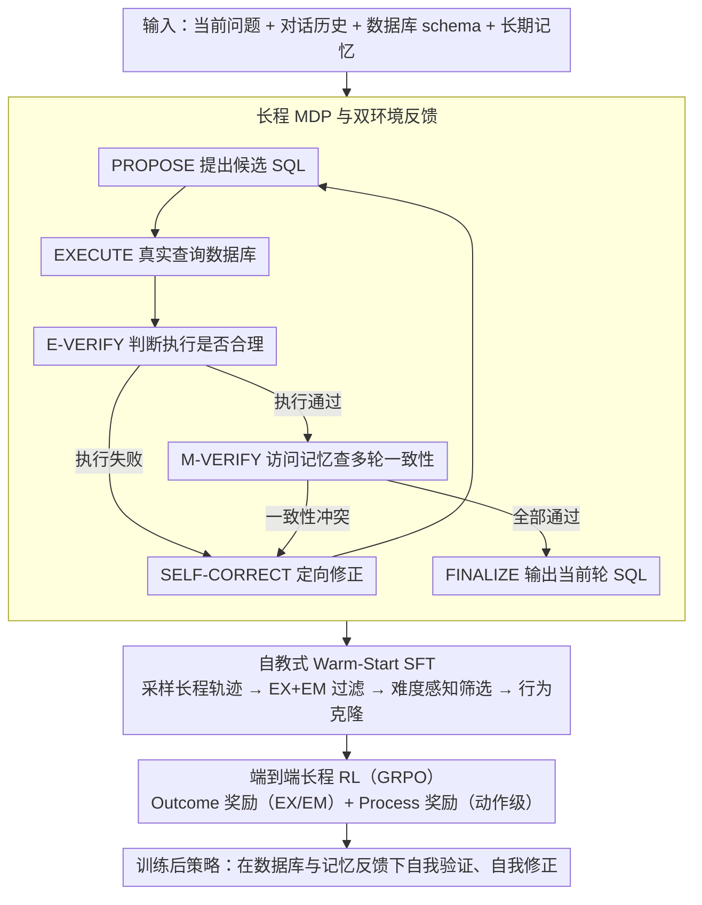

# MTSQL-R1: Towards Long-Horizon Multi-Turn Text-to-SQL via Agentic Training

**会议**: ACL2026  
**arXiv**: [2510.12831](https://arxiv.org/abs/2510.12831)  
**代码**: https://github.com/taichengguo/MTSQL-R1  
**领域**: NLP理解 / 多轮Text-to-SQL  
**关键词**: 多轮Text-to-SQL、长程推理、数据库执行反馈、对话记忆、强化学习

## 一句话总结
MTSQL-R1把多轮 Text-to-SQL 从“一次性翻译”改造成可与数据库和对话记忆交互的长程智能体训练问题，通过自教式 warm-start SFT 与多层级 GRPO 奖励，让小规模 Qwen3 模型在 CoSQL 和 SParC 上超过强闭源提示基线与短程 SFT/RL 基线。

## 研究背景与动机
**领域现状**：多轮 Text-to-SQL 要在连续对话中把当前用户问题、历史问题、历史 SQL、数据库 schema 一起映射成可执行 SQL。早期方法多依赖专门的上下文编码、关系图或动态 schema linking；进入 LLM 阶段后，ACT-SQL、CoE-SQL 等方法通常用提示、CoT 或基于历史 SQL 的编辑来处理多轮上下文。

**现有痛点**：这些方法大多仍然把任务当成短程的文本到 SQL 翻译：模型生成一条 SQL 后就结束，不真正执行 SQL，也不显式检查它是否和历史约束一致。结果是两类错误会反复出现：一类是 SQL 本身不可执行、返回空结果或逻辑结果错误；另一类是当前 SQL 看似合理，但丢掉了前几轮用户已经限定的实体、过滤条件或 join 路径。

**核心矛盾**：多轮 Text-to-SQL 的难点不只是“写出一条语法正确的 SQL”，而是要在逐轮变化的意图里持续验证和修正。短程模型缺少环境反馈，因此不知道自己错在哪里；纯提示式 agent 虽然可以接工具，但没有经过这种长程行为训练，往往不会稳定地调用工具、解释反馈和自我修正。

**本文目标**：作者希望解决三个子问题：第一，如何把多轮 Text-to-SQL 建模成包含执行、验证、修正的长程决策过程；第二，如何在模型初始能力不足时构造高质量的长程行为轨迹；第三，如何用强化学习让模型真正学会在数据库反馈和对话记忆之间循环推理。

**切入角度**：论文的观察是，多轮 SQL 生成本质上很适合 agentic training：数据库可以给出执行结果或错误信息，对话记忆可以给出历史约束，二者都是比静态标签更细的监督信号。与其让模型一次猜完，不如让它经历 propose、execute、verify、refine 的闭环。

**核心 idea**：用“数据库执行反馈 + 长期对话记忆验证”替代纯文本上下文提示，把多轮 Text-to-SQL 训练成一个可自我验证和自我修正的长程 MDP。

## 方法详解
MTSQL-R1 的方法可以理解为两层：外层是多轮对话任务本身，每一轮用户问题都要产出 SQL；内层是模型为了产出当前轮 SQL 所执行的一串 agent 行为。模型不是直接输出最终 SQL，而是先提出候选 SQL，再调用数据库执行，再判断执行是否合理，再调用记忆检查历史一致性。如果任何一步失败，就进入自我修正并重复这一循环，直到通过检查并 finalize。

这篇论文的关键不是发明新的 SQL parser，而是把训练数据、动作空间和奖励全部围绕这个长程闭环重新设计。Warm-Start SFT 先教会模型“像一个 Text-to-SQL agent 一样行动”；后续 RL 再让模型在工具反馈下优化最终 SQL 和中间验证行为。

### 整体框架
输入包括当前用户问题、此前对话历史、数据库 schema，以及由历史问题、历史 SQL、解析出的约束和实体组成的长期记忆。输出是当前轮最终 SQL。

整体 pipeline 分为三步。

第一步是 MDP 建模。状态包含历史对话、schema、当前问题、长期记忆、当前候选 SQL 和已经积累的执行观察；动作包括 PROPOSE、EXECUTE、E-VERIFY、M-VERIFY、SELF-CORRECT、FINALIZE。EXECUTE 会真实查询数据库，M-VERIFY 会访问对话记忆，其他动作由 LLM 生成文本推理或 SQL。

第二步是自教式 Warm-Start SFT。作者先让当前策略模型为训练样本生成多条长程轨迹，只保留最终 SQL 同时满足 EX 和 EM 的正确轨迹，再用难度感知的 rejection sampling 挑选适合监督的轨迹，进行行为克隆。这个过程迭代多轮，让模型逐步覆盖更多原本不会解的训练样本。

第三步是端到端长程 RL。SFT 后的模型继续按 MDP 与数据库和记忆交互，用 outcome reward 和 process reward 的加权和训练。优化算法采用 GRPO，并对工具输出和人工指令做 loss masking，使梯度主要作用在模型生成的动作、验证判断和 SQL 上。

### 关键设计

**1. 长程 MDP 与双环境反馈：把一次性翻译拆成执行—验证—修正的闭环**

短程模型生成一条 SQL 就结束，既不真执行、也不检查是否违背前几轮约束，错了也无从定位。MTSQL-R1 把当前轮的 SQL 生成建模成一个长程 MDP，动作空间为 PROPOSE、EXECUTE、E-VERIFY、M-VERIFY、SELF-CORRECT、FINALIZE，并固定转移顺序：先 PROPOSE 出候选 SQL，再 EXECUTE 真实查询数据库，再 E-VERIFY 判断执行是否合理；执行通过后进入 M-VERIFY 访问记忆做一致性检查，任一验证失败就 SELF-CORRECT 并重新进入循环，全部通过后才 FINALIZE。

关键在于环境是双重的：数据库负责返回执行结果、空结果或错误，长期记忆则保存历史问句、历史 SQL、解析出的约束与实体。数据库暴露的是语法和执行层面的错误，记忆暴露的是多轮一致性错误（当前 SQL 是否丢掉了前文已限定的实体、过滤条件或 join 路径）。两者结合后，模型不仅知道“错了”，还知道错误是执行问题还是上下文一致性问题，从而能做针对性修正——这正是纯文本拼接历史的提示式方法拿不到的细粒度反馈。

**2. 自教式 Warm-Start SFT 与难度感知轨迹筛选：在 RL 前先教会模型“像 agent 一样行动”**

小模型不经训练时根本不会稳定调用工具——1.7B base agent 只有约 23.3 EX。但直接用 gold SQL 合成轨迹又太“完美”，缺少真实的执行失败和修正过程；只靠 base model 采样则覆盖不足。作者的折中是自教式迭代：每轮对每个训练样本采样 20 条轨迹，只保留最终 SQL 同时通过 EX 和 EM 的正确轨迹做行为克隆。难度感知体现在筛选策略上——简单样本或 20 次全对的样本只保留少量短轨迹，避免把简单问题人为拉长；困难样本优先保留交互更多的长轨迹，并用 Qwen3-Embedding 聚类后选代表轨迹保证多样性。

每轮训练后，把已获得高质量轨迹的样本从下一轮待探索集合中移除，继续迭代扩大覆盖面。这样模型是从自己产生的成功经验里逐步学会长程推理，而不是死记一份外部标注的“完美”轨迹。

**3. Outcome + Process 的多层级奖励：给中间动作也装上学习信号**

难题和深轮次问题经常要多次试错，若只有最终 SQL 的 0/1 奖励，模型很难知道哪一步变好了。MTSQL-R1 把奖励拆成两层。最终奖励看 EX（执行结果是否正确）和 EM（与参考 SQL 是否精确匹配）；过程奖励则按动作类型设计：PROPOSE 和 SELF-CORRECT 用 SELECT、WHERE、JOIN、GROUP、ORDER 等 SQL clause 的平均 F1 衡量候选 SQL 与 gold SQL 的接近程度，E-VERIFY 根据执行结果与模型给出的 pass/fail 判断是否匹配给分，M-VERIFY 根据候选 SQL 的 clause F1 以及记忆验证结论给分。

整体奖励是 outcome reward 与 process reward 的加权和，权重在小验证集上网格搜索得到。这样“提出更接近的 SQL”“正确识别执行错误”“正确发现记忆冲突”都被转化成可优化目标，避免长程闭环里奖励过稀疏。

### 损失函数 / 训练策略
SFT 阶段使用标准自回归交叉熵，但用 token mask 排除系统指令、执行输出和记忆 prompt，只监督动作 token 与 SQL token。这样模型学习的是何时调用动作、如何给出验证判断和如何修正 SQL，而不是背诵工具返回文本。

RL 阶段采用 GRPO。对每个问题采样一组轨迹，根据总奖励得到组内归一化 advantage，再用 PPO-style ratio clipping 和 KL 正则更新策略。作者还采用 easy-to-hard curriculum：先用当前模型在每个样本上 20 次采样的成功次数估计难度，丢弃 20/20 全对的过易样本，再按成功次数从高到低分桶训练。实现上，Qwen3-1.7B 和 Qwen3-4B 是主要 backbone；SFT 使用学习率 5e-6，全参数微调；GRPO 学习率 1e-6，batch size 256，最大 prompt 长度 4000，最大响应长度 8000，最大工具交互次数 4。

## 实验关键数据

### 主实验
论文在 CoSQL 和 SParC 上评估，报告 Execution Accuracy（EX）和 Exact Match（EM）。CoSQL 包含约 3000 个多轮对话、1 万多条标注 SQL；SParC 包含 4298 个问题序列、1.2 万多个问题。除了标准 in-domain 设置，作者还做了 out-of-domain 交叉训练评估，用来检验泛化。

| 方法 | 模型规模 | CoSQL EX/EM | SParC EX/EM | 平均 EX/EM | 说明 |
|------|----------|-------------|-------------|------------|------|
| CoE-SQL | 闭源 | 69.6 / 52.4 | 70.3 / 56.0 | 64.1 / 51.6 | 强多轮提示与编辑基线，含 OOD 平均 |
| RASAT+PICARD | 3B | 67.0 / 58.8 | 73.3 / 67.7 | 64.5 / 57.7 | 经典结构化 pre-LLM 基线，含 OOD 平均 |
| Qwen3-1.7B Short-Horizon SFT | 1.7B | 68.1 / 59.3 | 74.3 / 69.2 | 69.6 / 62.2 | 原始训练集上的短程监督微调 |
| Qwen3-1.7B Short-Horizon Direct RL | 1.7B | 72.8 / 59.0 | 72.1 / 65.5 | 70.5 / 60.7 | 类似单轮 SQL-R1/Reasoning-SQL 的直接 RL |
| Qwen3-1.7B MTSQL-R1 | 1.7B | 77.3 / 63.5 | 76.2 / 66.1 | 74.6 / 64.4 | Warm-Start SFT + outcome/process RL |
| Qwen3-4B Short-Horizon SFT | 4B | 73.1 / 64.8 | 78.3 / 71.5 | 74.1 / 66.6 | 强短程 SFT 基线 |
| Qwen3-4B Short-Horizon Direct RL | 4B | 75.2 / 64.8 | 75.8 / 66.5 | 74.0 / 64.2 | 强短程 RL 基线 |
| Qwen3-4B MTSQL-R1 | 4B | 79.9 / 65.2 | 79.0 / 68.7 | 77.6 / 66.5 | 平均 EX 比前一最佳提升 3.5 点 |

一个值得注意的现象是，短程 SFT 有时 EM 不低，但 EX 明显弱于 MTSQL-R1。这说明它可能在字符串形式上接近参考 SQL，却缺少真实执行层面的逻辑正确性；而 MTSQL-R1 的长程验证主要提高的是更关键的 EX。

### 消融实验

| 配置 | CoSQL EX | CoSQL EM | 说明 |
|------|----------|----------|------|
| Qwen3-4B + Warm-Start + RL | 79.9 | 65.2 | 完整长程模型 |
| w/o Execution Tool | 74.6 | 64.6 | 去掉数据库执行后 EX 下降 5.3 点，说明执行反馈是主贡献之一 |
| w/o Memory Verification Tool | 77.8 | 64.1 | 去掉记忆验证后 EX 下降 2.1 点，EM 下降 1.1 点，多轮一致性变弱 |
| Qwen3-14B Long-horizon no training | 74.4 | 55.1 | 只提示大模型长程使用工具，仍弱于训练后的 4B 模型 |
| Qwen3-14B w/o Execution Tool | 71.4 | 54.6 | 即使更大模型，缺少执行工具也会明显掉点 |
| Qwen3-14B Direct | 66.5 | 54.3 | 不做长程推理时性能最低 |

### 奖励与泛化分析

| 分析项 | 结果 | 结论 |
|--------|------|------|
| Outcome Only RL | 79.1±0.15 EX / 64.5±0.18 EM | 只用最终奖励已经明显强于短程基线 |
| Outcome + Verify Reward | 79.7±0.14 EX / 65.0±0.19 EM | 验证动作奖励提升执行正确性 |
| Outcome + Propose/Correction Reward | 79.4±0.11 EX / 65.4±0.18 EM | 候选 SQL 和修正动作的 clause 奖励提高 EM |
| 全部过程奖励 | 79.9±0.11 EX / 65.2±0.17 EM | 组合奖励取得最高 EX，过程信号整体有效 |
| Predicted Prior 评估 | Direct RL 71.2 EX，MTSQL-R1 76.5 EX | 当历史 SQL 换成模型自己的预测时，长程验证的鲁棒性优势更大 |
| LLaMA3.2-3B 迁移 | Short-Horizon RL 70.4/70.9 EX，MTSQL-R1 74.8/75.2 EX | 框架不只适用于 Qwen，换 backbone 也有效 |

### 关键发现
- Warm-Start SFT 的轮数越多，能覆盖的高质量长程轨迹越多。CoSQL 中有轨迹的训练样本从 Round 1 的 6311 增至 Round 3 的 7555，最终得到 19416 条长程轨迹；SParC 从 9132 增至 10285，最终得到 29710 条轨迹。
- RL 对 hard 和 extra-hard 问题尤其有帮助。论文的难度分桶和 turn-wise 分析显示，深轮次（Turn ≥ 4）和复杂 SQL 上的增益更大，说明记忆验证和执行反馈主要解决的是上下文累积后的错误。
- 小模型不经训练时很难稳定遵循长程函数调用。1.7B 的 base agent 只有约 23.3 EX / 17.1 EM，4B base agent 好一些但仍显著低于 Warm-Start + RL，说明“给工具”不等于“会用工具”。
- 效率上，4B MTSQL-R1 在最大 8000 输出 token 时 CoSQL EX 为 79.9，延迟约 28.3 秒；如果限制到 4000 token，EX 仍有 77.0，延迟约 15.6 秒。它适合高风险、离线或可容忍数十秒延迟的数据库问答场景，而不一定适合极低延迟 BI 面板。

## 亮点与洞察
- 最有价值的点是把多轮 Text-to-SQL 的“历史一致性”变成了可调用、可奖励的记忆验证动作。很多方法只是把历史拼进 prompt，而 MTSQL-R1 让模型显式询问历史约束并据此判定当前 SQL 是否冲突。
- 自教式轨迹收集很实用。它没有假设现成的人工长程轨迹，而是从模型自己的正确 rollouts 中筛选行为，再用多轮迭代扩大覆盖，这对其他缺少 agent 轨迹标注的任务也有迁移价值。
- 过程奖励设计比较贴近 SQL 结构。用 SELECT、WHERE、JOIN、GROUP、ORDER 的 clause F1 给 propose 和 self-correct 打分，比纯执行结果更能指导模型修补局部 SQL 结构。
- 论文清楚地区分了“短程 RL”与“长程 agentic RL”。直接 RL 可以提高单步 SQL 生成，但如果没有工具交互和记忆检查，它仍然无法学到执行后反思、跨轮约束恢复这些行为。
- 对真实部署的 predicted-prior 评估很重要。标准多轮评测常用 gold SQL 作为历史，低估了错误累积；MTSQL-R1 在使用自己历史预测时优势更大，说明闭环修正确实能缓解滚雪球错误。

## 局限与展望
- 作者承认 Aggregation Drift 仍然难解。错误分析显示，执行错误、约束一致性、schema linking、join path 等错误都有明显下降，但聚合相关漂移改善有限，尤其集中在 extra-hard SQL。
- 长程推理带来更高 token 和延迟成本。相比只输出 SQL 的短程 SFT，MTSQL-R1 要生成动作、验证和修正过程，8000 token 设置下延迟约 28 秒，不适合所有实时交互场景。
- 当前记忆主要存储解析后的文本约束，虽然论文讨论了可替换为向量数据库或更复杂 backend，但实验还没有系统验证超长对话、工业级 schema 或噪声记忆下的效果。
- 奖励仍依赖 gold SQL 和执行结果，训练成本较高。若迁移到没有精确 SQL 标注的企业数据环境，需要进一步研究弱监督、日志反馈或人类偏好反馈如何接入。
- 工具调用上限和输出长度会影响性能。论文提到部分残余执行失败来自 8000 token cap 截断，说明长程 agent 的推理预算管理本身也是后续问题。

## 相关工作与启发
- **vs ACT-SQL**: ACT-SQL 通过自动生成 CoT 把多轮问题改写成更适合 LLM 的推理输入，但主要依赖闭源模型的 in-context 能力，没有训练模型使用数据库执行反馈。MTSQL-R1 的优势是可在开源小模型上训练出稳定的工具调用和修正行为。
- **vs CoE-SQL**: CoE-SQL 用 chain-of-editions 基于上一轮 SQL 做增量编辑，适合多轮语义变化较小的场景。MTSQL-R1 不只编辑历史 SQL，还显式执行和检查记忆，因此在 predicted-prior 这种历史可能有错的设置下更稳。
- **vs SQL-R1 / Reasoning-SQL**: 这些方法把 RL 用于单轮 Text-to-SQL，强调逻辑或执行一致性，但没有对话记忆，也没有多轮长程 MDP。MTSQL-R1 把 RL 的作用从“生成更好的单条 SQL”扩展到“学习完整的验证和修正策略”。
- **vs RASAT+PICARD / HIE-SQL 等结构化方法**: 传统方法通过 relation-aware attention、历史编码或 constrained decoding 提升语法和结构可靠性，但通常缺少 LLM agent 的开放式反思与工具交互。MTSQL-R1 更像是在 LLM 层面重建一个可学习的交互式 semantic parsing 流程。
- **对其他任务的启发**: 任何有外部可验证环境的多轮生成任务都可以借鉴这个框架，例如代码生成中的编译器和单元测试、数据分析 agent 中的 notebook 执行反馈、信息检索问答中的搜索结果验证。关键是把环境反馈拆成动作级奖励，而不只看最终答案。

## 评分
- 新颖性: ⭐⭐⭐⭐☆ 把 MDP、工具执行、记忆验证和 GRPO 组合到多轮 Text-to-SQL 上很完整，单个组件不算全新，但任务建模和训练闭环有明显贡献。
- 实验充分度: ⭐⭐⭐⭐⭐ 主实验覆盖 CoSQL/SParC、in-domain/OOD、不同模型、predicted-prior、奖励消融、动作消融、效率和错误类型分析，证据链很扎实。
- 写作质量: ⭐⭐⭐⭐☆ 论文结构清楚，动机和实验组织充分；但 arXiv 文本中的部分公式和动作名抽取不够干净，读 method 时需要结合上下文还原。
- 价值: ⭐⭐⭐⭐⭐ 对多轮 Text-to-SQL 和可验证数据库 agent 都很有参考价值，尤其适合需要高可靠 SQL 的企业数据访问场景。

<!-- RELATED:START -->

## 相关论文

- [\[ACL 2026\] MADE: A Living Benchmark for Multi-Label Text Classification with Uncertainty Quantification](made_a_living_benchmark_for_multi-label_text_classification_with_uncertainty_qua.md)
- [\[ACL 2026\] Reasoning-Based Refinement of Unsupervised Text Clusters with LLMs](reasoning-based_refinement_of_unsupervised_text_clusters_with_llms.md)
- [\[ACL 2026\] Beyond Chunking: Discourse-Aware Hierarchical Retrieval for Long Document Question Answering](beyond_chunking_discourse-aware_hierarchical_retrieval_for_long_document_questio.md)
- [\[ACL 2025\] ReSCORE: Label-free Iterative Retriever Training for Multi-hop Question Answering with Relevance-Consistency Supervision](../../ACL2025/nlp_understanding/rescore_multihop_qa.md)
- [\[ACL 2026\] MSMO-ABSA: Multi-Scale and Multi-Objective Optimization for Cross-Lingual Aspect-Based Sentiment Analysis](msmo-absa_multi-scale_and_multi-objective_optimization_for_cross-lingual_aspect-.md)

<!-- RELATED:END -->
