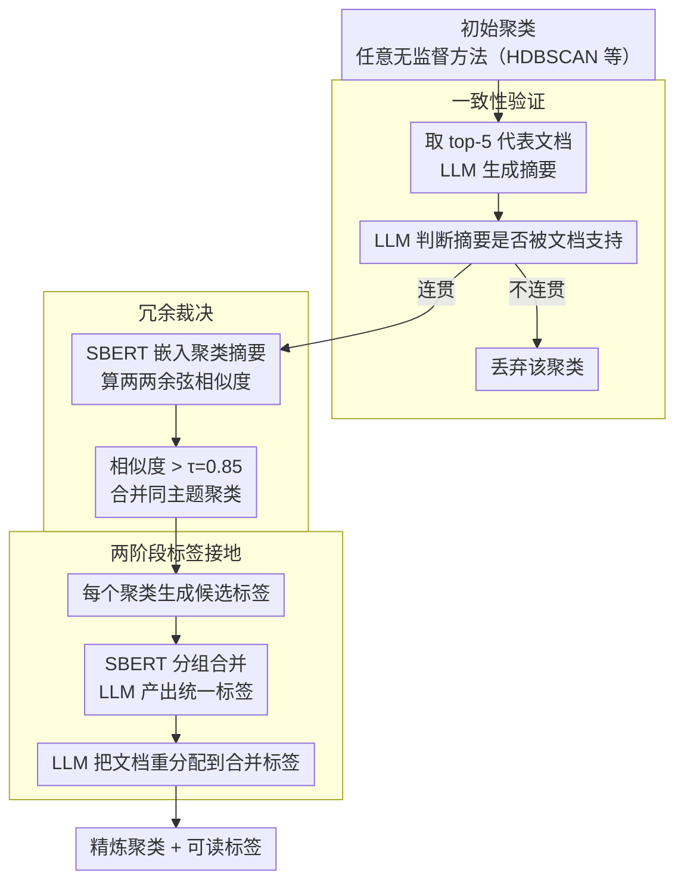

# Reasoning-Based Refinement of Unsupervised Text Clusters with LLMs

**会议**: ACL 2026 Findings  
**arXiv**: [2604.07562](https://arxiv.org/abs/2604.07562)  
**代码**: [GitHub](https://github.com/tunazislam/reasoning-based-refinement-llms-vegan)  
**领域**: 文本聚类 / 无监督学习  
**关键词**: 文本聚类精炼, LLM语义判官, 一致性验证, 冗余裁决, 标签接地

## 一句话总结
提出基于推理的聚类精炼框架，将 LLM 作为语义判官（而非嵌入生成器）验证和重构无监督聚类的输出，通过一致性验证、冗余裁决和标签接地三个推理阶段，在社交媒体语料上显著提升聚类一致性和人类对齐的标注质量。

## 研究背景与动机

**领域现状**：无监督文本聚类（LDA、BERTopic、HDBSCAN 等）广泛用于从大规模文本集合中发现潜在语义结构。近期方法主要依赖上下文嵌入 + 几何聚类准则来评估聚类质量。

**现有痛点**：嵌入空间中的几何性质（如分离度、密度）并不总是与人类对语义的理解一致。聚类可能在数值上分离良好但语义上不连贯，多个聚类可能编码重叠主题。特别在社交媒体短文本场景下，噪声大、词汇变化多、话题漂移快，加剧了统计一致性与人类可解释性之间的鸿沟。

**核心矛盾**：现有管道缺乏显式的语义验证机制——聚类算法产生的"假设"从未被检验是否真正语义连贯、非冗余和可解释。

**本文目标**：设计一个后置精炼层，利用 LLM 的推理能力验证和重构任意无监督聚类方法的输出。

**切入角度**：将聚类视为"提案"，LLM 作为"语义判官"而非嵌入生成器，将表示学习与结构验证解耦。

**核心 idea**：LLM 具有强大的自然语言推理能力，可以评估聚类是否内部一致、两个聚类是否有意义地不同、主题是否在文本中有据可查——这些是纯几何方法无法实现的。

## 方法详解

### 整体框架
三阶段后置精炼：输入为任意无监督聚类方法（如 HDBSCAN）产生的初始聚类，输出为精炼后的聚类集合及可解释标签。Stage 1 验证每个聚类的语义一致性，Stage 2 合并语义冗余的聚类，Stage 3 为精炼后的聚类生成并合并解释性标签。

### 关键设计

**1. 一致性验证（Coherence Verification）：用语言理解揪出“几何上紧凑、语义上散架”的聚类**

嵌入空间里看起来紧凑的聚类，内容可能是语义异质的——这是纯几何准则发现不了的失败模式。这一阶段对每个聚类选取最接近质心的 top-5 代表文档，先让 LLM 为它们生成一段简洁摘要，再让 LLM 反过来判断这段摘要是否真被这些代表文档所支持。如果 LLM 认为摘要没能捕捉到一条贯穿全部文档的一致主题，就把该聚类判定为不连贯并直接丢弃。换句话说，它把“这堆文档讲的是不是同一件事”交给语言推理来裁决，而不是看它们在嵌入空间里挨得多近。

**2. 冗余裁决（Redundancy Adjudication）：合并只是换皮、实质同主题的聚类**

多个聚类常常只有表层词汇差异，实际讨论的是同一主题，这让结构变得冗余。这一阶段用 SBERT 为每个聚类的摘要生成嵌入，计算两两余弦相似度，相似度超过阈值 $\tau=0.85$ 的聚类被合并。阈值不是随手定的，而是通过网格搜索在 Silhouette Score、Davies-Bouldin Index 和聚类数量三者之间权衡得到——既要把真正重复的聚类并掉，又不能合并过头把不同主题揉到一起。

**3. 两阶段标签接地（Label Grounding）：给精炼后的聚类配上不重复的人类可读标签**

精炼完还要让结果可解释，但不同聚类可能产出语义近似的标签，造成标签体系本身的冗余。于是标签生成分两阶段：第一阶段为每个聚类从其摘要生成候选标签；第二阶段计算标签间的 SBERT 相似度，把相似度 $>0.85$ 的标签分到一组，由 LLM 为每组生成一个合并标签。最后再用 LLM 把每篇文档重新分配到最合适的合并标签下，使标签与文档真正对齐，而不是停留在聚类层面的命名。

### 损失函数 / 训练策略
框架无需训练，全部基于 LLM（GPT-4o）的零样本推理。聚类阶段用 TF-IDF + SVD + UMAP + HDBSCAN。精炼阶段 LLM 和 SBERT 协同工作。

## 实验关键数据

### 主实验

| 方法 | CC | SS↑ | DBi↓ | 说明 |
|------|-----|-----|------|------|
| HDBSCAN (X) | 359 | 0.122 | 2.322 | 原始聚类 |
| SBERT 精炼 (X) | 250 | 0.156 | 0.569 | 仅用嵌入精炼 |
| LLM 精炼 (X) | 232 | **0.674** | - | 语义推理精炼，SS 提升 5.5x |
| HDBSCAN (Bluesky) | - | - | - | 基线 |
| LLM 精炼 (Bluesky) | - | 显著提升 | - | 跨平台一致有效 |

### 消融实验

| 评估维度 | 结果 | 说明 |
|----------|------|------|
| LLM 标签 vs 人类评估 | 高一致性 | 无金标准下 LLM 标签与人类判断强对齐 |
| 跨平台稳定性 | 一致 | 匹配时间和数量条件下结构稳定 |
| 不连贯聚类识别 | 有效 | 成功识别并丢弃含混杂内容的聚类 |

### 关键发现
- LLM 精炼将 Silhouette Score 从 0.122 提升至 0.674（X 数据集），5.5 倍提升
- 聚类数从 359 减少到 232，去除了不连贯和冗余聚类
- 人类评估显示 LLM 生成标签与专家标注者的高一致性
- 跨平台（X vs Bluesky）在匹配条件下结构保持稳定
- SBERT 精炼改善了分离度（DBi）但不如 LLM 精炼在语义一致性上的提升

## 亮点与洞察
- 将 LLM 定位为"语义判官"而非嵌入生成器是框架的核心思想——利用 LLM 的推理能力做结构验证，而将表示学习留给专门的嵌入模型。这种解耦设计使框架与聚类算法无关，可作为通用后置精炼层
- 三阶段推理检查点分别针对无监督聚类的三种典型失败模式（不连贯、冗余、不可解释），设计针对性强
- 在无金标准场景下通过人类评估验证 LLM 标签质量是务实的做法

## 局限与展望
- 依赖 GPT-4o 的 API 调用，成本和可复现性受限
- 仅在素食主义相关话题上验证，主题多样性有限
- Top-5 代表文档可能不足以代表大型异质聚类
- 合并阈值 0.85 是经验值，不同领域可能需要调整
- 未来可探索开源 LLM 替代 GPT-4o，扩展到更多领域

## 相关工作与启发
- **vs BERTopic**: BERTopic 依赖嵌入几何评估质量，本文增加语义推理验证层
- **vs LDA/HDP**: 概率主题模型在短文本上语义一致性差，本文后置精炼可改善任意主题模型输出
- **vs LLooM**: LLooM 需要用户提供种子集，本文完全无监督

## 评分
- 新颖性: ⭐⭐⭐⭐ LLM 作为语义判官精炼聚类的思路新颖且通用
- 实验充分度: ⭐⭐⭐ 仅在单一主题领域评估，缺少更多基线对比
- 写作质量: ⭐⭐⭐⭐ 框架描述清晰，设计原则明确
- 价值: ⭐⭐⭐⭐ 提供了一个通用的聚类后处理方法论

<!-- RELATED:START -->

## 相关论文

- [\[ACL 2026\] BoundRL: Efficient Structured Text Segmentation through Reinforced Boundary Generation](boundrl_efficient_structured_text_segmentation_through_reinforced_boundary_gener.md)
- [\[ACL 2026\] LLM-Guided Semantic Bootstrapping for Interpretable Text Classification with Tsetlin Machines](llm-guided_semantic_bootstrapping_for_interpretable_text_classification_with_tse.md)
- [\[ACL 2026\] DiZiNER: Disagreement-guided Instruction Refinement via Pilot Annotation Simulation for Zero-shot Named Entity Recognition](diziner_disagreement-guided_instruction_refinement_via_pilot_annotation_simulati.md)
- [\[ACL 2026\] MADE: A Living Benchmark for Multi-Label Text Classification with Uncertainty Quantification](made_a_living_benchmark_for_multi-label_text_classification_with_uncertainty_qua.md)
- [\[ACL 2026\] AdapTime: Enabling Adaptive Temporal Reasoning in Large Language Models](adaptime_enabling_adaptive_temporal_reasoning_in_large_language_models.md)

<!-- RELATED:END -->
