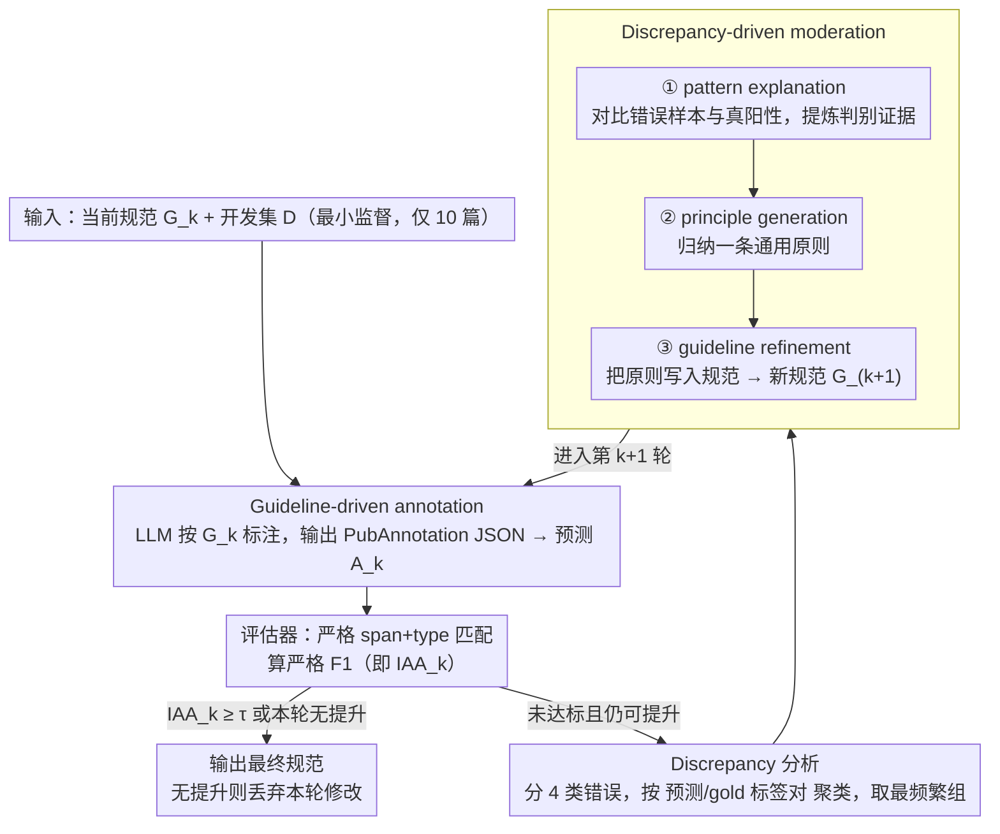

# Refining and Reusing Annotation Guidelines for LLM Annotation

**会议**: ACL2026  
**arXiv**: [2605.20809](https://arxiv.org/abs/2605.20809)  
**代码**: https://github.com/KonWooKim/llm-guideline-moderation  
**领域**: 生物医学NLP / LLM标注 / Annotation Guidelines  
**关键词**: 标注规范, LLM注释, 生物医学NER, guideline refinement, moderation  

## 一句话总结
这篇论文把传统人工标注项目中的 guideline reuse 和 moderation 流程迁移到 LLM 标注中，证明显式标注规范、推理型模型和少量 gold discrepancy 驱动的迭代规范细化，都能提升生物医学 NER 的严格 span+type F1。

## 研究背景与动机
**领域现状**：文本标注是语义检索、信息抽取和文本挖掘的基础。LLM 在零样本或少样本标注任务上表现不错，但 benchmark gold annotations 往往遵循非常具体的标注约定，尤其在生物医学 NER 中，实体边界、类型和灰区案例都有严格规则。

**现有痛点**：人类标注项目通常用 annotation guidelines 约束标注者，但直接让 LLM 做标注时，很多方法只给简单任务描述。LLM 可能知道领域概念，却不一定遵守 benchmark 的最小 span、实体类型边界、复合实体等细节约定。

**核心矛盾**：LLM 有强语言和世界知识，但这些知识未必和某个数据集的 annotation convention 对齐。要获得高质量标注，不只是要模型“懂医学”，还要让它按照 gold standard 的具体规则做决定。

**本文目标**：验证三个假设：加入原始 annotation guidelines 会提升 LLM 标注；推理型模型比非推理模型更适合 guideline-driven annotation；在少量 gold supervision 下，LLM 可以通过 moderation 迭代细化 guidelines。

**切入角度**：作者模拟人工标注项目早期的 pilot moderation。LLM 先用当前 guidelines 标注 10 篇开发文档，系统把预测和 gold 做严格匹配，找出主导错误模式，再让 LLM moderator 解释错误、生成原则、修改 guidelines。

**核心 idea**：把 annotation guidelines 当成对齐 LLM 标注行为的中间表示，并用 discrepancy pattern 驱动 guideline refinement，而不是直接微调模型。

## 方法详解
本文方法是一个迭代闭环：LLM annotator 用当前 guidelines 标注文档，评估器用严格 span+type matching 得到 F1 和错误集合，discrepancy analyzer 找出最常见错误组，LLM moderator 根据错误证据更新 guidelines，再进入下一轮。若达到质量阈值，或新一轮 refinement 没有提升，则停止并丢弃无效修改。

### 整体框架
第 $k$ 轮输入当前规范 $G_k$ 和开发集 $D$。LLM annotator 生成预测注释 $A_k$，评估器把 $A_k$ 与 gold $A_g$ 比较，计算严格 F1。若 $IAA_k$ 未达阈值且还有提升空间，就收集所有 discrepancy。系统用 soft overlap 把错误分成 label mismatch、boundary mismatch、false negative、false positive 四类，并按 predicted/gold label pair 聚类，选择频率最高的组进入 moderation。LLM moderator 依次做 pattern explanation、principle generation 和 guideline refinement，得到 $G_{k+1}$。

### 关键设计

**1. Guideline-driven annotation：把人工项目已有的标注规范显式喂给 LLM**

LLM 的标注错误常常不是因为“不懂实体”，而是因为它的世界知识没和某个数据集的标注约定对齐——最小 span、实体类型边界、复合实体这些细节，模型未必会按 gold standard 来。针对这点，除了最简单的 prompt-only baseline，作者把原始的 human guideline 做轻量格式化后直接注入 LLM prompt，并要求模型以 PubAnnotation JSON 格式输出，评估时采用 exact boundary + type 的严格匹配。guideline 在这里充当了对齐载体——它比 few-shot examples 更直接地告诉模型“这套项目的规则长什么样”。

**2. Discrepancy-driven moderation：用少量 gold 错误证据来驱动规范细化，而不是放任 LLM 自由改**

让 LLM 直接自由改规范容易发散，改出一堆和真实失败无关的东西。这里的做法是先用具体错误证据把修改框死：系统对 annotator 的预测与 gold 做软匹配，按类型归类出主导错误模式，再交给 LLM moderator 走三步——先解释这个错误模式出现的语言环境，再从中归纳出一条通用原则，最后把原则插入或改写进 guidelines。例如在 NCBI Disease 上，模型漏标了 feature-list 里的 DiseaseClass，moderator 据此生成“临床条件作为依存特征列表项时也应标注 DiseaseClass”这样一条规则。这样每轮 refinement 都精准对着当前模型的失败模式，产物还是人类可读、可审阅、可复用的规则文本。

**3. 最小监督设置：模拟标注项目早期，专家只给极少 gold 文档**

本文要检验的不是靠大量统计学习去刷 SOTA，而是 LLM 能否从少量分歧（disagreement）里归纳出高层标注规则，因此刻意把监督压到最小。每个数据集只从原训练集随机采样 10 篇文档做规范细化（development refinement），最终在独立的 100 篇评测集（evaluation set）上评测：NCBI Disease 和 BioRED 用完整 dev split 的 100 篇，BC5CDR 则从 500 篇 dev split 中采样 100 篇。正因为可见的 gold 极少，整体框架里的停止与回退逻辑才格外关键——一旦某轮 refinement 不再带来 F1 提升就立即停止、并丢弃该轮修改，避免在小样本上过拟合偶然有效的规则。

### 损失函数 / 训练策略
方法不训练模型，也不微调参数。实验比较三种 prompting / moderation 策略：Prompt-only、Original-guidelines、Guideline-refinement。模型覆盖 GPT、Gemini、DeepSeek 三个家族，并区分 reasoning 与 non-reasoning 版本：GPT-5 的 low/high reasoning effort，Gemini 2.5 Pro 的 min/max thinking budget，以及 deepseek-chat vs deepseek-reasoner。所有主实验使用默认超参。

## 实验关键数据

### 主实验
| 数据集 / 模型 | Prompt-only F1 | Original-guidelines F1 | Moderation F1 | 迭代数 |
|---------------|----------------|------------------------|---------------|--------|
| NCBI / GPT-5 | 0.46 | 0.73 (+0.27) | 0.76 (+0.03) | 3 |
| NCBI / Gemini | 0.40 | 0.63 (+0.23) | 0.66 (+0.03) | 5 |
| NCBI / DeepSeek | 0.31 | 0.55 (+0.24) | 0.56 (+0.01) | 2 |
| BC5CDR / GPT | 0.80 | 0.85 (+0.05) | 0.86 (+0.01) | 1 |
| BC5CDR / Gemini | 0.68 | 0.76 (+0.08) | 0.77 (+0.01) | 1 |
| BC5CDR / DeepSeek | 0.58 | 0.64 (+0.06) | 0.65 (+0.01) | 1 |
| BioRED / GPT-5 | 0.74 | 0.76 (+0.02) | 0.82 (+0.06) | 2 |
| BioRED / Gemini | 0.61 | 0.67 (+0.06) | 0.69 (+0.02) | 1 |
| BioRED / DeepSeek | 0.45 | 0.53 (+0.08) | 0.54 (+0.01) | 1 |

### 推理模型对比
| 数据集 | GPT non-reason / reason | Gemini non-reason / reason | DeepSeek non-reason / reason |
|--------|-------------------------|----------------------------|------------------------------|
| NCBI | 0.69 → 0.73 (+0.04) | 0.48 → 0.63 (+0.15) | 0.29 → 0.55 (+0.26) |
| BC5CDR | 0.78 → 0.85 (+0.07) | 0.70 → 0.76 (+0.06) | 0.57 → 0.64 (+0.07) |
| BioRED | 0.72 → 0.76 (+0.04) | 0.66 → 0.67 (+0.01) | 0.43 → 0.53 (+0.10) |

### 成本与时间摘录
| 数据集 / 模型 | 迭代数 | 单轮成本 | 单轮时间 | 估计总成本 | 估计总时间 |
|---------------|--------|----------|----------|------------|------------|
| NCBI / GPT-5 | 3 | $1.186 | 5.2 min | $3.557 | 15.6 min |
| NCBI / Gemini | 5 | $0.092 | 3.0 min | $0.460 | 14.8 min |
| BioRED / GPT-5 | 2 | $1.991 | 14.0 min | $3.982 | 28.0 min |
| BioRED / DeepSeek | 1 | $0.048 | 29.8 min | $0.048 | 29.8 min |

### 关键发现
- 原始 guidelines 带来的提升最大，NCBI 上 GPT-5 从 0.46 到 0.73，Gemini 从 0.40 到 0.63，DeepSeek 从 0.31 到 0.55。
- Moderation 的绝对提升较小，通常是 +0.01 到 +0.03 F1，但在 BioRED / GPT-5 上达到 +0.06。
- reasoning model 在所有数据集和模型家族中都优于 non-reasoning counterpart，说明应用复杂规范确实需要推理能力。
- GPT-5 性能强但成本高；DeepSeek 成本低但延迟长、性能较弱；Gemini 在成本和稳定性上较均衡。

## 亮点与洞察
- 这篇论文抓住了 LLM 标注里的一个关键问题：错误不一定来自“不懂实体”，而是“不懂这套项目规则”。guideline 是比 few-shot examples 更可解释的对齐载体。
- Moderation 流程很贴近真实标注项目。它不是让 LLM 直接优化 F1，而是让它把错误归纳成可读规则，这使产物能被人类审阅和复用。
- 结果也很诚实：moderation 有一致正收益，但幅度不大，说明少量 gold 文档能发现部分规则缺口，却不足以覆盖所有长尾歧义。

## 局限与展望
- 10 篇 development documents 很少，容易受样本选择影响，主导错误模式可能不是整个数据集的主导错误模式。
- 停止条件依赖小样本上的 IAA/F1 变化，统计不稳定，可能过早停止或保留偶然有效的规则。
- moderation 每轮只处理最频繁 discrepancy group，可能忽略多个中等频率但重要的错误类型。
- 本文聚焦生物医学 NER 的 span+type，尚不清楚 relation extraction、事件抽取、多标签主观标注是否同样受益。
- 未来可以让 human expert 审核 LLM 生成的 guideline edits，形成半自动 moderation，而不是完全自动接受。

## 相关工作与启发
- **vs LLM 直接标注**: prompt-only 依赖模型已有知识，容易和 gold convention 不一致；guideline prompt 把项目规则显式化。
- **vs few-shot 标注**: few-shot 给例子但不一定解释规则；guideline refinement 产出可读、可复用的规则文本。
- **vs 人工 moderation**: 人类 moderation 更可靠但成本高；LLM moderation 可作为早期草案生成器，帮助专家快速定位规则缺口。
- **启发**: 对高要求数据标注任务，优先维护一份“LLM 可读且人类可审”的 guideline，比单纯调 prompt 或堆 examples 更可持续。

## 评分
- 新颖性: ⭐⭐⭐⭐☆ 把 annotation moderation 形式化迁移到 LLM 标注很有实际意义，方法朴素但问题抓得准。
- 实验充分度: ⭐⭐⭐⭐☆ 覆盖三个生物医学数据集、三类模型家族和 reasoning 对比；跨任务泛化仍需更多验证。
- 写作质量: ⭐⭐⭐⭐☆ 假设清楚，实验设计和误差分析完整，局限讨论充分。
- 价值: ⭐⭐⭐⭐⭐ 对构建可审计、可复用的 LLM 标注流水线很有价值，尤其适合专业领域语料构建。

<!-- RELATED:START -->

## 相关论文

- [\[ACL 2026\] DiZiNER: Disagreement-guided Instruction Refinement via Pilot Annotation Simulation for Zero-shot Named Entity Recognition](diziner_disagreement-guided_instruction_refinement_via_pilot_annotation_simulati.md)
- [\[ACL 2026\] HCRE: LLM-based Hierarchical Classification for Cross-Document Relation Extraction](hcre_llm-based_hierarchical_classification_for_cross-document_relation_extractio.md)
- [\[ACL 2026\] LLM-Guided Semantic Bootstrapping for Interpretable Text Classification with Tsetlin Machines](llm-guided_semantic_bootstrapping_for_interpretable_text_classification_with_tse.md)
- [\[NeurIPS 2025\] Planning without Search: Refining Frontier LLMs with Offline Goal-Conditioned RL](../../NeurIPS2025/nlp_understanding/planning_without_search_refining_frontier_llms_with_offline_goal-conditioned_rl.md)
- [\[ECCV 2024\] SLIMER: Show Less, Instruct More - Enriching Prompts with Definitions and Guidelines for Zero-Shot NER](../../ECCV2024/nlp_understanding/slimer_zero_shot_ner.md)

<!-- RELATED:END -->
