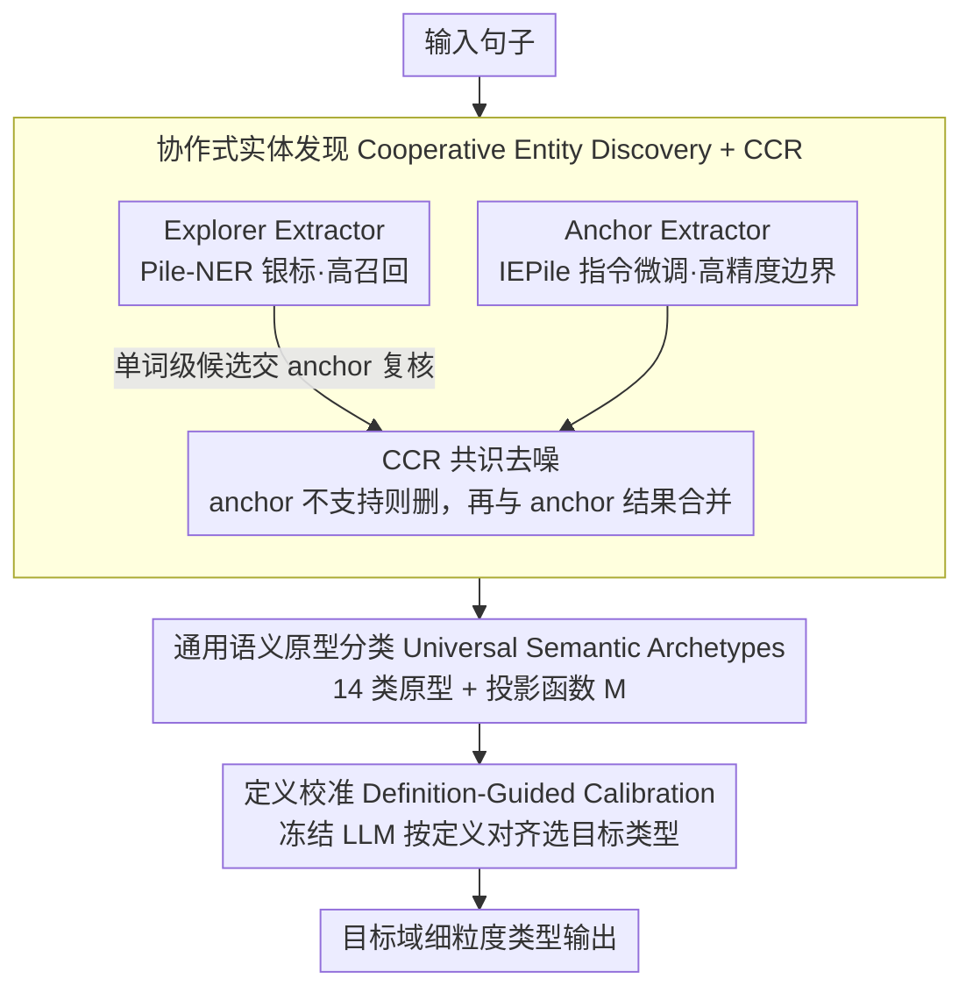

# SAM-NER: Semantic Archetype Mediation for Zero-Shot Named Entity Recognition

**会议**: ACL2026  
**arXiv**: [2605.03706](https://arxiv.org/abs/2605.03706)  
**代码**: https://github.com/DMIRLAB-Group/SAM-NER  
**领域**: 命名实体识别 / 零样本信息抽取 / LLM NLP  
**关键词**: 零样本 NER、语义原型、跨域迁移、定义校准、实体发现

## 一句话总结
SAM-NER 用“实体发现 → 14 类通用语义原型 → 目标类型定义校准”的三阶段中介框架缓解零样本 NER 的 schema drift，在 CrossNER 上取得 66.3 平均 micro-F1，超过一系列强基线。

## 研究背景与动机
**领域现状**：零样本 NER 希望模型在没有目标域标注的情况下，根据目标类型名称或定义抽取实体。近年来 LLM-based 方法通常通过 instruction tuning、类型定义、结构化代码约束或 retrieval augmented generation 来提升跨域泛化。

**现有痛点**：目标域 schema 经常包含细粒度、相互接近或领域特有的类型。直接把实体 mention 映射到目标类型，会要求 LLM 的内部语义组织与人工定义完全对齐；当标签新颖、定义重叠或外部知识稀疏时，模型容易发生 semantic drift。

**核心矛盾**：NER 需要足够细的目标类型区分，但零样本泛化又要求类型空间足够稳定。若直接预测细粒度类型，跨域偏移大；若只做粗粒度实体抽取，又难以满足目标任务的细粒度需求。

**本文目标**：作者希望在不依赖目标域监督和外部知识库的前提下，构造一个跨域稳定的中间语义空间，把实体 span 发现、通用语义理解和目标类型落地拆开处理。

**切入角度**：论文提出 Semantic Archetype Mediation：把大量异构 NER 标签先蒸馏成 14 个通用语义原型，如 Person、Organization、Medicine、Science 等。模型先判断实体属于哪个原型，再结合目标类型定义做细化校准。

**核心 idea**：不要让 LLM 一步跨越“实体 mention → 目标域细粒度类型”的语义鸿沟，而是先落到稳定的通用原型，再用定义约束把原型映射到目标 schema。

## 方法详解

### 整体框架
SAM-NER 是一个 progressive mediation pipeline。第一阶段 Entity Discovery 负责在输入句子中找出高覆盖且高质量的候选实体 span；第二阶段 Abstract Mediation 把候选 span 投射到通用语义原型空间；第三阶段 Definition-Guided Semantic Calibration 使用冻结 LLM，根据原型定义和目标类型定义把原型级预测解析成目标域类型。

这种设计的关键是解耦：span boundary 由双抽取器协作解决，跨域语义稳定性由 archetype classifier 提供，细粒度类型归属由 definition alignment 处理。每一步都降低下一步的搜索空间和语义不确定性。

### 关键设计

**1. Cooperative Entity Discovery 与 CCR：用双抽取器分工解决"既要召回长尾实体又要避开泛化噪声"**

单一抽取器在零样本目标域里很难两头兼顾——指令微调模型边界准但漏掉长尾，银标模型召回高却容易把通用功能词也当成实体。SAM-NER 让两者分工：Anchor Extractor 是基于 IEPile 高质量 IE 指令微调的 Llama3-8B，负责高精度边界；Explorer Extractor 基于 Pile-NER 银标数据训练，负责广撒网式的高召回。关键在于二者如何合并：Collaborative Consensus Refinement（CCR）把 explorer 里最容易出噪声的单词级候选逐个交给 anchor 复核，若 anchor 不独立支持该 span 就删掉，最后把 anchor 的结果与去噪后的 explorer 结果合并。这样银标模型只负责扩大覆盖面，指令模型则充当语义过滤器，把"宁滥勿缺"的召回收敛成可靠候选——消融里去掉 CCR 后 AI 域直接掉 7.4 点，正是这层共识在剪噪声。

**2. Universal Semantic Archetypes：把异构细粒度标签蒸馏成 14 个稳定原型，给跨域迁移一个不漂移的落脚点**

零样本 NER 最大的痛点是目标域 schema 千差万别，直接让 LLM 从实体 mention 一步跳到细粒度目标类型，schema drift 会很大。作者的解法是先落到一个跨域稳定的中间层：从 IEPile 的 NER 子集蒸馏异构标签，构造 14 个通用语义原型（Person、Organization、Medicine、Science 等），并定义确定性投影函数 $M:T_{orig}\rightarrow A$ 把原始标签映射到原型。训练时实体句子用 `<ENT>` 标记 mention，原始细粒度标签经 $M$ 变成原型级监督；推理时分类器只需在这 14 个原型上预测实体的 abstract type。原型数 14 不是拍脑袋——聚类分析里 k=14 在 Silhouette 和 Gap Statistic 之间折中最好，k=24 虽更细但更容易耦合领域噪声。这个中介层把"目标类型判断"的不确定性大幅压低，相当于先把实体归到稳定的语义父类，再处理细粒度归属。

**3. Definition-Guided Semantic Calibration：用定义对齐把原型映射回目标类型，避免被相似标签名误导**

有了原型预测还不够，最终要落到目标域细粒度类型。如果直接让 LLM 预测目标标签，相互接近的标签名（如 Politician 与 Person）很容易把它带偏。SAM-NER 改成"定义对齐"：为每个 abstract archetype 准备清晰、互斥的 canonical definition，并对目标域类型定义做轻量规范化，然后让一个冻结的 LLM 当 calibrator，在句子上下文 + 预测原型定义 + 候选目标类型定义三重约束下挑出最兼容的目标类型。因为已经有原型 prior 缩小了推理空间，目标类型选择就从"开放式标签猜测"变成"在少数候选定义里做对齐判断"，且全程不需要目标域训练数据。这一步是整条管线最关键的模块——消融里移除 calibration 后，AI/Literature/Music/Science 分别下降 9.7/12.6/12.6/11.0 点。

### 损失函数 / 训练策略
Anchor Extractor 使用 IEPile 提供的 Llama3-8B LoRA 权重；Explorer Extractor 和 Archetype Classifier 通过 supervised instruction tuning 训练，LoRA rank 为 8，alpha 为 16。Qwen2.5-7B 设置中，anchor 仍使用 Llama3 权重，Qwen 主要用于 explorer、classifier 和 calibrator。训练数据包括 Pile-NER 的约 13K 实体类型与约 240K 实体实例，以及 IEPile 的 NER 子集；实验在三张 RTX 3090 上用 LlamaFactory 完成。

## 实验关键数据

### 主实验

实验使用 CrossNER，覆盖 AI、Literature、Music、Politics、Science 五个跨域零样本场景，指标为 micro-F1。

| 方法 | 参数 / Backbone | AI | Literature | Music | Politics | Science | Avg. |
|--------|------|------|------|------|------|------|------|
| UniNER | 13B / LLaMA | 54.2 | 60.9 | 64.5 | 61.4 | 63.5 | 60.9 |
| KnowCoder | 7B / LLaMA2 | 60.3 | 61.1 | 70.0 | 72.2 | 59.1 | 64.5 |
| GLiNER-Large | 0.3B / DeBERTa-v3 | 57.2 | 64.4 | 69.6 | 72.6 | 62.6 | 65.3 |
| GUIDEX | 8B / LLaMA3.1 | 62.4 | 63.8 | 67.9 | 69.6 | 64.6 | 65.7 |
| SAM-NER(Qwen2.5-7B) | 7B / Qwen2.5 | 57.9 | 64.1 | 69.3 | 66.7 | 62.1 | 64.3 |
| SAM-NER(Llama3-8B) | 8B / LLaMA3 | 58.2 | 68.7 | 71.2 | 68.2 | 65.1 | 66.3 |

### 消融实验

| 配置 | AI | Literature | Music | Politics | Science | 说明 |
|------|------|------|------|------|------|------|
| Full SAM-NER | 58.2 | 68.7 | 71.2 | 68.2 | 65.1 | 完整三阶段 |
| w/o explorer | 53.0 | 64.6 | 65.3 | 63.6 | 61.4 | 召回不足，所有域下降 |
| w/o anchor | 54.1 | 61.9 | 66.1 | 61.9 | 58.8 | 噪声 span 增多，下降更明显 |
| w/o calibration | 48.5 | 56.1 | 58.6 | 63.7 | 54.1 | 缺少定义校准后平均损失最大 |
| w/o CCR | 50.8 | 65.3 | 67.2 | 65.5 | 60.9 | 仅合并抽取器会保留较多银标噪声 |
| w/ CCR | 58.2 | 68.7 | 71.2 | 68.2 | 65.1 | AI 域提升 7.4 点 |

### 关键发现
- Llama3-8B 版本平均 66.3，超过 GUIDEX 的 65.7，并在 Literature、Music、Science 上取得最好结果；Literature 比第二名高 4.3 点。
- Definition-guided calibration 是最关键模块之一，移除后在 AI、Literature、Music、Science 上分别下降 9.7、12.6、12.6、11.0 点，说明直接从抽象或训练标签跳到目标类型会明显受 schema drift 影响。
- CCR 的增益来自 precision 修复：explorer 常把通用功能词错当实体，anchor 共识能剪掉这类噪声，同时保留长尾实体覆盖。
- 14 个原型的选择来自聚类分析：k=14 在 Silhouette 和 Gap Statistic 间取得较好折中；k=24 虽能捕捉更细语义，但更容易耦合领域噪声。
- 复杂度分析显示完整模型耗时 7247 秒、1GPU × 29.53GB，平均分 66.3；w/o calibration 虽更快且只需 17.78GB，但平均分降到 56.2。

## 亮点与洞察
- 最核心的洞察是“零样本 NER 的错误不只是抽取错误，更是类型语义对齐错误”。语义原型层把这个问题显式拆出来，使方法更可解释。
- Anchor 与 Explorer 的角色分工清楚：一个提供高精度校验，一个提供高召回候选，CCR 则把二者的互补性转化成实际增益。
- Definition calibration 没有要求目标域训练数据，而是利用人类可读定义进行约束推理，符合零样本场景的现实需求。
- 原型数不是拍脑袋设定，论文用聚类结构解释为什么 14 比更细的 21/24 更稳，这让中间语义空间更可信。

## 局限与展望
- 14 个原型来自 IEPile，覆盖范围和粒度受源数据限制，不构成完备 ontology；在医学、法律、材料科学等高度专业领域可能过粗。
- 最终 calibration 依赖目标类型定义质量。如果定义过短、互相重叠或风格不一致，冻结 LLM 的对齐判断会不稳定。
- 方法包含多个 LLM 模块，完整管线耗时和显存均高于简化版本，在线部署需要考虑延迟和成本。
- Qwen 设置中 anchor 仍依赖 Llama3 的 IEPile LoRA 权重，跨模型家族的完全独立验证还不充分。
- 实验集中在 CrossNER，未来需要在更多语言、更多低资源垂直领域和真实标注规范下验证原型空间的泛化。

## 相关工作与启发
- **vs UniNER / IEPile**: 这些方法强调大规模指令数据带来的抽取能力，SAM-NER 在此基础上增加语义中介层，专门处理跨域类型漂移。
- **vs KnowCoder**: KnowCoder 用结构化代码表达 schema 约束，SAM-NER 用通用原型和定义对齐表达语义约束；前者偏结构，后者偏 ontology mediation。
- **vs GLiNER**: GLiNER 轻量且在 Politics 域很强，但 SAM-NER 更适合目标类型语义复杂、跨域偏移明显的场景。
- **vs GUIDEX / IRRA**: GUIDEX 与 IRRA 依赖 type definitions 或检索知识，SAM-NER 不直接依赖外部知识，而是先通过抽象原型降低目标定义难度。
- **启发**: 对零样本抽取任务，可以把“目标标签”拆成稳定中介概念和任务特定落地概念，这一策略也适用于事件抽取、关系抽取和多标签文档分类。

## 评分
- 新颖性: ⭐⭐⭐⭐☆ 语义原型中介用于 ZS-NER 很有启发性，但模块组合仍沿用 LLM 抽取与定义推理的常见范式。
- 实验充分度: ⭐⭐⭐⭐☆ CrossNER 主实验和多模块消融扎实，跨数据集与跨语言验证仍可扩展。
- 写作质量: ⭐⭐⭐⭐☆ 三阶段叙述清楚，原型设计与消融解释充分。
- 价值: ⭐⭐⭐⭐☆ 对跨域信息抽取很实用，尤其适合目标 schema 经常变化的业务场景。

<!-- RELATED:START -->

## 相关论文

- [\[ACL 2026\] DiZiNER: Disagreement-guided Instruction Refinement via Pilot Annotation Simulation for Zero-shot Named Entity Recognition](diziner_disagreement-guided_instruction_refinement_via_pilot_annotation_simulati.md)
- [\[ECCV 2024\] SLIMER: Show Less, Instruct More - Enriching Prompts with Definitions and Guidelines for Zero-Shot NER](../../ECCV2024/nlp_understanding/slimer_zero_shot_ner.md)
- [\[ACL 2026\] ASTRA: Adaptive Semantic Tree Reasoning Architecture for Complex Table Question Answering](astra_adaptive_semantic_tree_reasoning_architecture_for_complex_table_question_a.md)
- [\[ACL 2026\] Accurate and Efficient Statistical Testing for Word Semantic Breadth](accurate_and_efficient_statistical_testing_for_word_semantic_breadth.md)
- [\[ACL 2026\] Semantic Reranking at Inference Time for Hard Examples in Rhetorical Role Labeling](semantic_reranking_at_inference_time_for_hard_examples_in_rhetorical_role_labeli.md)

<!-- RELATED:END -->
