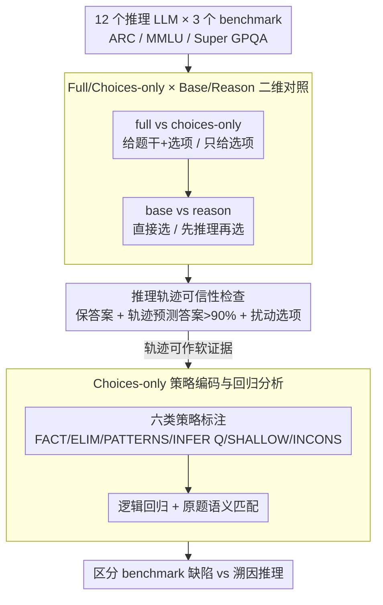

# Test-Time Reasoners Are Strategic Multiple-Choice Test-Takers

**会议**: ACL2026  
**arXiv**: [2510.07761](https://arxiv.org/abs/2510.07761)  
**代码**: https://github.com/nbalepur/mcqa-shortcuts  
**领域**: NLP理解 / LLM评测  
**关键词**: 多选题评测、测试时推理、partial-input、choices-only、推理轨迹

## 一句话总结
这篇论文系统比较 12 个推理 LLM 在完整多选题和只看选项的多选题上的表现，发现测试时推理确实会让模型在 choices-only 场景中高于随机，但推理轨迹显示其中不全是浅层作弊，也包含推断缺失问题、排除错误选项和调用事实知识等更像“策略性应试”的行为。

## 研究背景与动机
**领域现状**：多选题仍然是 LLM 评测里最常用的题型之一，从 ARC、MMLU 到 Super GPQA 都依赖“题干 + 若干选项 + 单一正确答案”的形式。随着 reasoning model 兴起，模型不只是直接输出选项，还会在测试时生成较长的推理轨迹，再给出最终答案。

**现有痛点**：过去的 partial-input 研究发现，模型即使不看题干、只看选项，也能在多选题上显著超过随机。这通常被解释为数据集存在 artifact，或者模型在利用“最长选项”“最具体选项”“唯一数字形态”等浅层线索。但这种结论主要来自非推理模型或简单扰动实验，很难知道模型到底是在投机，还是在用选项反推题目。

**核心矛盾**：choices-only 成功一方面可能暴露 benchmark 写作缺陷，另一方面也可能反映一种合理的部分信息推理能力。比如学生考试时即使忘了题干，也会通过排除明显错误项、识别选项类别、猜测原题意图来提高命中率。若把所有 partial-input 成功都叫“作弊”，会误伤这类非浅层能力；若完全忽略它，又会放过真的选项 artifact。

**本文目标**：作者想回答两个问题：测试时推理会不会放大 choices-only 成功；如果模型只看选项仍答对，它的推理轨迹到底使用了哪些策略，这些策略是否一定说明题目或模型有问题。

**切入角度**：论文不只看 choices-only accuracy，而是把 full / choices-only 与 base / reason 两个轴组合起来，并进一步人工编码 choices-only 推理轨迹。这样既能量化测试时推理的影响，也能把“答对”拆成浅层线索、事实回忆、排除法、选项模式识别和推断缺失问题等不同机制。

**核心 idea**：把推理轨迹当作 soft evidence，用它区分有害的多选题 artifact 和不那么有害的策略性部分信息推理，而不是用 choices-only accuracy 一个数字直接判定 benchmark 失效。

## 方法详解

### 整体框架
论文不训练任何新模型，而是在 ARC、MMLU、Super GPQA 三个难度递增的多选题 benchmark 上对 12 个现有推理 LLM 做受控评测。每道题有题干 $q$、选项集合 $C$ 和正确答案 $a$，作者把它拆成两个正交的轴：输入条件 full（给 $q$ 和 $C$）vs choices-only（只给 $C$，要求模型“用任何必要策略”猜出正确项），以及提示模式 base（直接选答案）vs reason（先生成逐步推理再选）。四种组合下跑同一批题，再对 choices-only 的推理轨迹先做可信性检查、后做人工策略编码，从而把“只看选项也能答对”这件事拆成浅层作弊和合理的部分信息推理两类机制。整套分析是一条串行流水线：先用二维对照量化测试时推理（TTR）到底抬高了哪种能力，再确认轨迹值得分析，最后用策略编码把“答对”诊断成不同机制。

### 关键设计

**1. Full / Choices-only × Base / Reason 的二维对照：把三种能力拆开测**

只测 choices-only accuracy 这一个数字，无法回答“推理模型是不是更会作弊”——因为它把正常答题能力、只看选项的 partial-input 能力、以及测试时推理（TTR）带来的增益全混在了一起。作者让同一模型、同一题目在四个格子里各跑一遍：如果 reason 只抬高 full、不抬高 choices-only，说明推理主要靠题干 $q$；如果 choices-only 的 reason 也显著上涨，才说明推理在增强选项级策略。这样就能判断 TTR 究竟是普遍提升 MCQA，还是专门放大了 partial-input shortcut。模型覆盖 Gemini 2.5 Lite/Flash/Pro、GPT-5 Mini/GPT-4.1/GPT-5、Claude Haiku/Sonnet、Cohere Command R/R+、DeepSeek-V3、Qwen3-235B-Instruct；支持 API reasoning effort 的模型 base 设 none、reason 设 medium，不支持的则用显式 CoT prompt 开关推理。

**2. 推理轨迹可信性检查：先证明轨迹值得分析，再用它**

CoT 不一定是真实的因果解释，如果轨迹连模型自己的答案都支持不了，拿它做策略分析就没意义。所以在编码之前，作者先做三类 faithfulness sanity check：一是加入 TTR 后模型多数时候保持原答案，说明推理没有随意翻供；二是让 GPT-5 只看轨迹去预测模型最终选了哪项，准确率超过 90%，说明轨迹和答案高度耦合；三是人为往选项里塞重复项、同义项、无意义项或事实错误项，模型会随之改答案或在轨迹里显式提到这些扰动。三关都过，作者才把轨迹定位为“有信息量的软证据”（soft evidence），而非强因果解释——这比“CoT 一定可靠 / 一定不可靠”的二分更可操作。

**3. Choices-only 策略编码与回归分析：区分 benchmark 缺陷和 abductive 推理**

partial-input 答对的含义取决于模型用了什么策略：若它只因为“1.5 这个数字看起来最乱”而蒙对，那是题目缺陷；若它能从选项反推“题目可能在问可再生资源”再选 trees，那更接近一种合理的溯因推理（abductive reasoning）。为此作者从 ARC 抽取 Gemini Pro、Claude Sonnet、Qwen-Instruct 的 180 条正确/错误 choices-only 轨迹做 qualitative coding，归出六类标签——FACT（回忆事实）、ELIM（排除错误项）、PATTERNS（识别选项类别/模式）、INFER Q（反推原题）、SHALLOW（利用表面线索）、INCONS（轨迹自相矛盾）。再用逻辑回归看每类策略是否预测答对/答错，并对 INFER Q 单独判断模型猜出的问题是否与原题语义接近。这套编码把“答对”从一个准确率审判，升级成了策略层面的诊断。

### 损失函数 / 训练策略
本文没有训练新模型，所有实验都是零样本提示评测，温度 $1.0$、最大输出 $81920$ token。附录另用 Qwen-2.5 Instruct 3B 补充比较两种训练方式：SFT 直接优化答案，GRPO 奖励那些能导向正确答案的推理轨迹；两者都让 choices-only 超过随机，但 GRPO 并未像在 full 上那样带来大幅优势，同样支持“推理训练不会显著放大 choices-only 成功”的结论。

## 实验关键数据

### 主实验
测试时推理对 full MCQA 的帮助明显强于 choices-only。正文报告在 36 个模型-数据集组合中，full 设置下 TTR 大多提升准确率，显著提升为 25/36；choices-only 中只有 15/36 出现提升。作者还指出，full 与 choices-only 的差距随任务变化：ARC/MMLU 上差距较大，说明题干仍然重要；Super GPQA 上部分 base 模型 full 与 choices-only 接近，提示高难题中选项线索可能更突出。

| 评测问题 | 关键结果 | 解释 |
|----------|----------|------|
| TTR 是否提升 full MCQA | 显著提升 25/36 个模型-数据集组合，原文另报告 raw improvement 为 27/36 | 推理在标准多选题中确实通常有帮助 |
| TTR 是否提升 choices-only | 15/36 个组合提升 | 推理会增强部分信息答题，但幅度远弱于 full |
| choices-only 是否高于随机 | 所有 LLM 只看选项仍明显高于随机，GPT-5 在 ARC 可达约 0.57 | 现代模型仍能利用选项信息或反推题目 |
| 推理长度是否关键 | GPT-5 Mini、Gemini Flash、Claude Sonnet 的 reasoning effort 从 low 到 high 会拉长轨迹，但 choices-only accuracy 只小幅变化 | 更长思考不等于更强 partial-input 成功，策略可能更关键 |
| 轨迹是否支持答案 | GPT-5 只看轨迹预测模型选项准确率超过 90% | 轨迹可作为策略分析的软证据 |

Prompt ablation 说明 choices-only 成功不是某个特定 prompt 的偶然产物。加入 “I don’t know” 选项会略降准确率，但模型仍普遍超过 0.25 随机线；换成 InspectAI 标准 prompt 后，accuracy 也没有消失。

| 数据集 | 模型 | Choices-only Base | + IDK | Choices-only Reason | Reason + IDK | 结论 |
|--------|------|-------------------|-------|---------------------|--------------|------|
| ARC | G-Flash | 0.5010 | 0.4880 | 0.5350 | 0.5075 | 加 IDK 后仍显著高于随机 |
| ARC | GPT-5 Mini | 0.4640 | 0.4273 | 0.5290 | 0.4848 | 推理提升明显，但 IDK 会让模型更保守 |
| ARC | GPT-4.1 | 0.4910 | 0.4945 | 0.5180 | 0.5080 | prompt 变化影响有限 |
| MMLU | G-Flash | 0.4650 | 0.4515 | 0.4530 | 0.4698 | IDK 不会消灭 choices-only 能力 |
| MMLU | GPT-5 Mini | 0.4258 | 0.3907 | 0.4920 | 0.4432 | reasoning 仍保留超过随机的选项推理 |
| MMLU | Command-R | 0.3880 | 0.3700 | 0.4037 | 0.3840 | 弱一些的模型也不是纯随机 |

### 消融实验
定性编码显示，choices-only 推理并不只有浅层线索。FACT、ELIM、PATTERNS 和 INFER Q 都可能调用多选题本来想测的知识或额外的解释能力；SHALLOW 才是最接近传统 artifact 的问题策略。回归结果也支持这一点：在 ARC 上，SHALLOW 显著预测失败；MMLU 上没有策略显著预测成功/失败，说明正确和错误轨迹中都可能混合使用非浅层策略。

| 策略 | 含义 | 是否一定有害 | 论文中的观察 |
|------|------|--------------|--------------|
| FACT | 回忆选项相关事实 | 不一定 | 例如判断某个选项是普遍科学事实 |
| ELIM | 排除明显错误选项 | 不一定 | 与人类考试中的 partial knowledge guessing 类似 |
| PATTERNS | 命名选项之间的类别/模式 | 取决于题目 | 可帮助推断题目，也可能暴露同质性不足 |
| INFER Q | 猜测原题再作答 | 多数不算浅层作弊 | 答对时 ARC 中 83%、MMLU 中 77% 的猜测问题与原题语义接近 |
| SHALLOW | 利用“最乱数字”“唯一非厨房物品”等表面线索 | 是 | ARC 回归系数 -0.701，p=0.002，显著预测失败 |
| INCONS | 轨迹不支持最终答案 | 是 | 较少见，ARC 中负向但 p=0.067 |

附录的训练策略对比进一步说明，“让模型产生推理”不是简单等于“更会利用选项捷径”。Qwen-2.5 3B 的 SFT 与 GRPO 都能让 choices-only 超过随机，但 GRPO 在 choices-only 中没有像 full 中那样带来很大优势。

| 分析项 | 结果 | 启示 |
|--------|------|------|
| ARC 策略回归 | SHALLOW 显著负向，INCONS 边缘负向；ELIM、FACT、INFER Q 不显著 | 浅层线索和自相矛盾更像失败信号，非浅层策略不是坏事 |
| MMLU 策略回归 | 各策略均未显著预测成功/失败 | 高知识难度任务里，策略出现本身不够解释成败 |
| 推断原题语义匹配 | choices-only 成功时，INFER Q 与原题接近率 ARC 83%、MMLU 77%；失败时仅 9%、13% | 成功的 choices-only 往往真在做缺失题干的解释性推理 |
| SFT vs GRPO | 两者 choices-only 均超过随机，但 GRPO 没有大幅超过 SFT | 推理训练不必然放大 partial-input shortcut |

### 关键发现
- choices-only accuracy 本身不是足够诊断。它可能来自浅层 artifact，也可能来自合理的选项知识、排除法和反推题干。
- TTR 在 full MCQA 中更稳定地提升，在 choices-only 中只是一半左右场景有提升，说明推理模型并非简单地“越想越会作弊”。
- 推理轨迹虽然不能被当成完全 faithful 的因果解释，但在本文检查下足够支持策略层面的定性分析。
- benchmark 修复应该面向策略类型。若轨迹使用 SHALLOW outlier，应该改写选项让它们同质；若模型通过 INFER Q 成功，则未必说明题目坏掉。

## 亮点与洞察
- 论文最有价值的地方是把 partial-input 研究从“准确率审判”推进到“策略诊断”。同样是只看选项答对，浅层 outlier 和反推缺失问题的含义完全不同。
- 用推理轨迹辅助 benchmark item debugging 很实用。作者的 Figure 4 展示了一个非厨房物品 outlier：把正确答案改成同类厨房物品后，choices-only 成功消失，这给多选题修订提供了直接工作流。
- 这篇短论文对 CoT faithfulness 的姿态比较稳健。它没有声称轨迹是真实内心过程，只说在通过若干 sanity check 后可作为 soft evidence，这比“CoT 一定可靠/一定不可靠”的二分更可操作。
- 对评测设计的启发是：未来多选题不应只报告 full accuracy，还可以报告 choices-only 策略分布，把 shallow artifact 与 abductive option reasoning 分开。

## 局限与展望
- 轨迹分析样本有限。定性编码主要围绕 ARC/MMLU 中三个 choices-only 表现较强的模型，虽然附录扩展到 MMLU，但仍不足以覆盖所有模型族和学科。
- 题目都是英文多选题。其他语言或开放式问答中，选项线索、题干反推和文化知识的作用可能不同。
- faithfulness 仍然只是 sanity check。模型可能生成看似支持答案的合理化轨迹，GPT-5 能从轨迹预测答案并不等于轨迹真实决定了答案。
- 实验更偏评测分析，没有提出自动化修复 pipeline。后续可以把策略分类器、MCQ 写作规则和自动改写结合起来，批量降低 shallow choices-only shortcut。
- choices-only prompt 中“use any strategy necessary”会鼓励模型主动猜题。虽然作者做了 InspectAI prompt 对照，但真实评测场景下不同系统提示仍可能改变策略分布。

## 相关工作与启发
- **vs partial-input / hypothesis-only baselines**: 传统研究用 partial-input 成功发现数据集 artifact，本文进一步指出 partial-input 成功不是单一现象，需要看模型使用的是浅层提示还是合理推断。
- **vs MCQA benchmark 研究**: 多选题常被批评选项可被 answer matching 或 outlier heuristic 利用，本文提供了利用 reasoning trace 定位具体坏选项的路径。
- **vs CoT faithfulness 研究**: CoT 不一定忠实，但本文展示即使只能作为软证据，也能帮助理解模型行为和 benchmark 缺陷。
- **vs human test-taking strategy**: 作者把 LLM choices-only 行为类比为学生在部分知识下猜题，这提示评测不应把所有策略性答题都等同于作弊。

## 评分
- 新颖性: ⭐⭐⭐⭐☆ 问题不是全新，但把测试时推理、choices-only 与轨迹编码结合起来很有洞察。
- 实验充分度: ⭐⭐⭐⭐☆ 覆盖 12 个模型、3 个 benchmark 和多种 prompt/faithfulness 检查；局限是人工编码规模仍有限。
- 写作质量: ⭐⭐⭐⭐☆ 短论文结构清楚，论点克制，部分图表是图像化结果，精确数值不够方便复用。
- 价值: ⭐⭐⭐⭐⭐ 对 MCQA 评测、benchmark 修复和 reasoning trace 分析都很实用，尤其能避免把 partial-input 成功一概误判为缺陷。

<!-- RELATED:START -->

## 相关论文

- [\[ACL 2026\] It's High Time: A Survey of Temporal Question Answering](it39s_high_time_a_survey_of_temporal_question_answering.md)
- [\[ACL 2026\] Semantic Reranking at Inference Time for Hard Examples in Rhetorical Role Labeling](semantic_reranking_at_inference_time_for_hard_examples_in_rhetorical_role_labeli.md)
- [\[ACL 2026\] Can LLMs Estimate Cognitive Complexity of Reading Comprehension Items?](can_llms_estimate_cognitive_complexity_of_reading_comprehension_items.md)
- [\[ACL 2026\] The Imperfective Paradox in Large Language Models](the_imperfective_paradox_in_large_language_models.md)
- [\[ACL 2026\] SAM-NER: Semantic Archetype Mediation for Zero-Shot Named Entity Recognition](sam-ner_semantic_archetype_mediation_for_zero-shot_named_entity_recognition.md)

<!-- RELATED:END -->
