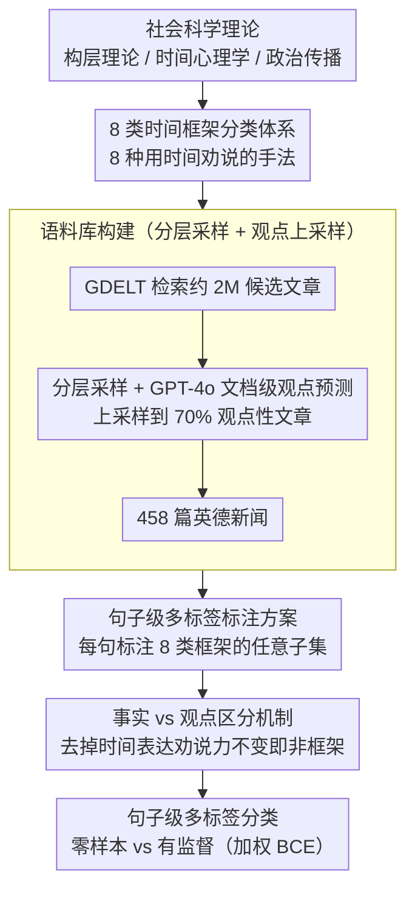

# 新闻文本中的时间框架揭示

**会议**: ACL 2026  
**arXiv**: [2606.00294](https://arxiv.org/abs/2606.00294)  
**代码**: https://mbzuai-nlp.github.io/temporal-framing/  
**领域**: NLP 理解 / 话语分析  
**关键词**: 时间框架、修辞分析、新闻话语、多语言语料库、文本分类

## 一句话总结

本文提出了新闻文本中"时间框架"的概念——从社会科学理论出发，建立包含 8 类时间框架的分类体系，标注了英德双语新闻语料库，并用有监督和零样本两种方式训练模型进行时间框架检测。

## 研究背景与动机

**领域现状**：NLP 中的时间处理传统上聚焦于时间表达式抽取、事件排序、时间推理等任务，主要关注时间作为客观的、描述性的事件属性。同时，学界已在框架理论的指导下开展了大量文本框架分析工作，从文档级、实体级、事件级的框架检测。

**现有痛点**：现有时间处理工作将时间视为客观属性而非修辞资源，忽视了时间语言在话语中的劝说功能；虽然框架分析工作深入，但尚未明确建模时间语言的框架维度。这导致 NLP 系统无法分析新闻中通过时间参考进行的修辞操纵——比如唤起怀旧情绪、制造紧迫感、锚定历史事件来合理化政策等。

**核心矛盾**：时间既可用于陈述事实（"通胀在 2024 年上升 2%"），也可作为修辞策略（"通胀多年持续上升，标志政策失败"）。后者的时间要素对劝说力至关重要，但现有 NLP 模型难以区分这两种用法。同时，社会科学领域早已系统研究时间框架如何影响认知和决策，但这些洞察从未被纳入 NLP。

**本文目标**：系统地建模新闻文本中时间框架作为修辞维度的角色，包括：（1）建立理论扎根的时间框架分类体系；（2）创建多语言标注语料库；（3）评估计算模型的性能；（4）分析时间框架的模式和触发词。

**切入角度**：从构层理论（construal level theory）、时间心理学等社会科学基础出发，将时间框架定义为"通过时间相关元素的修辞使用来结构意义和说服受众的方式"，而非仅仅描述事件顺序。

**核心 idea**：建立 8 类时间框架的分类体系（首要性、近期性、紧迫感、时间锚定、怀旧、时间对比、连续性、怀疑），通过句子级多标签分类来检测这些框架，从而捕捉新闻话语中的修辞意图。

## 方法详解

### 整体框架

本研究是一条从理论到资源再到模型的三阶段流水线。第一阶段从社会科学（构层理论、时间心理学、政治传播学）推导出 8 类时间框架分类法；第二阶段构建语料库——从 GDELT 检索约 2M 候选文章，按主题/语言/媒体/月份分层采样、用 GPT-4o 做文档级观点预测并上采样到 70% 观点性文章，最终留下 458 篇英德新闻做人工句子级标注（LLM 标签只用于采样、不参与最终标注）；第三阶段把时间框架检测形式化为句子级多标签分类，对比零样本与有监督两类模型。

### 关键设计

**1. 8 类时间框架分类体系：把时间从事件属性升级为修辞维度**

现有 NLP 框架分类多停在文档级或实体级，从没把时间当成一个独立的修辞维度建模，因此无法分析新闻里“用时间来劝说”的手法。本文从社会科学理论推导出 8 类框架，每一类对应一种时间被用来说服受众的方式：**首要性**（“首家发现治愈方案者将领导世界”）、**近期性**（强调最近事件的重要性）、**紧迫感**（时间限制或迫在眉睫的威胁）、**时间锚定**（“后 9·11 世界”，用历史参照框定现在）、**怀旧**（“找回昔日荣光”，调用过去情感）、**时间对比**（“曾经的繁荣中心，如今衰退中的城市”）、**连续性**（“经济十年来稳步上升”）、**怀疑性**（对未来的质疑）。这套体系既填补了时间维度的空白，又与社会科学既有研究高度对齐。

**2. 句子级多标签标注方案：在精度和成本之间取平衡**

跨句标注复杂度高、标注成本大，所以作者选句子级粒度，并把任务定义成多标签分类：给定文档 $D$ 和句子 $s_i$，输出 $f(D, s_i) \in \mathcal{P}(F)$，其中 $F$ 是 8 类框架集合、$\mathcal{P}(F)$ 是它的幂集。允许多标签是因为单句常同时含多种框架（如紧迫感+怀疑性），这正反映真实新闻话语里框架的共现。最终约 2365 个英文句子和 617 个德文句子被标为含至少一类框架，总标注数分别为 1934 和 2317。

**3. 事实 vs. 观点的区分机制：教模型识别修辞意图而非时间表面模式**

这是时间框架与传统时间表达抽取的本质区别——“2024 年通胀上升 2%”是可验证的事实陈述，“多年持续上升、标志政策失败”才是修辞性框架。作者引入一条启发式判据：若移除时间表达后句子的劝说力不变，则该时间元素只是附带的、不算框架，例如“上周宣布的计划存在深层缺陷”里的“上周”去掉后意思不变，故不计为时间框架。标注时还需排除引文和间接陈述（其说话人不是作者）。这条规则简洁却抓住了关键——模型要学的是“修辞意图”，不是“时间概念”。

### 数据构建与训练策略

语料采样上，从约 2M 候选中分层采样、用 GPT-4o 预测文档级观点标签并上采样，确保最终 70% 为观点性文章以富集修辞内容。训练侧针对标签长尾（如怀旧仅 42 例）用加权 BCE 损失 + 标签感知批处理，使仅 270M 参数的 XLM-R 也能逼近大模型微调的性能。

## 实验关键数据

### 主实验

| 方法 | 模型 | 二元检测 F1 | 多标签 Micro-F1 | 观点 |
|------|------|------------|-----------------|------|
| 零样本 | Qwen3-8B | 0.33 | 0.13 | 大模型难以无监督学习 |
| 零样本 | Qwen3-235B | 0.44 | 0.24 | 参数规模有限收益 |
| 零样本 | GPT-5.2 | 0.45 | 0.31 | 最强零样本基线 |
| 有监督 | XLM-R (270M) | 0.51 | 0.37 | 小模型有监督媲美大模型 |
| 有监督 | LLaMA-3.1-8B | 0.54 | 0.42 | 精度高但召回低 |
| 有监督 | Qwen3-8B | **0.57** | **0.44** | 最强性能 |

### 消融实验

| 配置 | 二元检测 F1 | 多标签 Micro-F1 | 说明 |
|------|------------|-----------------|------|
| 仅句子 | 0.57 | 0.44 | 最优配置 |
| 句子+前后文 | 0.51 | 0.38 | 额外上下文反而降低 (-10%) |
| 句子+全文档 | 0.48 | 0.35 | 全文档效果最差 (-16%) |
| 随机基线 | 0.20 | 0.04 | 随机预测基线 |

### 关键发现

- **有监督相比零样本有显著优势**：最强零样本模型（GPT-5.2, F1=0.45）相比最强有监督模型（Qwen3-8B, F1=0.57）性能差 27%。这说明时间框架依赖细微的修辞线索和关系对比，无法通过通用提示词可靠捕捉。
- **模型规模的收益递减**：在零样本设定下，Qwen3 从 8B 增加到 235B 参数，F1 从 0.33 仅提升至 0.44。相比之下，有监督微调在任何规模上都产生大幅改进（LLaMA-3.1-8B 零样本 F1=0.24，微调后 F1=0.54，提升 125%）。
- **编码器模型的惊人表现**：XLM-R 虽仅 270M 参数，微调后 F1=0.51，超越所有零样本基线。
- **语言和数据稀疏的影响**：德文数据集中标注句子比例远低于英文，导致德文微调性能略低。
- **框架级别的异质性**：频繁框架（连续性、时间对比、时间锚定）检测较好，稀有框架（怀旧，仅 42 例）易受数据稀疏影响。

## 亮点与洞察

- **弥合 NLP 与社会科学的鸿沟**：本工作首次系统地将社会科学中关于时间框架的深入理论融入 NLP。时间不再仅是事件的属性标签，而是修辞意图的载体——这是对现有时间处理任务的概念升级。
- **巧妙的事实 vs. 意见区分启发式**：提出的"移除时间表达后劝说力不变则非框架"的判断标准简洁有效，避免了复杂的多步推理。
- **数据不均衡的优雅处理**：通过加权 BCE 损失+标签感知批处理，在仅 270M 参数的模型上达到与大模型微调相当的性能。
- **零样本与有监督的鸿沟解释**：实验深刻揭示了为何大模型在开放域表现强劲但在细粒度修辞分析中失利——时间框架检测需要学习什么是"修辞意图"而非"时间概念"。

## 局限与展望

- **语料库代表性有限**：458 篇文章来自固定媒体集合，仅覆盖英德两种语言，存在媒体来源偏差。
- **标注粒度限制**：标注在句子级而非跨度级进行，可能遗漏跨越句子边界的时间框架。
- **稀有框架的数据贫困**：怀旧框架仅 42 例，导致微调模型对其学习不足。
- **隐性修辞线索的挑战**：许多时间框架的表达方式依赖事件特定的引用和评价语言，缺乏稳定的表面模式。

**改进方向**：（1）扩展至其他语言和媒体类型；（2）模型时间框架的交互作用（多框架共现的动态）；（3）探索富文本表征（融合跨句依赖、事件结构、话语连贯性）。

## 相关工作与启发

- **vs. 文档级框架分析（Card et al., 2015; Liu et al., 2019）**：现有工作聚焦文档/标题级框架，粗粒度但易于规模化。本工作下沉到句子级，捕捉了框架在话语中的本地化实现方式，精细度更高。
- **vs. 时间表达式抽取（Tan et al., 2023; Ding & Wang, 2025）**：传统时间 NLP 关注客观的"什么时候"；本工作关注修辞的"为什么用这个时间"。两者互补而非冲突。
- **vs. 实体/事件框架（Stammbach et al., 2022; Mahmoud et al., 2025）**：最近的细粒度框架工作探索了角色和属性如何框架化实体事件，但未明确建模时间维度。本工作填补了这一空白。

## 评分

- 新颖性: ⭐⭐⭐⭐⭐ 首次将时间作为独立的修辞框架维度系统建模，理论与实践结合紧密。
- 实验充分度: ⭐⭐⭐⭐ 对比了零样本与有监督、多种模型规模、双语性能、特征分析等维度，但稀有框架的分析还可更深入。
- 写作质量: ⭐⭐⭐⭐⭐ 动机清晰、流程严谨、图表清晰、论证有力。
- 价值: ⭐⭐⭐⭐ 为新闻偏见检测、舆论分析、传播研究等下游任务提供新工具；资源开放有助社区发展。

<!-- RELATED:START -->

## 相关论文

- [\[ACL 2026\] Creating ConLangs to Probe the Metalinguistic Grammatical Knowledge of LLMs](creating_conlangs_to_probe_the_metalinguistic_grammatical_knowledge_of_llms.md)
- [\[ACL 2026\] Commonsense Knowledge with Negation: A Resource to Enhance Negation Understanding](commonsense_knowledge_with_negation_a_resource_to_enhance_negation_understanding.md)
- [\[ACL 2026\] Agree, Disagree, Explain: Decomposing Human Label Variation in NLI through the Lens of Explanations](agree_disagree_explain_decomposing_human_label_variation_in_nli_through_the_lens.md)
- [\[ACL 2026\] Exploring Concreteness Through a Figurative Lens](exploring_concreteness_through_a_figurative_lens.md)
- [\[ACL 2026\] LexRel: Benchmarking Legal Relation Extraction for Chinese Civil Cases](lexrel_benchmarking_legal_relation_extraction_for_chinese_civil_cases.md)

<!-- RELATED:END -->
