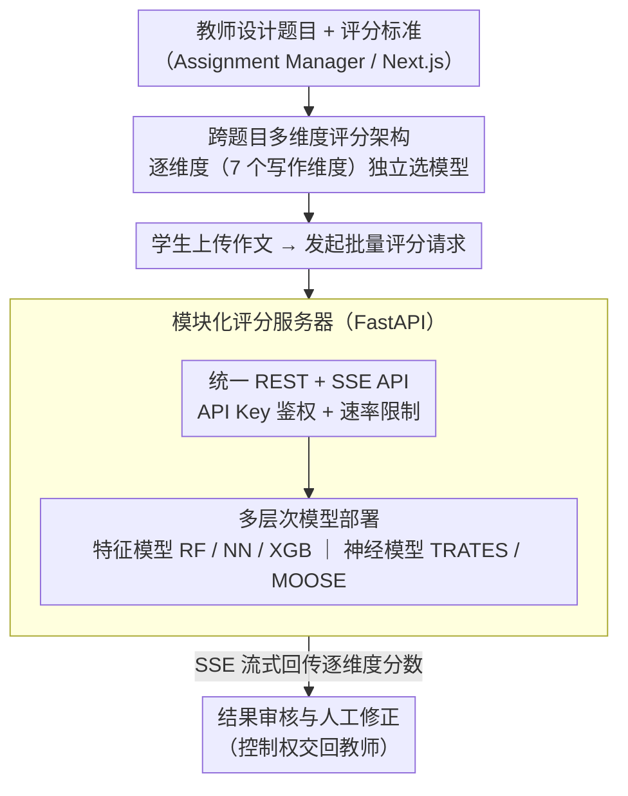

<!-- 由 src/gen_stubs.py 自动生成 -->
# Qayyem: A Real-time Platform for Scoring Proficiency of Arabic Essays

**会议**: ACL 2026  
**arXiv**: [2603.01009](https://arxiv.org/abs/2603.01009)  
**代码**: [https://qayyem.qu.edu.qa/](https://qayyem.qu.edu.qa/)  
**领域**: 其他  
**关键词**: 自动作文评分, 阿拉伯语NLP, 多维度评分, 跨题目泛化, 教育技术

## 一句话总结
Qayyem 是首个支持跨题目（cross-prompt）多维度（multi-trait）阿拉伯语自动作文评分的 Web 平台，集成了从特征工程到 SOTA 神经模型的多种评分方案，支持端到端的学术写作评估工作流。

## 研究背景与动机
**领域现状**: 自动作文评分（AES）系统在英语场景已有大量进展，但阿拉伯语 AES 由于语言复杂性和大规模标注数据集稀缺而严重滞后。

**现有痛点**: 现有阿拉伯语写作工具（如 Qalam）主要聚焦写作辅助而非评分；唯一已知的部署系统 ARWI 仅支持 prompt-specific 模式且不支持多维度评分。

**核心矛盾**: 教育场景需要一个能泛化到新题目、对多维写作特征（语法、组织、词汇等）分别打分的可部署系统，但现有工具无法同时满足跨题目泛化与多维度评分。

**本文目标**: 构建首个跨题目多维度阿拉伯语 AES 在线平台。

**切入角度**: 以 Web 平台为载体，将多种 SOTA 评分模型封装为统一 API 服务，并提供完整的作业创建-上传-评分-审核工作流。

**核心 idea**: 通过在 LAILA 大规模数据集上训练的跨题目模型 + 模块化架构设计，使教师无需技术背景即可使用先进的 AES 模型。

## 方法详解

### 整体框架
Qayyem 要解决的是「让没有技术背景的教师也能用上 SOTA 阿拉伯语作文评分模型」，因此它把研究模型和教学工作流封装成一个可部署的 Web 平台。系统采用前后端分离架构：Assignment Manager（Next.js 全栈应用）承载 Web 交互与作业管理，Scoring Server（FastAPI）承载模型推理与 API 服务。一份作文从进入系统到拿到分数走完四步——题目与评分标准设计、作业配置（选评分维度与模型）、批量评分、结果审核与人工修正——前三步由平台自动衔接，最后一步把控制权交回教师。

### 关键设计

**1. 跨题目多维度评分架构：把一篇作文拆成 7 个维度分别打分**

阿拉伯语教学需要的不是一个笼统的总分，而是对相关性、组织、词汇、风格、展开、拼写标点、语法这 7 个写作维度分别给出反馈；而且不同维度的评估难度和最优模型并不相同。Qayyem 让每个维度独立配置模型，所有候选模型都在 LAILA 数据集的跨题目划分（cross-prompt split）上训练，从而能泛化到训练时没见过的新题目。这样教师可以为「语法」选一个模型、为「组织」选另一个模型，按维度自由组合，而不是被一个全局模型锁死。

**2. 模块化评分服务器：靠配置文件加模型，不动核心代码**

平台要长期演进，就不能每加一个新模型都改一遍推理代码。Scoring Server 用一份配置文件集中管理所有模型的加载、启用与元数据，所有模型遵循同一套共享接口，对外只暴露统一的 REST + SSE API；访问通过 API Key 鉴权加速率限制保护，并用 SSE 把批量评分的进度实时流式推回前端。系统管理员因此可以热更新——在不碰核心代码的前提下添加或禁用任意模型。

**3. 多层次模型部署：用「效果-效率」梯度覆盖不同教学场景**

实时课堂随手批改和期末大规模评卷对速度与准确度的要求完全不同，单一模型无法两头兼顾。Qayyem 同时部署轻量特征模型（RF、NN、XGB，基于 816 个手工特征）和两个 SOTA 神经模型：TRATES 用 LLM 生成 trait-specific 特征再叠加语言特征，MOOSE 则把 MoE、成对排序与相关性建模结合起来。教师可以在毫秒级的特征模型和分钟级但更准的 TRATES 之间，按场景挑一个合适的档位。

### 损失函数 / 训练策略
所有模型均在 LAILA 数据集（7,859 篇阿拉伯语作文、8 个题目）上以跨题目设置训练。评估指标为 Quadratic Weighted Kappa（QWK），衡量预测评分与人工评分的一致性。TRATES 使用 Fanar LLM 生成特征，MOOSE 使用 AraBERT 编码器。

## 实验关键数据

### 主实验
各模型在 LAILA 数据集 8 个题目上的平均 QWK：

| 模型 | REL | ORG | VOC | STY | DEV | MEC | GRM | HOL | AVG |
|------|-----|-----|-----|-----|-----|-----|-----|-----|-----|
| RF | 0.331 | 0.609 | 0.644 | 0.637 | 0.573 | 0.559 | 0.609 | 0.682 | 0.581 |
| NN | 0.353 | 0.609 | 0.621 | 0.631 | 0.566 | 0.565 | 0.597 | 0.651 | 0.574 |
| XGB | 0.360 | 0.645 | 0.641 | 0.641 | 0.583 | 0.577 | 0.619 | 0.679 | 0.593 |
| MOOSE | 0.411 | 0.627 | 0.642 | 0.649 | 0.585 | 0.586 | 0.623 | 0.649 | 0.597 |
| **TRATES** | **0.557** | **0.696** | **0.657** | **0.664** | **0.652** | **0.608** | **0.643** | **0.744** | **0.653** |

### 效率-效果权衡
| 模型 | 平均 QWK | 每篇推理时间 |
|------|----------|-------------|
| NN | 0.574 | 0.2 秒 |
| RF | 0.581 | 0.3 秒 |
| XGB | 0.593 | 0.2 秒 |
| MOOSE | 0.597 | 1 秒 |
| TRATES | 0.653 | 30 秒 |

### 关键发现
- TRATES 在所有维度上均取得最佳表现，整体 QWK 为 0.653，比第二名 MOOSE 高 5.6 个百分点
- TRATES 在相关性（REL）维度优势最大，领先 MOOSE 达 15 个百分点
- 词汇和风格维度各模型差异较小（约 3.5 个百分点），而整体评分、展开和组织维度差距可达 9 个百分点
- TRATES 的高性能伴随 150× 的推理开销（30 秒 vs 0.2 秒），需要高端 GPU 或 LLM API

## 亮点与洞察
- 首个跨题目多维度阿拉伯语 AES 系统，填补了阿拉伯语教育技术的空白
- 平台设计兼顾全自动评分和辅助决策两种场景，支持人工审核与分数修正
- 提供公开 API 访问，便于研究者直接调用模型进行二次开发
- 效率-效果梯度设计使教师可根据场景灵活选择评分方案

## 局限与展望
- 当前仅支持阿拉伯语，但双语 UI 设计已为集成英语模型预留接口
- TRATES 推理慢（30 秒/篇），大批量评分场景可能需要异步队列优化
- 数据集 LAILA 仅覆盖 10-12 年级的说服文和说明文，对其他文体和年级的泛化性有待验证
- 系统依赖手工特征（816 维），未来可考虑端到端的多维度评分模型

## 相关工作与启发
- **ARWI**: 唯一已知的阿拉伯语 AES 部署系统，但仅支持 prompt-specific 且无多维度评分
- **CriterionSM / IFlyEA**: 英语/中文的成熟 AES 系统，Qayyem 借鉴了其跨题目 + 多维度的设计理念
- **LAILA 数据集**: 首个大规模多维度阿拉伯语 AES 基准，是本系统模型训练的基础
- 启发：资源匮乏语言的 NLP 系统工程需要同时解决数据、模型和部署三个层面的问题

## 评分
- 新颖性: ⭐⭐⭐ 核心贡献在系统集成而非模型创新，但填补了阿拉伯语 AES 平台空白
- 实验充分度: ⭐⭐⭐⭐ 在 LAILA 上的跨题目评估全面，效率-效果分析清晰
- 写作质量: ⭐⭐⭐⭐ 系统设计描述详尽，工作流可视化清楚
- 价值: ⭐⭐⭐⭐ 对阿拉伯语教育技术领域有实际部署价值

## 评分
- 新颖性: 待评
- 实验充分度: 待评
- 写作质量: 待评
- 价值: 待评

<!-- RELATED:START -->

## 相关论文

- [\[AAAI 2026\] I2E: Real-Time Image-to-Event Conversion for High-Performance Spiking Neural Networks](../../AAAI2026/others/i2e_real-time_image-to-event_conversion_for_high-performance_spiking_neural_netw.md)
- [\[ACL 2025\] DREsS: Dataset for Rubric-based Essay Scoring on EFL Writing](../../ACL2025/others/dress_dataset_rubric_based_essay_scoring_efl_writing.md)
- [\[ACL 2025\] Guidelines for Fine-grained Sentence-level Arabic Readability Annotation](../../ACL2025/others/guidelines_for_fine-grained_sentence-level_arabic_readability_annotation.md)
- [\[ACL 2025\] Enhancing Marker Scoring Accuracy through Ordinal Confidence Modelling in Educational Assessments](../../ACL2025/others/enhancing_marker_scoring_accuracy_through_ordinal_confidence_modelling_in_educat.md)
- [\[ACL 2025\] FRACTAL: Fine-Grained Scoring from Aggregate Text Labels](../../ACL2025/others/fractal_fine-grained_scoring_from_aggregate_text_labels.md)

<!-- RELATED:END -->
