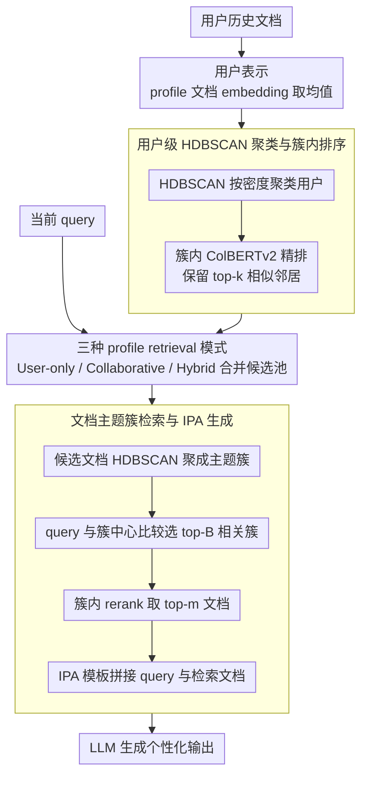

# ClusterRAG: Cluster-Based Collaborative Filtering for Personalized Retrieval-Augmented Generation

**会议**: ACL2026  
**arXiv**: [2605.18769](https://arxiv.org/abs/2605.18769)  
**代码**: https://github.com/academicprojects44/anonymous  
**领域**: 个性化推荐 / Personalized RAG  
**关键词**: 个性化RAG, 协同过滤, 用户聚类, HDBSCAN, LaMP

## 一句话总结
ClusterRAG 把协同过滤引入个性化 RAG：先用用户历史文档构建用户表示并用 HDBSCAN 聚类，再从目标用户和相似用户中分层检索 profile 文档组成 prompt，在 LaMP 多任务基准上使 hybrid 模式全面优于 vanillaRAG、LaMP-IPA、ROPG 和 CFRAG。

## 研究背景与动机
**领域现状**：RAG 已经是降低幻觉、增强事实性的主流范式，通常做法是根据当前 query 检索外部文档，再把检索结果拼进生成模型上下文。个性化 RAG 进一步引入用户历史，让回答符合用户偏好、写作风格或长期兴趣。

**现有痛点**：很多个性化 RAG 只看目标用户自己的 profile，这在用户历史稀疏、噪声大或当前 query 与历史记录不完全匹配时很脆弱。另一端是非个性化 RAG，完全忽视用户长期偏好。已有协同式方法尝试找相似用户，但如果直接在大规模用户集合中两两计算相似度，成本高；找到相似用户后，如何选择其文档并与目标用户 profile 混合也缺少系统设计。

**核心矛盾**：个性化需要充分利用目标用户历史，但单个用户历史往往不完整；协同过滤能补足稀疏性，却会带来检索复杂度、隐私和噪声邻居问题。一个可扩展的 Personalized RAG 需要在“个人信号”和“相似群体信号”之间找到可控混合方式。

**本文目标**：ClusterRAG 希望构建一个模型无关、检索器可替换、能利用协同信号但不强依赖模型参数微调的 RAG pipeline。它要解决三件事：用户如何表示、相似用户如何高效找、目标用户文档与相似用户文档如何一起进入生成 prompt。

**切入角度**：作者把推荐系统里的聚类式协同过滤迁移到 RAG 检索前端。用户先被组织为语义一致的 cohort，搜索相似用户时只在同簇内部排序；文档检索也通过 profile 文档聚类先选主题簇再做细粒度 rerank。

**核心 idea**：用 HDBSCAN 构建用户/文档的层次化检索空间，再用 hybrid profile retrieval 同时注入目标用户和相似用户的证据，让 LLM 生成更稳定的个性化输出。

## 方法详解

### 整体框架
ClusterRAG 包含三个阶段：用户表示与相似用户检索、profile 文档检索、个性化生成。首先，系统把每个用户的历史文档编码成 dense embeddings，并对文档向量取平均得到用户表示。随后用 HDBSCAN 将用户分入可变密度簇，并在每个簇内用 ColBERTv2 计算细粒度用户相似度，保留每个用户的 top-$k$ 相似邻居。给定当前 query 后，系统可以只检索目标用户文档、只检索相似用户文档，或使用二者混合。最后，候选文档还会再被聚成主题簇，先选相关簇，再在簇内取 top-$m$ 文档拼入 IPA prompt，交给生成模型输出。

### 关键设计

**1. 用户级 HDBSCAN 聚类与簇内排序：先聚类再排序，避开全局两两比较**

在大规模用户集合里两两计算相似度成本极高，而且很容易把主题完全不相关的用户当成「相似邻居」引入噪声。ClusterRAG 先把每个用户 $u$ 表示成其 profile 文档 embedding 的平均值 $\mathbf{z}_u=\frac{1}{n_u}\sum_i f(d_i)$，用 HDBSCAN 按密度自动发现可变大小的用户簇；随后只在同一簇内部用 ColBERTv2 算细粒度相似度 $R^C_{u,v}=ColBERTv2(\mathbf{z}_u,\mathbf{z}_v)$，为每个用户保留 top-$k$ 邻居。这样相似度计算被限制在行为更一致的 cohort 内，既省掉了全局比较的开销，又过滤掉了跨主题的噪声邻居。

**2. 三种 profile retrieval 模式：显式控制个体信号与协同信号的配比**

只看目标用户自己的 profile，在用户历史稀疏或冷启动时很脆弱；纯靠相似用户又会稀释个人偏好。ClusterRAG 提供三种模式：User-only 只用目标用户 profile，Collaborative 从 top-$k$ 相似用户的 profile 取文档，Hybrid 则把两类文档合并成候选池。论文默认 $k=1$、$m=2$，也就是在「只借 1 个相似用户、最终只塞 2 篇文档」这种极简设置下测试协同信号是否真的有帮助——hybrid 在这种约束下依然全面领先，说明个性化不是简单替换上下文，而是用相似用户证据补充上下文。

**3. 文档主题簇检索与 IPA 生成：分层缩小候选，把 prompt 长度花在刀刃上**

把候选用户的所有历史文档一股脑塞进 prompt，既浪费上下文长度，又会引入与当前任务无关的历史。ClusterRAG 对候选 profile 文档同样先用 dense retriever 编码、再用 HDBSCAN 聚成主题簇并算出簇中心；给定 query 后，先用 query embedding 与簇中心比较选 top-$B$ 个相关簇，再在选中簇内 rerank 取 top-$m$ 文档。生成阶段用 In-Prompt Augmentation（IPA）按任务模板把 query 与检索文档拼接，prompt 中 profile 占用的长度由 $|U_p|=\mathcal{G}_t(L_{max}-\min(|q|,\lfloor \gamma L_{max}\rfloor))$ 控制（默认 $\gamma=0.55$）。这套层次检索把复杂度降到 $\mathcal{O}(K+B\cdot N/K)$，同时保证进入 prompt 的只有当前任务最相关的证据。

### 一个完整示例
以 LaMP 的个性化标题生成任务、默认配置（$k=1$、$B$ 个主题簇、$m=2$）走一遍：目标用户 Alice 历史文档稀疏，系统先取她 profile 文档 embedding 的均值得到 $\mathbf{z}_{\text{Alice}}$，定位到她所属的用户簇；在该簇内用 ColBERTv2 排序，挑出 1 个最相似邻居 Bob（$k=1$）。Hybrid 模式把 Alice 自己的 profile 文档和 Bob 的 profile 文档合并成候选池——假设共 40 篇。这 40 篇先被聚成若干主题簇，query 与各簇中心比较后只保留 top-$B$ 个相关簇（候选收缩到约十几篇），再在这些簇内 rerank 取 top-2 文档。最后这 2 篇连同 query 按 IPA 模板拼成 prompt 交给 FlanT5-base 生成标题。整条链路把「40 篇 → 十几篇 → 2 篇」逐级收缩，既补上了 Alice 稀疏历史的缺口，又没让无关文档挤占 prompt。

### 损失函数或训练策略
ClusterRAG 本身是检索与 prompt 组织框架，不要求改造生成模型结构。主实验用 fine-tuned FlanT5-base；扩展实验还用 FlanT5-XXL 和 Qwen2-7B-Instruct 做 zero-shot 个性化测试。训练采用 AdamW，学习率 $5\times10^{-5}$，weight decay $10^{-4}$，warm-up ratio 0.05，最多 30 epoch，batch size 16，最大 prompt 长度 512，最大输出长度 128，beam size 4。实验在 Quadro RTX 8000 48GB 上运行，每个任务约 10-24 小时。

## 实验关键数据

### 主实验
LaMP 基准包含个性化 citation、movie tagging、product rating、headline/title generation 和 tweet paraphrasing 等任务。下表摘取主表中的代表指标；分类任务越高越好，LaMP-3 的 MAE/RMSE 越低越好。

| 方法 | LaMP-1 Acc/F1 | LaMP-2 Acc/F1 | LaMP-3 MAE/RMSE | LaMP-7 R-1/R-L |
|------|---------------|---------------|-----------------|----------------|
| vanillaRAG | 0.630 / 0.630 | 0.520 / 0.440 | 0.371 / 0.709 | 0.310 / 0.273 |
| LaMP-IPA | 0.674 / 0.664 | 0.570 / 0.522 | 0.289 / 0.608 | 0.508 / 0.457 |
| CFRAG | 0.633 / 0.327 | 0.534 / 0.036 | 0.354 / 0.707 | 0.375 / 0.306 |
| ClusterRAG-C | 0.674 / 0.673 | 0.644 / 0.607 | 0.284 / 0.624 | 0.507 / 0.454 |
| ClusterRAG-U | 0.645 / 0.645 | 0.649 / 0.612 | 0.271 / 0.599 | 0.514 / 0.464 |
| ClusterRAG-H | 0.690 / 0.690 | 0.661 / 0.620 | 0.270 / 0.594 | 0.521 / 0.470 |

### 消融实验
| 变体 | LaMP-3 MAE | LaMP-3 RMSE | LaMP-7 R-1 | LaMP-7 R-L | 说明 |
|------|-----------:|------------:|-----------:|-----------:|------|
| w/o user clustering | 0.320 | 0.637 | 0.458 | 0.371 | 随机相似用户，协同信号变噪 |
| w/o intra-cluster sim | 0.329 | 0.639 | 0.501 | 0.442 | 没有簇内精排，相似用户质量下降 |
| w/o doc ranking | 0.331 | 0.642 | 0.462 | 0.413 | 文档级证据未被有效排序 |
| Centroids only | 0.400 | 0.643 | 0.472 | 0.438 | 只用中心表示，丢失具体证据 |
| k-means | 0.291 | 0.610 | 0.502 | 0.453 | 聚类可替换，但弱于 HDBSCAN |
| ClusterRAG | 0.270 | 0.594 | 0.521 | 0.470 | 完整方法 |

### 关键发现
- Hybrid 模式在所有 LaMP 任务上取得最优，说明目标用户 profile 与相似用户 profile 的互补性很强。
- 只用 2 个 profile 文档就能超过需要更多文档的基线，说明“选对文档”比“塞更多文档”更重要。
- ColBERTv2 是最强 retriever：在 LaMP-1/2/7 上达到 0.690/0.690、0.661/0.620、0.521/0.470；Random、Recency、BM25 明显落后，BGE 和 Contriever 居中。
- zero-shot LLM 也受益于 ClusterRAG：pFlan 在 LaMP-1 上从 0.546/0.540 提升到 0.648/0.647，pQwen2 在 LaMP-2 上从 0.521/0.521 提升到 0.610/0.606。

## 亮点与洞察
- **把协同过滤做成 RAG 前端，而不是改 LLM**：这让方法更容易接到现有 personalized generation 系统里，也避免了为每个用户微调模型。
- **用户聚类和文档聚类分层对应两个问题**：用户聚类解决“向谁借信号”，文档聚类解决“借哪些证据”，结构上很清楚。
- **hybrid 检索是核心收益点**：实验显示 user-only 和 collaborative-only 都有用，但二者混合最稳，说明个性化不是单纯替换上下文，而是补充上下文。
- **对冷启动有实际意义**：当目标用户历史稀疏时，相似用户文档可以填补缺口；当协同信号不可信时，框架也能退回 user-only。

## 局限与展望
- 生成端依赖 IPA prompt，作者也承认 prompt formulation 不是最优；更结构化的 prompt 或检索-生成联合优化可能进一步提升结果。
- LaMP-1 和 LaMP-5 只有论文摘要而非全文，因此 citation/title 类任务的信息上限受限。
- 实验限制在英文、文本数据，尚未验证多语言、多模态用户历史或跨平台推荐场景。
- 框架性能仍依赖底层 LLM 与 retriever；如果用户 embedding 或文档 embedding 本身带偏差，协同过滤可能放大群体偏见。
- 后续可以研究增量聚类、在线用户重分配、隐私保护 embedding 聚合，以及把生成反馈回流到检索排序中。

## 相关工作与启发
- **vs vanillaRAG / Self-RAG**: 传统 RAG 主要围绕当前 query 检索共享知识；ClusterRAG 进一步把用户长期历史和相似用户历史纳入上下文。
- **vs LaMP-IPA / ROPG**: 这些个性化方法更侧重目标用户自己的 profile；ClusterRAG 的增量在于显式建模跨用户协同信号。
- **vs CFRAG**: CFRAG 使用 contrastive learning 找相似用户；ClusterRAG 用 HDBSCAN 和簇内 ColBERTv2 排序，强调可扩展的 cohort 检索和文档级 rerank。
- **启发**：在企业知识助手、学习助手或长周期写作助手中，可以把相似用户或相似项目的历史交互作为“协同记忆”，但需要用聚类与权限控制约束检索范围。

## 评分
- 新颖性: ⭐⭐⭐⭐☆ 把协同过滤和 Personalized RAG 结合得系统，单个模块不陌生，但组合完整。
- 实验充分度: ⭐⭐⭐⭐☆ LaMP 覆盖任务多，并有 retriever、LLM、消融分析；真实大规模线上延迟和隐私评估仍欠缺。
- 写作质量: ⭐⭐⭐⭐☆ 方法拆解清楚，表格覆盖全面；部分符号和 prompt 细节略显密集。
- 价值: ⭐⭐⭐⭐☆ 对个性化 RAG 很有工程启发，尤其适合用户历史稀疏但群体行为可用的场景。

<!-- RELATED:START -->

## 相关论文

- [\[ACL 2026\] MemRec: Collaborative Memory-Augmented Agentic Recommender System](memrec_collaborative_memory-augmented_agentic_recommender_system.md)
- [\[AAAI 2026\] SlideTailor: Personalized Presentation Slide Generation for Scientific Papers](../../AAAI2026/recommender/slidetailor_personalized_presentation_slide_generation_for_scientific_papers.md)
- [\[ICML 2026\] Rethinking Contrastive Learning for Graph Collaborative Filtering: Limitations and a Simple Remedy](../../ICML2026/recommender/rethinking_contrastive_learning_for_graph_collaborative_filtering_limitations_an.md)
- [\[NeurIPS 2025\] FACE: A General Framework for Mapping Collaborative Filtering Embeddings into LLM Tokens](../../NeurIPS2025/recommender/face_a_general_framework_for_mapping_collaborative_filtering_embeddings_into_llm.md)
- [\[NeurIPS 2025\] Semantic Retrieval Augmented Contrastive Learning for Sequential Recommendation](../../NeurIPS2025/recommender/semantic_retrieval_augmented_contrastive_learning_for_sequential_recommendation.md)

<!-- RELATED:END -->
