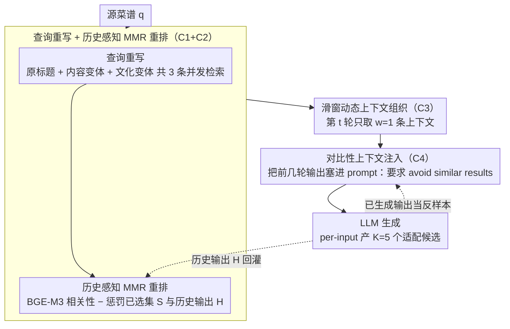

# Culinary Crossroads: A RAG Framework for Enhancing Diversity in Cross-Cultural Recipe Adaptation

**会议**: ACL 2026  
**arXiv**: [2507.21934](https://arxiv.org/abs/2507.21934)  
**代码**: <https://github.com/TenneyHu/CARRIAGE>  
**领域**: 推荐 / RAG / 跨文化生成  
**关键词**: 跨文化菜谱适配、RAG、多样性、MMR、对比上下文、CultureScore

## 一句话总结
作者发现标准 RAG 在创意任务上"给了多样上下文也产出不多样"，于是设计 plug-and-play 的 CARRIAGE：查询重写 + diversity-aware MMR 重排 + sliding-window 动态上下文 + 对比性上下文注入，把"上下文多样性"真正传导到"输出多样性"，在西班牙语跨国菜谱适配上同时改善 lexical/semantic/ingredient diversity 与 CultureScore，对 closed-book LLM 达到 Pareto efficiency。

## 研究背景与动机
**领域现状**：跨文化菜谱适配（cross-cultural recipe adaptation）是把源文化菜谱改写成目标文化版本——既要保留原菜灵魂又要符合目标饮食习惯。现有工作（Cao et al. 2024、Hu et al. 2024、Pandey et al. 2025）把它当跨文化翻译任务，用 prompt-based LLM 做中英互转，或用 IR（CARROT）从目标文化里检索真实菜谱。

**现有痛点**：先前工作只追求"高质量"，几乎没人关注"多样性"。但现实里，同一道墨西哥 Nopal 菜适配到西班牙厨房可以有多种合理替换（菠菜、芦笋、青豆…），用户的饮食偏好差异巨大——一个菜谱适配系统理应能给同一输入多份合理输出。把 RAG 应用到这种"多 valid 答案"的创意任务上后，作者意外发现：RAG 即使吃了多样的上下文，输出反而比 closed-book LLM 更不多样。

**核心矛盾**：RAG 经典设计假设"上下文 → 输出"是 1-to-1 的事实承接，但创意任务里"上下文 → 输出"是 1-to-many；LLM 在多样上下文里往往只盯着同一段抄、忽略其余（lost-in-the-middle），加上检索器对相同 query 反复返回同样结果，输出多样性被双重挤压。

**本文目标**：(1) 验证"标准 RAG 在多样上下文下能否产出多样输出"；(2) 设计兼顾质量/多样性的自动评测指标；(3) 设计一个 plug-and-play 的 RAG 框架，把上下文多样性真正传导到输出多样性。

**切入角度**：把多样性挤压拆成四个相互独立的失败点（C1 文化差异致检索遗漏；C2 排序无多样性意识；C3 上下文有限被 LLM 集中利用；C4 生成阶段不感知多样性），每个 C 对应一个轻量组件。

**核心 idea**：构造 CARRIAGE（Cultural-Aware Recipe Retrieval Augmented GEneration）：query rewriting + 历史感知 MMR 重排 + sliding-window 动态上下文组织 + 对比性上下文注入，每步只解决一个 C，整套训练 free，可即插即用到任意 LLM。

## 方法详解

### 整体框架
CARRIAGE 要解决的是"标准 RAG 在创意任务上多样性塌缩"，把多样性挤压拆成四个独立失败点（C1 检索遗漏、C2 排序无多样意识、C3 上下文被 LLM 集中利用、C4 生成不感知多样性），每个 C 对应一个轻量组件。给定源菜谱 $q$，它顺序走查询重写→历史感知 MMR 重排→滑窗动态上下文→对比性上下文注入四阶段，对每个源菜谱产 $K=5$ 个适配候选。每轮生成的输出会回灌到 MMR 的历史集合与对比注入的反样本里，构成 session 级的去重回环。整套流程完全 inference-time、训练 free，可即插即用到任意 LLM。

### 关键设计

**1. Query Rewriting + Historical-MMR Re-ranking：让检索池覆盖更广又跨轮不重复（C1+C2）**

文化差异让单条 query 召回不全，而纯相关性排序又会把同一批菜谱反复抬到顶部。CARRIAGE 先用 LLM 把源标题改写成两份变体（一份基于内容重生成、一份适配目标文化），连同原标题共 3 条 query 并发检索拉宽召回面；再用 BGE-M3 打相关性分，把经典 MMR 扩展为同时惩罚"当前已选集 $S$"和"历史 RAG 输出集合 $H$"的相似度：

$$\text{Score}(D_i) = \max_{D_i \in R \setminus S} \left[\lambda \cdot \text{Rel}(D_i) - (1-\lambda) \cdot \max_{D_j \in S \cup H} \text{Sim}(D_i, D_j)\right], \quad \lambda=0.6$$

把"历史输出 $H$"塞进相似性项是关键创新：纯 MMR 只能让一次检索的 top-$k$ 互不重复，跨多轮生成时仍倾向重复抬同一批文档；引入历史项后，前几轮已用过的菜谱会被压分，从而强制后续轮次拉出新的、未被消费的 cultural variation。

**2. Dynamic Context Organization：在输入端分窗，把上下文多样性传导成输入级多样性（C3）**

即便检索给了多样上下文，LLM 也常只盯着 1-2 段抄——这是 lost-in-the-middle 的"创意版本"。与其指望模型自己学会均匀利用上下文，CARRIAGE 直接让每轮看见的上下文真的不同：对 $k$ 条上下文 $\mathcal{C} = \{D_1, \ldots, D_k\}$，第 $t$ 轮生成只用滑窗取 $w$ 条 $\mathcal{C}_{\text{reference}}^{(t)} = \{D_{tw+1}, \ldots, D_{(t+1)w}\}$，默认 $k=5, w=1$，于是 5 轮分别看到完全不同的 1 条上下文。

这个简单滑窗效果很硬：作者的 probing 实验（Table 2）显示 Vanilla RAG 在 5 次生成里 ~76% 只主要依赖 1-2 个上下文（平均主导上下文只切换 1.78 次），即使用 CARROT-MMR 把上下文池做多样化也只涨到 1.90；CARRIAGE 把平均切换提到 2.67，相对提升 >40%，直接证明"在输入端强制分窗"比"让 LLM 内部决定怎么用上下文"更可靠。

**3. Contrastive Context Injection：在 prompt 层给生成阶段一个"反样本"信号（C4）**

post-trained LLM 的输出分布天然变 sharp（Lanchantin et al. 2025），单靠调高温度很难真正多样。CARRIAGE 每次为同一源菜谱生成新输出时，把它前几轮已生成的输出取出塞进 prompt，并显式要求模型 "avoid generating similar results"。这一步不改 LLM、不调温度，只通过 prompt 提供"远离已有输出"的明确推力，等价于在 prompt 层做一种轻量化的 diversity-promoting decoding 提示。

### 损失函数 / 训练策略
完全 training-free。关键超参：temperature=0.7、top-K/top-P/min-P 对结果几乎无影响（temperature 是真正主控）、$k=5$（检索条数）、$w=1$（滑窗大小）、$\lambda=0.6$（MMR 多样性权重）、$K=5$（per-input 生成轮数）。检索用 JINA-ES dense vector，re-ranking 用 BGE-M3。基础 LLM 选 LLaMA-3.1-8B 或 Qwen-2.5-7B（都是开源）。整个 pipeline 是 plug-and-play，可以套到任何 LLM。

## 实验关键数据

### 主实验
数据集：RecetasDeLaAbuel@ 西语菜谱集，500 个源菜谱（来自墨西哥/秘鲁/阿根廷/智利/哥伦比亚/委内瑞拉/乌拉圭七国）→ 适配到西班牙菜谱风格，检索库 9381 条西班牙菜谱。所有方法都 per-input 生成 5 个候选，再算 per-input diversity（Table 1 节选）：

| 类别 | 方法 | Lexical↑ | Ingredient↑ | Semantic↑ | CultureScore↑ | BERTScore↑ |
|------|------|----------|-------------|-----------|---------------|------------|
| Closed-book | Llama3.1-8B | 0.557 | 0.667 | 0.232 | 0.451 | 0.404 |
| Closed-book | Qwen2.5-7B | 0.551 | 0.531 | 0.247 | 0.404 | 0.439 |
| Closed-book | Gemma2-9B | 0.538 | 0.639 | 0.196 | 0.468 | 0.370 |
| IR | JINA-ES | 0.742 | 0.937 | 0.459 | 0.511 | 0.295 |
| IR | CARROT-MMR | 0.741 | 0.941 | 0.527 | 0.503 | 0.298 |
| RAG | Vanilla-LLaMA RAG | 0.518 | 0.748 | 0.155 | 0.383 | 0.551 |
| RAG | CARROT-MMR-LLaMA RAG | 0.520 | 0.748 | 0.164 | 0.393 | 0.545 |
| **Ours** | **CARRIAGE–LLaMA** | **0.577** | 0.739 | **0.269** | **0.463** | 0.442 |
| **Ours** | **CARRIAGE–Qwen** | **0.628** | 0.676 | **0.303** | **0.590** | 0.342 |

关键观察：(1) IR 直接拿检索结果当输出，diversity/CultureScore 都最高但 BERTScore（与源菜谱保留度）只有 0.30 左右——基本是另一道菜了；(2) Vanilla RAG 反而是所有 baseline 里 semantic diversity 最低的（0.155），证实"标准 RAG 在创意任务上多样性塌缩"；(3) CARRIAGE-LLaMA 相比 LLaMA closed-book 全面 Pareto dominant——lexical 0.518→0.577、semantic 0.155→0.269、CultureScore 0.383→0.463，且 BERTScore 还从 0.404 涨到 0.442；(4) CARRIAGE-Qwen 把 CultureScore 推到 0.590（全表最高），semantic diversity 0.303 也接近 IR 顶配。

### 消融实验
作者在附录给出 Table 5 消融（去掉 query rewriting / context organization / contrastive context 中任一）：每去一个都会破坏 Pareto frontier；论文正文报告了 Table 2 的"contextual diversity utilization"消融，更直观（5 次生成里主导上下文的切换次数分布）：

| 方法 | #1（始终同一上下文主导） | #2 | #3 | #4 | #5（每轮换一个） | 平均切换次数 |
|------|-------------------------|-----|-----|-----|-------------------|---------------|
| Vanilla RAG | 204 | 209 | 78 | 9 | 0 | 1.78 |
| CARROT RAG | 195 | 212 | 88 | 5 | 0 | 1.81 |
| CARROT-MMR RAG | 180 | 201 | 108 | 11 | 0 | 1.90 |
| **CARRIAGE RAG** | **40** | 178 | 202 | 67 | 13 | **2.67** |

仅靠提供更多样的检索上下文（CARROT-MMR RAG），平均切换次数仅从 1.78→1.90，提升 <7%；CARRIAGE 通过 dynamic context organization 直接把平均切换提到 2.67、相对提升 >40%，且 #4 #5 两档第一次出现非零样本，证明输入端分窗是真正起作用的关键组件。

### 关键发现
- **"标准 RAG 多样性塌缩"是一个跨数据集的普遍现象**：Vanilla-LLaMA RAG 的 semantic diversity 0.155 比 closed-book LLaMA 的 0.232 还低，BERTScore 高（0.551）是因为模型直接抄了检索段。
- **per-input 多样性与 CultureScore 正相关，但与 BERTScore 负相关**：保留源菜谱越多，就越难做出文化适配（图 5 Pearson 矩阵证实）；CARRIAGE 在 BERTScore 上略低于 RAG 但仍高于 closed-book，权衡得当。
- **CARRIAGE 在不同 base LLM 上展现不同侧重**：LLaMA 版偏 source preservation，Qwen 版偏 cultural appropriateness，给部署者明确的"选 backbone 选权衡"的空间。
- **CultureScore 与人评一致性 κ=0.59**（双标注者间 κ=0.68 为上限），证明这个 BERT-based 自动指标是 reliable proxy。
- **Across-input 全局多样性反而下降**（图 6）：所有适配方法都把高频 ingredient 用得更多，作者承认 per-input 多样性 ≠ 全局多样性，后者是 future work。

## 亮点与洞察
- **诊断式问题分解 C1/C2/C3/C4 + 一一对应组件**：把"RAG 多样性不足"这个看起来抽象的现象拆成四个互相独立的失败点，每个组件只解决一个 C，让框架既好理解又好做消融，方法论上比"端到端魔法"清晰得多。
- **Historical-MMR 是从单查询到 session-level 多样性的关键升级**：把"历史输出集合 $H$"塞进 MMR 相似性项，是个简单但效果显著的扩展，可直接迁移到任何"同一 user 多次 query"的检索/推荐场景。
- **dynamic context organization 揭示了 LLM 的一个隐性失效模式**：即便给了多样上下文，LLM 也只会盯着 1-2 段抄；这其实是 lost-in-the-middle 的"创意版本"。作者用滑窗在 prompt 端绕过这个失效模式，比改进 decoding/temperature 等花哨方法更直接、更便宜、更稳定。
- **CultureScore 作为自动文化适配评估**：用国家分类器的目标国概率当评分，避开了语言线索（西语都通），强制学习 ingredient / flavor / writing style 等文化特征，F1>0.90 的分类器给出 reasonable 评测；这一思路可直接推广到方言适配、地域差异化生成等任务。

## 局限与展望
- 作者承认的局限：(1) 只覆盖西语圈跨国适配，未触中英、东亚、阿拉伯等更宽泛的文化跨度；(2) 因资源限制只用开源 7-9B LLM，未测 GPT-4 这类有更丰富文化知识的大模型；(3) 没做人评菜谱质量。
- 自己发现的局限：(1) per-input 多样性提升但 across-input 全局多样性反而下降（图 6），所有方法都更依赖高频 ingredient，意味着用户在"广度"上仍受限；(2) sliding window $w=1$ 极端，每轮只看 1 条上下文，可能在 query 复杂时丢失信息；(3) historical-MMR 的历史项 $H$ 随生成轮数线性增长，长 session 下计算成本会上升；(4) contrastive context 直接把前几轮输出塞进 prompt，会消耗 context window，对长菜谱可能 token 紧张；(5) 整套依赖 dense 检索 + 重排，对 cold-start 文化对（无 retrieval corpus）失效。
- 改进思路：(1) 在 prompt 里显式提示 "避开 top-N high-frequency ingredients" 改善 across-input 多样性；(2) 把 sliding window 改成 stride > $w$ 的随机采样，兼顾输入丰富度和上下文多样性；(3) 用 reservoir sampling 维护一个 fixed-size 历史集合代替线性增长；(4) 把 contrastive context 用 distill / latent embedding 替代逐字注入，缓解 token 压力；(5) 把 CARRIAGE 套到中英、阿英等更高文化差异语言对，验证泛化能力。

## 相关工作与启发
- **vs CARROT (Hu et al. 2024)**：CARROT 是检索 SOTA，给的是 retrieval result 本身；CARRIAGE 在 CARROT 之上加了 RAG 生成 + 4 个多样性组件，把检索的多样性传导成输出的多样性。
- **vs 经典 MMR (Carbonell & Goldstein 1998)**：经典 MMR 只在单查询 top-k 里去重，CARRIAGE 把它扩展到跨多次生成 session（加历史项 $H$），是检索-生成耦合场景的自然推广。
- **vs Lost-in-the-middle (Liu et al. 2023)**：LiM 关注 LLM 对长上下文中段信息利用差，CARRIAGE 关注 LLM 对多样上下文的均匀利用差——本质都是 LLM "选择性消费上下文"的失败，但 CARRIAGE 给出了 prompt-level 的工程缓解方案。
- **vs Carraro & Bridge 2024（LLM-based diversity re-ranking）**：他们关注推荐场景的多样化重排，CARRIAGE 把"重排 + 动态上下文 + 对比注入"打包成完整 RAG pipeline，并扩展到创意生成。
- **启发**：(1) "把上下文多样性真正传导到输出多样性"是所有 RAG-for-creative-tasks 的共性挑战，CARRIAGE 提供的"输入端分窗 + 对比性 prompt"是廉价高效的通用方案；(2) Historical-MMR 可直接迁移到 session-based 推荐、创作伙伴、对话系统等任意"多轮生成需要互不重复"的场景；(3) CultureScore 思路（用分类器概率当文化适配评分）可平移到方言、地区文风、营销文案地域适配等下游任务的自动评测。

## 评分
- 新颖性: ⭐⭐⭐⭐ 第一个显式把"多样性"作为 RAG 一等目标的工作，C1-C4 诊断 + 四件套缓解的方法学清晰，单项技术不算颠覆但组合扎实。
- 实验充分度: ⭐⭐⭐⭐ 完整覆盖 IR/LLM/RAG 三族 baseline、双 LLM backbone、人评 CultureScore、超参敏感性、消融、contextual utilization 探针；只憾未做菜谱质量人评。
- 写作质量: ⭐⭐⭐⭐ 故事线（"RAG 不多样" → 问题分解 → 四组件 → Pareto）层层递进，图 1 Nopal 示意直观，Table 1 颜色标注 Pareto 关系很直接。
- 价值: ⭐⭐⭐⭐ 给创意类 RAG（推荐解释、对话写作、菜谱适配、跨文化文案）提供了即插即用的多样性增强工具，CARRIAGE 代码开源，落地门槛低。

<!-- RELATED:START -->

## 相关论文

- [\[AAAI 2026\] From IDs to Semantics: A Generative Framework for Cross-Domain Recommendation with Adaptive Semantic Tokenization](../../AAAI2026/recommender/from_ids_to_semantics_a_generative_framework_for_cross-domain_recommendation_wit.md)
- [\[ACL 2026\] SenseJudge: Human-Centric Preference-Driven Judgment Framework](sensejudge_human-centric_preference-driven_judgment_framework.md)
- [\[AAAI 2026\] CroPS: Improving Dense Retrieval with Cross-Perspective Positive Samples in Short-Video Search](../../AAAI2026/recommender/crops_improving_dense_retrieval_with_cross-perspective_positive_samples_in_short.md)
- [\[ACL 2026\] Personalizing LLMs with Binary Feedback: A Preference-Corrected Optimization Framework](personalizing_llms_with_binary_feedback_a_preference-corrected_optimization_fram.md)
- [\[ACL 2025\] KERL: Knowledge-Enhanced Personalized Recipe Recommendation using Large Language Models](../../ACL2025/recommender/kerl_knowledge-enhanced_personalized_recipe_recommendation_using_large_language_.md)

<!-- RELATED:END -->
