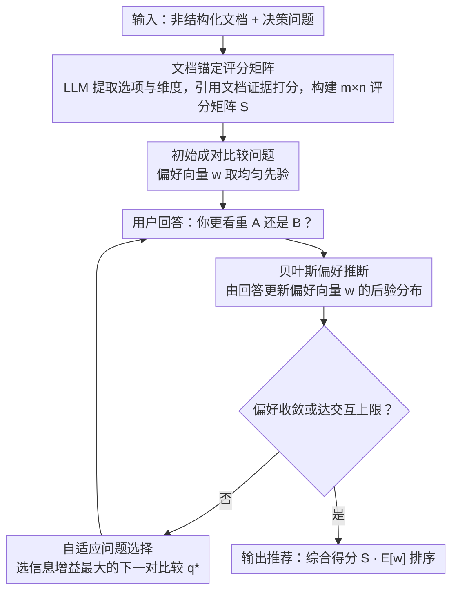

# Decisive: Guiding User Decisions with Optimal Preference Elicitation from Unstructured Documents

**会议**: ACL 2026  
**arXiv**: [2604.18122](https://arxiv.org/abs/2604.18122)  
**代码**: 无  
**领域**: 推荐系统  
**关键词**: 决策支持, 偏好获取, 贝叶斯推断, 文档锚定, 交互式系统

## 一句话总结

提出 DECISIVE 交互式决策框架，通过从非结构化文档中提取客观选项评分矩阵，结合贝叶斯偏好推断自适应选择成对比较问题高效学习用户潜在偏好向量，在最小化用户交互负担的同时实现透明个性化推荐，决策准确率比强基线提升最高 20%。

## 研究背景与动机

**领域现状**：决策制定是一项认知密集型任务——用户需要从多个非结构化信息源中综合信息、权衡竞争因素、并融入个人主观偏好。典型场景包括选择产品、学校、医疗方案等。现有的辅助决策工具包括 LLM 直接生成建议和传统决策支持系统。

**现有痛点**：LLM 直接回答决策问题时，要么信息过载（列出所有优缺点但不给明确建议），要么过于武断（给出建议但不透明、不考虑个人偏好）。传统决策支持系统需要结构化输入和明确的偏好权重，但用户往往无法准确表达自己的偏好——他们"知道自己想要什么"但说不出具体的权重分配。

**核心矛盾**：有效的决策支持需要同时解决两个问题：（1）从非结构化信息中客观提取选项的多维评分；（2）高效获取用户的主观偏好。现有方法要么忽视客观信息的锚定（纯靠 LLM 主观判断），要么忽视偏好获取的效率（要求用户填写大量问卷）。

**本文目标**：构建一个交互式决策框架，既能从文档中客观提取选项信息，又能通过最少的交互高效学习用户偏好，最终给出透明且个性化的推荐。

**切入角度**：作者将决策问题分解为"客观维度"和"主观维度"——客观维度通过文档锚定的评分矩阵解决，主观维度通过贝叶斯偏好推断解决。两者的桥梁是自适应选择的成对比较问题。

**核心 idea**：用文档锚定的选项评分矩阵提供客观基础，通过信息增益最大化的自适应成对比较问题高效学习用户潜在偏好向量，两者结合实现透明、高效、个性化的决策推荐。

## 方法详解

### 整体框架

DECISIVE 的输入是一组与决策相关的非结构化文档（如产品评测、学校介绍）和一个决策问题，输出是个性化的选项排序和推荐。流程分为四步：（1）从文档中提取选项和评估维度，构建客观评分矩阵；（2）设计初始成对比较问题呈现给用户；（3）基于用户回答更新偏好后验分布，自适应选择下一个问题；（4）当偏好收敛或达到交互次数上限时，输出最终推荐。其中第（3）步是一个"提问→更新→再选问"的交互回环，直到偏好收敛才退出。

### 关键设计

**1. 文档锚定的选项评分矩阵：把评分锚在文档事实而非 LLM 先验上**

LLM 直接给决策评分会凭空编造、带训练偏差，且无法追溯。DECISIVE 让 LLM 先从源文档（产品评测、学校介绍等）里识别选项和评估维度（如价格、质量、便利性），再针对每个选项在每个维度上依据文档内容打分，构建 $m \times n$ 的评分矩阵（$m$ 个选项、$n$ 个维度），且要求评分引用文档证据。

这样做让客观维度有了可追溯的事实基础：用户能查看每个评分背后的文档依据，整个推荐过程因此透明，而不是黑箱给结论。

**2. 贝叶斯偏好推断：让用户答直觉题，而不是填数值权重**

用户"知道自己想要什么"却说不出具体权重分配，直接要数值偏好很不自然。DECISIVE 假设用户有一个潜在偏好向量 $\mathbf{w} \in \mathbb{R}^n$ 表示对各维度的重要性，初始化为均匀先验；每当用户回答一个"你更看重 A 还是 B？"的成对比较，就用贝叶斯更新算出偏好的后验分布，最终推荐取后验均值与评分矩阵的乘积 $S \cdot E[\mathbf{w}]$ 作为每个选项的综合得分。

贝叶斯框架的好处是天然处理不确定性：用户只需做直觉判断，随着回答增多偏好估计逐渐精准，而后验方差还能反过来当"什么时候推荐够可靠了"的信号。

**3. 自适应问题选择：每轮只问信息增益最大的那对比较**

随机选问题效率低，很多比较对最终决策毫无影响（用户在两个不相关维度上的偏好不改变最终选择）。DECISIVE 在所有可能的成对维度比较里，选能最大化最终决策信息增益的那一对，形式化为 $q^* = \arg\max_q I(D; A_q | \mathcal{H})$，其中 $D$ 是最终决策、$A_q$ 是用户对问题 $q$ 的回答、$\mathcal{H}$ 是历史回答。

直觉上就是优先问那些对最终推荐排序影响最大的维度比较，于是用最少的问题就能收敛到可靠推荐——实验里通常 5-8 轮即可，而随机选问需要 15+ 轮。

## 实验关键数据

### 主实验

| 方法 | 决策准确率 | 用户满意度 | 交互轮数 |
|------|----------|----------|---------|
| DECISIVE | 最优 | 最高 | 5-8轮收敛 |
| GPT-4 直接推荐 | -20% | 较低 | 0（但不个性化） |
| 传统 MCDM 方法 | -15% | 中等 | 需要完整权重输入 |
| 随机问题选择 | -12% | 中等 | 需更多轮数 |

### 消融实验

| 配置 | 决策准确率 | 说明 |
|------|----------|------|
| Full DECISIVE | 最优 | 文档锚定 + 贝叶斯推断 + 自适应选择 |
| w/o 文档锚定（LLM自由评分） | 下降显著 | LLM 评分不一致且不可追溯 |
| w/o 自适应选择（随机问题） | 收敛慢 | 需要2-3倍的交互轮数 |
| w/o 贝叶斯推断（直接权重估计） | 稍有下降 | 不确定性建模对鲁棒性有贡献 |

### 关键发现

- 文档锚定是最关键的组件——去掉它后 LLM 的评分带有显著的训练偏差和不一致性
- 自适应问题选择使得通常 5-8 轮交互就足以得到可靠推荐，而随机选择需要 15+ 轮
- 跨领域泛化性好：在产品选择、学校选择、旅行规划等不同领域都表现优异
- 贝叶斯框架的不确定性估计可以用来判断"什么时候推荐足够可靠了"——当后验方差低于阈值时自动停止提问

## 亮点与洞察

- **将决策问题优雅分解为客观评分 + 主观偏好**的框架设计非常清晰。这种分解使得每个部分都可以独立优化和评估
- **自适应成对比较**作为偏好获取界面比传统的权重滑块或 Likert 量表更自然——用户只需做直觉判断而非精确量化
- 该框架可以迁移到任何需要个性化推荐的场景，特别是信息密集型决策（如选择保险方案、投资策略等）

## 局限与展望

- 评分矩阵的质量依赖于源文档的完整性——如果关键信息未出现在文档中，评分会有偏差
- 假设用户偏好可以用线性加权模型表示，但现实中偏好可能是非线性的（如某个维度低于阈值则直接排除）
- 成对比较问题的语言生成质量可能影响用户理解和回答准确性
- 未来可以探索多轮对话式偏好获取（而非只有选择题）和动态更新评分矩阵

## 相关工作与启发

- **vs LLM 直接推荐**：LLM 推荐不透明且不个性化，DECISIVE 通过显式的偏好获取和文档锚定解决了这两个问题
- **vs 传统 MCDM（多准则决策）**：传统 MCDM（如 AHP、TOPSIS）需要用户预先给出完整偏好权重，DECISIVE 通过自适应学习降低了用户负担
- **vs 对话式推荐**：对话式推荐通过自由文本交互获取偏好，但效率低且难以收敛；DECISIVE 的结构化成对比较更高效

## 评分

- 新颖性: ⭐⭐⭐⭐ 文档锚定 + 贝叶斯偏好推断 + 自适应选择的组合在决策支持领域是创新的
- 实验充分度: ⭐⭐⭐⭐ 多领域评估和详细消融，但缺少大规模用户研究
- 写作质量: ⭐⭐⭐⭐ 框架描述清晰，动机阐述有说服力
- 价值: ⭐⭐⭐⭐ 为 LLM 辅助决策提供了一个有原则的框架，具有广泛的应用前景

<!-- RELATED:START -->

## 相关论文

- [\[ACL 2026\] Mirroring Users: Towards Building Preference-aligned User Simulator with User Feedback in Recommendation](mirroring_users_towards_building_preference-aligned_user_simulator_with_user_fee.md)
- [\[ACL 2026\] Learning to Retrieve User History and Generate User Profiles for Personalized Persuasiveness Prediction](learning_to_retrieve_user_history_and_generate_user_profiles_for_personalized_pe.md)
- [\[ACL 2026\] HARPO: Hierarchical Agentic Reasoning for User-Aligned Conversational Recommendation](harpo_hierarchical_agentic_reasoning_for_user-aligned_conversational_recommendat.md)
- [\[ACL 2026\] What Makes LLMs Effective Sequential Recommenders? A Study on Preference Intensity and Temporal Context](what_makes_llms_effective_sequential_recommenders_a_study_on_preference_intensit.md)
- [\[ACL 2026\] HORIZON: A Benchmark for in-the-wild User Behaviour Modeling](horizon_a_benchmark_for_in-the-wild_user_behaviour_modeling.md)

<!-- RELATED:END -->
