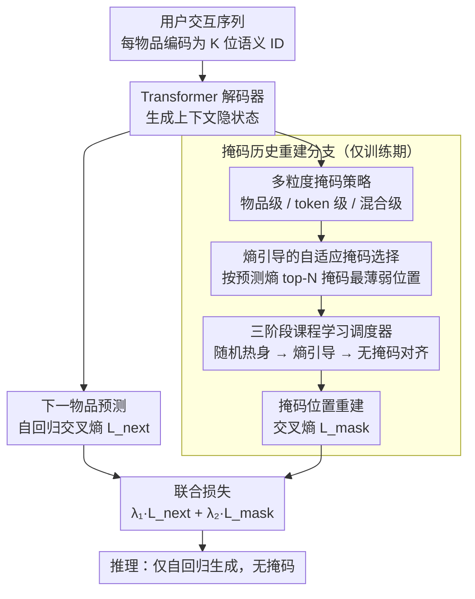

# From Past To Path: Masked History Learning for Next-Item Prediction in Generative Recommendation

**会议**: ACL 2026  
**arXiv**: [2509.23649](https://arxiv.org/abs/2509.23649)  
**代码**: [GitHub](https://github.com/CQU-MM-Intelligent-Lab/MHL)  
**领域**: 图像生成  
**关键词**: 生成式推荐, 掩码历史学习, 信息熵引导, 课程学习, 序列推荐

## 一句话总结

提出掩码历史学习（MHL）训练框架，通过在生成式推荐的自回归训练中加入掩码历史重建辅助任务，结合熵引导的自适应掩码策略和课程学习调度器，使模型从仅预测"下一个是什么"转向理解"为什么形成这条路径"，在三个数据集上显著超越SOTA。

## 研究背景与动机

**领域现状**：生成式推荐是近年兴起的推荐范式，将物品编码为语义ID序列，利用预训练语言模型（如T5）或LLM直接生成推荐物品的标识符，具有灵活性和可扩展性优势。

**现有痛点**：现有生成式推荐模型（TIGER、HSTU、RPG等）几乎全部依赖自回归的下一物品预测训练，这种"从左到右"的范式本质上偏向局部上下文，无法捕获用户行为路径中的深层历史依赖和复杂用户意图。模型擅长局部预测但缺乏全局理解，容易受噪声和短期偏差影响（短期近视问题）。

**核心矛盾**：当截断近期交互历史时，现有SOTA模型出现性能崩溃（如摄影爱好者依次购买相机、三脚架、相机包、镜头后，模型仅关注"镜头"预测镜头配件，而忽略了"相机机身"才是驱动后续购买存储卡的真正意图）。

**本文目标**：让生成式推荐模型不仅学习"下一个是什么"，更理解"为什么形成这条购买路径"。

**切入角度**：借鉴NLP中掩码语言建模的思想，在自回归训练中引入历史重建辅助任务。

**核心idea**：联合优化下一物品预测和掩码历史重建两个目标，通过信息熵引导选择最具信息量的历史位置进行掩码，并用课程学习从历史理解平滑过渡到未来预测。

## 方法详解

### 整体框架

MHL 在基于语义ID的生成式推荐基础上增加掩码历史重建分支。每个物品编码为K位语义ID，用Transformer解码器生成上下文隐状态。训练时同时优化两个损失：（1）$\mathcal{L}_{next}$ 预测下一物品的语义ID；（2）$\mathcal{L}_{mask}$ 从上下文状态重建被掩码的历史物品。重建分支内部依次由三个组件驱动——先用多粒度掩码策略制造重建任务，再用熵引导选择把掩码放到最薄弱位置，最后用三阶段课程学习把掩码训练平滑过渡到无掩码推理。推理时仅使用自回归生成，无掩码。

### 关键设计

**1. 多粒度掩码策略：从不同层面逼模型理解历史序列的结构**

纯下一物品预测只学到"下一个是什么"，缺乏对历史依赖的理解，单一掩码方式又只能提供单层面的学习信号。MHL 设计三种掩码粒度——物品级（替换整个 K 位语义 ID，学物品间依赖）、token 级（替换单个数位，学物品内 token 关系）、混合级（随机选物品级或 token 级），用多样化的重建任务迫使模型同时理解序列的跨物品结构和物品内部结构。

不同粒度互补地施压：实验表明 token 级提供更细的学习信号，配合后面的 R→E→Inf 课程学习效果最佳。

**2. 熵引导的自适应掩码选择：把重建目标始终对准模型最薄弱的位置**

随机掩码平等对待所有位置，忽略了用户行为信息密度不均匀这一事实——关键决策点和噪声位置被同等掩码，学习效率低。MHL 在每个训练步先对未掩码序列做一次无梯度前向，算出每个位置的预测熵 $\mathcal{H}_t^k$；高熵位置意味着模型对该处理解不足，往往对应关键决策点或复杂语义单元。按熵降序取 top-$N$ 掩码，$N$ 从均匀分布 $\mathcal{U}(1, \lfloor\gamma \cdot T\rfloor)$ 采样以防过拟合。

这样重建目标始终集中在模型最不确定、最需要补课的位置上，让有限的掩码预算花在刀刃上，而不是浪费在已经学透的近因位置。

**3. 三阶段课程学习调度器：把"掩码训练"平滑过渡到"无掩码推理"**

直接上熵引导掩码会训练不稳定（早期熵估计不可靠），而且掩码训练与无掩码推理之间存在天然差异。MHL 用三段课程桥接：Phase I 用低比率随机掩码热身，建立基线重建能力和稳定优化；Phase II 切到高比率熵引导掩码鼓励深度历史理解，验证性能趋平时指数衰减掩码比率 $\gamma \leftarrow \max(\gamma_{min}, \gamma \cdot \eta)$；Phase III 设 $\gamma=0$、只训 $\mathcal{L}_{next}$，做推理对齐、消除训练-推理差异。

三段过渡实现了从"理解路径"到"生成路径"的平滑切换——消融显示跳过 Phase III 会明显掉点，证明这一收尾对齐是把历史理解兑现成预测性能的关键。

### 损失函数 / 训练策略

$$\mathcal{L}_{MHL} = \lambda_1 \mathcal{L}_{next} + \lambda_2 \mathcal{L}_{mask}$$

其中 $\mathcal{L}_{next}$ 为标准下一物品语义ID的交叉熵损失，$\mathcal{L}_{mask}$ 为掩码位置的重建交叉熵损失。

## 实验关键数据

### 主实验

| 数据集 | 指标 | MHL | RPG(上一SOTA) | 提升 |
|--------|------|-----|-------------|------|
| Beauty | R@10 | .0795 | .0745 | +6.7% |
| Beauty | N@10 | .0495 | .0436 | +13.5% |
| Toys | R@10 | .0903 | .0778 | +16.1% |
| Toys | N@10 | .0564 | .0460 | +22.6% |
| Sports | R@10 | .0511 | .0436 | +17.2% |
| Sports | N@10 | .0298 | .0246 | +21.1% |

### 消融实验

| 配置 | 关键指标 | 说明 |
|------|---------|------|
| Token级 + R→E→Inf | 最佳 | 三数据集综合最优 |
| 无掩码（基线RPG） | .0745 R@10 | 仅下一物品预测 |
| 随机掩码 | 有提升 | 简单掩码即有效 |
| 仅熵引导（无课程） | 性能下降 | 早期熵估计不可靠导致不稳定 |
| 截断近期历史 | MHL vs SOTA +40% | MHL在历史截断下表现鲁棒 |

### 关键发现
- 掩码历史重建辅助任务在所有三种粒度（物品/token/混合）上均带来提升
- Token级掩码效果最佳，因其提供更细粒度的学习信号
- 熵引导掩码必须搭配课程学习才有效——直接使用会导致训练不稳定
- 当截断近期交互历史时，MHL显示出极强的鲁棒性（+40%），证明其学到了深层意图而非仅依赖近因效应
- Phase III（推理对齐）是关键——跳过该阶段导致明显性能下降

## 亮点与洞察
- **训练范式创新**：将掩码语言建模思想引入生成式推荐的自回归训练，从"预测结果"转向"理解过程"
- **"理解过去才能预测未来"的洞察深刻**：通过鲁棒性实验（历史截断）令人信服地展示了深层历史理解的价值
- **熵引导+课程学习的组合精巧**：两者互补——熵引导提供高质量信号，课程学习确保训练稳定和推理对齐
- **方法通用性强**：作为训练框架可直接应用于各种基于语义ID的生成式推荐模型

## 局限与展望
- **数据集规模有限**：仅在Amazon Reviews 2014的三个类别上验证，需要在更大规模和更多领域上测试
- **额外计算开销**：熵引导掩码需要额外的无梯度前向传播计算每步熵
- **超参数敏感性**：课程学习的三个阶段转换点和掩码比率等超参需要调优
- 未来可探索：应用于LLM-based推荐系统、跨域推荐、多模态推荐

## 相关工作与启发
- **vs BERT4Rec/S3-Rec**：使用双向编码器+掩码预测进行判别式推荐；MHL在单向解码器上增加掩码重建辅助任务，保持生成能力
- **vs TIGER/RPG**：纯自回归下一物品预测的SOTA生成式推荐；MHL通过历史重建辅助任务显著提升
- **vs HSTU**：Facebook的工业级序列推荐模型，MHL在所有指标上超越

## 评分
- 新颖性: ⭐⭐⭐⭐ 将掩码学习引入生成式推荐的训练范式创新有意义，熵引导+课程学习的组合设计巧妙
- 实验充分度: ⭐⭐⭐⭐ 多数据集、多基线对比、详尽的消融实验和鲁棒性分析
- 写作质量: ⭐⭐⭐⭐ 摄影爱好者的例子直观易懂，方法动机阐述清晰
- 价值: ⭐⭐⭐⭐ 为生成式推荐提供了新的训练范式，历史理解视角具有启发性

<!-- RELATED:START -->

## 相关论文

- [\[ACL 2026\] Learning to Retrieve User History and Generate User Profiles for Personalized Persuasiveness Prediction](learning_to_retrieve_user_history_and_generate_user_profiles_for_personalized_pe.md)
- [\[AAAI 2026\] Inductive Generative Recommendation via Retrieval-based Speculation](../../AAAI2026/recommender/inductive_generative_recommendation_via_retrieval-based_speculation.md)
- [\[AAAI 2026\] Align³GR: Unified Multi-Level Alignment for LLM-based Generative Recommendation](../../AAAI2026/recommender/align3gr_unified_multi-level_alignment_for_llm-based_generat.md)
- [\[AAAI 2026\] FreqRec: Exploiting Inter-Session Information with Frequency-enhanced Dual-Path Networks for Sequential Recommendation](../../AAAI2026/recommender/exploiting_inter-session_information_with_frequency-enhanced_dual-path_networks_.md)
- [\[AAAI 2026\] Tool4POI: A Tool-Augmented LLM Framework for Next POI Recommendation](../../AAAI2026/recommender/tool4poi_a_tool-augmented_llm_framework_for_next_poi_recommendation.md)

<!-- RELATED:END -->
