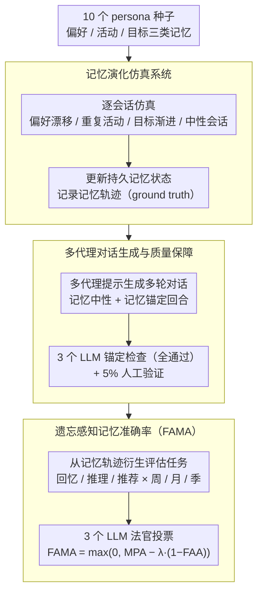

# From Recall to Forgetting: Benchmarking Long-Term Memory for Personalized Agents

**会议**: ACL 2026  
**arXiv**: [2604.20006](https://arxiv.org/abs/2604.20006)  
**代码**: [GitHub](https://github.com/geniesinc/Memora)  
**领域**: 长期记忆 / 个性化智能体  
**关键词**: 长期记忆基准, 记忆整合, 记忆突变, 遗忘感知评估, 个性化agent, Memora, FAMA

## 一句话总结

本文提出Memora基准和FAMA指标，将长期记忆评估从浅层事实检索扩展到跨越数周至数月的记忆整合与突变处理，揭示现有LLM和记忆agent在处理频繁知识更新时的系统性失败。

## 研究背景与动机

**领域现状**: 个性化智能体需要在长期交互中维持跨会话的持久记忆。现有基准（LoCoMo、LongMemEval、PersonaMem等）主要将长期记忆操作化为"跨会话事实检索"，94%的LoCoMo问题和85%的LongMemEval问题仅需参考至多2个历史会话。

**现有痛点**: 现有基准存在两个核心缺陷：(1) 记忆整合（consolidation）需求极低——平均仅需参考约1个历史会话；(2) 记忆突变（mutation）几乎未被测试——LongMemEval最多2次更新，PersonaMem最多3次。评估指标只奖励记忆包含，不惩罚过时信息的错误使用。

**核心矛盾**: 人类认知不仅能回忆，还能积累经验、调和变化、维持连贯的世界模型。但当前评估框架本质上只测试"能否从历史中检索一条孤立信息"，无法暴露模型在记忆演化和冲突解决方面的真实能力。

**本文目标**: 构建一个在记忆整合（最高309次跨会话引用）和记忆突变（最高94次更新/删除）方面远超现有基准的评估体系，并提出能惩罚"使用过时记忆"的评估指标。

**切入角度**: 从三个维度定义记忆任务——Remembering（回忆）、Reasoning（推理）、Recommending（推荐），覆盖周/月/季度三个时间跨度。

**核心idea**: 长期记忆不仅是"记住"，更是"知道何时遗忘"；FAMA指标通过显式惩罚对过时记忆的依赖，暴露现有系统的致命缺陷。

## 方法详解

**整体框架**: Memora 是一条仿真驱动的基准构建管道。它从 10 个专业角色画像（persona）的种子记忆出发，逐会话仿真用户交互、演化出带有真实记忆动态的记忆轨迹（作为 ground truth）；再把每个会话规格转写成高质量多轮对话并做质量校验；最后从记忆轨迹衍生评估任务，用遗忘感知指标 FAMA 打分。三个阶段恰好对应下面三个关键设计。

**关键设计**:

**1. 记忆演化仿真系统：让记忆"会变"，并留下可核对的轨迹**

现有基准的会话之间几乎相互独立，记忆很少被反复引用、更很少被推翻，因此测不出模型在记忆演化下的真实能力。Memora 先构建 10 个专业角色画像（工程师、研究员等），每个画像维护偏好、活动、目标三类记忆；仿真器逐会话推进，注入偏好漂移、重复活动、长期目标渐进等动态，同时穿插不修改任何记忆的中性会话，并在每个会话后更新持久记忆状态、记录完整的记忆轨迹作为 ground truth。正是这套演化机制把整合与突变压力拉满——Quarterly 设置下平均记忆整合（跨会话引用）达 28.4，而现有基准只有约 1；记忆突变（更新/删除）达 14.8，现有基准则近乎为 0–2，从而保证每道评估题都有明确的记忆状态依据。

**2. 多代理对话生成与质量保障：把会话规格转成对话而不偏离记忆轨迹**

仿真产出的是结构化的会话规格，直接用它出题会丢失自然对话的语境，而让 LLM 自由生成对话又容易"脑补"出仿真里并不存在的记忆细节，污染 ground truth。本文用多代理提示框架把每个会话规格转写成多轮对话，区分记忆中性与记忆锚定两类回合；随后用 3 个 LLM 独立做自动化记忆锚定检查（必须全部通过才接受）、再加 5% 人工验证。这道双重质检确保生成的对话与底层记忆轨迹严格对齐，不引入未被追踪的虚假记忆。

**3. 遗忘感知记忆准确率（FAMA）：既奖励记住、也惩罚没忘掉**

传统指标只看模型有没有用上正确记忆，却不惩罚它继续引用已经过时的信息，因此一个"什么都记着、从不更新"的系统也能拿高分。FAMA 把两件事合到一个分数里：$\text{FAMA} = \max(0,\ \text{MPA} - \lambda\,(1-\text{FAA}))$，其中 MPA（memory presence accuracy）衡量"该记住的有效记忆是否用上"，FAA（forgetting absence accuracy）衡量"该忘掉的过时记忆是否真的没再出现"，权重 $\lambda = N_{\text{forget}} / (N_{\text{presence}} + N_{\text{forget}})$ 按每道题中遗忘项与存在项的比例动态调整，使含遗忘需求多的题对"没忘掉"惩罚更重、不同题之间可公平比较。每个判定标准由 3 个 LLM 法官（GPT-4.1、Claude Haiku 4.5、Gemini 2.5 Flash）多数投票裁定。FAA 这一项正是把"知道何时遗忘"显式写进指标的关键。

## 实验关键数据

**LLM基础模型表现（FAMA, 0-100）**:

| 模型 | Remembering (W/M/Q) | Recommending (W/M/Q) | Reasoning (W/M/Q) |
|------|---------------------|----------------------|--------------------|
| GPT-5.2 | 25.3/19.9/23.4 | 54.8/51.1/53.4 | 4.7/0.0/1.0 |
| Claude Sonnet 4.5 | 27.5/19.4/21.3 | 43.6/39.0/44.0 | 6.7/3.0/5.5 |
| Gemini 3 Pro | 20.4/21.4/17.3 | 45.1/45.9/52.6 | 6.7/4.0/4.0 |

**长期记忆Agent表现（FAMA）**:

| Agent | Remembering (W/M/Q) | Recommending (W/M/Q) | Reasoning (W/M/Q) |
|-------|---------------------|----------------------|--------------------|
| A-Mem | 71.8/41.9/40.8 | 35.0/37.5/35.0 | 2.0/2.0/5.0 |
| LangMem | 71.2/42.0/39.1 | 48.9/44.1/33.9 | 30.0/14.0/11.0 |
| MemoBase | 43.6/20.1/15.2 | 68.9/58.5/45.6 | 18.0/7.0/1.0 |
| MemoryOS | 51.8/29.8/25.1 | 62.6/48.5/44.0 | 20.7/6.0/5.5 |
| Mem-0 | 40.4/21.1/19.9 | 52.6/36.2/38.5 | 16.0/0.0/2.0 |

**关键发现**:
- **Reasoning几乎完全失败**: 所有模型和Agent的Reasoning分数大多<10，GPT-5.2在Monthly上甚至为0
- **记忆Agent在Remembering上显著优于LLM**（如A-Mem 71.8 vs GPT-5.2 25.3），但在Reasoning上优势有限
- **时间跨度增大导致性能持续下降**: 从Weekly→Quarterly，所有系统的Remembering分数大幅降低
- **推理token效果不稳定**: 某些场景有帮助（如Gemini在Monthly Reasoning从4→10），但总体改善有限
- **所有系统频繁复用已失效记忆**，暴露了高整合/高突变压力下维持一致信念状态的根本困难

## 亮点与洞察

- **评估范式革新**: 将长期记忆从"你记得吗？"升级为"你知道什么该忘吗？"，FAMA指标设计优雅且实用
- **仿真驱动的构建方法**: 结构化种子→会话仿真→对话生成→自动验证的流水线，实现大规模高质量基准构建
- **Reasoning是最大瓶颈**: 跨时间线的信息综合推理是所有现有系统的致命弱点
- **基准规模前所未有**: Quarterly设置下每persona平均1991个会话、1171.4次记忆操作

## 局限与展望

- 基于仿真数据而非真实用户交互，可能存在生态效度问题
- 评估依赖LLM-as-judge（虽然与人工标注88.3%一致）
- 所有Agent使用统一的GPT-4o-mini后端，可能低估某些Agent在更强LLM下的表现
- 未探索记忆压缩/摘要策略的效果

## 相关工作与启发

- **LoCoMo (Maharana et al., 2024)**: 多会话对话基准，94%问题只需≤2会话
- **LongMemEval (Wu et al., 2024)**: 百万token评估，但记忆更新有限
- **PersonaMem (Jiang et al., 2025)**: 个性化决策评估，记忆突变最多3次
- **MemoryAgentBench (Hu et al., 2025)**: 代理式记忆评估
- **启发**: 长期记忆的核心挑战不在于容量，而在于时序一致性管理和知识状态维护；评估AI记忆能力不应只看"记住多少"，更应看"在信息矛盾时如何取舍"

## 评分

- **新颖性**: ★★★★☆ — FAMA指标和大规模记忆突变评估是重要贡献
- **实验充分度**: ★★★★☆ — 4个LLM + 6个记忆Agent，覆盖全面
- **写作质量**: ★★★★☆ — 动机阐述清晰，与先前工作的量化对比到位
- **价值**: ★★★★★ — 填补了个性化Agent评估的关键空白

<!-- RELATED:START -->

## 相关论文

- [\[ACL 2026\] IceBreaker for Conversational Agents: Breaking the First-Message Barrier with Personalized Starters](icebreaker_for_conversational_agents_breaking_the_first-message_barrier_with_per.md)
- [\[ICML 2026\] RGMem: Renormalization Group-Inspired Memory Evolution for Language Agents](../../ICML2026/recommender/rgmem_renormalization_group-inspired_memory_evolution_for_language_agents.md)
- [\[ACL 2026\] Bridging Language and Items for Retrieval and Recommendation: Benchmarking LLMs as Semantic Encoders](bridging_language_and_items_for_retrieval_and_recommendation_benchmarking_llms_a.md)
- [\[ACL 2026\] MemRec: Collaborative Memory-Augmented Agentic Recommender System](memrec_collaborative_memory-augmented_agentic_recommender_system.md)
- [\[ACL 2026\] Learning to Retrieve User History and Generate User Profiles for Personalized Persuasiveness Prediction](learning_to_retrieve_user_history_and_generate_user_profiles_for_personalized_pe.md)

<!-- RELATED:END -->
