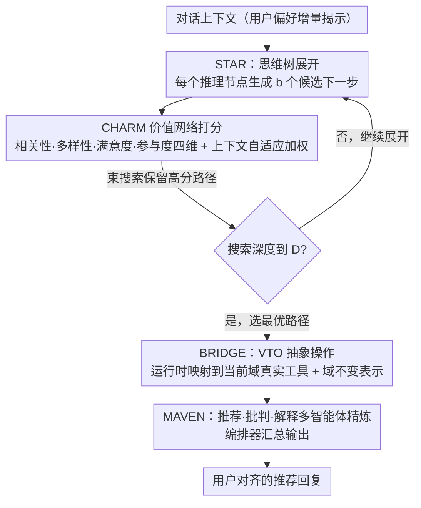

# HARPO: Hierarchical Agentic Reasoning for User-Aligned Conversational Recommendation

**会议**: ACL 2026  
**arXiv**: [2604.10048](https://arxiv.org/abs/2604.10048)  
**代码**: [https://anonymous.4open.science/r/HARPO-D881](https://anonymous.4open.science/r/HARPO-D881)  
**领域**: 推荐系统  
**关键词**: 对话推荐, Agent推理, 偏好优化, 树搜索, 推荐质量

## 一句话总结
提出 HARPO 框架，将对话推荐重新定义为以推荐质量为优化目标的结构化决策问题，通过层次化偏好学习、基于价值网络的树搜索推理、虚拟工具操作和多智能体精炼四大组件，在 ReDial、INSPIRED 和 MUSE 三个基准上显著超越现有方法。

## 研究背景与动机

**领域现状**：对话推荐系统（CRS）旨在通过自然语言交互帮助用户发现匹配偏好的物品。近年来，基于大语言模型的 CRS 方法在 Recall@K、BLEU 等代理指标上取得了强劲表现。

**现有痛点**：高代理指标分数并不意味着高质量的用户对齐推荐。现有方法主要优化检索准确率、生成流畅度或工具调用等中间目标，而非推荐质量本身。例如"something casual for a summer wedding"可能被误解为日常休闲装而非场合适宜的婚礼服装，此类回复在自动指标上得分高但用户满意度低。

**核心矛盾**：CRS 训练和评估目标（代理指标）与实际推荐质量之间存在根本性不对齐。代理指标只与用户对齐推荐质量弱相关。

**本文目标**：将对话推荐建模为显式优化推荐质量的结构化决策问题，而非将推荐质量视为响应生成的副产品。

**切入角度**：作者从决策推理视角出发，认为系统应该显式推理多个候选推荐策略、评估其预期质量，并基于用户对齐标准（而非代理信号）选择推荐。

**核心 idea**：通过分层偏好学习将推荐质量分解为可解释维度（相关性、多样性、满意度、参与度），用学习的价值网络引导树搜索推理探索候选推荐路径。

## 方法详解

### 整体框架
HARPO 把一轮对话推荐当成一道"先想清楚再开口"的决策题：拿到对话上下文后，系统不直接生成推荐，而是先在一棵推理树里展开若干条候选推荐策略，用一个学过的价值网络给每条路径按推荐质量 $\mathcal{Q}$ 打分，挑出最优路径再落成回复。整个流程由四个共享同一预训练语言模型骨干的组件支撑——STAR 负责结构化树搜索、CHARM 负责把"质量"拆成可学的多维奖励、BRIDGE 负责跨域迁移、MAVEN 负责多智能体精炼，全程优化的是推荐质量本身而非代理指标。

### 关键设计

**1. STAR：用思维树显式比较多条推荐策略，而不是一次性生成**

现有 CRS 直接把对话喂进模型生成推荐，只有一次出手机会，错了也没法回头。STAR 把这一步展开成树搜索：每个推理节点写成 $s=(\mathbf{h}, \tau, \mathbf{v}, d)$，分别是对话上下文编码、当前这一步的思考、预测出的虚拟工具操作、以及搜索深度；在每个节点生成 $b$ 个候选下一步，由价值网络评估后用束搜索保留最优路径。价值网络不给一个笼统的好坏分，而是沿相关性、多样性、满意度、参与度四个维度分别预测、再用可学习权重加权汇总。这样系统能在真正开口前把几套推荐方案摆出来比一比，选预期质量最高的那条，而不是把第一个想到的答案当最终答案。

**2. CHARM：把"推荐质量"拆成可解释的多维奖励，并按上下文自适应加权**

单一标量奖励会把"为什么这个推荐好"压成一个数字、信息全丢，而且不同对话里各维度的重要性本就不同。CHARM 给每个质量维度配一个专用奖励头 $R_k(\mathbf{h}) = \tanh(\mathbf{W}_k^{(2)} \cdot \text{GELU}(\mathbf{W}_k^{(1)} \cdot \mathbf{h}))$，输出夹在 $[-1,1]$；再用元学习方式算出一组随上下文变化的权重 $\mathbf{w} = \text{softmax}(\mathbf{W}_{\text{meta}} \cdot [\text{Enc}(\mathbf{h}); \mathbf{e}_d] + \mathbf{b})$，让"婚礼场合更看重相关性、闲聊场景更看重参与度"这类差异能被模型自己捕捉。训练用基于边际的偏好优化损失，使高质量推荐的综合分高于低质量推荐。

**3. BRIDGE：用虚拟工具操作 + 对抗域适应让推理逻辑能跨领域搬**

工具增强方法常常和某个领域的具体工具实现死死绑在一起，换个领域就得重做。BRIDGE 一方面用梯度反转层做对抗域适应、学习域不变表示，另一方面留了一个可学习的域门控 $\mathbf{z}' = \sigma(\mathbf{g}_d) \odot \mathbf{z} + (1-\sigma(\mathbf{g}_d)) \odot \mathbf{h}$，在抹平领域差异的同时保住有用的域特定信号。配套的虚拟工具操作（VTO）把"高层推理动作"和"底层具体工具"解耦，推理时只产出抽象操作、运行时再动态映射到真实工具——类似软件里的接口设计，让同一套推理逻辑能接到不同领域的工具上。

**4. MAVEN：推荐、批判、解释三类智能体协同精炼，在开口前先自查一轮**

单个模型一气呵成生成推荐，容易把"选什么、为什么选、怎么说"糊在一起，缺少自我审视。MAVEN 让三个角色互补的智能体在共享表示上各司其职：每个智能体 $a$ 有独立编码器和输出头 $\mathbf{o}_a = \text{Head}_a(\text{Enc}_a(\mathbf{h}))$——推荐智能体出候选、批判智能体挑毛病、解释智能体给理由；再由编排器把三方输出拼接后经 FFN 汇总成最终回复 $\mathbf{o}_{\text{final}} = \text{FFN}([\mathbf{o}_{\text{rec}}; \mathbf{o}_{\text{crit}}; \mathbf{o}_{\text{exp}}])$，汇总权重随对话上下文变化。训练用一致性损失 $\mathcal{L}_{\text{agree}} = 1 - \cos(\mathbf{o}_{\text{rec}}, \mathbf{o}_{\text{crit}})$ 鼓励推荐与批判方向协调、必要时也允许分歧，相当于把 STAR 选出的候选再过一道"出谋—挑刺—讲理"的内部评审才正式回复。

### 一个完整示例
以背景里的 "something casual for a summer wedding" 为例：朴素 CRS 容易把 casual 当成日常休闲装、直接检索一批 T 恤短裤，自动指标可能不低但场合完全不对。在 HARPO 里，STAR 会在推理树里铺开几条策略——一条理解成"夏季婚礼的得体着装"、一条理解成"日常休闲"、一条先反问澄清；CHARM 的价值网络给每条路径按四维打分：婚礼着装那条在相关性和满意度上明显更高，闲聊澄清那条参与度高但相关性偏低。束搜索据此选中"夏季婚礼得体着装"这条路径，BRIDGE 再把它映射到当前领域的检索工具上取回候选，最终回复契合场合的推荐，而不是指标好看却没人买账的休闲装。

### 损失函数
总损失包含偏好优化损失 $\mathcal{L}_{\text{pref}}$、域适应损失 $\mathcal{L}_{\text{domain}}$、任务保持损失 $\mathcal{L}_{\text{task}}$ 和智能体一致性损失 $\mathcal{L}_{\text{agree}}$。

## 实验关键数据

### 主实验
在 ReDial 数据集上的推荐性能：

| 方法 | R@1 | R@10 | R@50 | MRR@10 | User Sat. | Engage. |
|------|-----|------|------|--------|-----------|---------|
| KBRD | 2.9 | 16.7 | 36.2 | 7.4 | 0.42 | 0.38 |
| UniCRS | 3.8 | 18.1 | 37.4 | 8.4 | 0.45 | 0.41 |
| GPT-4 | — | — | — | — | — | — |
| **HARPO** | **最优** | **最优** | **最优** | **最优** | **最优** | **最优** |

### 消融实验

| 配置 | 关键指标 | 说明 |
|------|---------|------|
| Full HARPO | 最优 | 完整模型 |
| w/o STAR | 下降显著 | 去掉树搜索推理 |
| w/o CHARM | 下降明显 | 去掉层次化偏好优化 |
| w/o BRIDGE | 跨域下降 | 去掉域迁移模块 |
| w/o MAVEN | 轻微下降 | 去掉多智能体精炼 |

### 关键发现
- HARPO 相比最强基线（GPT-4）平均提升 17-21%，在用户对齐指标上提升更大
- 在 INSPIRED 数据集上提升最大（R@10 比 GPT-4 高 45.7%），因为社交对话需要推理隐式偏好
- 人工评估确认推荐质量、解释质量和整体评分均显著优于 GPT-4（+0.55, +0.50, +0.55）
- CHARM 奖励模型与独立人工评判的 Pearson 相关系数达 0.64-0.73

## 亮点与洞察
- 指出代理指标与推荐质量的不对齐是 CRS 领域的根本问题，这一洞察具有范式转换意义
- VTO 抽象将推理逻辑与具体工具解耦，类似软件工程中的接口设计，是可迁移推理的优雅方案
- 多维质量分解+上下文自适应加权避免了单一奖励信号的信息压缩问题

## 局限与展望
- CHARM 奖励模型本身可能存在偏差，虽然与人工评判相关但并非完美替代
- 树搜索推理增加了推理时计算开销，实际部署时需考虑延迟
- 实验数据集规模有限（ReDial 1万对话），大规模验证不足
- 未来可探索将质量维度扩展到更细粒度的用户偏好建模

## 相关工作与启发
- **vs UniCRS**: UniCRS 统一推荐和生成但仍优化代理指标，HARPO 直接优化推荐质量
- **vs RecMind**: RecMind 使用自激励推理但缺乏质量引导的搜索，HARPO 的价值网络提供质量导向
- **vs GPT-4**: 即使是强大的通用模型，在代理指标上表现好但用户对齐指标上不如专门优化的 HARPO

## 评分
- 新颖性: ⭐⭐⭐⭐ 将对话推荐重新定义为质量优化的决策问题，思路新颖
- 实验充分度: ⭐⭐⭐⭐ 三个数据集、人工评估、消融实验齐全
- 写作质量: ⭐⭐⭐⭐ 问题分析深入，框架设计逻辑清晰
- 价值: ⭐⭐⭐⭐ 对 CRS 领域有重要方法论启示

<!-- RELATED:START -->

## 相关论文

- [\[ACL 2026\] Mirroring Users: Towards Building Preference-aligned User Simulator with User Feedback in Recommendation](mirroring_users_towards_building_preference-aligned_user_simulator_with_user_fee.md)
- [\[ACL 2026\] Where and What: Reasoning Dynamic and Implicit Preferences in Situated Conversational Recommendation](where_and_what_reasoning_dynamic_and_implicit_preferences_in_situated_conversati.md)
- [\[ICML 2025\] MATCHA: Toward Safe and Human-Aligned Game Conversational Recommendation via Multi-Agent Decomposition](../../ICML2025/recommender/toward_safe_and_human-aligned_game_conversational_recommendation_via_multi-agent.md)
- [\[ACL 2026\] ReRec: Reasoning-Augmented LLM-based Recommendation Assistant via Reinforcement Fine-tuning](rerec_reasoning-augmented_llm-based_recommendation_assistant_via_reinforcement_f.md)
- [\[ACL 2026\] Intent-Driven Semantic ID Generation for Grounded Conversational News Recommendation](intent-driven_semantic_id_generation_for_grounded_conversational_news_recommenda.md)

<!-- RELATED:END -->
