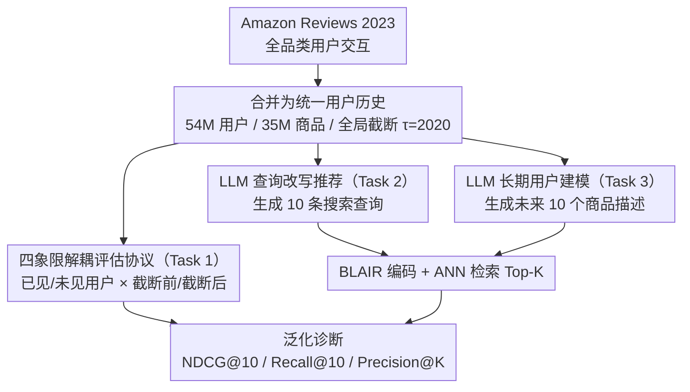

# HORIZON: A Benchmark for in-the-wild User Behaviour Modeling

**会议**: ACL 2026 Findings  
**arXiv**: [2604.17259](https://arxiv.org/abs/2604.17259)  
**代码**: [https://github.com/microsoft/horizon-benchmark](https://github.com/microsoft/horizon-benchmark)  
**领域**: 推荐系统 / 用户行为建模  
**关键词**: 序列推荐, 跨领域用户建模, 长期行为预测, 时序泛化, LLM推荐

## 一句话总结

本文提出 HORIZON，首个全开源的大规模跨领域长期推荐基准，基于 Amazon Reviews 合并构建包含 54M 用户和 35M 商品的统一交互历史，设计了沿时间轴和用户维度解耦的四象限评估协议，揭示了 BERT4Rec 等模型在分布内表现强劲但在时序外推和未见用户场景下显著退化的现象，且 LLM 在用户行为建模上并未一致优于专用架构。

## 研究背景与动机

**领域现状**：序列推荐是个性化系统的核心，主流方法（SASRec、BERT4Rec 等）在 MovieLens、Amazon Reviews 等单领域短序列基准上取得了显著进展。现实中用户行为跨越多个领域、多个平台，偏好随时间持续演化。

**现有痛点**：(1) 现有基准以单领域 next-item 预测为主——Amazon Reviews 虽跨多品类但评估时按品类切割，无法捕捉跨品类转移行为；(2) Leave-One-Out 和 Ratio-Based 评估存在时序泄露风险——训练集中的用户交互可能在时间上晚于测试集中其他用户的交互；(3) 没有任何公开基准同时支持跨领域、长时间跨度和未见用户的泛化评估；(4) PinnerFormer 和 USE 虽设计合理但依赖私有数据，不可复现。

**核心矛盾**：现有评估协议将所有泛化维度混在一起——时序泛化（模型能否预测未来时段的行为）、用户泛化（模型能否处理未见用户）、跨领域泛化（模型能否利用跨品类信号）被无差别地评估，导致无法准确诊断模型的具体弱点。

**本文目标**：构建一个大规模、跨领域、时序连续的公开基准，并设计将时间轴和用户维度正交解耦的评估协议，系统地评估推荐模型在各维度上的泛化能力。

**切入角度**：将 Amazon Reviews 2023 的所有品类交互合并为统一的用户历史，设定全局时间截断点 $\tau$=2020，沿"已见/未见用户 × 截断前/截断后时间"构建四象限评估。

**核心 idea**：泛化能力不是单一维度的——同一个模型可能在分布内表现优异但在时序外推上崩溃，或者对已见用户强但对未见用户弱。解耦评估是诊断问题的关键。

## 方法详解

### 整体框架

HORIZON 从 Amazon Reviews 2023 出发，把所有品类的用户交互合并成一条统一历史（54M 用户、35M 商品、486M 交互），并以 $\tau$=2020 作为全局时间截断点。在此之上定义三个任务：Task 1 是传统 next-item 推荐，但配上四象限解耦评估；Task 2 让 LLM 把用户历史改写成搜索查询再检索；Task 3 让 LLM 直接生成未来若干商品的描述来建模长期偏好演化。三个任务共用同一份跨领域、时序连续的数据。

### 关键设计

**1. 四象限解耦评估协议（Task 1）：把时间泛化和用户泛化拆成两条正交的轴**

传统 Leave-One-Out 只覆盖"已见用户、截断前"一个角落，Ratio-Based 又把多个泛化维度混在一起，结果是模型某一维崩了也看不出来。HORIZON 沿"已见/未见用户 × 截断前/截断后"切出四象限：(1a) 分布内 + 时间对齐，即已见用户在截断前的标准 Leave-One-Out；(1b) 分布内 + 时序外推，同批用户在截断后的所有交互；(1c) 未见用户 + 时间对齐，完全新用户在截断前的 Leave-One-Out；(1d) 未见用户 + 时序外推，新用户在截断后的预测，最难。关键在于只用 (1a) 训练，再拿同一个训练好的模型去跑四个设定。这一拆分直接照出了被旧协议掩盖的差异——比如 BERT4Rec 在 (1a) 表现最佳却在 (1c) 严重退化。

**2. LLM 查询改写推荐（Task 2）：检验 LLM 能不能把行为历史翻成语义搜索意图**

ID-based 模型对全新商品和未见用户几乎无能为力，而 LLM 的强项恰是语义理解。Task 2 让 LLM 读完用户交互历史后生成 10 条多样化搜索查询 $Q = \{q_1,...,q_{10}\}$，再用预训练的 BLAIR 编码器把查询和商品映射进同一嵌入空间，经 ANN 索引检索 Top-K，用 Recall@K、Precision@K 评估。它把推荐过程显式化成一组可读的搜索查询，既是对 ID-based 方法的语义补充，也让结果便于调试分析。

**3. LLM 长期用户建模（Task 3）：从"预测下一次点击"升级到"预见长期需求"**

现实里的主动推荐、库存规划需要的是对未来一段时间需求的预判，而几乎没有公开基准评估这件事。Task 3 给定截断前的用户历史，让 LLM 一次性生成未来 10 个可能交互商品的自然语言描述，走与 Task 2 同一条检索流水线匹配商品目录。和 Task 2 的差别在于它要预测的是长期演化（多个目标而非单个），且评估窗口覆盖整个截断后时段，难度和现实价值都更高。

### 损失函数 / 训练策略

Task 1 中传统模型使用 RecBole 框架标准训练。Task 2/3 中 LLM 以零样本方式使用，同时提供 LoRA 微调和全量微调作为对比基线。

## 实验关键数据

### 主实验

**Task 1: 四象限评估结果（NDCG@10 / Recall@10）**

| 模型 | (1a) 分布内对齐 | (1b) 分布内外推 | (1c) 未见用户对齐 | (1d) 未见用户外推 |
|------|----------------|----------------|------------------|------------------|
| BERT4Rec | 26.4 / 33.9 | 1.1 / 2.8 | 11.8 / 17.8 | 1.1 / 2.8 |
| SASRec | 25.2 / 34.1 | 2.9 / 6.2 | 17.8 / 26.2 | 3.1 / 6.7 |
| CORE | 8.5 / 12.1 | 0.09 / 0.26 | 5.9 / 11.1 | 0.10 / 0.32 |
| GRU4Rec | 0.08 / 0.14 | 0.01 / 0.01 | 0.01 / 0.01 | 0.01 / 0.01 |

**Task 2: LLM 查询改写（零样本）**

| 模型 | Recall@10 | Recall@100 | Precision@10 |
|------|-----------|------------|-------------|
| Qwen3-8B | 2.06 | 3.50 | 0.25 |
| LLaMA-3.1-8B | 1.62 | 2.84 | 0.20 |
| Gemma2-9B | 1.45 | 2.66 | 0.16 |

### 消融实验

| 分析维度 | 发现 | 说明 |
|---------|------|------|
| 时序 vs 用户泛化 | 时序外推退化更严重 | BERT4Rec NDCG@10: 26.4→1.1（-96%） |
| 已见 vs 未见用户 | SASRec 退化更稳健 | SASRec 在 (1c) 保持 NDCG=17.8 vs BERT4Rec 的 11.8 |
| LLM 规模效应 | Qwen3-235B ≈ Qwen3-8B | R@100: 3.40 vs 3.50，规模/推理无显著增益 |
| LLM 微调 vs 零样本 | 微调效果有限 | 零样本在可扩展性上更优 |
| 非注意力模型 | GRU4Rec 基本失败 | 复杂跨领域环境需要灵活的上下文建模 |

### 关键发现

- BERT4Rec 在标准 (1a) 设定下最强（NDCG@10=26.4），但在未见用户 (1c) 上退化严重（降至 11.8），而 SASRec（17.8）更稳健——传统评估掩盖了这一关键差异
- 时序分布偏移比用户分布偏移更致命：所有模型在 (1b)/(1d) 上的性能暴跌 90%+，因为 ID-based 模型无法处理全新商品
- LLM 在推荐任务上并未展现压倒性优势——Recall 绝对值很低（<4%@100），说明 LLM 的世界知识难以直接转化为精准的用户偏好理解
- Qwen3-235B 在推理模式下甚至略差于非推理模式（R@100: 2.96 vs 3.40），模型规模和推理链对推荐任务帮助有限

## 亮点与洞察

- 四象限评估设计是本文最大的方法论贡献——用一个训练好的模型在四个正交设定上评估，揭示了被传统协议系统性掩盖的泛化缺陷。这个评估范式可直接迁移到对话系统、搜索排序等任何需要泛化评估的场景
- 跨领域合并用户历史（而非按品类切割）是一个简单但有力的数据处理思路——平均用户历史长度从 3.86 提升到 9.07，释放了更多跨领域信号
- LLM 推荐的"查询改写→检索"范式虽然效果有限，但提供了可解释的中间表示（搜索查询），比黑盒推荐模型更适合调试和分析

## 局限与展望

- 仅限英文电商数据，多语言和其他场景（新闻、社交、视频）未覆盖
- 仅使用文本模态，未整合商品图片等多模态信息
- 受计算限制，模型仅在 100K 用户子集上训练，未充分利用 54M 全量数据
- Task 2/3 的 LLM 评估仅在 OOD 用户上进行，缺少分布内对比

## 相关工作与启发

- **vs Amazon Reviews**: 同一数据源但评估方式根本不同——Amazon Reviews 按品类切割，HORIZON 合并为跨领域统一历史
- **vs PinnerFormer**: Pinterest 的大规模多年用户建模，但私有数据不可复现。HORIZON 是首个同等定位的全开源基准
- **vs MIND**: 微软新闻推荐数据集，仅两周历史且单领域，HORIZON 覆盖多年跨领域交互

## 评分

- 新颖性: ⭐⭐⭐⭐⭐ 四象限解耦评估是推荐领域的重要方法论贡献，跨领域合并思路虽简单但有力
- 实验充分度: ⭐⭐⭐⭐ 传统模型+LLM 基线覆盖全面，但受限于计算资源未能充分利用全量数据
- 写作质量: ⭐⭐⭐⭐ 评估协议设计清晰，发现叙述有条理
- 价值: ⭐⭐⭐⭐⭐ 为推荐系统评估提供了急需的标准化泛化测试框架

<!-- RELATED:START -->

## 相关论文

- [\[ACL 2026\] Learning to Retrieve User History and Generate User Profiles for Personalized Persuasiveness Prediction](learning_to_retrieve_user_history_and_generate_user_profiles_for_personalized_pe.md)
- [\[ACL 2026\] Mirroring Users: Towards Building Preference-aligned User Simulator with User Feedback in Recommendation](mirroring_users_towards_building_preference-aligned_user_simulator_with_user_fee.md)
- [\[AAAI 2026\] RecToM: A Benchmark for Evaluating Machine Theory of Mind in LLM-based Conversational Recommender Systems](../../AAAI2026/recommender/rectom_a_benchmark_for_evaluating_machine_theory_of_mind_in_llm-based_conversati.md)
- [\[ACL 2026\] HARPO: Hierarchical Agentic Reasoning for User-Aligned Conversational Recommendation](harpo_hierarchical_agentic_reasoning_for_user-aligned_conversational_recommendat.md)
- [\[ACL 2026\] Decisive: Guiding User Decisions with Optimal Preference Elicitation from Unstructured Documents](decisive_guiding_user_decisions_with_optimal_preference_elicitation_from_unstruc.md)

<!-- RELATED:END -->
