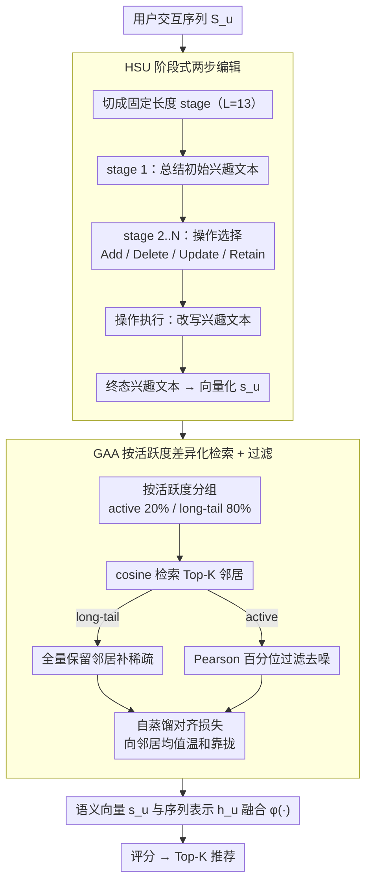

<!-- 由 src/gen_stubs.py 自动生成 -->
# HSUGA: LLM-Enhanced Recommendation with Hierarchical Semantic Understanding and Group-Aware Alignment

**会议**: ACL 2026 Findings  
**arXiv**: [2605.11662](https://arxiv.org/abs/2605.11662)  
**代码**: HSUGA (GitHub, 名称已给但链接未在原文 PDF 中给出)  
**领域**: 推荐系统 / LLM 增强序列推荐 / 长尾用户  
**关键词**: 序列推荐, LLM 语义嵌入, 阶段式偏好演化, 编辑操作, 分组自蒸馏

## 一句话总结
HSUGA 把 LLM 增强序列推荐的两个核心环节拆开来打补丁：用"阶段式 + 四类原子编辑（Add/Delete/Update/Retain）"的 HSU 模块把长交互序列的语义抽取做稳，再用按活跃度分组（20% 头部 / 80% 长尾）的 GAA 自蒸馏对齐解决长尾用户欠监督、活跃用户过对齐的问题，在 Steam/Fashion/Beauty 三个数据集 + GRU4Rec/BERT4Rec/SASRec 三个 backbone 上即插即用都涨点。

## 研究背景与动机

**领域现状**：LLM 增强序列推荐（LLM4SR）目前主流套路分两步：(1) 用 LLM 把用户交互历史 summarize 成语义向量（embedding extraction）；(2) 把这个语义向量塞回传统序列编码器（GRU4Rec / BERT4Rec / SASRec）做语义利用（embedding utilization），代表方法包括 LLMEmb、LLM2Rec、LLM-ESR、RLMRec、LLMInit 等。

**现有痛点**：两端都有结构性缺陷。抽取端：现有方法直接把整条长交互序列灌进 LLM 让它一次 summarize，但上下文过长会触发 lost-in-the-middle，得到的用户向量不稳定，长尾用户尤其惨。利用端：所有用户用同一套对齐 / 检索策略，无视活跃度差异——活跃用户表示已经很密，再硬拉去对齐邻居反而引入噪声；长尾用户表示稀疏，弱对齐又不够。

**核心矛盾**：长序列推理可靠性 vs. 直接 summarize 的简洁性；统一对齐策略 vs. 用户活跃度异质性。一刀切要么噪声、要么欠拟合。

**本文目标**：拆成两个可即插即用的 plugin，分别治理两个环节，同时保留 backbone 无关性，能挂在任何 LLM4SR 方法上。

**切入角度**：作者借鉴 CoT + 可编辑 LLM memory 的思路——把长序列切成固定长度的 stage，每个 stage 内强制 LLM 走"先选操作类型（Add/Delete/Update/Retain），再执行"的两步流程，把语义更新约束在离散动作空间里，避免 open-ended 的语义漂移和误差累积。

**核心 idea**：用"原子编辑操作 + 阶段式更新"代替"一次性 summarize"做语义抽取（HSU），用"按活跃度分组 + 邻居数量自适应 + 活跃用户 Pearson 百分位过滤"代替"统一邻居对齐"做语义利用（GAA），两件事都是 plugin。

## 方法详解

### 整体框架
HSUGA 输入用户 $u$ 的完整交互序列 $\mathcal{S}_u = [i_1, \dots, i_T]$、输出 Top-K 推荐，核心是把 LLM4SR 的"抽语义"和"用语义"两端各自做成一个即插即用的 plugin。抽取端的 HSU 把长序列切成固定长度的 stage、用阶段式原子编辑逐步更新出兴趣文本再向量化成 $\mathbf{s}_u$；利用端的 GAA 按用户活跃度分组检索邻居并做自蒸馏对齐。最后序列编码器的 $\mathbf{h}_u$ 与 $\mathbf{s}_u$ 通过融合函数 $\phi(\cdot)$（加 / 门控 / concat-投影）得到 $\tilde{\mathbf{h}}_u$，评分 $\hat{y}_{u,j} = \mathbf{e}_j^\top \tilde{\mathbf{h}}_u$，与 GAA 自蒸馏损失联合优化。

### 关键设计

**1. HSU 阶段式两步编辑：把"一口气 summarize 长序列"换成"按 stage 增量改写兴趣"**

直接把整条长交互序列灌给 LLM 一次性总结，上下文一长就触发 lost-in-the-middle，得到的用户向量不稳，长尾用户尤其惨。HSU 把序列切成固定长度 $L$（默认 13）的若干 stage：stage 1 先总结出初始兴趣描述，从 stage 2 起每个 stage 强制走"Operation Selection → Operation Execution"两步——先从 {Add, Delete, Update, Retain} 四个原子动作里选一个，再据此改写兴趣文本（Add 引入新概念、Delete 去掉过时兴趣、Update 精修已有偏好、Retain 保持不变），最后把终态兴趣文本向量化得到 $\mathbf{s}_u$。这等于把原本 open-ended 的语义演化压成离散动作空间里的状态转移，既给出可解释的"为什么变了"，又把 LLM 的自由度限制在四个操作里、避免语义漂移和误差累积。

**2. GAA 按活跃度差异化检索 + 过滤：长尾用户多拿邻居补稀疏，活跃用户严过滤去噪**

所有用户共用一套对齐策略并不公平——活跃用户表示本就密，硬拉去对齐邻居反而引噪；长尾用户表示稀疏，弱对齐又不够。GAA 先按交互次数 $n_u$ 把用户切成 top 20% active 和 80% long-tail，再用 cosine 相似度从 $\mathcal{U} \setminus \{u\}$ 检索 Top-$K$ 邻居集 $N_u^{(g)}$，其中 $K$ 按组取值（long-tail 取大、active 取小）。long-tail 用户全保留 $N_u^{\text{long-tail}} = N_u^{(g)}$；active 用户再用 Pearson 相似度按百分位过滤 $N_u^{\text{active}} = \{v \in N_u^{(g)} \mid \text{Pearson}(u,v) \ge Q_\tau(\mathcal{S}_u)\}$，其中 $Q_\tau$ 是该用户自身相似度分布的 $\tau$-分位点。用百分位而非固定绝对阈值，是因为不同用户的相似度尺度差异巨大、绝对阈值会偏袒高密度用户；Figure 3(a) 也证实长尾用户的最佳邻居数明显大于活跃用户，活跃用户邻居一多就掉点。

**3. 自蒸馏对齐损失：把目标用户向邻居平均表示温和靠拢**

相比硬性对比学习，自蒸馏更温和。GAA 用邻居均值 $\frac{1}{|N_u|}\sum_{v \in N_u} f(v)$ 当 teacher mediator、目标用户 $f(u)$ 当 student mediator，损失为 $\mathcal{L}_{SD} = \frac{1}{|\mathcal{U}|}\sum_u \|f(u) - \frac{1}{|N_u|}\sum_{v \in N_u} f(v)\|^2$。配合上一步的分组检索，long-tail 用户拿到的 teacher 是稀疏邻居的多数票、active 用户拿到的是高 Pearson 邻居的精挑细选，从而做隐式的协同信号增强。

### 一个完整示例
以论文 case study（Table 6）里的一个时尚用户为例，看 HSU 怎么逐 stage 改写兴趣：初始 stage 总结出"plus-size 长袖上衣"，之后兴趣依次演化为"配饰 → 配饰（保持）→ 配饰 + 娃娃裙"，分别对应 Modify、Delete、Retain、Add 四个编辑操作，整条轨迹是人能读懂的。终态兴趣文本向量化后喂给 GAA：若这是个长尾用户，就全量保留检索到的邻居补稀疏信号；若是活跃用户，则再按 Pearson 百分位筛掉低相关邻居，最后通过自蒸馏把它向筛后邻居的均值靠拢，得到增强后的语义向量 $\mathbf{s}_u$ 与序列表示融合出分。

### 损失函数 / 训练策略
- 排序损失（pairwise）：$\mathcal{L}_{\text{Rank}} = -\sum_u \sum_k \log \sigma(\hat{y}_{u,k}^+ - \hat{y}_{u,k}^-)$。
- 总损失：$\mathcal{L} = \mathcal{L}_{\text{Rank}} + \alpha \cdot \mathcal{L}_{SD}$，$\alpha \in \{1, 0.5, 0.1, 0.05, 0.01\}$ 做网格搜。
- 邻居数 $N_u^{(g)} \in \{2, 6, 10, 14, 18\}$；分位 $\tau$ 按 octile 搜；LLM 默认 Qwen2.5-7B-Instruct，stage 长度默认 13。

## 实验关键数据

### 主实验

| 数据集 | Backbone | 指标 | LLM-ESR (前 SOTA) | HSUGA | 提升 |
|--------|----------|------|-------------------|-------|------|
| Fashion | SASRec | HR@10 | 0.5619 | **0.5880** | +4.6% |
| Fashion | SASRec | Tail Item HR@10 | 0.1095 | **0.1602** | +46.3% |
| Beauty | BERT4Rec | HR@10 | 0.5393 | **0.5711** | +5.9% |
| Beauty | BERT4Rec | Tail Item HR@10 | 0.1379 | **0.1829** | +32.6% |
| Beauty | SASRec | NDCG@10 | 0.3713 | **0.3911** | +5.3% |
| Beauty | SASRec | Tail Item HR@10 | 0.2257 | **0.2415** | +7.0% |

整体上三数据集 × 三 backbone 全面 SOTA，**长尾物品上提升最大**（最高 +46%），验证了 group-aware 设计对稀疏信号的补足作用。

### 消融实验（Fashion 数据集，SASRec backbone）

| 配置 | HR@10 | NDCG@10 | Tail Item HR@10 | 说明 |
|------|-------|---------|-----------------|------|
| HSUGA (Full) | **0.5946** | **0.4979** | **0.1930** | 完整模型 |
| w/o Add | 0.5881 | 0.4921 | 0.1746 | 去掉 Add 操作 |
| w/o Delete | 0.5892 | 0.4929 | 0.1773 | 去掉 Delete 操作 |
| w/o Update | 0.5869 | 0.4929 | 0.1720 | 去掉 Update 操作（掉 1.3% HR） |
| w/o Retain | 0.5845 | 0.4918 | 0.1657 | 去掉 Retain 操作（掉 1.7% HR，最严重） |
| w/o Interest Updater | 0.5872 | 0.4930 | 0.1784 | 整个 HSU 退化为标准传播 |
| w/o Group-Aware SD | 0.5841 | 0.4904 | **0.1573** | 关掉分组（统一对齐），尾物品掉 18.5% |
| w/o Active User Filter | 0.5903 | 0.4928 | 0.1745 | 只去活跃用户过滤 |

### 关键发现
- **Group-Aware 设计最关键**：w/o Group-Aware SD 在 tail item 上掉得最狠（0.1930 → 0.1573，−18.5%），说明长尾场景下区分用户活跃度的对齐策略是核心增益来源。
- **Retain 操作贡献最大**：四个原子编辑里去掉 Retain 掉点最多（0.5946 → 0.5845），说明"明确选择不动"比让 LLM 默认无动作更稳定，符合可解释 memory 操作的设计哲学。
- **HSUGA-7B > CoT-14B**：Table 5 显示 HSUGA + Qwen2.5-7B（H@10=0.6445）已经超过 CoT + Qwen2.5-14B（0.6391），说明增益来自结构化推理范式而非纯模型容量。
- **稳定性高**：分组阈值在 15%/20%/25%、Pearson 百分位在 25/50/75 三档之间波动只有 ±0.005 H@10，方法对超参不敏感。
- **效率代价**：HSU 比标准 CoT 离线时间高一倍（0.381 vs 0.189 s/user），但支持增量更新（每 stage ~272ms），不需要全序列重推理，工业部署可接受。

## 亮点与洞察
- **把"语义编辑"做成离散动作空间**是本文最巧妙的设计——LLM 自由 summarize 太松，离散动作 + 执行步骤把演化压到一个状态机里，既可解释又抗误差累积，这个思路完全可以迁移到任何"长时记忆 / 增量更新" LLM agent 场景。
- **"按用户活跃度做异质对齐"是 long-tail 推荐里被长期忽视的视角**：传统 contrastive learning 对所有用户一视同仁，但长尾和活跃用户的最优邻居数实际上是反的（Figure 3a 显示 active 用户邻居数 ≈ 长尾的 1/3 时最佳），这个观察值得推荐系统社区重新思考。
- **百分位阈值代替绝对阈值**是工程上很实用的小 trick：用户相似度尺度差异巨大，固定绝对阈值会偏袒高密度用户，按用户自身分位过滤天然抗尺度漂移。
- **Plugin 范式**让 HSUGA 不和具体 LLM4SR 方法竞争——Panel A 是给已有"抽取派"方法加 GAA，Panel B 是给"利用派"方法加 HSU，几乎所有 base + plugin 都涨点（Table 1 全表带 `*`），证明两个 plugin 是正交补丁。

## 局限与展望
- 作者承认：尽管支持 stage 内并行 + 增量更新，**工业级用户量下 LLM 推理成本仍偏高**，未来需要更轻量的偏好抽取策略。
- 自己看到的：**stage 长度是硬编码**（默认 13），不同用户兴趣演化速度不同，理论上应当自适应分段，比如以 session 边界或 topic shift 来切；现在固定长度可能切断了短期兴趣周期。
- **四个原子操作够不够？** 比如 Merge（合并两个相似兴趣）、Split（拆分一个泛化兴趣）等更细的操作没考虑，可能在更复杂的兴趣演化场景下不足。
- **GAA 的分组只用了交互次数 $n_u$**，没考虑兴趣多样性、消费金额、时间衰减等更复杂的活跃度维度，可能在新兴趣爆发的用户上失效。

## 相关工作与启发
- **vs LLM-ESR (Liu et al., NeurIPS 2024)**：LLM-ESR 用 LLM 出语义 embedding + 双塔检索，是当前最强 baseline；HSUGA 在它基础上加 HSU + GAA 全面涨点，本质是把"如何更稳地抽语义"和"如何按用户差异化用语义"分别打补丁。
- **vs CoT 推理 (Wei et al. NeurIPS 2022)**：HSU 是 CoT 在推荐场景的结构化变体——不让 LLM 自由 reasoning，而是约束在"操作选择 → 操作执行"两步，类似 ReAct + memory editing 的混合。
- **vs MemoryBank (Zhong et al., AAAI 2024) / LongMem (Wang et al., NeurIPS 2023)**：HSU 借鉴了可编辑 memory 的 atomic ops 设计，但搬到推荐场景的兴趣演化建模；MemoryBank 是对话场景的 memory 更新。
- **vs MELT (SIGIR 2023) / CITIES (ICDM 2020)**：传统长尾推荐用 meta-learning / counterfactual，HSUGA 用 LLM 语义 + 分组对齐，二者可正交结合。

## 评分
- 新颖性: ⭐⭐⭐⭐ 把"editable memory atomic ops"搬到推荐场景做兴趣演化建模是新颖的，分组对齐也是少见的明确建模。
- 实验充分度: ⭐⭐⭐⭐⭐ 三数据集 × 三 backbone × 多 baseline + Panel A/B 兼容性验证 + 详尽消融 + 鲁棒性 + 效率分析 + case study，做得非常完整。
- 写作质量: ⭐⭐⭐⭐ 论文结构清晰，公式与表格交代到位，方法叙述基本无歧义；不足是 plugin 之间的耦合细节（HSU 输出怎么喂进 GAA 的检索）讲得偏快。
- 价值: ⭐⭐⭐⭐ Plugin 范式让方法落地门槛低，长尾物品 30-46% 的提升是真有实用价值的数字，业界推荐系统可直接借鉴。

<!-- RELATED:START -->

## 相关论文

- [\[ACL 2026\] HARPO: Hierarchical Agentic Reasoning for User-Aligned Conversational Recommendation](harpo_hierarchical_agentic_reasoning_for_user-aligned_conversational_recommendat.md)
- [\[ACL 2025\] GRAM: Generative Recommendation via Semantic-aware Multi-granular Late Fusion](../../ACL2025/recommender/gram_generative_recommendation.md)
- [\[AAAI 2026\] Align³GR: Unified Multi-Level Alignment for LLM-based Generative Recommendation](../../AAAI2026/recommender/align3gr_unified_multi-level_alignment_for_llm-based_generat.md)
- [\[ACL 2026\] Intent-Driven Semantic ID Generation for Grounded Conversational News Recommendation](intent-driven_semantic_id_generation_for_grounded_conversational_news_recommenda.md)
- [\[ACL 2026\] Bridging Language and Items for Retrieval and Recommendation: Benchmarking LLMs as Semantic Encoders](bridging_language_and_items_for_retrieval_and_recommendation_benchmarking_llms_a.md)

<!-- RELATED:END -->
