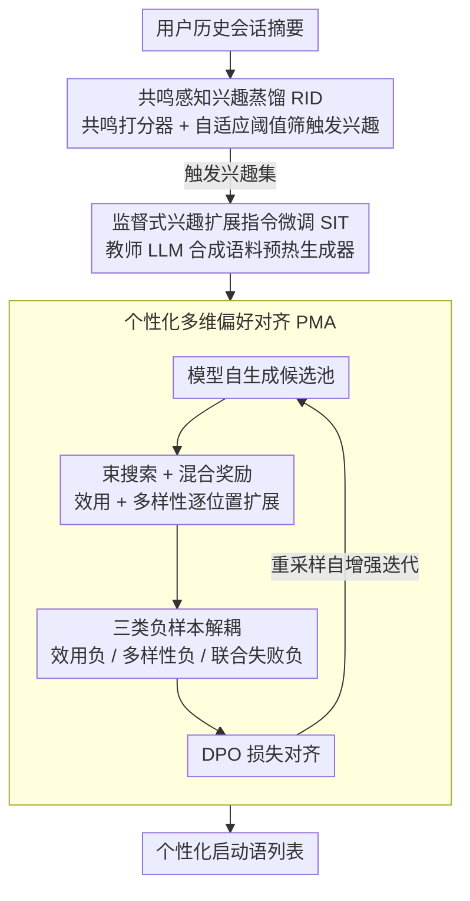

# IceBreaker for Conversational Agents: Breaking the First-Message Barrier with Personalized Starters

**会议**: ACL 2026  
**arXiv**: [2604.18375](https://arxiv.org/abs/2604.18375)  
**代码**: 无（工业部署系统）  
**领域**: 推荐系统 / 对话系统  
**关键词**: 主动对话发起, 个性化会话启动, 兴趣蒸馏, 偏好对齐, 冷启动

## 一句话总结
本文提出 IceBreaker，通过两步"握手"——共鸣感知兴趣蒸馏捕获触发兴趣 + 交互导向启动语生成配合个性化偏好对齐——解决对话智能体的"首条消息壁垒"，在全球最大对话产品之一的 A/B 测试中提升用户活跃天数 +1.84‰ 和点击率 +94.25‰。

## 研究背景与动机

**领域现状**：对话智能体（如 ChatGPT、豆包）正从被动应答转向主动参与。已有研究关注对话中的主动性，如生成追问、话题引导等，但这些都发生在对话已经开始之后。

**现有痛点**：在对话发起阶段存在一个被忽视的产品瓶颈——"首条消息壁垒"。用户可能有模糊的需求但没有明确的查询意图，且对智能体能做什么缺乏认知，导致约 20% 的用户进入产品但未发起任何对话就离开。

**核心矛盾**：对话发起阶段缺乏即时上下文来引导响应。与对话中阶段不同，发起阶段必须在没有显式用户意图的"冷启动"时刻运作。此外，用户偏好高度个性化且呈长尾分布，统一的对齐目标倾向生成泛化的启动语，无法与个体产生共鸣。

**本文目标**：将主动发起形式化为"会话启动语生成"任务，生成个性化的启动问题引导用户开始对话。

**切入角度**：模仿人类在冷启动场景下发起对话的方式——先找到几个可能引起共鸣的兴趣点，再用合适的措辞引发互动。

**核心 idea**：两步握手框架——先用共鸣感知兴趣蒸馏从会话摘要中提取触发兴趣，再用交互导向生成器生成启动语列表，通过列表级多维偏好对齐优化个性化交互效用和列表内多样性。

## 方法详解

### 整体框架
IceBreaker 把"主动发起对话"拆成两步握手。第一步是共鸣感知兴趣蒸馏 (RID)：从用户历史会话摘要里筛出那些最可能让人愿意重新聊起来的"触发兴趣"，而不是用全部历史兴趣轰炸用户。第二步是交互导向启动语生成 (ISG)：以这些触发兴趣为条件，生成一份多样化的启动语列表，再通过列表级多维偏好对齐让措辞既贴合个人偏好、又不至于扎堆同一个话题。中间还夹了一道监督式预热，给生成器一个稳的起点。

### 关键设计

**1. 共鸣感知兴趣蒸馏 (RID)：只留真正能勾起再次对话的兴趣点**

并非所有历史兴趣都值得拿来开场——很多是一次性的功能查询，再提一遍只会打扰用户。RID 的关键洞察是用"兴趣回访"作为共鸣信号的代理：如果用户在后续会话里又主动聊回了某个历史话题，那这条会话摘要就是正样本。基于此训练一个个性化共鸣打分器 $s_\phi(u, h_t) = \cos(\mathbf{u}, \mathbf{z}_t)$，用余弦相似度衡量用户特征向量 $\mathbf{u}$ 和会话摘要嵌入 $\mathbf{z}_t$ 的匹配度，并用用户内负样本与跨用户负样本做对比学习。

推理时不是一刀切阈值，而是按用户活跃度分组设自适应阈值 $\tau_u$ 来筛出触发兴趣集 $\mathcal{I}^*$：活跃用户门槛更高（避免信息过载），低活跃用户门槛更松（增加召回）。这样蒸馏出的兴趣天然偏向长尾、可互动的话题，而不是泛化的头部功能。

**2. 监督式兴趣扩展指令微调 (SIT)：给生成器一个覆盖面足够广的起点**

直接在稀疏的观测数据上做偏好优化容易塌缩到少数高频话题。SIT 先用教师 LLM 从触发兴趣 $\mathcal{I}^*$ 合成一批高质量的启动语指令语料 $\mathcal{D}_{\text{cov}}$，再用标准语言建模损失微调生成器。它的作用是把训练分布撑开，超越有限的真实日志，让后续的偏好对齐有一个稳定、话题覆盖良好的初始化，不至于一开始就偏。

**3. 个性化多维偏好对齐 (PMA)：在稀疏反馈下同时对齐效用和多样性**

直接从用户反馈攒偏好对会遇到极端稀疏性，而且普通 DPO 一旦只盯着交互效用，列表多样性就会崩（实验里语义多样性从 5.59 掉到 2.37）。PMA 改成让模型自己生成候选池，再用混合奖励列表搜索迭代构建偏好对：用束搜索逐位置扩展启动语列表，每一步同时结合交互效用奖励 $R_{\text{util}}$ 和多样性奖励 $R_{\text{div}}$ 打分。

为了不让效用和多样性互相打架，PMA 构造了三种负样本——效用负样本、多样性负样本、联合失败负样本——把不同维度的偏好信号解耦后再喂给 DPO 损失。每轮更新后从最新策略重新采样、继续挖新的偏好对，形成自增强迭代优化，部署后还能定期重跑来跟踪用户偏好漂移。

### 损失函数 / 训练策略
RID 用对比学习训练共鸣打分器；ISG 先用 SFT（即 SIT）预热，再用 DPO 对齐，DPO 的偏好对通过混合奖励搜索迭代挖掘。部署后定期执行自增强优化以跟踪用户偏好漂移。

## 实验关键数据

### 主实验（线上 A/B 测试，大于一个月）

| 方法 | 活跃天数‰ | 平均会话‰ | CTR‰ | 对话启动率‰ |
|------|-----------|-----------|------|------------|
| PE (直接提示) | -0.01 | -0.26 | -16.16* | -0.17 |
| SFT | +0.20 | +0.33 | +6.97* | -0.05 |
| SFT + DPO | +1.16 | +0.42* | +56.41* | +0.68 |
| **IceBreaker** | **+1.84*** | **+1.59*** | **+94.25*** | **+1.27*** |

### 消融实验（离线，Doubao1.5-Lite backbone）

| 方法 | R-User ↑ | R-Score ↑ | Lexical多样性 ↑ | Semantic多样性 ↑ |
|------|---------|-----------|----------------|-----------------|
| PE | +0.56 | +0.08 | 29.45 | 6.23 |
| PE + RID | +0.71 | +0.38 | 25.13 | 4.86 |
| SFT | +0.78 | +0.44 | 28.97 | 5.59 |
| SFT + DPO | +0.79 | +0.52 | 12.94 | 2.37 |
| **IceBreaker** | **+0.89** | **+0.80** | 28.83 | 5.28 |

### 关键发现
- RID 蒸馏显著提升个性化：从直接提示到加 RID，排名一致性和分数提升均有明显改善
- 普通 DPO 虽然提升效用但严重损害多样性（语义多样性从 5.59 降到 2.37），IceBreaker 通过多维偏好对齐解决了这一问题
- 分布分析显示：RID 过滤掉功能性/通用头部话题，向触发性长尾话题偏移；ISG 进一步向易互动的消费类话题（心理、二次元、娱乐）倾斜
- 线上 A/B 测试中所有指标显著（p<0.05），CTR 提升 +94.25‰ 尤为突出

## 亮点与洞察
- "兴趣回访"作为共鸣信号的代理非常巧妙——用户愿意重复讨论的话题天然反映了深层兴趣。这种信号构造思路可以迁移到推荐系统中的兴趣建模
- 三种负样本的设计（效用负、多样性负、联合失败负）优雅地解耦了多维优化目标，避免了 DPO 中常见的"效用与多样性跷跷板"问题
- 将对话系统从"被动回答"推进到"主动发起"是一个重要的范式转变。20% 的用户因首条消息壁垒流失，说明这确实是一个值得关注的产品瓶颈

## 局限与展望
- 论文缺少公开代码和可复现的离线数据集，线上实验依赖工业环境
- 触发兴趣的质量高度依赖会话摘要的准确性，如果历史摘要质量差，整个管线的基础就会受影响
- 当前系统假设用户有足够的历史交互数据，对完全新用户（零历史）的冷启动场景未做讨论
- 自增强迭代优化可能存在偏差累积的风险

## 相关工作与启发
- **vs 对话中主动性方法**: 传统主动对话（追问、澄清、话题引导）依赖已有对话上下文；IceBreaker 解决的是对话开始前的冷启动主动发起，是更基础的问题
- **vs 通用偏好对齐 (DPO/RLHF)**: 通用对齐目标无法处理用户级个性化和反馈稀疏性；IceBreaker 的多维偏好对齐通过模型自生成候选 + 混合奖励搜索迭代挖掘偏好对，有效解决了这两个问题
- **vs 推荐系统**: 启动语生成本质上是"推荐对话入口"，但与传统推荐不同的是它需要生成自然语言而非选择已有项目

## 评分
- 新颖性: ⭐⭐⭐⭐ "首条消息壁垒"问题定义新颖，两步握手框架和三类负样本设计有创意
- 实验充分度: ⭐⭐⭐⭐⭐ 离线+线上 A/B 测试超一个月，分布分析和案例分析丰富
- 写作质量: ⭐⭐⭐⭐ 问题动机从产品视角出发很有说服力，方法描述清晰
- 价值: ⭐⭐⭐⭐⭐ 已在全球最大对话产品之一部署，具有直接的工业应用价值

<!-- RELATED:START -->

## 相关论文

- [\[ACL 2026\] From Recall to Forgetting: Benchmarking Long-Term Memory for Personalized Agents](from_recall_to_forgetting_benchmarking_long-term_memory_for_personalized_agents.md)
- [\[ACL 2026\] HARPO: Hierarchical Agentic Reasoning for User-Aligned Conversational Recommendation](harpo_hierarchical_agentic_reasoning_for_user-aligned_conversational_recommendat.md)
- [\[ACL 2026\] Intent-Driven Semantic ID Generation for Grounded Conversational News Recommendation](intent-driven_semantic_id_generation_for_grounded_conversational_news_recommenda.md)
- [\[ACL 2026\] Where and What: Reasoning Dynamic and Implicit Preferences in Situated Conversational Recommendation](where_and_what_reasoning_dynamic_and_implicit_preferences_in_situated_conversati.md)
- [\[ICLR 2026\] In Agents We Trust, but Who Do Agents Trust? Latent Source Preferences Steer LLM Generations](../../ICLR2026/recommender/in_agents_we_trust_but_who_do_agents_trust_latent_source_preferences_steer_llm_g.md)

<!-- RELATED:END -->
