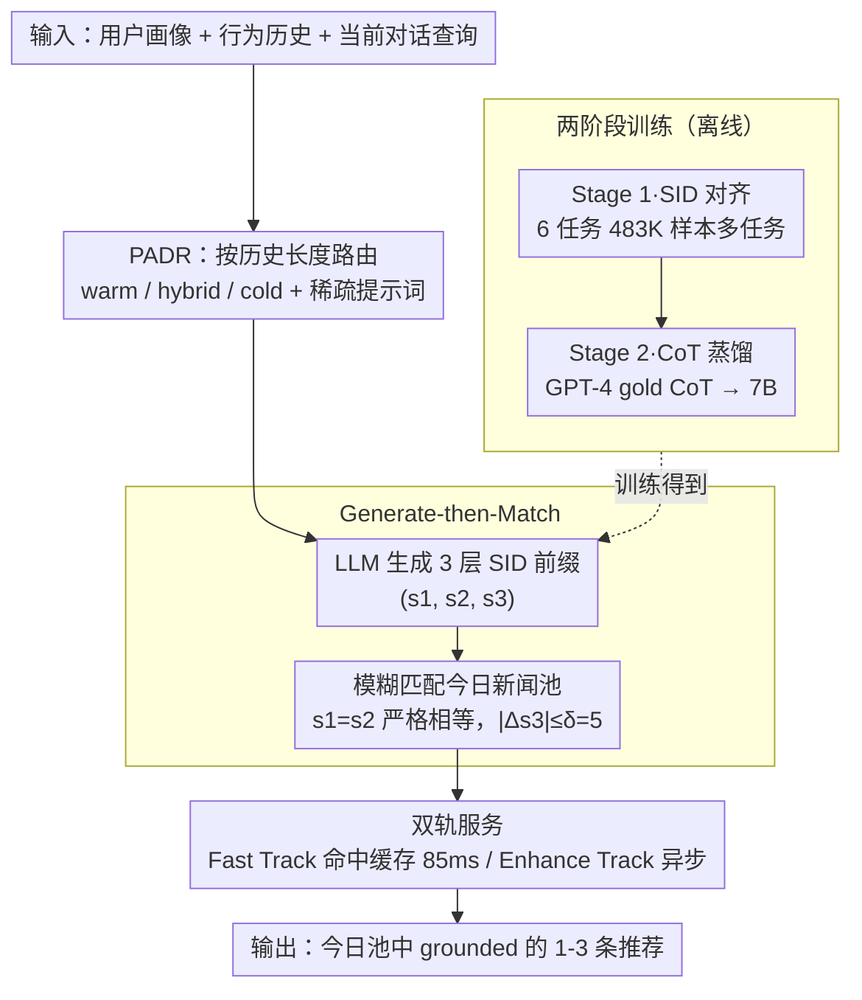

# Intent-Driven Semantic ID Generation for Grounded Conversational News Recommendation

**会议**: ACL 2026 Oral  
**arXiv**: [2605.07613](https://arxiv.org/abs/2605.07613)  
**代码**: 待确认  
**领域**: 推荐 / 对话 / 生成式推荐 / 语义 ID  
**关键词**: Semantic ID、对话推荐、生成式推荐、冷启动、RQ-VAE

## 一句话总结
本文提出 NewsRec-Chat，把对话式新闻推荐从"先检索再生成"反转为"先生成 SID 再模糊匹配"，靠两阶段 SID 对齐 + GPT-4 CoT 蒸馏让 7B 模型直接生成层级 Semantic ID 前缀并与当日新闻池模糊匹配，腾讯新闻平台上 152K 开放生成空间里取得 12.4% L1（4× 随机）、0% 幻觉，并通过 Profile-Aware Dual-Signal Reasoning 让 0 历史用户达到 18.0% L1（其他基线 0%）。

## 研究背景与动机

**领域现状**：主流对话推荐建立在稳定商品目录（电影、商品）之上，先把对话意图变成关键词或嵌入向量做检索，再让 LLM 在召回集合内做排序与解释。生成式推荐近年用 SID（RQ-VAE 量化得到的层级 token）把 item 编码成可学习的离散序列，但都假设丰富点击行为。

**现有痛点**：新闻平台与稳定目录差别巨大——文章 24 小时内大量下线、新文章持续涌入、20-30% 用户历史 < 10 条，对话里"再来一条""换个不同的""不要体育"这种 5 类隐式意图占主导，根本没有可被 RAG 用的关键词；而把 SID 直接搬过来又面临两个开放问题：(1) 如何从对话意图（而非点击序列）生成 SID 前缀，(2) 没有点击历史的冷启动用户怎么办。

**核心矛盾**：检索优先 (retrieve-first) 范式需要查询里有显式 key，而对话推荐的真实需求恰恰是隐式 + 短生命周期，让"先有查询"和"语料每天换"两个假设全垮。

**本文目标**：(1) 不依赖关键词地把对话意图直接映射到候选 item，(2) 结构上保证 0 幻觉（每个推荐必须真实存在于今日池），(3) 让冷启动用户能从画像里得到有意义推荐，(4) 满足 sub-100ms 在线延迟。

**切入角度**：观察到 RQ-VAE 的前三层 SID 是"语义层级编码"（s1 大类、s2 中类、s3 细聚类），第 4 层近似 item ID 才每日抖动；那让 LLM 只生成前 3 层就既能表达意图、又跟"池子每天变"解耦。

**核心 idea**：用 Generate-then-Match 取代 RAG —— LLM 直接根据 (用户画像, 历史, 当前意图) 生成 3 层 SID 前缀 $P = (s_1, s_2, s_3)$，再与当日新闻池做容差为 $\delta$ 的模糊匹配 $\text{Match}(P, \mathcal{P}) \subseteq \mathcal{P}$，从架构上保证存在性。

## 方法详解

### 整体框架

输入：用户画像 $\mathbf{p}_u$（25+ 维特征）、行为历史 $\mathbf{h}_u$、当前对话查询 $q$。中间过程：(1) PADR 路由器根据 $|\mathbf{h}_u|$ 选 warm/hybrid/cold 路径并组装 prompt；(2) 双阶段微调过的 LLM 生成 3 层 SID 前缀；(3) 模糊匹配模块对前缀与今日新闻池做 $\delta=5$ 容差比对，返回小候选集（mean 5.2, median 3.0 篇）；(4) 在线服务用 Dual-Track 架构，Fast Track 命中缓存直接 100ms 出结果，Enhance Track 异步跑完整 PADR 推理并更新缓存。输出：从今日池里 grounded 的 1-3 条推荐。

### 关键设计

**1. Generate-then-Match：反转 RAG 范式，从架构上消除幻觉**

对话推荐里 5/6 类隐式意图（"再来一条""换个不同的""不要体育"）根本没有可供检索的关键词，retrieve-first 在这些意图上彻底失败。NewsRec-Chat 干脆把"用查询去检索池"反过来做成"先让 LLM 生成 SID、再去池里反查"：$\text{LLM}(u, h, q) \to \text{SID}$，然后做模糊匹配 $\text{Match}(\text{SID}, \mathcal{P}) = \{n \in \mathcal{P}: s_1' = s_1, s_2' = s_2, |s_3' - s_3| \leq \delta\}$——s1/s2 严格相等保证语义大类一致，s3 留容差去捕获细粒度相似邻居，候选按 $1 - |s_3'-s_3|/(\delta+1)$ 排序，$\delta=5$ 是在 {1,3,5,7,10} 上网格搜出来的。

这一反转的好处是双重的：item 选择从"语义检索 + 排序"两步坍缩成"语义生成 + 存在校验"，更贴合 LLM 的强项；而且只要推荐落在"今日池里真实存在的 SID"上，幻觉就从一个概率事件变成了零事件。关键细节是只生成前 3 层 SID 而不碰第 4 层——第 4 层是逐日抖动的"近似 item ID"，一旦让模型生成它，模型就会被绑死到某一天的库存，而前 3 层是稳定的语义层级，天然跟"池子每天换"解耦。

**2. Profile-Aware Dual-Signal Reasoning (PADR)：让 0 历史用户也能从画像里推出推荐**

新闻平台 20-30% 用户历史不足 10 条，传统 SID 模型一缺历史就直接崩到 L1 0%。PADR 按历史长度 $|\mathbf{h}_u|$ 与阈值 $\tau=10$ 把用户切成 warm / hybrid / cold 三档，并在 prompt 里显式插入 "sparse" 或 "no history" 提示词，让模型在 CoT 里学会差异化推理：warm 做行为-画像关联、cold 做"人口学→兴趣"映射、hybrid 做两路交叉验证。

它的妙处在于把"路由策略"蒸馏进了模型而不是写死成规则模块——省掉了为冷启动单独加 fallback 分支的工程复杂度。实测冷路径 L1 达到 18.0%（OneRec-7B 为 16.1%），是唯一在冷启动上不为 0 的方案。

**3. 两阶段训练：SID Alignment 打底 + CoT Distillation 教推理**

只做对齐，模型会"复读 SID"不会推理；只做蒸馏却不分意图，模型会把所有意图都套同一条 CoT。所以训练拆成两阶段：Stage 1 用 6 个任务（content↔SID 双向映射、行为摘要、next-item 预测、多轮推荐）共 483K 样本做多任务对齐，让模型先学会"看内容知 SID、看 SID 知内容、把行为序列总结成 SID"；Stage 2 用 GPT-4 给每个 (input, target SID) 对生成 gold CoT 再蒸馏到 7B Qwen，教它"对每种意图用不同的 reasoning 链生成 SID"。

Stage 2 的三个关键做法决定了成败：(i) 掺入 31% 冷启动样本，保证模型见过仅靠画像推理的情形；(ii) 每种意图给独立的 CoT 结构（冷启动走 demographic→interest，反馈调整走 preference-shift）；(iii) 把 CoT 长度卡在 150-300 字——太长会让模型 over-think、反而劣化 SID 生成。消融显示去掉 Stage 2，幻觉率直接从 0% 跳到 18.4%。

### 一个完整示例

以一个 sparse-history 用户在 152K SID 开放生成空间下的一次请求为例：用户画像 $\mathbf{p}_u$ 显示偏好科技+财经、历史只有 6 条（< $\tau=10$），当前查询是"换个不同的"这种隐式意图。PADR 路由器据此判定走 hybrid 路径，在 prompt 里加上 "sparse" 标签并组装上下文。双阶段微调过的 LLM 不去检索关键词，而是直接生成 3 层 SID 前缀，比如 $P = (s_1, s_2, s_3)$。

模糊匹配模块拿这个前缀去今日新闻池比对：s1、s2 必须严格相等，s3 允许 $|s_3' - s_3| \leq 5$ 的容差，于是从 152K 的池子里收敛出一个均值约 5.2 篇、中位数 3.0 篇的小候选集，再按 $1 - |s_3'-s_3|/6$ 给候选排序，最终 grounded 出 1-3 条真实存在于今日池的推荐。在线服务用 Dual-Track：若命中缓存，Fast Track 85ms 直接出结果；否则 Enhance Track 异步跑完整 PADR 推理（首次冷启约 3.7s）并回填缓存。整条链路里，"模型只吐前 3 层语义 + 后置存在校验"保证了 0 幻觉。

### 损失函数 / 训练策略

Stage 1 多任务对齐用标准 LM cross-entropy，6 个任务按比例混合（详见附录 B）；Stage 2 用 teacher (GPT-4 CoT) → student (Qwen2.5-7B-Instruct) 的指令蒸馏，依然是 next-token loss，但 supervise 序列是 "CoT + SID 前缀"。Backbone Qwen2.5-7B-Instruct + LoRA，4×H20-96G 训练。RQ-VAE 编码器在新内容嵌入上离线训练（~2h，1 GPU 可迁移到新域），4 层 codebook，论文用前 3 层做生成。

## 实验关键数据

### 主实验（9982 测试样本，152K SID 开放生成空间）

| 方法 | Hit@1 (Rand) | Hit@1 (Align) | L1 | L2 | Category | 幻觉率 |
|------|--------------|---------------|-----|-----|----------|--------|
| Random | 20.0 | 20.0 | 5.1 | 0.1 | 10.3 | – |
| Popular | 20.0 | 20.0 | 7.7 | 0.5 | 12.6 | – |
| Hist-Pop（生产基线） | – | – | 11.6 | 0.7 | 16.8 | – |
| Qwen-7B Direct | 28.1 | 26.0 | 2.4 | 0.0 | 6.9 | **70.0%** |
| GPT-4 Direct | 34.4 | 30.9 | 0.9 | 0.0 | 1.4 | **94.6%** |
| Qwen-7B + Hybrid RAG | 28.1 | 26.0 | 11.4 | 0.5 | 18.1 | 0% |
| GPT-4 + Hybrid RAG | 34.4 | 30.9 | 12.4 | 0.5 | 18.8 | 0% |
| **NewsRec-Chat (Ours, 7B)** | **59.3** | 30.8 | **12.4** | **1.0** | **20.0** | **0%** |

冷启动 L1：SASRec 0% / TIGER 0% / OneRec-7B 16.1% / **Ours 18.0%**，同时只有 Ours 覆盖全部 6 种意图。

### 消融（Rand setting）

| 配置 | Hit@1 | L1 | 幻觉率 | 延迟 |
|------|-------|-----|--------|------|
| Full Model | 59.3% | 12.4% | 0% | 85ms |
| w/o Stage 2 (仅 Stage 1) | 51.6% | 8.9% | **18.4%** | 0.67s |
| w/o Fuzzy Match | 59.3% | 12.4% | 5.7% | 85ms |
| w/o Dual-Track | 59.3% | 12.4% | 0% | **3.7s** |

任务分解：Feedback Adjustment Hit@1 19.2→54.8%（+35.6pp），Pure Cold-Start L1 0.3→18.0%（60×），冷任务平均 L1 (14.9%) 反而高于暖任务 (11.9%)，p<0.05。

### 关键发现

- Stage 2 PADR CoT 蒸馏是单点最大贡献——去掉它幻觉从 0% 跳到 18.4%、延迟从 85ms 升到 670ms，是支撑"架构 0 幻觉"的核心。
- Fuzzy Match 也不可或缺：去掉容差精确匹配会导致 5.7% 命中失败，因为日级别池子里某个 (s1, s2, s3) 三元组未必有 item 落点；这是连接"模型预测"与"动态池"的关键润滑剂。
- 冷启动用户的 L1 反而高于暖用户——作者解释是 profile→SID cluster 的映射比"历史多到无所适从"更聚焦，PADR 这条 cold path 反向证明 LLM 在画像推理上比序列推理更适合 SID 生成。
- 跨类别泛化：29 类编辑分类下平均 L1 23.5% (CV=0.23)，9 个 Stage 2 几乎没见过的零样本类也达到 4× 随机基线，Spearman ρ=0.35 (p=0.055) 训练频次与测试 L1 无显著相关，说明模型学的是语义结构而非词频记忆。
- 内部 38 天 300+ 人 pilot：731 篇推荐零幻觉投诉，回访率 22.8%，58.9% 多轮，把离线 0% 幻觉率投射到了线上。
- 对比 GPT-4+Hybrid RAG：L1 持平 (12.4 vs 12.4)，但 L2 翻倍 (1.0 vs 0.5)、Category +1.2pp，且推理成本 ~100× 更低——这是论文最有说服力的"7B 打败 GPT-4 + RAG"案例。

## 亮点与洞察

- "生成 3 层不生成 4 层"是非常巧妙的工程切分——让生成内容（粗粒度语义）与每日抖动（item 身份）解耦，使模型与池子的版本完全松耦合，这种"层级切片"思路可迁移到任何短生命周期生成式推荐（短视频、直播、闪购）。
- Generate-then-Match 给"LLM 幻觉"问题给出了一个少见的架构级解法：与其用 constrained decoding 限制 token、或者用 grounding loss 惩罚不存在 item，不如让模型只输出"语义槽位"再去池里找——这是把幻觉从"概率事件"变成"零事件"。
- PADR 通过 prompt 里的 availability indicator 让模型自己学路由，不写硬规则；这是个值得普及的 trick——任何"多分支策略"系统都可以把 routing 从硬编码模块改成在 prompt 中加上"分支标签"+ CoT 数据。
- 冷启动 L1 高于暖启动是反直觉而有道理的发现，揭示 LLM-based 推荐里"画像 → 兴趣聚类"可能比"行为序列 → 兴趣"更精准，对未来推荐系统设计有方向性意义——也许我们一直高估了行为序列的价值。

## 局限与展望

- 评估只在单平台（腾讯中文新闻）单语言上完成，跨域转移性虽然在论文中被论证为"换 RQ-VAE codebook 即可"，但没有实证（短视频、直播、电商等其他短生命周期域留作未来工作）。
- 7B 推理在 cold-start 首次 3.7s 才能产出，需要缓存才能压到 85ms，对没有用户群体可预热的场景仍有冷启时延问题。
- δ=5 是网格搜出来的固定值，没有按 (s1, s2) 单元局部自适应；可能在某些稀疏单元下太松、密集单元下太紧。
- Stage 2 蒸馏依赖 GPT-4 生成 gold CoT，存在 teacher 模型 cutoff 之后的概念漂移风险；论文也没讨论 teacher 偏见传递到 student 后冷启用户的代表性问题。
- 6 种意图分类来自人工标注（Fleiss κ=0.81），跨语言/文化的对话意图泛化未验证。

## 相关工作与启发

- **vs TIGER (Rajput et al. 2023)**：他们用 SID 做单轮 next-item 预测，本文扩展到 6 种对话意图 + PADR 冷启动；架构差异在 generate→match vs generate-and-decode，本文优势是支持隐式查询。
- **vs OneRec-7B (Zhou et al. 2025)**：同 backbone（Qwen2.5-7B + LoRA），他们用 constrained decoding 限制 SID 词表，本文用 Generate-then-Match 后置匹配；冷启动 L1 18.0 vs 16.1，且我们覆盖 6/6 意图（他们 1/6）。
- **vs GPT-4 + Hybrid RAG**：他们靠超大模型 + 强检索，本文靠 7B + 直接生成；L1 持平但 L2 翻倍 + 成本降 100×，是 SLM 工程化范本。
- **vs Constrained Decoding (Hokamp & Liu 2017)**：他们在解码时硬约束 token，限制表达；本文用模糊匹配把约束放到后置，保留生成自由度。

## 评分
- 新颖性: ⭐⭐⭐⭐ Generate-then-Match 范式 + PADR 冷启动的组合是真正的"思路反转"，单看 SID 或 CoT 蒸馏都不新。
- 实验充分度: ⭐⭐⭐⭐⭐ 主表覆盖 5 类基线 + 4 种 retrieval 变体、消融全且 p 值齐、任务分解 + 冷启动 + 跨类别泛化 + 38 天 pilot 部署，工业论文中少见的扎实。
- 写作质量: ⭐⭐⭐⭐ Pipeline 图清晰、公式准确、6 类意图表格让动机一秒到位；缺点是部分关键 trick（CoT 长度限制、δ 搜索）藏在附录。
- 价值: ⭐⭐⭐⭐⭐ 直接给出工业级"7B + SID 替代 GPT-4 + RAG"的可复制方案，0% 幻觉 + sub-100ms 双指标对所有短生命周期推荐域都有借鉴。

<!-- RELATED:START -->

## 相关论文

- [\[ACL 2026\] HARPO: Hierarchical Agentic Reasoning for User-Aligned Conversational Recommendation](harpo_hierarchical_agentic_reasoning_for_user-aligned_conversational_recommendat.md)
- [\[ACL 2026\] Bridging Language and Items for Retrieval and Recommendation: Benchmarking LLMs as Semantic Encoders](bridging_language_and_items_for_retrieval_and_recommendation_benchmarking_llms_a.md)
- [\[ACL 2026\] Where and What: Reasoning Dynamic and Implicit Preferences in Situated Conversational Recommendation](where_and_what_reasoning_dynamic_and_implicit_preferences_in_situated_conversati.md)
- [\[ACL 2026\] HSUGA: LLM-Enhanced Recommendation with Hierarchical Semantic Understanding and Group-Aware Alignment](hsuga_llm-enhanced_recommendation_with_hierarchical_semantic_understanding_and_g.md)
- [\[AAAI 2026\] From IDs to Semantics: A Generative Framework for Cross-Domain Recommendation with Adaptive Semantic Tokenization](../../AAAI2026/recommender/from_ids_to_semantics_a_generative_framework_for_cross-domain_recommendation_wit.md)

<!-- RELATED:END -->
