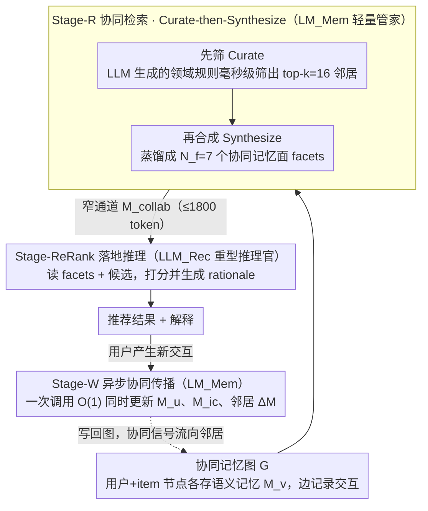

<!-- 由 src/gen_stubs.py 自动生成 -->
# MemRec: Collaborative Memory-Augmented Agentic Recommender System

**会议**: ACL 2026  
**arXiv**: [2601.08816](https://arxiv.org/abs/2601.08816)  
**代码**: https://github.com/rutgerswiselab/memrec (有)  
**领域**: 推荐系统 / LLM Agent / 协同过滤  
**关键词**: 协同记忆, Agentic RS, 记忆图, 解耦架构, 标签传播

## 一句话总结
MemRec 用一个**轻量级 LLM 专门管理一张动态"协同记忆图"**（把多个 user 与 item 的语义记忆通过交互边相连），然后把蒸馏后的"协同记忆面（facets）"喂给重量级推理 LLM 做最终推荐；通过"Curate-then-Synthesize"压噪 + 异步 $O(1)$ 标签传播更新，在 4 个 benchmark 上 H@1 相对 SOTA i2Agent 提升 **+15% 到 +29%**，数据稀疏用户上更是相对 Vanilla LLM 提升 **+91.4%**。

## 研究背景与动机
**领域现状**：推荐系统的"记忆形态"经历了三波演化：(1) 矩阵分解时代的稀疏 rating 记忆；(2) 深度学习时代的稠密 embedding 记忆；(3) LLM agentic RS 时代的"语义记忆"——把用户偏好和 item 描述都写成自然语言文本，让 LLM 推理时用。最新研究又把语义记忆细分为"无记忆 → 静态记忆 → 动态自反思记忆"三档（如 i2Agent、AgentCF、RecBot 自我反思更新 user/item profile）。

**现有痛点**：所有现有 agentic RS 都是**"孤岛记忆"** —— 每个 user 的 $M_u$ 和每个 item 的 $M_i$ 都各自独立维护，user $u$ 推荐时只看 $M_u$，完全丢失了 collaborative filtering 时代最核心的信号：**同好用户的 peer 信号**和**共现 item 的迁移信号**。这导致稀疏用户、冷启动 item 的表现极差——本来 GNN/LightGCN 时代靠 user-item graph 一招吃遍天下，到了 LLM agent 时代反而退化成纯个人记忆。

**核心矛盾**：直接把"全部邻居记忆拼进 prompt"看起来能补齐缺失，但会立刻撞上两堵墙：(1) **认知过载**——海量文本塞进 LLM context 后，模型会被噪声淹没（参考 "Lost in the Middle" 现象），ranking 质量反而下降；(2) **更新瓶颈**——每来一个新交互都要级联更新所有邻居的语义记忆，naive 实现是 $O(|N_k|)$ 次 LLM 调用，工业部署下成本爆炸。

**本文目标**：把"协同信号"重新注入 agentic 记忆体系，同时绕开认知过载和更新瓶颈。

**切入角度**：作者从 Information Bottleneck 理论受启发——既然 raw 邻居信息太多，那就**蒸馏出一个"压缩-但-保留任务相关信息"的子表示**。再借鉴 Label Propagation 算法的思想，把"对邻居的反思更新"批量异步打包。

**核心 idea**：**架构性解耦** —— 让一个轻量 $\text{LM}_{\text{Mem}}$ 在后台维护协同记忆图、做 curate-then-synthesize 蒸馏；前台重量级 $\text{LLM}_{\text{Rec}}$ 只看蒸馏后的高浓度信号做推理。这样既解决过载，又把所有更新批量化为单次异步 LLM 调用（$O(1)$ 每交互）。

## 方法详解

### 整体框架
MemRec 的核心思路是把"记忆管理"和"推荐推理"拆给两个不同体量的 LLM，中间只通过一道窄通道传信号。系统底层维护一张 unified memory graph $G = (\mathcal{V}, E)$，节点 $\mathcal{V} = \mathcal{U} \cup \mathcal{I}$（用户和 item）各存一份会进化的语义记忆 $M_v$，边 $E$ 记录交互和派生关系。每次给 $u$ 出推荐时，轻量级的 $\text{LM}_{\text{Mem}}$ 先在后台从图上把 $u$ 的邻居修剪、蒸馏成一小撮高浓度的"协同记忆面（facets）"$M_{\text{collab}}$，重量级的 $\text{LLM}_{\text{Rec}}$ 只读这份蒸馏结果给候选打分并生成解释；交互发生后，$\text{LM}_{\text{Mem}}$ 再异步地把这次交互的影响一次性传播回图上的相关节点。三段分别是协同检索（Stage-R）、落地推理（Stage-ReRank）、异步协同传播（Stage-W）。

### 关键设计

**1. 双 LLM 架构解耦：让管家和推理官各司其职**

直接把全部邻居记忆拼进一个模型的 prompt 会撞上 cognitive bottleneck——长 raw context 下 LLM 没法同时兼顾"压缩"和"推理"，作者在 Figure 6 里证明这种 "Naive Agent"（单模型既 ingest 又 rank）很快就性能 plateau。MemRec 干脆把两个职能物理剥离：$\text{LM}_{\text{Mem}}$ 专吃 raw graph context、负责 curation / synthesis / propagation，可以用便宜的 gpt-4o-mini 甚至本地的 Qwen-2.5-7B / Llama-3-8B；$\text{LLM}_{\text{Rec}}$ 是重量级模型（gpt-4o-mini 或 gpt-4o），只读蒸馏后的高信号 $M_{\text{collab}}$ 做最终 ranking 与 rationale。

两侧只通过 $M_{\text{collab}}$ 这道 narrow channel 通信，正对应 Information Bottleneck 里 $T = \arg\max I(T; Y) - \beta I(T; X)$ 的思路——压缩掉与任务无关的 $X$、保留与目标 $Y$ 相关的信息。这相当于把 system 1（快速过滤）和 system 2（深度推理）分开，两侧的更新频率与触发条件也随之解耦；Books 上这种解耦让 H@1 相对单模型方案绝对提升 **+34%**。

**2. Curate-then-Synthesize：先用 LLM 生成的规则快筛，再蒸馏成结构化 facets**

邻居动辄数十个，但 $\text{LLM}_{\text{Rec}}$ 的 token budget 只有 $\tau = 1800$，所以必须先把邻居信息压成高浓度。传统图剪枝要么 random-walk（有规则但无语义）、要么 GNN attention（要训练且不可解释），都不适合 zero-shot 的 LLM agent。MemRec 用"LLM-as-Rule-Generator"取折中：离线让 $\text{LM}_{\text{Mem}}$ 看领域统计 $\mathcal{D}_{\text{domain}}$ 自动生成一组可解释的启发式规则 $R_{\text{domain}} \leftarrow \text{LM}_{\text{Mem}}(\mathcal{D}_{\text{domain}} \| P_{\text{meta}})$（Books 生成"按 genre/theme 相似度优先"，Yelp 生成"按 cuisine + price + 近期访问优先"），在线时这些规则像高速 filter 一样毫秒级把邻居 $N(u)$ 筛到 top-$k$ 的 $N_k'(u)$，既有规则的速度又有 LLM 的语义理解。

筛完进入 synthesize：把目标 user 的**完整 $M_u^{t-1}$** 加上邻居的**轻量 tiered representation** 一起喂给 $\text{LM}_{\text{Mem}}$，输出 $N_f = 7$ 个结构化 facets（每个 facet 带 theme + 置信度 + 邻居证据）。tiered representation 是个聪明的省 token 做法——item 邻居只写截断后的 memory，user 邻居只用最近 3 个交互 item 标题作 dense proxy，既不重复信息又压住了长度。

**3. 异步协同传播：把更新复杂度从 $O(|N_k'|)$ 压到 $O(1)$**

记忆图要随交互动态演化，但 naive 同步方案对每个邻居都单独跑一次 LLM、还得把 user context 反复塞进 prompt，调用数是 $O(|N_k'|)$、token 冗余巨大，工业部署成本爆炸。MemRec 借鉴 Label Propagation 的思想，把"一次交互"视为沿相似关系向邻居扩散的"新标签"：当 $u$ 在 $t$ 时刻与 $i_c$ 交互，构造统一 prompt $P_{\text{update}}$ 让 $\text{LM}_{\text{Mem}}$ **一次调用**就同时产出 $(M_u^t, M_{i_c}^t, \{\Delta M_{\text{neigh}}\})$——既全量更新交互双方的 memory，又对每个邻居输出一段"增量更新片段" $\Delta M$。

这个过程异步执行、不阻塞 online ranking 路径，把调用复杂度降到 $O(1)$ 每交互、token 总量也大幅压缩。更关键的是，"批量增量"的建模保证协同信号真的流动到了邻居，而不是像孤岛 agent 那样只更新交互双方。

### 一个完整示例：给一个稀疏用户出推荐
设 $u$ 是 Books 上一个只读过 3 本书的 low-activity 用户，候选集 $\mathcal{I}_u$ 有 10 本书。**Stage-R**：$\text{LM}_{\text{Mem}}$ 先用离线生成的 Books 规则（"按 genre/theme 相似度优先"）从 $u$ 的全部邻居里毫秒级筛出 top-$k=16$ 个同好用户和共现书；再把 $u$ 完整的 $M_u^{t-1}$ 加上这 16 个邻居的 tiered representation 喂进去，蒸馏出 $N_f=7$ 个 facets（如"偏好硬科幻、置信度 0.8、证据来自邻居 A/C"），整段控制在 1800 token 内。**Stage-ReRank**：$\text{LLM}_{\text{Rec}}$ 拿到候选 + 这 7 个 facets，给 10 本书打分并写出 rationale，把同好们都爱的那本硬科幻排到 H@1。**Stage-W**：$u$ 真的点了这本书后，$\text{LM}_{\text{Mem}}$ 异步跑一次 $P_{\text{update}}$，同时刷新 $M_u^t$、这本书的 $M_{i_c}^t$、以及 16 个邻居各自的 $\Delta M$——下一个同好用户来时就能受益于这条新流入的协同信号。

### 损失函数 / 训练策略
**完全 training-free**。所有 LLM 调用都是 zero-shot prompting，超参 $k=16$ 邻居，$N_f=7$ facets，$\tau=1800$ tokens budget，temperature=0。$\text{LLM}_{\text{Rec}}$ 与 $\text{LM}_{\text{Mem}}$ 默认都用 gpt-4o-mini，Ceiling 配置可换 gpt-4o；Local 配置用 vLLM 部署 Qwen-2.5-7B/Llama-3-8B；Vector 配置把 $\text{LLM}_{\text{Rec}}$ 换成 all-MiniLM-L6-v2 Sentence Transformer 直接做相似度排序。这种"可插拔架构"使 MemRec 能从 cloud-API 到 on-premise 各档部署都跑得动。

## 实验关键数据

### 主实验

**4 个 benchmark（Amazon Books / Goodreads / MovieTV / Yelp，N=10 候选）H@1 与 N@5**：

| 数据集 | 方法 | H@1 | N@5 | H@1 提升 |
|--------|------|-----|-----|---------|
| **Books** | i2Agent (SOTA) | 0.4453 | 0.6138 | — |
| | LightGCN | 0.1753 | 0.3592 | — |
| | **MemRec** | **0.5117** | **0.6601** | **+14.91%** |
| **Goodreads** | i2Agent | 0.3099 | 0.5481 | — |
| | **MemRec** | **0.3997** | **0.6112** | **+28.98%** |
| **MovieTV** | i2Agent | 0.4912 | 0.6672 | — |
| | **MemRec** | **0.5882** | **0.7422** | **+19.75%** |
| **Yelp** | i2Agent | 0.4205 | 0.6007 | — |
| | **MemRec** | **0.4868** | **0.6463** | **+15.77%** |

所有提升 $p < 0.05$ 统计显著。Books / Goodreads 这种最稀疏的数据集提升最大，验证协同信号对稀疏用户的价值。

### 消融实验（Books 数据集）

| 配置 | H@1 | H@5 | N@5 | H@1 Drop |
|------|-----|-----|-----|----------|
| MemRec (Full) | 0.527 | 0.803 | 0.670 | — |
| w/o Collab. Write（关掉 async 传播） | 0.505 | 0.814 | 0.665 | **−4.2%** |
| w/o LLM Curation（用通用规则代替领域规则） | 0.498 | 0.788 | 0.648 | **−5.5%** |
| **w/o Collab. Read（关掉协同检索）** | **0.475** | 0.769 | 0.624 | **−9.9%** |

### 关键发现
- **协同读 > 协同写 > LLM curation > 单独使用记忆**：H@1 drop 排序明确告诉我们"把邻居信息引入推理路径"是收益最大的设计；动态传播次之；curation 的精度 + 适应性也贡献明显。
- **数据稀疏用户受益最大**：Low-activity 用户子组上 MemRec 相对 Vanilla LLM **+91.4%** H@1，证明协同信号正是孤岛 agent 缺失的关键。
- **30% noise injection 下仍稳健**：恶意注入 30% 假 item 到用户历史，MemRec 还维持 H@1=0.491，源于 LLM curation 在前置位起到了"语义过滤器"作用，过滤掉无关 peer。
- **Pareto 前沿大幅外扩**：Standard (4o-mini) 配置 H@1=0.524 / N@5=0.663 / ~16.5s 延迟；Cloud-OSS（gpt-oss-120B）H@1=0.561 / N@5=0.699；Ceiling (gpt-4o) H@1=0.580 / N@5=0.722——验证 $\text{LM}_{\text{Mem}}$ 选模型选哪档都 work，且 Vector 配置可压到亚毫秒延迟。
- **Token I/O 比 3.9:1**：MemRec 的 token 分布天然偏 input 重 output 轻（input 约 5,100 / output 约 1,300），完美利用了商业 LLM "output token 3-4× 贵于 input token" 的不对称定价，实际花费远低于 token 总数估计。
- **Rationale 质量上升**：GPT-4o-as-judge 评测 specificity / relevance 都显著提升（$p<0.001$），factuality 也微弱提升，证明协同记忆不仅提升 ranking 还提升解释质量。

## 亮点与洞察
- **"双模型解耦 + IB 通道"是个普适架构**：把 memory management 和 reasoning 物理分离的思路可以套用到任何"agent 处理过载上下文"的场景（如长文 QA、code 仓库 agent、长视频 agent）；轻量管家 + 重型推理的组合在工业部署上极有吸引力。
- **LLM-as-Rule-Generator**：用 LLM 一次性生成可解释规则，再让规则在线做毫秒级 filter——既保留了 LLM 的语义理解，又避开了在线 LLM 调用成本。可推广到"用 LLM 蒸馏出规则供其他系统使用"这一更大的 paradigm。
- **Async batched propagation 的 $O(1)$ 复杂度**：让"协同更新"在 LLM 时代第一次具备工业可部署性。标签传播是经典老算法，但作者把它包装成"一个 LLM 调用同时反思自身 + 增量更新邻居" —— 是把经典 GNN 思想搬到 agent 的漂亮案例。
- **协同信号对稀疏用户的"91% 提升"**：这是个非常惊人的数字，等于说 collaborative memory 直接把 long-tail 用户的推荐质量翻了一倍——这也是过去传统 CF 时代之所以能成立的原因，现在 agent 时代被这篇重新找回。
- **不对称 token pricing 的工程优化**：把"贵的 output"压缩、把"便宜的 input"放开，是 LLM 产品设计经常被忽视但非常重要的一个工程维度。

## 局限与展望
- **作者承认**：(1) 协同传播只走 1-hop，多跳社区传播会引入噪声且成本高；(2) 领域规则在离线一次性生成，对高度动态领域（如新闻）需要在线适配；(3) Ceiling 性能仍依赖商用大模型 gpt-4o。
- **自查**：(1) 评测主要在 1000 用户子集（除主表外），完整规模上是否还保持优势需谨慎；(2) 跨域迁移 / 用户画像漂移情形未做；(3) 隐私维度——协同记忆把邻居信号通过 LLM 编码到 $u$ 的 prompt 里，存在前一篇 MIA 论文揭示的隐私泄露风险；(4) 长期演化下记忆图会膨胀，没讨论 forgetting / compaction 机制。
- **改进方向**：(1) 引入差分隐私的 federated memory updates（作者也提到）；(2) 学习自适应的 $k, N_f$ 而非固定；(3) 让 propagation 走多跳但加 trust-score 门控；(4) 把 $\text{LM}_{\text{Mem}}$ 训练为 reward-tuned 小模型，进一步降低成本与延迟；(5) 在用户画像漂移的 streaming 场景下测试。

## 相关工作与启发
- **vs i2Agent / AgentCF / RecBot（孤岛动态记忆 agent）**：他们都是 self-reflection 改 $M_u$ 或 $M_i$，更新范围严格限定在交互双方；MemRec 第一个把更新沿协同图 propagate。
- **vs Vanilla LLM / iAgent（无记忆 / 静态记忆）**：本文证明记忆等级从 No → Static → Dynamic → Collaborative 是逐级递进的，每升一级 H@1 都显著上涨。
- **vs LightGCN / SASRec（传统 CF）**：传统 CF 在稀疏数据（Books）上崩溃，密集数据（Yelp）尚可；本文用 LLM 推理把 CF 的协同图思想"重新激活"，结合 LLM 的语义理解，在两端都击败传统方法。
- **vs MemGPT / Generative Agents（通用 agent 记忆）**：他们也用 decoupled memory manager，但目标是事实记忆 + 长对话，没有图结构 + 协同传播；MemRec 是把这个范式移植到 RS 域并加入图结构。
- **vs Graph RAG**：Graph RAG 在 retrieval 端用 KG 做结构化检索；MemRec 进一步把 graph 作为 dynamic、可写的语义记忆，写入端也图结构化。
- **启发**：(1) 凡是 agent 需要"看很多相关上下文 + 反思" 的场景，都应该考虑解耦 memory manager；(2) "LLM 生成规则、规则在线过滤" 是降低 LLM 推理成本的通用范式；(3) 经典图算法（label propagation、PageRank、community detection）值得在 agent 时代被重新捡起。

## 评分
- 新颖性: ⭐⭐⭐⭐ "协同记忆"概念 + 解耦双 LLM + 异步 batched propagation 这一组合在 agentic RS 领域是清晰的新范式；个别组件（IB、label propagation）非原创但组合得当。
- 实验充分度: ⭐⭐⭐⭐⭐ 4 数据集 × 8 baseline × 5 配置（Standard/Vector/Local-Qwen/Local-Llama/Ceiling/Cloud-OSS）+ 完整 ablation + niche-user 子组 + 30% 噪声鲁棒性 + rationale GPT-4o judge + 超参 heatmap + N=20 大候选集 + 成本与延迟全分析，覆盖度非常高。
- 写作质量: ⭐⭐⭐⭐⭐ Figure 1 的"孤岛 vs 协同"对比一图胜千言；方法 section 公式 / 思路 / 直觉三位一体；附录 prompt 完整、case study 详细；结构非常工整。
- 价值: ⭐⭐⭐⭐⭐ 在 LLM-based RecSys 的关键瓶颈（稀疏用户、冷启动、解释质量）上提供了直接可工业部署的方案，公开代码 + 公开主页，复现门槛极低；对推荐系统社区是个里程碑式工作。

<!-- RELATED:START -->

## 相关论文

- [\[ACL 2026\] ClusterRAG: Cluster-Based Collaborative Filtering for Personalized Retrieval-Augmented Generation](clusterrag_cluster-based_collaborative_filtering_for_personalized_retrieval-augm.md)
- [\[NeurIPS 2025\] Radial Neighborhood Smoothing Recommender System](../../NeurIPS2025/recommender/radial_neighborhood_smoothing_recommender_system.md)
- [\[ICML 2026\] Learning Design Skills as Memory Policies for Agentic Photonic Inverse Design](../../ICML2026/recommender/learning_design_skills_as_memory_policies_for_agentic_photonic_inverse_design.md)
- [\[ICML 2026\] Incentivized Exploration with Stochastic Covariates: A Two-Stage Mechanism Design for Recommender System](../../ICML2026/recommender/incentivized_exploration_with_stochastic_covariates_a_two-stage_mechanism_design.md)
- [\[ACL 2026\] HARPO: Hierarchical Agentic Reasoning for User-Aligned Conversational Recommendation](harpo_hierarchical_agentic_reasoning_for_user-aligned_conversational_recommendat.md)

<!-- RELATED:END -->
