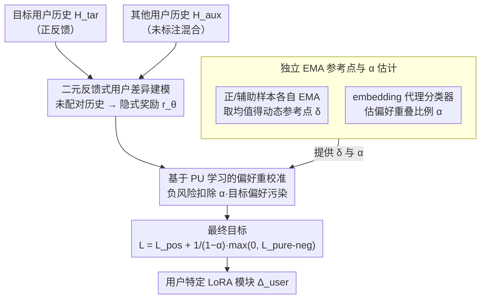

# Personalizing LLMs with Binary Feedback: A Preference-Corrected Optimization Framework

**会议**: ACL2026  
**arXiv**: [2605.10043](https://arxiv.org/abs/2605.10043)  
**代码**: 未公开  
**领域**: 个性化LLM / 偏好优化 / 推荐与用户建模  
**关键词**: LLM个性化, 二元反馈, PU学习, 偏好重校准, 用户差异

## 一句话总结
这篇论文提出 C-BPO，把目标用户历史当作正反馈、其他用户历史当作带噪未标注负反馈，并用 PU 学习校正“偏好重叠”带来的误惩罚，从而让 LLM 学到用户独特偏好而不压制通用任务能力。

## 研究背景与动机
**领域现状**：LLM 个性化常见做法有三类：在 prompt 里检索用户历史或用户画像，在用户历史上训练 LoRA 之类的轻量模块，或者构造偏好对做 DPO 式优化。它们的共同目标是让模型回答更像某个用户会写、会选或会喜欢的内容。

**现有痛点**：很多方法只看目标用户自己的历史，把个性化等同于“模仿这个用户过去写过什么”。但用户偏好真正有信息量的部分往往来自跨用户差异：这个用户和其他用户到底哪里不同。DPO 又要求同一输入下有 winner/loser 成对完成，而真实用户历史通常是未配对的 `(x, y)` 样本。

**核心矛盾**：其他用户的数据既有价值又危险。它们提供了天然对比信号，可以帮助模型知道目标用户“不像谁”；但其他用户也共享大量通用任务知识和群体偏好。如果把所有其他用户数据都当作负样本，模型会错误惩罚大家共同需要的能力，例如新闻标题要简洁、学术标题要准确、评论要围绕商品属性。

**本文目标**：作者要把未配对的用户历史转成可优化的偏好信号，同时解决三个问题：如何用二元反馈替代成对偏好，如何从辅助用户数据中剥离共享偏好，如何在目标用户样本少而辅助样本多时保持训练边界稳定。

**切入角度**：论文借用 Positive-Unlabeled learning 的思想：目标用户历史是正类，辅助用户历史不是干净负类，而是正偏好与真实负偏好的混合。只要估计出辅助数据中“像目标用户”的比例，就能从负风险里减去这部分正偏置。

**核心 idea**：把“其他用户数据 = 负样本”改成“其他用户数据 = 未标注混合样本”，用 PU 风险分解得到净化后的负损失，再做二元偏好优化。

## 方法详解
C-BPO 的出发点是：个性化不该只拟合目标用户写过什么，而要建模"目标用户相对人群的差异"。所以它不为每个用户手工构造对比回答，而是直接拿用户历史本身做信号——把目标用户历史 $H_{\text{tar}}$ 当正反馈、其他用户历史 $H_{\text{aux}}$ 当辅助集合，再用 PU 学习把辅助集合里"和目标用户共享的偏好"扣掉，避免误惩罚大众共性。

### 整体框架
给定底座模型 $\pi_{\text{base}}$，个性化模型写作 $\pi_{\text{user}} = \pi_{\text{base}} + \Delta_{\text{user}}$，其中 $\Delta_{\text{user}}$ 是用户特定的轻量 LoRA 模块。训练样本不要求同一 prompt 下的成对回答，只需要目标用户历史 $(x,y)$ 和辅助用户历史 $(x,y)$ 这种未配对样本。模型沿用 BCO/KTO 那套二元反馈偏好优化的隐式奖励 $r_\theta(x,y) = \beta \log \frac{\pi_\theta(y|x)}{\pi_{\text{ref}}(y|x)}$：正样本希望奖励高于参考点 $\delta$，负样本希望低于 $\delta$。C-BPO 在此基础上做两处关键修改——把辅助集合当未标注混合分布、用校正项减去目标用户偏好的污染；以及用正/辅助样本各自的 EMA 奖励均值估计参考点，防止负样本数量变化时决策边界漂移。推理阶段不再需要辅助用户数据，只用训练好的用户 adapter。

### 关键设计

**1. 二元反馈式用户差异建模：用未配对历史替代成对偏好**

真实个性化数据通常是"用户写过的内容"或"用户点过赞的内容"，不是标准 RLHF 的偏好对，DPO 那套"同一输入下 winner/loser 成对"的要求在这里根本满足不了。C-BPO 改用二元反馈：目标用户样本 $H_{\text{tar}}$ 视为正反馈，其他用户样本 $H_{\text{aux}}$ 视为隐式负反馈来源。损失沿用 BCO 形式，正样本优化 $-\log\sigma(r_\theta(x,y)-\delta)$、负样本优化 $-\log\sigma(-(r_\theta(x,y)-\delta))$，这样模型就能直接从原始用户历史学起，不必额外构造对比回答。

**2. 基于 PU 学习的偏好重校准：把共享知识从负信号里扣掉**

直接把其他用户数据全当负样本是危险的——如果大家都喜欢简洁标题，惩罚其他用户的标题等于让模型把通用能力也学坏。C-BPO 把 $H_{\text{aux}}$ 看成由正偏好和真实负偏好混合而成的未标注集合，只要估出辅助数据里"像目标用户"的比例 $\alpha$，就能从负风险里减去这部分正偏置。净化后的负损失写作

$$L_{\text{pure-neg}} = \mathbb{E}_{H_{\text{aux}}}[l(g,-1)] - \alpha\, \mathbb{E}_{H_{\text{tar}}}[l(g,-1)]$$

最终目标为 $L_{\text{C-BPO}} = L_{\text{pos}} + \frac{1}{1-\alpha}\max(0, L_{\text{pure-neg}})$。校正项把共享偏好从负信号中扣掉后，剩余梯度更专注于用户特异性，这也是 C-BPO 区别于 KTO/BCO（默认负样本干净）的核心。

**3. 独立 EMA 参考点与 alpha 估计：在数据不平衡时稳住边界、按用户适配校正强度**

辅助数据量往往远大于目标数据，BCO 那种在 batch 里混合正负样本求平均参考点的做法会被数量占优的辅助分布拉走，使决策边界 $\delta$ 漂移。C-BPO 改为分别维护正样本奖励和辅助样本奖励的 EMA，再取两者均值作为动态 $\delta_{\text{EMA}}$，让边界不被辅助分布主导。$\alpha$ 则通过用户历史 embedding 上的代理分类器估计：先区分目标用户与辅助用户，再取辅助集合中"目标用户式"概率的平均值作为校正强度。这样 $\alpha$ 不再是一个普通调参系数，而是可解释的"偏好重叠比例"——重叠高的 Non-unique 用户需要更大的 $\alpha$ 去过滤共同偏好，差异大的 Unique 用户最优 $\alpha$ 更低。

### 损失函数 / 训练策略
正样本损失为 $L_{\text{pos}} = \mathbb{E}_{H_{\text{tar}}}[l(g,+1)]$，其中 $l(g,+1) = -\log\sigma(r_\theta(x,y)-\delta)$。负样本不直接用 $\mathbb{E}_{H_{\text{aux}}}[l(g,-1)]$，而是扣除 $\alpha\, \mathbb{E}_{H_{\text{tar}}}[l(g,-1)]$ 得到净化负项，并套上 $\max(0,\cdot)$ 防止 PU 风险估计在高容量模型下变成负数导致过拟合。实现用 LoRA（rank 8、scaling 16）；SFT 类阶段用 AdamW + 线性 warmup，二元偏好优化统一训练 3 个 epoch，学习率 $1\text{e-}6$。

## 实验关键数据

### 主实验
作者在 LaMP 与 LongLaMP 的五个个性化生成任务上评测：新闻标题生成、学术标题生成、摘要生成、评论写作和话题写作。主表使用 Mistral-7B-Instruct-v0.3，指标为 ROUGE-1 / ROUGE-L。

| 任务 | Base | OPPU | CoPE | BCO | C-BPO | 主要结论 |
|------|------|------|------|-----|-------|----------|
| Abstract Gen. R-1 / R-L | 0.341 / 0.186 | 0.378 / 0.218 | 0.392 / 0.239 | 0.373 / 0.231 | 0.398 / 0.269 | C-BPO 两项最好，尤其 R-L 提升明显 |
| Review Writing R-1 / R-L | 0.287 / 0.126 | 0.319 / 0.134 | 0.335 / 0.146 | 0.315 / 0.132 | 0.353 / 0.154 | 辅助用户差异对评论风格有帮助 |
| Topic Writing R-1 / R-L | 0.246 / 0.105 | 0.278 / 0.112 | 0.281 / 0.120 | 0.272 / 0.112 | 0.291 / 0.118 | R-1 最好，R-L 略低于 CoPE |
| News Headline R-1 / R-L | 0.119 / 0.105 | 0.203 / 0.182 | 0.205 / 0.184 | 0.197 / 0.179 | 0.215 / 0.198 | 标题任务上优于检索和 SFT 类方法 |
| Scholarly Title R-1 / R-L | 0.409 / 0.324 | 0.510 / 0.454 | 0.519 / 0.461 | 0.507 / 0.443 | 0.539 / 0.481 | 学术标题个性化收益稳定 |

| 数据集统计 | 样本数 | 输入长度均值 | 历史长度均值 | 输出长度均值 |
|------|------|------|------|------|
| Abstract Generation | 原文统计表未给出可核对样本数 | 233.1 ± 117.5 | 1296.7 ± 446.4 | 210.5 ± 92.8 |
| Review Writing | 19,649 | 407.2 ± 299.5 | 759.3 ± 324.2 | 511.8 ± 294.2 |
| Topic Writing | 21,119 | 358.3 ± 316.9 | 260.6 ± 314.0 | 358.3 ± 255.4 |
| News Headline Generation | 7,275 | 15.5 ± 6.0 | 270.1 ± 182.1 | 18.6 ± 5.2 |
| Scholarly Title Generation | 16,076 | 17.9 ± 6.1 | 444.0 ± 121.6 | 16.4 ± 5.8 |

### 消融实验

| 分析项 | 观察 | 对方法的含义 |
|------|------|------|
| 辅助数据比例 `x = |H_aux| / |H_tar|` | 当目标用户历史少于约 50% 时，`x=1.5` 反而弱于平衡设置；目标历史足够多后，更多辅助数据才有优势 | 负信号必须有足够正样本锚定，否则模型无法准确剥离共享偏好 |
| 去掉独立 EMA 参考点 | 当 `x` 偏离 1.0 时性能明显下降，在 `x=1.5` 且目标历史较少时甚至低于 OPPU | 参考点不能被数量占优的辅助分布主导，独立 EMA 是稳定器 |
| 用户唯一性分组 | KTO/BCO 在 Non-unique 组显著退化，在 Unique 组也难以超过 SFT；C-BPO 在三组中都能稳定利用辅助信息 | 标准 BPO 不会处理偏好重叠，C-BPO 的校正项是关键 |
| alpha 敏感性 | Non-unique 用户需要更高 `alpha` 过滤共同偏好，Unique 用户的最优 `alpha` 更低 | `alpha` 可解释为偏好重叠比例，而不是普通调参系数 |
| token-level log-prob shift | 相比 BCO，C-BPO 减轻了对辅助数据中共享偏好 token 的过度压低 | 说明 PU 校正确实在保护通用任务知识 |

### 关键发现
- 直接把其他用户数据作为负样本并不可靠。KTO 和 BCO 在多个任务上低于 OPPU 或 CoPE，说明“二元反馈”本身不足以解决个性化，必须处理偏好重叠。
- C-BPO 在 5 个任务的多数指标上超过 CoPE，且不需要为同一输入构造 rejection-sampling 负回答，数据形式更接近真实用户历史。
- 论文最重要的实验证据来自用户唯一性分析：当辅助用户与目标用户很像时，标准 BPO 最容易误惩罚共享偏好；当辅助用户差异大时，C-BPO 能更充分提取个性化信号。
- EMA 参考点看似是实现细节，但它决定了训练在数据不平衡下是否稳定。对于真实应用，辅助用户池通常远大于目标用户历史，这一点非常关键。

## 亮点与洞察
- 论文把个性化从“只拟合目标用户”推进到“建模目标用户相对人群的差异”，这个视角很重要。个性本质上是相对概念，只看目标历史会混淆用户独有偏好和任务共性。
- PU 学习的迁移很漂亮：辅助用户历史不是干净负类，而是含有目标式偏好的未标注混合分布。这个建模比“其他用户都不喜欢”更符合个性化场景。
- `alpha` 的解释性强。它既是偏好重叠程度，也是校正强度；用 embedding 代理分类器估计，给实际部署提供了比人工网格搜索更可行的起点。
- C-BPO 对推荐系统也有启发：很多隐式负反馈其实是“未暴露/未标注/群体共享”的混合信号，直接当负样本会压制大众共性偏好，PU 式校正可迁移到排序和生成式推荐。

## 局限与展望
- 评测主要依赖 ROUGE，这对个性化风格和用户满意度的刻画有限。ROUGE 高不一定代表用户真的更喜欢，后续需要人工偏好评测或在线交互指标。
- `alpha` 估计依赖历史 embedding 与代理分类器。如果 embedding 不能捕捉用户风格，或目标用户历史很短，校正系数可能不稳定。
- 辅助数据的选择策略仍较简单，主要是随机或基于 embedding 距离的分组。真实系统中还需要考虑用户隐私、群体偏差、冷启动用户和时间变化。
- 论文默认目标用户历史是正反馈，但用户历史未必全是用户偏好，可能包含偶然行为、低质量输出或过时偏好。未来可以结合时间衰减、置信度和显式反馈。
- C-BPO 目前为每个用户训练 adapter，面对百万用户规模时仍有存储和训练成本问题；可以探索用户聚类 adapter、超网络生成 LoRA 或在线轻量更新。

## 相关工作与启发
- **vs RAG / PAG 个性化**: RAG 和 PAG 在 prompt 里加入用户历史或画像，不改模型参数；C-BPO 直接训练用户模块，更能长期吸收细粒度风格，但训练成本更高。
- **vs OPPU / SFT 用户微调**: OPPU 只最大似然拟合目标用户历史，容易学习共同任务模式；C-BPO 加入辅助用户对比，能显式放大用户差异。
- **vs DPO / CoPE**: CoPE 通过 rejection sampling 构造负样本再做 DPO，数据加工更重；C-BPO 不要求相同输入下的成对回答，直接使用未配对历史。
- **vs KTO / BCO**: KTO 和 BCO 已经支持二元反馈，但默认负样本干净。C-BPO 的核心改进是承认辅助用户数据有正偏置，并用 PU 风险分解校正。

## 评分
- 新颖性: ⭐⭐⭐⭐☆ 用 PU learning 解释和修正个性化里的偏好重叠，视角扎实且有迁移价值。
- 实验充分度: ⭐⭐⭐⭐☆ 覆盖 5 个任务、多种基线和关键分析，但缺少真实用户偏好评测。
- 写作质量: ⭐⭐⭐⭐☆ 理论推导和实验叙事较清楚，个别附录细节较多，主文可再强化直观例子。
- 价值: ⭐⭐⭐⭐⭐ 对个性化 LLM、生成式推荐和隐式反馈学习都很有参考意义，尤其适合处理“其他用户不是纯负样本”的场景。

<!-- RELATED:START -->

## 相关论文

- [\[ACL 2026\] SenseJudge: Human-Centric Preference-Driven Judgment Framework](sensejudge_human-centric_preference-driven_judgment_framework.md)
- [\[ACL 2026\] Mirroring Users: Towards Building Preference-aligned User Simulator with User Feedback in Recommendation](mirroring_users_towards_building_preference-aligned_user_simulator_with_user_fee.md)
- [\[ICML 2026\] T-POP: Test-Time Personalization with Online Preference Feedback](../../ICML2026/recommender/t-pop_test-time_personalization_with_online_preference_feedback.md)
- [\[ACL 2026\] What Makes LLMs Effective Sequential Recommenders? A Study on Preference Intensity and Temporal Context](what_makes_llms_effective_sequential_recommenders_a_study_on_preference_intensit.md)
- [\[AAAI 2026\] Evaluating LLMs for Police Decision-Making: A Framework Based on Police Action Scenarios](../../AAAI2026/recommender/evaluating_llms_for_police_decision-making_a_framework_based_on_police_action_sc.md)

<!-- RELATED:END -->
