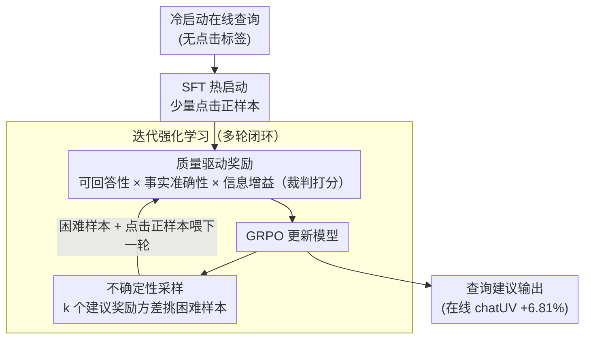

# Quality Over Clicks: Intrinsic Quality-Driven Iterative RL for Cold-Start E-Commerce Query Suggestion

**会议**: ACL 2026  
**arXiv**: [2603.22922](https://arxiv.org/abs/2603.22922)  
**代码**: [GitHub](https://github.com/QiSun123/Cold-EQS)  
**领域**: E-Commerce / Reinforcement Learning  
**关键词**: 冷启动, 查询建议, 质量驱动奖励, 不确定性采样, 电商对话

## 一句话总结

提出 Cold-EQS，一个面向冷启动电商场景的查询建议框架，利用可回答性、事实准确性和信息增益作为内在质量奖励，通过迭代强化学习持续优化查询建议质量，在线 chatUV 提升 6.81%。

## 研究背景与动机

**领域现状**：查询建议(Query Suggestion)是电商对话系统的核心组件——在多轮交互中，AI 助手主动提供可点击的建议查询，帮助用户用最少的努力细化需求。现有生成式方法通常使用 LLM 生成查询，并通过 CTR 模型进行对齐。

**现有痛点**：(1) 生成式方法严重依赖大量在线点击数据来训练有效的 CTR 模型（如 20M+ 条交互记录），但在冷启动阶段这些数据不可用；(2) 现有方法主要关注查询的**相关性和多样性**，忽视了查询本身的**内在质量**——生成的查询可能不可回答（超出下游 Agent 能力）、包含幻觉事实（"一美元买 iPhone"）、或仅重复用户原始问题而无新增信息。

**核心矛盾**：冷启动阶段无法依赖点击数据训练 CTR 模型，但仍需持续优化查询建议质量。点击信号本身也存在噪声——高点击的查询未必能产生高质量的多轮交互。

**本文目标**：在不依赖大量点击数据的冷启动阶段，通过内在质量信号持续优化查询建议的质量。

**核心idea**：不用点击率作为奖励，而用可回答性、事实准确性和信息增益三个内在质量维度作为 RL 奖励信号，结合不确定性采样从无点击信号的在线数据中选择困难样本进行迭代训练。

## 方法详解

### 整体框架

Cold-EQS 是一个四阶段迭代框架：(1) 用少量点击数据 SFT 热启动；(2) 使用质量驱动奖励进行 GRPO 强化学习；(3) 通过不确定性采样从无点击在线数据中选取困难样本；(4) 多轮迭代 RL 训练持续优化。基础模型为 Qwen3-4B。

### 关键设计

**1. 质量驱动奖励：用内在质量信号顶替冷启动时拿不到的点击率**

冷启动阶段没有 20M+ 点击记录可以训 CTR，而且点击信号本身有噪声——"一美元买 iPhone" 这种查询可能点击很高却毫无价值。Cold-EQS 干脆不看点击，改从查询本身的三个内在维度打分：可回答性 $r_{\mathrm{ans}}(s_i)$（下游 Agent 能不能答得上来）、事实准确性 $r_{\mathrm{fact}}(s_i)$（有没有幻觉），以及信息增益 $r_{\mathrm{info}}(s_i)$（相比用户原始问题有没有带来新信息）。每个 rollout 生成 $k$ 个建议，总奖励取格式分 $r_f$ 乘上 $k$ 个建议的三维乘积均值：

$$r_q = r_f \cdot \frac{1}{k}\sum_{i=1}^k r_{\mathrm{ans}}(s_i) \cdot r_{\mathrm{fact}}(s_i) \cdot r_{\mathrm{info}}(s_i)$$

三维用乘法而非加法，意味着任一维度塌陷（不可回答、有幻觉、零增益）都会把这条建议的奖励直接拉到接近零，逼模型同时满足三者。奖励评估由 Qwen-30B-A3B 充当裁判完成，无需任何在线点击。

**2. 不确定性采样：从没有点击标签的在线数据里挑出模型最吃不准的困难样本**

冷启动期海量在线查询都没有点击标签，全用来训会引入偏差、又浪费算力。Cold-EQS 用模型自己的"分歧"来筛样本：对每个在线查询 $q$，让模型生成 $k$ 个建议并打分，计算这 $k$ 个奖励的方差作为不确定度

$$u_q = \frac{1}{k}\sum_{i=1}^k \Big(R(s_i) - \frac{1}{k}\sum_j R(s_j)\Big)^2$$

方差大说明模型对这个查询的好坏判断不稳定，正是它的薄弱环节。把这些高不确定性查询选作困难样本喂进下一轮 RL，既增加了数据多样性，又把训练算力集中在模型最该补课的地方，而不是在已经做得好的样本上空转。

**3. 迭代强化学习：让"生成—筛样本—再训练"循环起来，持续逼出模型的盲点**

单次 RL 训练覆盖不了所有场景。Cold-EQS 把上面两步组成闭环多轮迭代：每轮用当前模型在无点击数据上生成建议 → 用不确定性采样选出困难样本 → 混合点击正样本一起做 RL 更新 → 下一轮再用更强的模型重新筛。每迭代一轮，模型的薄弱点就被重新暴露并修补一次，质量随轮次持续抬升，而整个过程始终不依赖点击率。

### 损失函数 / 训练策略

使用 GRPO 算法进行 RL 训练。奖励使用三维乘法组合（可回答性×事实性×信息增益×格式），确保三个维度同时满足。SFT 阶段使用点击正样本，RL 阶段使用质量驱动奖励。基础模型 Qwen3-4B，奖励评估器 Qwen-30B-A3B。

## 实验关键数据

### 主实验

| 模型 | Strict Accuracy | Valid Rate | 说明 |
|------|----------------|------------|------|
| GPT-4.1-mini | 70.5 | 79.2 | 闭源最佳之一 |
| Qwen-flash | 75.4 | 81.3 | 闭源最佳 |
| Qwen3-4B(base) | 36.7 | 53.2 | 开源 baseline |
| Cold-EQS(Qwen3-4B) | 显著提升 | 显著提升 | 接近甚至超越闭源模型 |
| **在线指标** | **+6.81% chatUV** | | 实际部署效果验证 |

### 关键发现
- 离线指标与在线效果呈强正相关，验证了内在质量评估的有效性
- 冷启动场景下，质量驱动奖励比点击驱动奖励更可靠
- 不确定性采样有效缓解了仅依赖点击数据的偏差问题
- 迭代 RL 训练带来持续的性能提升
- 4B 模型通过 Cold-EQS 训练后可接近甚至超越大型闭源模型

## 亮点与洞察
- **从点击到质量的范式转换**：用内在质量奖励替代 CTR 信号，适用于冷启动且更鲁棒
- **三维质量评估的合理性**：可回答性、事实性和信息增益恰好覆盖了查询建议的核心质量维度
- **离线-在线一致性**：离线质量指标与在线 chatUV 的强正相关使得离线迭代变得可靠
- **实际工业部署验证**：不仅是学术实验，还在阿里巴巴国际电商系统上验证了实际效果
- **EQS-Benchmark 的贡献**：提供了电商查询建议的标准化评估基准

## 局限与展望
- 奖励评估器(Qwen-30B-A3B)本身可能引入偏差，评估器质量直接影响训练效果
- 实验主要在阿里巴巴国际电商平台上验证，跨平台/跨语言的泛化性未知
- 不确定性采样使用简单的方差度量，更复杂的不确定性估计方法（如贝叶斯方法）可能更有效
- EQS-Benchmark 规模相对较小(16,949条)，更大规模的基准有待构建

## 相关工作与启发
- **vs CTR-based QS (Min et al., 2025)**：CTR 方法依赖 20M+ 在线记录，Cold-EQS 在冷启动阶段即可有效工作
- **vs 检索式方法**：检索式方法受限于历史查询池，无法生成新颖的查询建议；Cold-EQS 可以生成多样化的新查询
- **vs 标准 SFT**：纯 SFT 会放大点击噪声（如"一美元买iPhone"），RL + 质量奖励可以避免此问题

## 评分
- 新颖性: ⭐⭐⭐⭐ 内在质量驱动的冷启动 RL 框架在电商 QS 领域是新颖的
- 实验充分度: ⭐⭐⭐⭐ 含离线和在线实验，多模型对比，但消融细节可以更丰富
- 写作质量: ⭐⭐⭐ 结构合理，但作者信息匿名化不完整，部分描述可更清晰
- 价值: ⭐⭐⭐⭐ 解决了实际工业问题，在线 6.81% 提升验证了实用价值

<!-- RELATED:START -->

## 相关论文

- [\[ACL 2026\] Intent-Driven Semantic ID Generation for Grounded Conversational News Recommendation](intent-driven_semantic_id_generation_for_grounded_conversational_news_recommenda.md)
- [\[CVPR 2025\] FineVQ: Fine-Grained User Generated Content Video Quality Assessment](../../CVPR2025/recommender/finevq_fine-grained_user_generated_content_video_quality_assessment.md)
- [\[ACL 2026\] SenseJudge: Human-Centric Preference-Driven Judgment Framework](sensejudge_human-centric_preference-driven_judgment_framework.md)
- [\[ACL 2025\] LOTUS: A Leaderboard for Detailed Image Captioning from Quality to Societal Bias and User Preferences](../../ACL2025/recommender/lotus_a_leaderboard_for_detailed_image_captioning_from_quality_to_societal_bias_.md)
- [\[ICML 2026\] Position: Stop Preaching and Start Practising Data Frugality for Responsible Development of AI](../../ICML2026/recommender/position_stop_preaching_and_start_practising_data_frugality_for_responsible_deve.md)

<!-- RELATED:END -->
