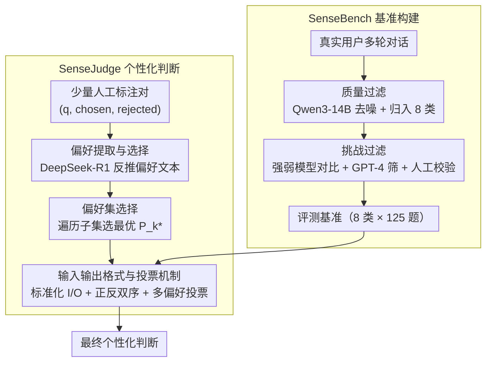

<!-- 由 src/gen_stubs.py 自动生成 -->
# SenseJudge: Human-Centric Preference-Driven Judgment Framework

**会议**: ACL 2026 Findings  
**arXiv**: [2606.03189](https://arxiv.org/abs/2606.03189)  
**代码**: [GitHub](https://github.com/qiongrenpiqida/SenseJudge)  
**领域**: 推荐系统  
**关键词**: LLM评估, 个性化判断, 偏好驱动, 多轮对话, 模型排名

## 一句话总结
提出 SenseJudge，一种基于显式人类偏好的可定制化 LLM 判断框架，配合真实多轮对话基准 SenseBench，在个性化评判任务中平均准确率比基线高 16.08%，模型排名与真实人类排名一致。

## 研究背景与动机
**领域现状**: LLM-as-a-Judge 范式日益流行，用于评估模型响应、生成偏好数据和模型排名。

**现有痛点**: (1) 现有判断方法（PandaLM、Auto-j、奖励模型）依赖固定偏好数据训练，学到的是同质化标准，忽略了用户偏好的多样性；(2) 现有基准（MT-Bench、Auto-j）以单轮或双轮对话为主，与真实多轮人机交互场景脱节；(3) 训练好的奖励模型在面对多样化真实场景时泛化能力有限。

**核心矛盾**: 用户偏好是多样化和场景依赖的（有人重视创意、有人重视格式、有人重视准确性），但现有判断器只学到了一种固定的偏好标准。

**本文目标**: 构建能适应不同用户偏好的可定制化 LLM 判断框架，以及能真实反映人机交互复杂度的评测基准。

**切入角度**: 从少量人工标注中提取显式偏好文本，用多偏好投票机制让小模型也能做出准确的个性化判断。

**核心 idea**: 偏好提取 + 偏好集选择 + 多偏好投票 = 无需训练的个性化 LLM 判断。

## 方法详解

### 整体框架
SenseBench 通过质量过滤+挑战过滤从真实用户对话中构建多轮评测基准。SenseJudge 从少量人工标注对中提取偏好文本，选择最优偏好子集，推理时通过多偏好投票产生最终判断。

### 关键设计
**1. SenseBench 基准构建：用两道过滤把真实多轮对话筛成有区分度的评测集（8 类 × 125 题）**

现有基准多是单轮简单任务，反映不出真实人机交互的多轮上下文依赖。SenseBench 从真实用户对话出发，先做**质量过滤**——用 Qwen3-14B 去噪并归到 8 个类别（数学/逻辑/代码/创意写作/角色扮演/翻译/QA/NLU）；再做**挑战过滤**——拿强模型和弱模型的响应对比，配合 GPT-4 自动筛选与人工校验，把那些强弱模型都答得一样好、区分不出判断器水平的题剔掉。两道过滤下来留下的才是真正能拉开判断器差距的多轮、多领域样本。

**2. 偏好提取与选择：从少量标注里蒸馏出一组显式偏好文本，挑出最优子集再组合投票**

固定偏好训练出来的判断器只会一种同质化标准，而真实用户有人重创意、有人重格式、有人重准确。SenseJudge 不训模型，改走三步：**偏好生成**用 DeepSeek-R1 从每个标注对 $(q, \text{chosen}, \text{rejected})$ 里反推出一句显式偏好文本（如"重视逻辑严谨性""重视回答全面性"）；**偏好集选择**遍历所有偏好子集 $\mathcal{P}_k \subseteq P$，在标注集上用多偏好投票算准确率，留下表现最好的那个子集 $\mathcal{P}_k^*$；**偏好应用**时让 $\mathcal{P}_k^*$ 里每个偏好各自独立判断、最后多数投票。不同偏好捕捉的是标注决策的不同侧面，组合起来比押在单一偏好上更鲁棒，也让小模型靠"好偏好"就能做出准确的个性化判断。

**3. 输入输出格式与投票机制：标准化判断流程，专门压住 LLM-as-Judge 的位置偏差**

判断器有个老毛病——倾向于无脑选第一个或最后一个响应。SenseJudge 把输入固定成 $I = \{q, (r_1, r_2), p\}$、输出 judgment 加 analysis，并且**不给"平局"选项**，强制模型表态区分；同一对响应**正序、反序各评一遍**用来检测位置偏差；再叠加上面的多偏好投票，最终得到稳定判断。双序评估让位置带来的偏好被相互抵消，投票则进一步平滑掉单次判断的抖动，小模型上的一致性提升尤其明显。

## 实验关键数据

### 主实验（LLM-as-a-Personalized-Judge 准确率 %）

| 方法 | Math | Code | Logic | QA | Write | Role | NLU | Trans | Overall |
|------|------|------|-------|-----|-------|------|-----|-------|---------|
| GPT-4o | 66.00 | 61.60 | 65.47 | 72.93 | 60.80 | 63.20 | 65.47 | 56.40 | 63.98 |
| DeepSeek-V3 | 72.80 | 62.27 | 66.67 | 77.07 | 62.67 | 64.40 | 64.80 | 61.87 | 66.57 |
| Skywork-Reward-Gemma2-27B | 70.40 | 61.60 | 66.10 | 74.10 | 64.00 | 60.00 | 62.70 | 58.40 | 64.70 |
| Qwen2.5-14B + **SenseJudge** | **73.45** | **80.90** | **72.44** | **85.67** | **72.89** | **75.24** | **76.80** | **74.21** | **76.88** |
| Qwen2.5-72B + **SenseJudge** | **82.30** | **89.01** | **79.76** | **89.87** | **79.82** | **82.12** | **78.10** | **75.23** | **81.99** |
| Qwen3-14B + **SenseJudge** | **86.53** | **87.96** | **83.69** | **92.24** | **75.27** | **81.04** | **78.72** | **75.78** | **82.65** |

### 一致性与位置偏差

| 模型 | 原始一致性 | +SenseJudge 一致性 |
|------|-----------|------------------|
| Qwen2.5-14B-Instruct | 69.97% | **74.17%** |
| Llama3.1-8B-Instruct | 60.36% | **68.19%** |
| Qwen2.5-72B-Instruct | 78.86% | 78.79% |
| Qwen3-14B-Instruct | 81.23% | 81.30% |

### 关键发现
- SenseJudge 平均比基线提升 +16.08%，即使在 8B/14B 小模型上也超越 GPT-4o 等强模型的直接判断
- 8 个类别全面提升，其中 Code (+20.10) 和 Trans (+18.84) 提升最大
- 奖励模型（INF-ORM-70B、QRM-27B）在个性化数据集上准确率 <65%，说明固定偏好难以泛化
- SenseJudge 显著缓解位置偏差，尤其对小模型效果更好
- 在 RewardBench 上达到 90.55%，接近专门训练的 Skywork-Critic（92.2%），验证通用有效性
- 模型排名结果与 Arena 人类排名一致：DeepSeek-R1 > Claude-3-7-Sonnet > GPT-4o > Qwen2.5-72B > GPT-3.5

## 亮点与洞察
- 偏好提取 + 子集选择 + 投票的三步流程简洁优雅，不需要训练判断模型即可实现个性化
- 从失败中学习的思路——通过少量标注反向推断偏好——比直接训练奖励模型更数据高效
- SenseBench 的构建方法（强弱模型对比 + 人工校验）确保了评测基准的区分度
- 证明了小模型 + 好偏好 > 大模型 + 无偏好，为低成本部署提供了新思路

## 局限与展望
- 偏好构建依赖 DeepSeek-R1 等强模型生成，偏好质量受生成模型能力制约（消融实验证实弱模型生成的偏好效果更差）
- 仅 3 位标注者，标注规模有限（每人 1000 条），更大规模标注可能揭示更丰富的偏好模式
- 偏好子集选择需要遍历组合空间，随偏好集增大计算量指数增长
- 跨域偏好迁移效果参差不齐（数学→逻辑 78.62% vs 数学→翻译 61.83%）

## 相关工作与启发
- Auto-j / PandaLM 等训练式判断器学到固定偏好，SenseJudge 的显式偏好文本更灵活可解释
- 个性化 LLM（OPPU / 多粒度兴趣预测）关注响应个性化，SenseJudge 关注评判个性化——互补方向
- 偏好投票机制可推广到任何需要多视角聚合的评估场景（如代码审查、内容审核）

## 评分
- 新颖性: ⭐⭐⭐⭐ 显式偏好驱动的个性化判断是有意义的新方向
- 实验充分度: ⭐⭐⭐⭐ 多模型对比+一致性/位置偏差分析+消融+跨域+RewardBench 验证
- 写作质量: ⭐⭐⭐ 结构完整但部分公式表述可更简洁
- 价值: ⭐⭐⭐⭐ 实用性强，低成本个性化评判的落地价值高

<!-- RELATED:START -->

## 相关论文

- [\[ACL 2026\] Personalizing LLMs with Binary Feedback: A Preference-Corrected Optimization Framework](personalizing_llms_with_binary_feedback_a_preference-corrected_optimization_fram.md)
- [\[AAAI 2026\] Preference is More Than Comparisons: Rethinking Dueling Bandits with Augmented Human Feedback](../../AAAI2026/recommender/preference_is_more_than_comparisons_rethinking_dueling_bandits_with_augmented_hu.md)
- [\[ACL 2026\] Intent-Driven Semantic ID Generation for Grounded Conversational News Recommendation](intent-driven_semantic_id_generation_for_grounded_conversational_news_recommenda.md)
- [\[ACL 2026\] Quality Over Clicks: Intrinsic Quality-Driven Iterative RL for Cold-Start E-Commerce Query Suggestion](quality_over_clicks_intrinsic_quality-driven_iterative_reinforcement_learning_fo.md)
- [\[ACL 2026\] Decisive: Guiding User Decisions with Optimal Preference Elicitation from Unstructured Documents](decisive_guiding_user_decisions_with_optimal_preference_elicitation_from_unstruc.md)

<!-- RELATED:END -->
