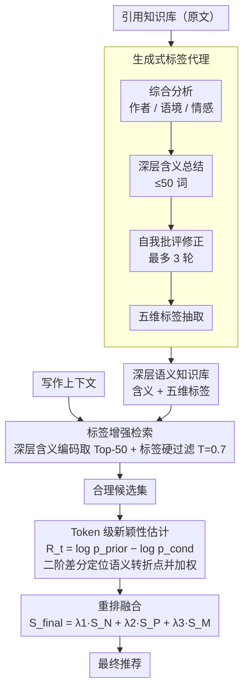

# What Makes an Ideal Quote? Recommending "Unexpected yet Rational" Quotations via Novelty

**会议**: ACL 2026  
**arXiv**: [2602.22220](https://arxiv.org/abs/2602.22220)  
**代码**: 无  
**领域**: 推荐系统 / 自然语言生成  
**关键词**: 引用推荐, 新颖性估计, 陌生化理论, 深层语义检索, 续写偏差

## 一句话总结

NOVELQR 提出了一个新颖性驱动的引用推荐框架，通过生成式标签代理构建深层语义知识库实现语义理性检索，并用 token 级新颖性估计器缓解自回归续写偏差，在双语基准上显著提升推荐质量。

## 研究背景与动机

**领域现状**：引用推荐系统旨在为给定写作上下文推荐合适的名言警句。现有系统（如 QuoteR、QUILL）主要优化语义相关性，通过文本嵌入匹配实现检索。

**现有痛点**：两个关键问题——(1) 现有系统仅关注表面语义匹配而忽略引用的美学价值和新颖性，推荐出"正确但陈旧"的引用（如"失败是成功之母"），而非"意外但合理"的精彩引用（如但丁的"美唤醒灵魂去行动"）；(2) LLM 本身难以在仅给出引用文本的情况下理解其深层含义，且基于 logit 的新颖性指标（如 surprisal）存在自回归续写偏差——常见短语一旦开头被预测就会被"惯性"续写完成，导致新颖性估计失真。

**核心矛盾**：理想的引用应该是"出人意料却合情合理"的——读者初见可能困惑，但联系上下文后豁然开朗。现有系统在"合理性"上做得不错，但完全忽略了"出人意料"这个维度。

**本文目标**：(1) 在深层语义空间中检索以确保引用的合理性；(2) 在不引入续写偏差的前提下估计引用的新颖性。

**切入角度**：基于陌生化理论（"艺术旨在使熟悉变陌生"）和大规模用户调研（964 人问卷 + 控制实验），确认用户确实偏好"意外但合理"的引用。在此基础上，用标签增强弥补 LLM 的引用理解缺陷，用 token 级新颖性聚焦"新颖 token"缓解续写偏差。

**核心 idea**：先用标签代理将引用映射到深层语义空间确保"合理"，再用 token 级新颖性重排确保"出人意料"，两步协作实现"unexpected yet rational"。

## 方法详解

### 整体框架

NOVELQR 想推荐"出人意料却合情合理"的引用，把这个目标拆成"先保证合理、再保证意外"两段串行的流程。给定一段写作上下文，系统先用一个生成式标签代理把引用知识库里的每条引用从表面文本"翻译"成深层语义解释和多维标签，再在这个深层语义空间里检索出语义合理的候选集，最后用一个 token 级新颖性估计器对候选重排，结合流行度和语义匹配信号产出最终推荐。

### 关键设计

**1. 生成式标签代理：把引用从表面文本翻译成可检索的深层语义**

LLM 在只看到一句引用原文时，往往读不懂它真正想说什么——实验里 GPT-4o 即便在 EASY 子集上的理解分也低于高质量阈值，意味着直接拿原文去做语义匹配会推荐出"字面相关但理解错位"的引用。标签代理（基于 Qwen3-8B）用四步把这件事补上：先结合作者背景、历史文化语境、情感内涵做综合分析；再提炼出不超过 50 词的深层含义总结（"表达了……"）；接着做最多 3 轮自我批评修正，专门检查浅薄化、过度解读和逻辑漏洞，约 4.6% 的输出会因此被拒绝重写；最后抽取核心领域、洞察、价值观、适用对象、情感基调五个维度的结构化标签。补上辅助信息后理解分在 HARD 子集上回升到接近 9.0，这套"分析→生成→修正→提取"流程因此成了后续检索的语义地基。

**2. 标签增强检索：在深层含义空间里检索，而不是在原文表面**

如果直接对引用原文做嵌入检索，只能抓到表面词汇相关性，这正是旧系统推荐"正确但陈旧"引用的根源。NOVELQR 改为对上一步生成的深层含义（而非原始文本）编码，用嵌入相似度取 Top-N（$N=50$）候选，再用"核心领域 / 价值 / 洞察"三个维度的标签相似度做一道硬过滤（阈值 $T=0.7$），把语义上不合理的候选直接剔除。这相当于模拟人"先读懂语境、再挑引用"的思路；人工验证显示生成标签的失真率低于 3%，过滤因此是可靠的。

**3. Token 级新颖性估计：用语义转折点定位"新颖 token"，绕开续写偏差**

光有合理还不够，还要量化"意外"。最直接的做法是用 surprisal 或 KL 散度，但它们在 token / 引用层面聚合时会被续写偏差严重扭曲——"天才是百分之一的灵感……"开头很难预测、看起来很新颖，可"百分之九十九的汗水"几乎是必然续写，却被一并算进高新颖度，导致估计失真。NOVELQR 先把 token 级新颖度定义为无上下文与有上下文 logit 之差 $R_t = \log p_{\text{prior}}(x_t) - \log p_{\text{cond}}(x_t)$，关键创新是识别真正的"新颖 token"：对自困惑度序列取二阶差分 $|\delta_2(t)|$ 找突变点（标志引用内部出现语义转折），给这些点高权重，而把平稳续写段（续写偏差的主要来源）降权。最终新颖性分数 $S_N = \sum_t \tilde{w}_t R_t$，其中 $\tilde{w}_t$ 由归一化的突变权重决定，只让真正"拐弯"的地方贡献新颖度。

### 一个完整示例

以一段需要配引用的写作上下文为例：标签代理先把知识库里的每条引用解析成深层含义和五维标签；检索阶段在深层含义空间里取回 50 条语义相近的候选，再用领域/价值/洞察标签相似度（阈值 0.7）硬过滤掉理解错位的，把候选收缩成一个"都说得通"的小集合；重排阶段对每条候选算 token 级新颖性——逐 token 算 $R_t$，用二阶差分挑出语义转折点加权，得到 $S_N$，再融合流行度 $S_P$ 和深层含义相似度 $S_M$。于是像"失败是成功之母"这类语义匹配但毫无意外的引用 $S_N$ 偏低被压到后面，而但丁"美唤醒灵魂去行动"这类既合理又意外的会被推到前列。

### 损失函数 / 训练策略

最终重排分数 $S_{\text{final}} = \lambda_1 \cdot S_N + \lambda_2 \cdot S_P + \lambda_3 \cdot S_M$，其中 $S_N$ 是新颖性、$S_P$ 是基于 Bing 搜索频率的流行度信号（避免推荐过于冷门的引用）、$S_M$ 是深层含义的余弦相似度。权重 $\lambda_1=0.70, \lambda_2=0.20, \lambda_3=0.10$。

## 实验关键数据

### 主实验

**引用推荐质量对比（NOVELQR-BENCH）**

| 方法 | Novelty | Match | HR@5 | nDCG@5 |
|------|---------|-------|------|--------|
| QR + 无重排 | 3.14 | 3.99 | 0.35 | 0.26 |
| QUILL | 3.08 | 4.15 | 0.15 | 0.12 |
| LR + 无重排 | 3.40 | **4.55** | 0.55 | 0.44 |
| LR + GPT 重排 | 3.75 | 4.50 | 0.66 | 0.47 |
| **LR + Ours** | **3.81** | 4.50 | **0.70** | **0.51** |

### 消融实验

| 配置 | Novelty | Match | HR@5 | 说明 |
|------|---------|-------|------|------|
| Self-BLEU | 3.55 | 4.48 | 0.50 | 词汇级新颖性不够 |
| Surprisal | 3.66 | 4.31 | 0.55 | 有续写偏差 |
| + Novelty-token | **3.73** | **4.39** | **0.62** | 缓解续写偏差有效 |

### 关键发现

- 从 QR 切换到 LR（标签增强检索），Match 从 3.99 大幅提升到 4.55，验证了深层语义检索的优势
- 新颖 token 机制使 Surprisal 的 HR@5 从 0.55 提升到 0.62，直接验证了续写偏差缓解的效果
- 人类多选研究中 78% 的选择偏好 NOVELQR 系统的推荐
- 流行度信号的移除导致一致性下降，说明其作为"避免过于冷门"的正则化器是必要的

## 亮点与洞察

- 用陌生化理论 + 大规模用户调研来证明"用户确实想要新颖引用"，将主观审美需求变成可操作化的工程目标，方法论上很有说服力
- 续写偏差的发现和 token 级缓解策略非常巧妙——通过自困惑度的二阶差分识别"语义转折点"，这个信号可以迁移到任何需要估计文本新颖性的场景
- 标签代理的四步处理流程（分析→生成→修正→提取）为"LLM 理解困难文本"提供了通用范式

## 局限与展望

- 标签代理依赖辅助信息（作者、出处），对于匿名或来源不明的引用效果可能下降
- 新颖性定义偏向"语义意外性"，未考虑修辞手法（如反讽、双关）带来的审美效果
- 流行度信号依赖搜索引擎，跨语言和文化的可移植性有待验证
- 测试集每个数据集仅 100 条，规模较小

## 相关工作与启发

- **vs QuoteR/QUILL**: 这些系统优化语义相关性，NOVELQR 额外优化新颖性
- **vs Surprisal/KL-divergence**: 这些标准新颖性指标被续写偏差扭曲，NOVELQR 的 token 级方法显式缓解此问题

## 评分

- 新颖性: ⭐⭐⭐⭐⭐ 从理论（陌生化）到用户研究到技术实现形成完整闭环，续写偏差的发现有独立学术贡献
- 实验充分度: ⭐⭐⭐⭐ 覆盖双语多领域，有人类评估，但测试集规模较小
- 写作质量: ⭐⭐⭐⭐⭐ 问题定义精彩（"unexpected yet rational"），叙事流畅
- 价值: ⭐⭐⭐⭐ 对引用推荐领域有重要贡献，续写偏差发现可迁移到更广泛场景

<!-- RELATED:START -->

## 相关论文

- [\[ACL 2026\] What Makes LLMs Effective Sequential Recommenders? A Study on Preference Intensity and Temporal Context](what_makes_llms_effective_sequential_recommenders_a_study_on_preference_intensit.md)
- [\[ACL 2026\] Where and What: Reasoning Dynamic and Implicit Preferences in Situated Conversational Recommendation](where_and_what_reasoning_dynamic_and_implicit_preferences_in_situated_conversati.md)
- [\[ACL 2025\] CoVE: Compressed Vocabulary Expansion Makes Better LLM-based Recommender Systems](../../ACL2025/recommender/cove_compressed_vocabulary_expansion_makes_better_llm-based_recommender_systems.md)
- [\[NeurIPS 2025\] Measuring What Matters: Construct Validity in Large Language Model Benchmarks](../../NeurIPS2025/recommender/measuring_what_matters_construct_validity_in_large_language_model_benchmarks.md)
- [\[ACL 2026\] Mirroring Users: Towards Building Preference-aligned User Simulator with User Feedback in Recommendation](mirroring_users_towards_building_preference-aligned_user_simulator_with_user_fee.md)

<!-- RELATED:END -->
