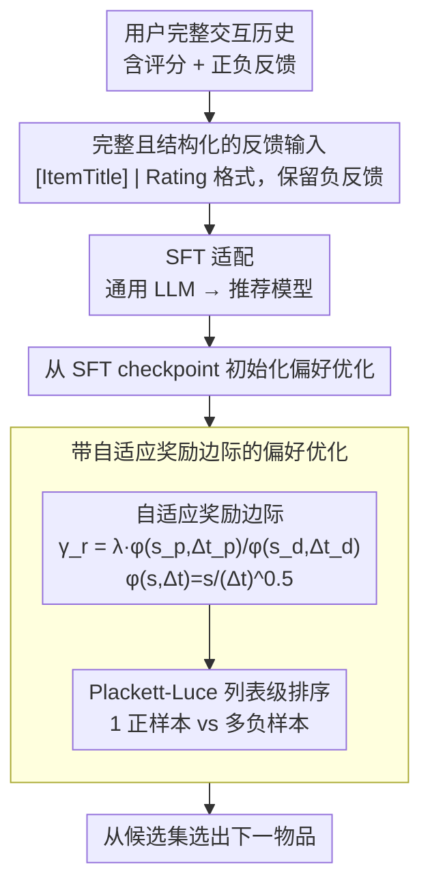

# What Makes LLMs Effective Sequential Recommenders? A Study on Preference Intensity and Temporal Context

**会议**: ACL 2026  
**arXiv**: [2506.02261](https://arxiv.org/abs/2506.02261)  
**代码**: [https://github.com/zyouyang/RecPO](https://github.com/zyouyang/RecPO)  
**领域**: 推荐系统  
**关键词**: 序列推荐, 偏好对齐, 偏好强度, 时间上下文, DPO

## 一句话总结

本文揭示现有 LLM 推荐系统的二元偏好建模丢失了偏好强度和时间上下文两个关键信息，提出 RecPO 框架通过自适应奖励边际将这两个因素纳入偏好优化，在五个数据集上显著超越 S-DPO 等基线。

## 研究背景与动机

**领域现状**：大语言模型正被广泛用于序列推荐任务，通过文本化的交互历史来预测用户下一个可能交互的物品。当前主流方法采用 DPO/S-DPO 等偏好对齐技术进行训练。

**现有痛点**：现有偏好对齐方法（DPO、S-DPO）将所有偏好统一为二元成对比较——只区分"喜欢"和"不喜欢"，丢弃了大量有价值的信息。实际用户行为中，评分从1到5存在结构化的偏好强度差异（强烈喜欢 vs 轻微喜欢），且越近期的交互越能反映用户当前意图。

**核心矛盾**：二元偏好建模与人类决策行为之间的根本错配——人类展现出结构化偏好（不同强度）和时间敏感偏好（近期交互更重要），这些在现有方法中被完全忽略。

**本文目标**：(1) 系统验证偏好强度和时间上下文对 LLM 推荐的重要性；(2) 设计能利用这两个因素的偏好优化框架。

**切入角度**：从行为经济学和认知科学中人类决策的已知特征出发，通过受控实验证明保留负反馈 + 结构化评分能大幅提升推荐效果，从而为方法设计提供实证基础。

**核心 idea**：通过自适应奖励边际（adaptive reward margin）将偏好强度和交互时间远近编码进 DPO 目标函数，让模型学到更符合人类决策模式的偏好表征。

## 方法详解

### 整体框架

RecPO 走两阶段训练：先用 SFT 把通用 LLM 适配成推荐模型，再用一个带"自适应奖励边际"的偏好优化进一步对齐。输入是用户完整交互历史（含正负反馈和评分），输出是从候选集里选出的下一个物品。和 S-DPO 最大的区别是，RecPO 不再丢弃负面交互，而是保留完整序列，并把评分当成结构化的偏好强度信号喂进训练目标。

### 关键设计

**1. 完整且结构化的反馈输入：把被 S-DPO 丢掉的强度信息找回来**

S-DPO 把所有偏好压成二元成对比较，只分"喜欢/不喜欢"，把评分高低和负反馈一并扔了。RecPO 反过来保留用户的完整交互序列，每个历史物品都带上偏好信号，格式为 `[ItemTitle] | Rating: [ItemRating]`；没有显式评分的数据集就用游戏时长、播放次数等当代理分。之所以两者都要保留，是因为 proof-of-concept 实验显示：只有同时保留完整反馈和结构化评分时推荐才最优，单独保留负面交互却不给评分反而会引入噪声、拉低性能——强度和负反馈缺一不可。

**2. 自适应奖励边际：让"5分 vs 1分"和"4分 vs 3分"得到不同的优化力度**

统一的边际无法区分偏好对比的本质差异，也没法体现"越近期的交互越重要"。RecPO 对每个偏好对 $(y_p, y_d)$ 定义边际 $\gamma_r = \lambda \cdot \phi(s_p, \Delta t_p) / \phi(s_d, \Delta t_d)$，其中效用函数 $\phi(s, \Delta t) = s / (\Delta t)^{0.5}$，$s$ 是偏好分数、$\Delta t$ 是与当前决策点的时间距离。偏好差异越大、交互越近，边际越大、优化信号越强；写成比值形式还能在用户评分波动性低的场景下放大训练梯度，把强弱偏好的差距显式编码进 DPO 目标。

**3. Plackett-Luce 列表级排序推广：从单负样本扩到多负样本**

单个负样本难以覆盖用户完整的"不喜欢"空间。RecPO 用 PL 模型把自适应边际嵌进列表级偏好分布，让每个正样本同时和多个负样本配对，学到它们之间的相对排序关系。这套推广是 S-DPO 的自然超集——当 $\lambda=0$ 时边际失效、退化回标准 S-DPO，保证了方法的一般性。

### 损失函数 / 训练策略

最终损失在 S-DPO 基础上加入自适应边际项 $\gamma_r$，通过 $\lambda$ 控制边际影响力度（默认 $\lambda=2$）。训练先 SFT 后偏好对齐，偏好对齐从 SFT checkpoint 初始化；对负采样和没有显式反馈的历史交互，分配默认偏好分数和时间延迟。

## 实验关键数据

### 主实验

| 数据集 | 指标 | RecPO (LLaMA3-8B) | S-DPO | 提升 |
|--------|------|------|----------|------|
| MovieLens | HR@1 | 0.3451 | 0.2902 | +18.9% |
| Amazon-Books | HR@1 | 0.5802 | 0.5065 | +14.6% |
| BeerAdvocate | HR@1 | 0.5771 | 0.4698 | +22.8% |
| Steam | HR@1 | 0.4672 | 0.3588 | +30.2% |
| LastFM | HR@1 | 0.6830 | 0.5719 | +19.4% |

RecPO 在 Qwen-7B 上同样显著优于所有基线，HR@1 提升幅度在 10%-30% 之间。

### 消融实验

| 配置 | MovieLens | Amazon-Books | BeerAdvocate | Steam | LastFM |
|------|---------|------|------|------|------|
| –I –T (=S-DPO) | 0.2902 | 0.5065 | 0.4698 | 0.3588 | 0.5719 |
| –T (仅偏好强度) | 0.3343 | 0.5661 | 0.6143 | 0.4202 | 0.6544 |
| RecPO (完整) | 0.3451 | 0.5802 | 0.5771 | 0.4672 | 0.6830 |

### 关键发现

- **偏好强度贡献最大**：仅加入偏好强度（–T）就能带来显著提升，说明结构化偏好信号是最关键的因素。
- **时间上下文提供互补增益**：在偏好强度基础上再加入时间上下文，4/5 个数据集进一步提升（Steam 提升最大，从 0.4202 到 0.4672）。
- **边际函数形式**：比值形式（默认）优于 Log Diff 和 Log Ratio 两种替代形式。
- **人类对齐行为**：RecPO 学到了四种人类决策模式——即时满足优先、抵抗诱惑、隐式厌恶建模、跨上下文长度稳健（HR@1 方差 8.7% vs S-DPO 的 17.8%）。

## 亮点与洞察

- **实证先行的方法论**：先通过受控实验证明偏好强度和时间上下文的重要性，再据此设计方法，这种假设驱动的研究范式值得借鉴。
- **简洁有效的边际设计**：$\phi(s, \Delta t) = s / (\Delta t)^{0.5}$ 形式非常简洁，通过一个超参数 $\lambda$ 就能控制影响，易于复现。
- **隐式厌恶建模的涌现**：在没有显式厌恶标签的情况下学到了识别用户最不喜欢物品的能力，说明结构化偏好信号能隐式编码负面偏好。

## 局限与展望

- 仅考虑了简化的序列偏好结构和满足延迟作为上下文因素，现实中人类决策涉及更复杂的偏好层级。
- 对隐式反馈数据集的提升相对较小，代理信号的同质性限制了优势发挥。
- 未来可探索认知合理的偏好建模在推荐之外的偏好任务中的应用。

## 相关工作与启发

- **vs S-DPO**: S-DPO 用多负样本列表级优化但使用统一边际。RecPO 是 S-DPO 的自然扩展（$\lambda=0$ 退化为 S-DPO），通过自适应边际引入偏好强度和时间信息。
- **vs SimPO**: SimPO 用固定边际和长度正则化，但固定边际无法捕捉不同偏好对的差异，且 Valid Ratio 较低影响部署。

## 评分

- 新颖性: ⭐⭐⭐⭐ 从认知科学角度切入推荐系统偏好对齐很有启发性
- 实验充分度: ⭐⭐⭐⭐⭐ 五个数据集、两个 backbone、多种消融和行为分析非常全面
- 写作质量: ⭐⭐⭐⭐⭐ 实证先行的叙事结构清晰
- 价值: ⭐⭐⭐⭐ 为 LLM 推荐系统的偏好对齐提供了实用改进方向

<!-- RELATED:START -->

## 相关论文

- [\[ACL 2026\] What Makes an Ideal Quote? Recommending "Unexpected yet Rational" Quotations via Novelty](what_makes_an_ideal_quote_recommending_34unexpected_yet_rational34_quotations_vi.md)
- [\[ACL 2026\] Personalizing LLMs with Binary Feedback: A Preference-Corrected Optimization Framework](personalizing_llms_with_binary_feedback_a_preference-corrected_optimization_fram.md)
- [\[ACL 2026\] Where and What: Reasoning Dynamic and Implicit Preferences in Situated Conversational Recommendation](where_and_what_reasoning_dynamic_and_implicit_preferences_in_situated_conversati.md)
- [\[ACL 2026\] Bridging Language and Items for Retrieval and Recommendation: Benchmarking LLMs as Semantic Encoders](bridging_language_and_items_for_retrieval_and_recommendation_benchmarking_llms_a.md)
- [\[ACL 2026\] Mirroring Users: Towards Building Preference-aligned User Simulator with User Feedback in Recommendation](mirroring_users_towards_building_preference-aligned_user_simulator_with_user_fee.md)

<!-- RELATED:END -->
