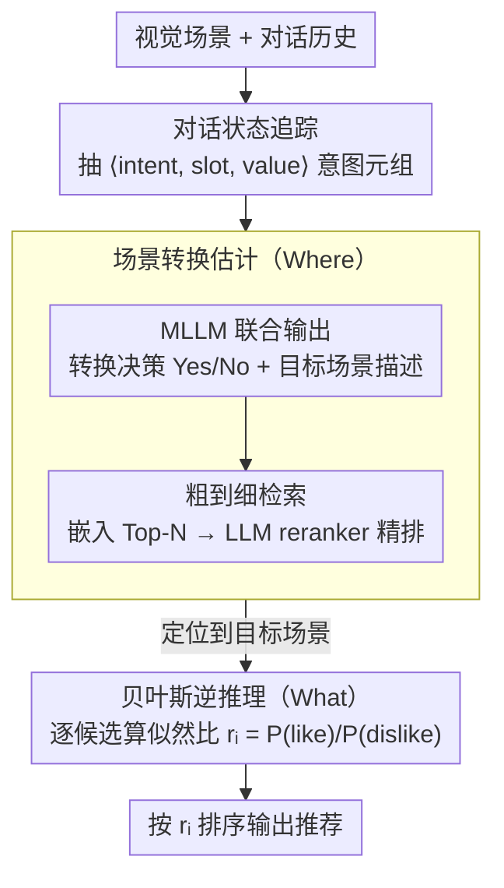

# Where and What: Reasoning Dynamic and Implicit Preferences in Situated Conversational Recommendation

**会议**: ACL 2026  
**arXiv**: [2604.20749](https://arxiv.org/abs/2604.20749)  
**代码**: [https://github.com/DongdingLin/SiPeR](https://github.com/DongdingLin/SiPeR)  
**领域**: 推荐系统 / 对话推荐  
**关键词**: 情景对话推荐, 场景转换, 贝叶斯逆推理, 隐式偏好, 多模态

## 一句话总结

SiPeR 通过场景转换估计（"Where"）和贝叶斯逆推理（"What"）两个机制，解决情景对话推荐中用户偏好随环境动态变化且常常隐式表达的挑战，在 SIMMC 2.1 和 SCREEN 上分别提升 10.9% 和 10.6%。

## 研究背景与动机

**领域现状**：对话推荐系统通过自然语言交互提供推荐，但大多只关注文本交互，忽略视觉信息和环境因素。情景对话推荐（SCR）利用视觉场景和对话来提供上下文相关的推荐，更贴近真实购物场景。

**现有痛点**：SCR 面临两个独特挑战——(1) 用户偏好是动态的，随场景变化而变化：当用户在正装区表达对"户外徒步"的兴趣时，系统需要主动引导到户外区，但现有工作忽略了场景转换决策；(2) 用户偏好常常是隐式的：用户说"尺寸对"但要求看其他选项，说明推荐的蓝色牛仔裤不符合真实偏好，系统需推理出用户真正想要灰色裤子。

**核心矛盾**：SCR 需要同时解决"Where"（在哪个场景推荐）和"What"（推荐什么物品）两个决策，但现有研究主要聚焦数据集构建而非框架设计。

**本文目标**：(1) 设计场景转换估计机制判断何时/向何处转换场景；(2) 用贝叶斯逆推理从对话中推断用户的真实隐式偏好。

**切入角度**：将用户视为理性行动者（受贝叶斯逆规划启发），其话语是为实现潜在目标而执行的"行动"，通过对比"喜欢"和"不喜欢"两种假设的似然比来推理偏好。

**核心 idea**：场景转换用"生成-检索"策略（先生成目标场景描述再检索匹配场景），物品偏好用贝叶斯逆推理（将用户话语视为潜在目标的观测信号）。

## 方法详解

### 整体框架

SiPeR 把情景对话推荐拆成"Where"和"What"两个决策串起来。给定视觉场景和对话历史，系统先用对话状态追踪把自然语言对话压成结构化意图元组，给后续概率推理一个干净的输入；再用场景转换估计（STE）判断要不要换场景、换到哪个场景，把用户引导到正确的"货架"前；最后用贝叶斯逆推理（BI-INF）从对话里反推用户真正想要的物品，在当前场景的候选里排序。

### 关键设计

**1. 对话状态追踪：把对话压成结构化意图，给概率推理一个干净输入**

在自然语言空间里直接做贝叶斯推理太不可控，需要先收敛成结构化表示。这一步直接指示一个强 LLM 从对话历史中抽取 ⟨intent, slot, value⟩ 元组，人工验证准确率达 98.8%。有了这组结构化意图，后续的场景转换判断和似然计算就不必在开放文本上展开，推理空间更可控——它是"Where"和"What"两个机制共享的输入预处理。

**2. 场景转换估计（STE）：决定何时换场景、换到哪个场景**

用户的兴趣会随场景漂移——在正装区聊起"户外徒步"，系统就该主动把人带到户外区，而以往工作干脆忽略了这个转换决策。直接在大规模候选场景上做语义推理又算不动，STE 因此用"生成-检索"三步分解：先用 MLLM 把每个候选场景转成文本描述（situated profile）；再给定对话历史和当前场景，让 MLLM 联合输出转换决策（Yes/No）和目标场景的文字描述，转换概率由 Yes/No token 的 logit 归一化得到；最后做粗到细检索——先用嵌入相似度取 Top-N 候选，再用训练好的 LLM reranker 精排。生成目标描述再去检索，把"在哪推荐"的语义推理和计算开销解耦开。

**3. 贝叶斯逆推理（BI-INF）：把用户话语当成行动，反推隐式偏好**

用户常常不直说真实偏好——嘴上说"尺寸对"却要求看别的，其实是在否定眼前这条蓝牛仔裤、想要灰色的，LLM 很难从表层对话里分辨这种细微信号。BI-INF 借贝叶斯逆规划，把用户形式化成 POMDP 里的理性代理，话语是为达成潜在目标而执行的"行动"。对每个候选物品 $m_i$，它比较两种假设的似然比 $r_i = \mathbb{P}(\text{like} \mid \text{dialogue}) / \mathbb{P}(\text{dislike} \mid \text{dialogue})$：用微调过的 MLLM 分别在"用户想要该物品"和"用户不想要该物品"两个假设下，计算生成观察到的对话状态的概率。似然比高的物品才是用户真正想要的，比直接让模型启发式判断"喜不喜欢"更严谨。

### 一个完整示例

设想用户站在正装区，对话里提到想找"户外徒步"相关的东西：对话状态追踪先把这句话抽成 ⟨intent=browse, slot=scene, value=outdoor⟩ 之类的意图元组；STE 据此判断当前正装场景不匹配，生成目标场景描述"户外/徒步装备区"，再粗到细检索出最匹配的户外场景并完成转换——这是"Where"。到了户外区，用户说"尺寸对，但想看其他选项"，BI-INF 把这句当成行动，对每个候选物品算似然比 $r_i$：眼前那条蓝裤子在"想要"假设下生成该对话状态的概率低、似然比小被压后，而符合用户隐含意图的灰裤子似然比高被排到前面——这是"What"。两个机制接力，完成"在正确场景里推荐正确物品"。

### 损失函数 / 训练策略

Reranker 用负对数似然优化。MLLM 微调用于对话状态生成和似然计算。

## 实验关键数据

### 主实验

| 方法 | SIMMC 2.1 R@1 | SCREEN R@1 |
|------|--------------|------------|
| GPT-4o (CoT) | 28.12 | 33.45 |
| Qwen2.5-VL (CoT) | 16.72 | 21.05 |
| **SiPeR** | **~39** | **~44** |

### 消融实验

| 配置 | 关键指标 | 说明 |
|------|---------|------|
| SiPeR 完整 | 最优 | STE + BI-INF |
| 移除 STE | 下降 | 无法处理场景转换 |
| 移除 BI-INF | 下降 | 无法推断隐式偏好 |
| 用 CoT 替代 BI-INF | 显著下降 | 验证概率推理优于启发式推理 |

### 关键发现

- SiPeR 在 SIMMC 2.1 和 SCREEN 上分别比最佳基线平均提升 10.9% 和 10.6%
- 贝叶斯逆推理的似然比方法显著优于简单的 CoT 推理，验证了概率框架在隐式偏好推理上的优势
- 场景转换估计对动态场景变化的推荐至关重要——没有 STE，系统无法在正确的场景中推荐

## 亮点与洞察

- 将认知科学中的贝叶斯逆规划应用于对话推荐，将用户话语视为"行动"而非"陈述"，这是一个优雅的理论框架
- "Where + What"的问题分解清晰地对应了 SCR 的两个核心挑战
- 生成-检索的场景转换策略巧妙地平衡了语义推理能力和计算效率

## 局限与展望

- 实验仅在模拟数据集上验证，真实电商场景的复杂度更高
- 贝叶斯推理假设用户是"理性代理"，但真实用户行为可能非理性
- 对话状态追踪依赖强 LLM，低资源场景下可能不适用

## 相关工作与启发

- **vs 传统 CRS**: 传统系统只处理文本，SiPeR 处理视觉场景 + 文本对话
- **vs BIP/Theory of Mind**: SiPeR 将计算认知科学的贝叶斯逆规划引入推荐系统

## 评分

- 新颖性: ⭐⭐⭐⭐⭐ 贝叶斯逆推理在 SCR 中的应用和 Where+What 的问题分解非常新颖
- 实验充分度: ⭐⭐⭐⭐ 两个基准、多基线对比、消融完整，但缺少真实场景验证
- 写作质量: ⭐⭐⭐⭐ 动机和方法阐述清晰
- 价值: ⭐⭐⭐⭐ 为情景对话推荐提供了首个系统性框架

<!-- RELATED:START -->

## 相关论文

- [\[ACL 2026\] HARPO: Hierarchical Agentic Reasoning for User-Aligned Conversational Recommendation](harpo_hierarchical_agentic_reasoning_for_user-aligned_conversational_recommendat.md)
- [\[ACL 2026\] ReRec: Reasoning-Augmented LLM-based Recommendation Assistant via Reinforcement Fine-tuning](rerec_reasoning-augmented_llm-based_recommendation_assistant_via_reinforcement_f.md)
- [\[ACL 2026\] Intent-Driven Semantic ID Generation for Grounded Conversational News Recommendation](intent-driven_semantic_id_generation_for_grounded_conversational_news_recommenda.md)
- [\[ACL 2026\] What Makes an Ideal Quote? Recommending "Unexpected yet Rational" Quotations via Novelty](what_makes_an_ideal_quote_recommending_34unexpected_yet_rational34_quotations_vi.md)
- [\[ACL 2026\] What Makes LLMs Effective Sequential Recommenders? A Study on Preference Intensity and Temporal Context](what_makes_llms_effective_sequential_recommenders_a_study_on_preference_intensit.md)

<!-- RELATED:END -->
