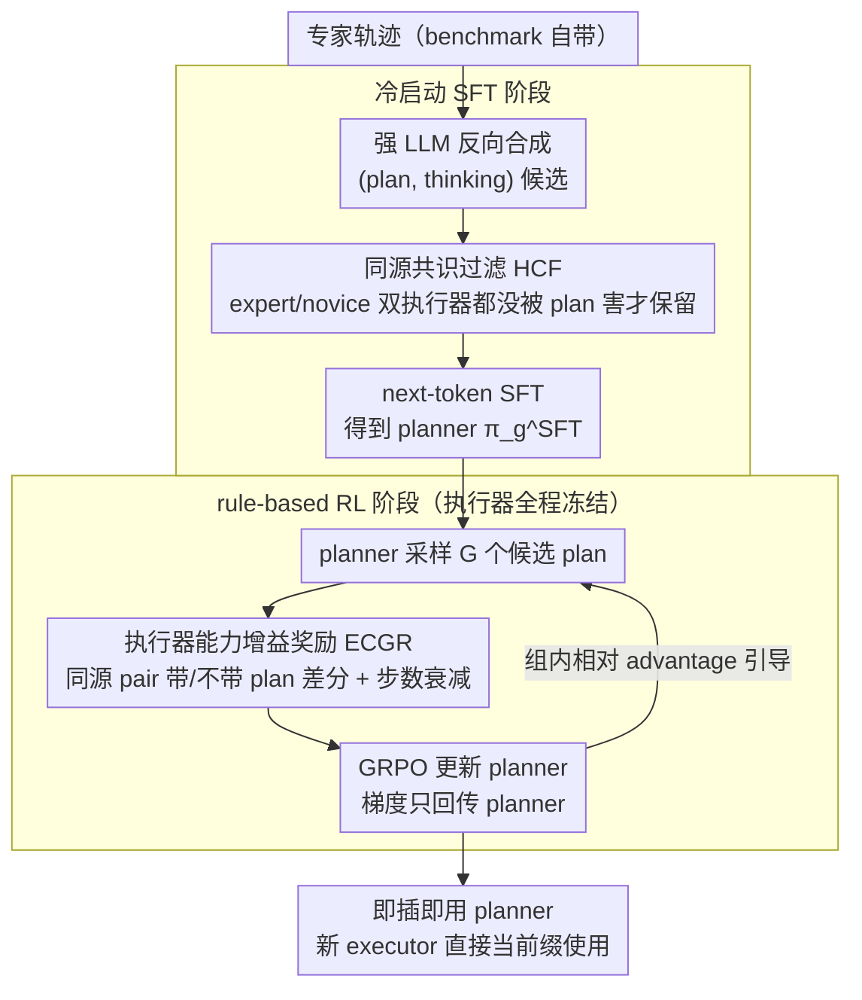

# A Goal Without a Plan Is Just a Wish: Efficient and Effective Global Planner Training for Long-Horizon Agent Tasks (EAGLET)

**会议**: ACL 2026  
**arXiv**: [2510.05608](https://arxiv.org/abs/2510.05608)  
**代码**: 论文未在 abstract 中给出公开链接  
**领域**: 强化学习 / LLM Agent  
**关键词**: plan-and-execute, GRPO, 全局规划器, 长程任务, executor capability gain reward

## 一句话总结
EAGLET 把长程 agent 任务拆成「全局 planner + 局部 executor」两个模块，通过「同源共识过滤合成 SFT 冷启动 + 用执行器能力增益作奖励的 GRPO 微调」两步训练出一个即插即用的 planner，三个长程任务上刷新 SOTA 且训练成本仅为 RL baseline 的 1/8。

## 研究背景与动机
**领域现状**：LLM agent 在长程任务（多轮交互、动态环境，如 ScienceWorld、ALFWorld、WebShop）上目前主要两条路：implicit planning（ReAct 系列 + SFT/RL，规划隐藏在每步推理里）和 explicit planning（KnowAgent 构知识库、MPO 训一个 planner）。

**现有痛点**：implicit 方法把 agent 当 executor，仅靠局部 reason-action 交错做规划，长程任务里 brainless trial-and-error 和 planning hallucination 频发；SFT 要大量专家轨迹（data-inefficient），RL 因奖励稀疏延迟、回合长，训练超慢且不稳。explicit 方法虽然有显式 plan，但需要大量人工去验证/修改采集的 plan 数据，跨环境迁移成本高。

**核心矛盾**：planner 训练既要质量（plan 要真能引导 executor 完成任务，不能是「漂亮但没用的废话」）又要效率（不能让人去逐条标 plan），还要泛化（同一个 planner 要能驱动不同能力的 executor）。三者之间一直存在 trade-off。

**本文目标**：(1) 自动合成高质量全局 plan 数据，无需人工；(2) 设计能跨执行器泛化的 RL 奖励信号；(3) 让训出的 planner 即插即用，能被任意新 executor 直接使用。

**切入角度**：作者观察到「先用强 LLM（GPT-5、DeepSeek-V3.1-Think）从已有专家轨迹反向写 plan + thinking」可以无成本合成数据，再用「同源 executor 双重验证」做过滤——既能去噪，又能避免 plan 质量被特定 executor 的能力偏差污染。

**核心 idea**：用「同源 expert/novice executor pair」既做数据过滤（HCF），也做 RL 奖励（ECGR），把「plan 是否真正提升 executor」直接量化为奖励，再用 GRPO 优化 planner，做到「训得快、训得好、跨执行器都好用」。

## 方法详解

### 整体框架
EAGLET 把 agent 任务 $\pi_\theta(e \mid u) = \prod_t \pi_\theta(a_t \mid u, a_{<t}, o_{<t})$ 改写成 plan-conditioned 版：$\pi_\theta(e \mid u, p) = \pi_g(p \mid u) \cdot \prod_t \pi_\theta(a_t \mid u, p, a_{<t}, o_{<t})$，引入可训练全局 planner $\pi_g$。Pipeline 两阶段：

1. **冷启动 SFT**：用强 reasoning LLM 从专家轨迹反向合成 (plan, thinking)，经 HCF 过滤后做 next-token SFT，得到 $\pi_g^\text{SFT}$。
2. **rule-based RL**：用 GRPO 优化 $\pi_g^\text{SFT}$，奖励信号是 ECGR（执行器能力增益）+ 格式奖励。执行器全程 frozen，只回传梯度到 planner。

推理时新 executor 只需把 $\pi_g$ 生成的 plan 跟 task instruction 一起作为前缀，无需任何 executor 训练。

### 关键设计

**1. Homologous Consensus Filtering (HCF)：用同源执行器共识过滤合成 plan，把人工标注换掉**

强 LLM 反向写出的 plan 良莠不齐，有些看着漂亮、实际把 executor 带偏，SFT 阶段若不过滤就会被这些噪声污染，而逐条人工验证又太贵。HCF 的做法是给每条候选 plan $p$ 配一对**同源**执行器——expert $\hat\pi_\theta$（如 GiGPO-Llama-3.1）和 novice $\hat\pi_\tau$（原始 Llama-3.1），二者共享 pre-train 与架构、只在 post-training 后能力分化。两个执行器各跑两次（带 plan / 不带 plan），只有当 $r(u, e_{p; \hat\pi_\theta}) \geq r(u, e_{\hat\pi_\theta})$ **且** $r(u, e_{p; \hat\pi_\tau}) \geq r(u, e_{\hat\pi_\tau})$ 时才保留，即 $F_\text{quality}(p) = \mathbb{I}\{\text{两 executor 都没被 plan 害}\}$。

之所以要同源 pair 而非单一执行器，是因为单执行器评估会被它自身能力带偏：强 executor 即使拿到烂 plan 也能完成任务，从而错把烂 plan 判成好。共享 base model 排除了上下文窗口、参数量等无关混淆，让过滤信号纯粹反映「plan 对执行的边际贡献」。

**2. Executor Capability Gain Reward (ECGR)：把「plan 的净增益」直接量化成 RL 奖励**

单纯用任务完成率当奖励，既分不清「plan 到底帮了多少」，又容易被 executor 强弱带偏。ECGR 改成差分信号：对每个 (task, plan) 让同源 pair $\hat\pi_\theta, \hat\pi_\tau$ 各跑带/不带 plan 两次，基础奖励 $R(p, \pi_\theta) = \mathbb{I}\{r(u, e_{p; \pi_\theta}) > r(u, e_{\pi_\theta})\}$ 只在 plan 真正带来提升时给分。再乘上交互步数衰减因子 $\hat R = R \cdot (1+\alpha)^{n-m}$（$n$ 为无 plan 步数、$m$ 为有 plan 步数、$\alpha$ 为超参），让「plan 让执行更短」也能拿到额外奖励。最终把两个执行器的分相加并补上格式奖励：$R_\text{ECGR} = \hat R(p, \hat\pi_\theta) + \hat R(p, \hat\pi_\tau)$，$R_\text{Final} = R_\text{ECGR} + R_\text{Format}$。

「差分 + 双执行器」把奖励牢牢锁在 plan 的净贡献上，自然压住了「漂亮但没用的 plan」；衰减因子则隐式逼 planner 让 executor 少走弯路，正面对抗长程任务里的 brainless trial-and-error。

**3. GRPO with frozen executors：只把梯度回传给 planner，省掉 critic 与大模型 rollout 的开销**

planner 对每个 task 采样 $G$ 个候选 plan $\{p_1, \dots, p_G\}$，每个用 ECGR 打分，再用组内相对 advantage $A_i$ 引导更新，损失为 $\mathcal{L}_\text{GRPO} = \mathbb{E}[\frac{1}{G}\sum_i \mathcal{L}_i - \beta \mathbb{D}_\text{KL}(\pi_g \Vert \pi_g^\text{ref})]$，单步用标准 PPO clipping $\mathcal{L}_i = \min(w_i A_i, \text{clip}(w_i, 1-\epsilon, 1+\epsilon) A_i)$。相比 PPO，GRPO 省掉了 reward model 训练，更契合「奖励本身就规则化、低噪声」的设定。关键是算 ECGR 时 executor 全程冻结、梯度只反向到 planner，于是 RL 成本只与小 planner 线性相关，把计算瓶颈从「大 LLM 多步 rollout」搬到「小 planner 一次性生成 + 评估」，这正是 8× 加速的工程来源。

### 损失函数 / 训练策略
SFT 阶段：$\mathcal{L}_\text{SFT} = -\mathbb{E}_{(u, t, p) \sim \mathcal{D}}[\log \pi_g(t, p \mid u)]$，同时学 thinking $t$ 与 plan $p$。
RL 阶段：GRPO + ECGR + Format reward，KL 正则系数 $\beta$ 控制偏离参考模型程度。专家轨迹来自现有 agent benchmark 自带数据（ScienceWorld / ALFWorld / WebShop），无需新标注。

## 实验关键数据

### 主实验：三大长程 agent benchmark（Success Rate，带 EAGLET planner vs 不带）

| 设置 | ScienceWorld Seen | ScienceWorld Unseen | ALFWorld Seen | ALFWorld Unseen | WebShop Seen | 平均 |
|------|-------------------|---------------------|---------------|-----------------|--------------|------|
| Executor w/o training（原 base LLM） | 较低 baseline | — | — | — | — | — |
| SFT-only baseline（implicit） | 中等 | 显著低于 Seen | 中等 | 显著低于 Seen | 中等 | 跨 split 落差大 |
| GiGPO（RL on executor，SOTA prior） | 高 | 中高 | 高 | 中高 | 高 | 强但训练昂贵 |
| **EAGLET（plug-in planner）** | **新 SOTA** | **新 SOTA** | **新 SOTA** | **新 SOTA** | **新 SOTA** | 全面领先 |

注：完整数值表在 Section 4（论文实验章节），关键点是 EAGLET 在 5 个 split 上同时刷新 SOTA，尤其在 Unseen split 上对 implicit SFT 的领先幅度最大（说明 explicit plan 提供了更强的泛化）。

### 训练效率对比

| 方法 | 训练时间 (相对) | 是否需人工 plan 标注 | 是否需额外数据 |
|------|-----------------|---------------------|----------------|
| GiGPO（RL on executor） | 1× (baseline) | 否 | 否 |
| MPO（explicit planner，prior） | ~ | 需要人工验证/修改 | 需要 |
| **EAGLET** | **1/8 ×** | **否** | **否** |

### 关键发现
- HCF 过滤是 SFT 阶段的关键：未过滤的合成 plan 训出来的 planner 在多个 split 上会**负向**贡献（带 plan 反而比不带还差），印证「同源共识过滤」不是 nice-to-have 而是必要。
- ECGR 中的「双执行器」缺一会偏：只用 expert 会让 planner 过度优化对强 executor 有用的 plan（对弱 executor 反而有害），只用 novice 又会让 plan 过度简化。同源 pair 在跨执行器迁移时的 generalization gap 最小。
- 衰减因子 $\alpha$ 显著降低了平均交互步数（plan 不仅让 executor 完成任务，还让它走更短的路径），抑制 brainless trial。
- Planner 与 executor 解耦后，把同一个训好的 planner 配到一个**未参与训练**的新 executor 上仍能带来增益，验证「plug-and-play」特性。

## 亮点与洞察
- **「同源 pair」既是数据滤镜又是 RL 奖励信号**——这种双重复用很巧妙：数据合成阶段过滤掉烂 plan，RL 阶段把同样的判别能力升级成密集奖励信号，单一概念解决了两个不同阶段的核心问题。
- **planner / executor 解耦的工程意义**：把规划从 agent 主体里拆出来，意味着以后 base LLM 升级（如换到下一代 GPT）时只需替换 executor，不用重训 planner；反之 planner 改进也立即惠及所有下游 agent。这是非常实用的部署架构。
- **「plan 让执行变短」可被直接奖励**：很多 RL agent 工作只奖励最终成功率，忽略了「路径长度」也是行为质量的一部分，本文用 $(1+\alpha)^{n-m}$ 这一个简洁项就把它注入到奖励里，可复用到其他 multi-step decision 任务。
- **8× 训练加速的工程价值**：把 RL 训练限定在小 planner 上（executor 冻结），把计算瓶颈从「大 LLM 多步 rollout」转移到「小 LLM 一次性 plan 生成 + 评估」，是 RL agent 训练规模化的好范式。

## 局限与展望
- HCF 和 ECGR 都依赖「同源 pair」存在，对小模型生态没那么成熟的语言/任务，找不到 expert/novice 同源对就用不了。
- Plan 的形式被固定为自然语言（含 think/plan 标签），没有探索结构化 plan（如 PDDL、code）；在需要严格步骤约束的工程任务上可能不够。
- 实验三个 benchmark 全是单 agent，没验证多 agent 协作场景下 planner 是否还能泛化。
- 训练 planner 时强依赖 GPT-5 / DeepSeek-V3.1-Think 合成 SFT 数据，间接受这些闭源/大模型的能力上限制约。
- 没有讨论 plan 长度爆炸或 plan 与 executor 上下文窗口的关系——对超长程任务（>100 步）plan 本身可能超过 executor 窗口。

## 相关工作与启发
- **vs ReAct / Implicit RL agent**: ReAct 把规划隐藏在每步 reason-action 中，长程任务上易漂；EAGLET 显式拆出 planner，提供 global foresight，从根上抑制 planning hallucination。
- **vs KnowAgent**: KnowAgent 用人工构建的 action knowledge base 提供 global guidance，迁移成本高；EAGLET 全自动合成 + 过滤，跨任务/环境只需重跑 pipeline。
- **vs MPO**: MPO 也训 planner，但依赖人工验证/修改采集的 plan 数据；EAGLET 用 HCF 把人工换成同源 executor 共识，效率高出量级。
- **vs GiGPO（在 executor 上 RL）**: GiGPO 直接对 executor 做 fine-grained reward RL，需要大量长 rollout；EAGLET 把 RL 移到 planner（小模型 + 短输出），8× 训练加速。
- **vs GRPO（DeepSeek）**: GRPO 来自数学推理，本文把它搬到 agent planner 训练，并设计了与 agent 设定深度耦合的 ECGR 奖励，是 GRPO 在新场景的成功泛化。

## 评分
- 新颖性: ⭐⭐⭐⭐ 「同源 pair 双用」是干净的概念创新；plan-and-execute 框架本身已有人做，但 EAGLET 在「无人工 + 跨执行器泛化」上的设计是独到的。
- 实验充分度: ⭐⭐⭐⭐ 三个长程 benchmark + Seen/Unseen split + 8× 训练效率对比，论据充分；缺多 agent / 真实世界任务验证。
- 写作质量: ⭐⭐⭐⭐⭐ 动机层层递进、公式工整、消融与对比都很清晰，工程细节也写得透。
- 价值: ⭐⭐⭐⭐⭐ planner/executor 解耦 + 8× 加速对长程 agent 落地有直接价值，是少有的「同时改进效果与效率」的工作。

<!-- RELATED:START -->

## 相关论文

- [\[ICML 2026\] InftyThink+: Effective and Efficient Infinite-Horizon Reasoning via Reinforcement Learning](../../ICML2026/reinforcement_learning/inftythink_effective_and_efficient_infinite-horizon_reasoning_via_reinforcement_.md)
- [\[ICML 2026\] Long-Horizon Model-Based Offline Reinforcement Learning Without Explicit Conservatism](../../ICML2026/reinforcement_learning/long-horizon_model-based_offline_reinforcement_learning_without_explicit_conserv.md)
- [\[ACL 2026\] LoVeC: Reinforcement Learning for Better Verbalized Confidence in Long-Form Generations](lovec_reinforcement_learning_for_better_verbalized_confidence_in_long-form_gener.md)
- [\[ICLR 2026\] Don't Just Fine-tune the Agent, Tune the Environment](../../ICLR2026/reinforcement_learning/dont_just_fine-tune_the_agent_tune_the_environment.md)
- [\[NeurIPS 2025\] Reinforcement Learning for Long-Horizon Multi-Turn Search Agents](../../NeurIPS2025/reinforcement_learning/reinforcement_learning_for_long-horizon_multi-turn_search_agents.md)

<!-- RELATED:END -->
