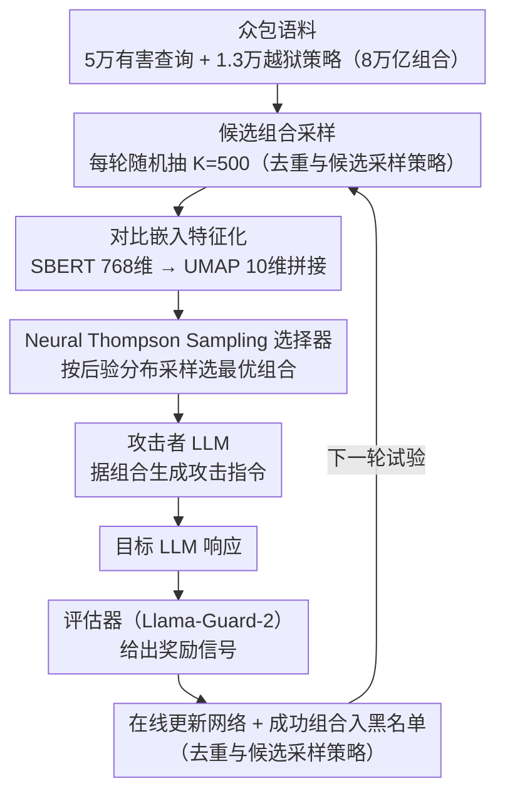

# Adaptive Instruction Composition for Automated LLM Red-Teaming

**会议**: ACL 2026  
**arXiv**: [2604.21159](https://arxiv.org/abs/2604.21159)  
**代码**: 无  
**领域**: AI安全 / 强化学习  
**关键词**: LLM红队测试, 自适应指令组合, 上下文赌博机, 越狱攻击, 多样性-有效性权衡

## 一句话总结
提出 Adaptive Instruction Composition (AIC) 框架，利用 Neural Thompson Sampling 在众包有害查询和越狱策略的组合空间中自适应地选择攻击指令，同时优化攻击成功率和多样性，在 Harmbench 上大幅超越已有方法。

## 研究背景与动机

**领域现状**：自动化 LLM 红队测试是提升模型安全的关键手段。现有方法主要分两类：一类让攻击 LLM 通过试错发现越狱策略（如 PAIR、TAP），另一类使用众包数据随机组合攻击指令（如 WildTeaming）。

**现有痛点**：试错型方法发现的成功攻击语义多样性有限，只能探索到有限的策略空间。WildTeaming 虽然利用了5万+有害查询和1.3万+越狱策略的庞大语料，但采用随机组合方式，未能利用历史攻击结果进行自适应优化，导致在面对防御良好的模型时成功率低下。

**核心矛盾**：WildTeaming 定义的指令组合空间超过 8 万亿种可能（50000×13000²），随机搜索在如此巨大空间中效率极低，但试错型方法又缺乏对已知攻击空间的系统覆盖。需要一种既能探索多样攻击又能利用成功信号的自适应方法。

**本文目标**：设计一种在大规模组合空间中平衡探索与利用的自适应指令组合机制，同时优化攻击有效性和多样性。

**切入角度**：将红队测试建模为组合神经赌博机（Combinatorial Neural Bandit）问题，利用强化学习在文本样本的组合空间中做自适应选择。

**核心 idea**：用 Neural Thompson Sampling 作为自适应选择器，通过对比预训练的句子嵌入将组合空间映射为低维特征，使轻量网络能在海量空间中快速泛化和学习。

## 方法详解

### 整体框架
系统由四个模型组成：攻击者 LLM（生成攻击）、目标 LLM（被攻击对象）、评估器（安全评判）、以及一个神经赌博机（自适应选择指令组合）。在每个试验中，赌博机从 $K=500$ 个候选指令组合中选择最优组合，攻击者据此生成攻击，评估器给出奖励信号反馈给赌博机，再用该信号在线更新赌博机并把成功组合加入黑名单，循环往复。

### 关键设计

**1. 对比嵌入特征化：把文本组合压成紧凑特征向量，让赌博机能跨语义区域泛化**

赌博机面对的是 8 万亿种文本组合，若直接以离散组合为臂根本无从学习。本文用 SBERT (all-mpnet-base-v2) 把查询和策略各映射成 768 维嵌入，再用 UMAP 降到 10 维，把各组件嵌入拼接起来作为网络输入。对比预训练保证了语义相近的文本在嵌入空间里也彼此靠近，于是赌博机只见过少量样本就能把奖励信号外推到整个语义邻域，推断那一片区域的攻击成功概率。消融也印证了这一点：SBERT 比 BERT 嵌入学得更快、ASR 更高。

**2. Neural Thompson Sampling 选择器：用后验采样在每轮自适应地挑组合，天然平衡探索与利用**

随机组合无法利用历史成功信号，而确定性贪心又会过早收敛。本文维护一个仅约 2201 参数的两层前馈网络，为每个候选组合算出高斯后验奖励分布 $\hat{r}_{t,k} \sim \mathcal{N}(\mu_{t,k}, \sigma^2_{t,k})$，其中均值来自网络输出、方差由神经切线核计算，再按后验采样来选组合。这样高不确定性的区域会自动获得更多探索，低不确定性但高均值的区域则被利用。超参 $\lambda$ 缩放方差，相当于一个可解释的旋钮：调大偏向多样性、调小偏向成功率，把「多样性-有效性权衡」直接交到使用者手里。

**3. 去重与候选采样策略：逼系统持续发现新区域，并把搜索压缩到可扩展规模**

如果不加约束，网络会反复利用同一个成功组合，多样性塌缩，且对全部 8 万亿组合逐个评分也不现实。本文一方面把成功攻击的指令组合加入黑名单，迫使网络必须在特征空间中泛化才能继续奏效，从而不断转向新的有效区域；另一方面每轮只从全空间随机抽 $K=500$ 个候选来评分（many-armed bandit 思路），避免对整个组合空间打分。两者合起来既保住了多样性，又让海量空间中的搜索变得可行。

### 损失函数 / 训练策略
赌博机网络使用 $\ell_2$ 正则化平方损失在线训练，学习率 0.01，权重衰减随试验次数递增。每轮试验结束后，用选中组合的嵌入和评估器奖励更新网络参数及不确定性矩阵 $U$。

## 实验关键数据

### 主实验

| 目标模型 | WildTeaming ASR | AIC Subtle ASR | AIC Aggressive ASR |
|----------|----------------|---------------|-------------------|
| Mistral-7B | 0.252 | 0.363 | 0.567 |
| Llama-3-70B | 0.088 | 0.155 | 0.450 |
| Llama-3.3-70B | 0.183 | 0.247 | 0.558 |

| Harmbench 策略 | Mistral-7B ASR | Llama-3-70B ASR |
|---------------|---------------|----------------|
| GCG-T | 0.645 | 0.238 |
| PAIR | 0.525 | 0.215 |
| AutoDAN-Turbo | 0.976 | 0.672 |
| **AIC** | **1.000** | **0.934** |

### 消融实验

| 配置 | 关键效果 | 说明 |
|------|---------|------|
| SBERT嵌入 vs BERT嵌入 | ASR 显著提升 | 对比预训练嵌入支持快速泛化 |
| λ=1 (subtle) vs λ=0.01 (aggr.) | 多样性↑ vs 成功率↑ | λ提供可解释的探索-利用控制 |
| 1策略 vs 3策略 | 多样性指标改善 | 更多策略槽提升内容多样性 |

### 关键发现
- AIC 在 Harmbench 上达到近乎完美的 ASR（Mistral: 1.0，Llama-3: 0.934），大幅超越所有已有方法
- 跨模型迁移效果良好：在 Mistral 上训练的策略迁移到 Llama-3 后 ASR 仍达 0.184-0.254（WildTeaming 基线仅 0.088）
- Subtle bandit 在保持与 WildTeaming 相当的多样性指标的同时显著提升成功率

## 亮点与洞察
- 将红队测试建模为组合赌博机问题非常巧妙，自然地将探索-利用权衡与攻击多样性-有效性权衡对应起来。可迁移到任何需要在大规模提示组合空间中搜索的场景
- 对比预训练嵌入 + 轻量网络实现了"少参数、大泛化"，2201 个参数就能在 8 万亿空间中有效学习
- λ 超参数提供了直观的"旋钮"来控制多样性-有效性权衡

## 局限与展望
- 实验仅在三个开源目标模型上进行，未验证对商业 API 模型的泛化性
- 依赖 Llama-Guard-2 作为评估器，可能产生假阳性/假阴性
- 计算成本较高，10K 试验需要 70-120 GPU 小时
- 未来可扩展到图像生成器和智能体的红队测试

## 相关工作与启发
- **vs WildTeaming**: WildTeaming 随机组合，AIC 用 RL 自适应选择，ASR 提升 40-400%
- **vs PAIR/TAP**: 试错方法多样性受限；AIC 利用众包语料保证覆盖
- **vs AutoDAN-Turbo**: AutoDAN-Turbo 能从零发现新策略但 ASR 不如 AIC；两者可互补

## 评分
- 新颖性: ⭐⭐⭐⭐ 组合赌博机用于红队测试是新颖的建模视角
- 实验充分度: ⭐⭐⭐⭐⭐ 多目标模型、多基线、迁移实验、消融、Harmbench对比一应俱全
- 写作质量: ⭐⭐⭐⭐ 结构清晰，算法描述详细
- 价值: ⭐⭐⭐⭐ 对 LLM 安全研究有较大实际价值

<!-- RELATED:START -->

## 相关论文

- [\[AAAI 2026\] MARS: Multi-Agent Adaptive Reasoning with Socratic Guidance for Automated Prompt Optimization](../../AAAI2026/reinforcement_learning/mars_multi-agent_adaptive_reasoning_with_socratic_guidance_f.md)
- [\[ACL 2026\] ImpRIF: Stronger Implicit Reasoning Leads to Better Complex Instruction Following](imprif_stronger_implicit_reasoning_leads_to_better_complex_instruction_following.md)
- [\[ACL 2026\] LENS: Less Noise, More Voice — Reinforcement Learning for Reasoning via Instruction Purification](less_noise_more_voice_reinforcement_learning_for_reasoning_via_instruction_purif.md)
- [\[ACL 2026\] ARGUS: Policy-Adaptive Ad Governance via Evolving Reinforcement with Adversarial Umpiring](argus_policy-adaptive_ad_governance_via_evolving_reinforcement_with_adversarial_.md)
- [\[ACL 2026\] Deliberative Searcher: Improving LLM Reliability via Reinforcement Learning with Constraints](deliberative_searcher_improving_llm_reliability_via_reinforcement_learning_with_.md)

<!-- RELATED:END -->
