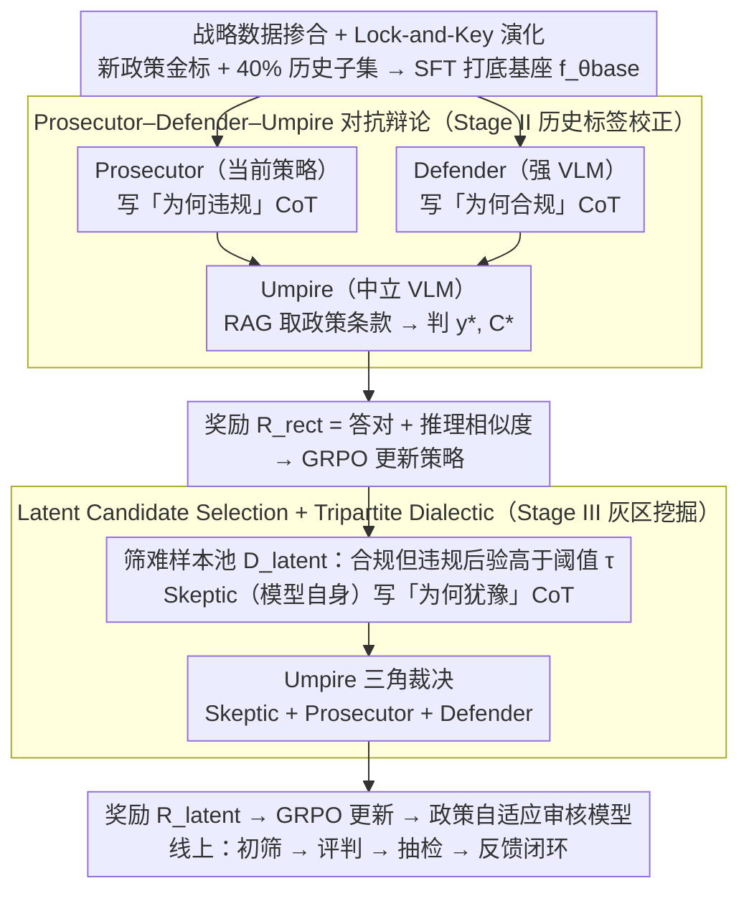

# ARGUS: Policy-Adaptive Ad Governance via Evolving Reinforcement with Adversarial Umpiring

**会议**: ACL 2026  
**arXiv**: [2605.02200](https://arxiv.org/abs/2605.02200)  
**代码**: 无  
**领域**: 强化学习 / 广告治理 / 多模态  
**关键词**: 策略自适应, 多智能体辩论, GRPO, 标签更新, 工业部署

## 一句话总结
ARGUS 用 Prosecutor–Defender–Umpire 三智能体辩论 + GRPO 强化学习，让广告审核 VLM 在政策不断更新时既能纠正历史「过时标签」、又能挖出灰区潜在违规，工业 A/B 把违规漏放率（VLR）相对降低 35.2%。

## 研究背景与动机

**领域现状**：互联网广告审核高度依赖大模型，但传统做法（SFT + 静态规则）默认政策是静态的；现有 RL/CoT 框架（RAVEN、Hi-Guard、BLM-Guard）也都假设规则不变。

**现有痛点**：监管政策频繁新增（如禁止 K12 应试焦虑 / 容貌焦虑 / 信息差骗局），但历史海量样本是按旧政策标注的。直接喂这些数据再 fine-tune 会带来三个问题：(1) **标签不一致**——历史「合规」样本按新政策可能违规；(2) **推理模糊**——新政策含灰区，二元标签不足以让模型学到判定逻辑；(3) **难样本召回**——隐蔽违规藏在海量合规流量中。

**核心矛盾**：Vanilla SFT 学新政策时会因为旧标签的「梯度冲突」导致 catastrophic forgetting（历史召回从 0.858 暴跌到 0.432）；EWC 等 continual learning 能保住老知识但学新政策能力不足。

**本文目标**：用三阶段强化学习让模型「先打底子—再校正历史—再挖灰区」，在保住历史合规性能的同时持续吸收新政策。

**切入角度**：把奖励信号从「单一裁判」升级为「多智能体结构化辩论」——Prosecutor 找违规理由、Defender 找合规辩解、Umpire 用 RAG 取出政策条款后做最终判决。辩论本身就是奖励 shaping 的来源。

**核心 idea**：用「检察官-辩护人-裁判」三元辩论 + RAG 增强的判决 + GRPO 把判决变成策略奖励，实现「政策演化」与「策略演化」同步。

## 方法详解

### 整体框架
ARGUS 是 GRPO 驱动的三阶段 pipeline：**Stage I Policy Seeding** 用 $\mathcal{D}_\text{gold}$（新政策的稀少金标）+ 40% 历史子集 $\mathcal{D}_\text{hist}'$ 做 SFT 取得基座模型 $f_{\theta_\text{base}}$；**Stage II Adversarial Label Rectification** 用 Prosecutor–Defender–Umpire 三智能体辩论给历史数据生成新的奖励 $R_\text{rect}$ 来覆盖旧标签噪声；**Stage III Latent Knowledge Discovery** 引入 Skeptic 让当前模型自己提出怀疑，并和 Prosecutor / Defender 一起被 Umpire 三角裁决，挖出隐蔽违规。三阶段共享同一套对抗辩论裁判机制，奖励信号随政策一起演化。

### 关键设计

**1. 战略数据掺合 + Lock-and-Key 演化：先用稀少金标打底、再让奖励随政策演化**

整套 pipeline 的第一步要解决「稀疏的新政策金标会被海量旧噪声淹没」这个矛盾。Stage I 用 $\mathcal{D}_\text{gold} \cup \mathcal{D}_\text{hist}'$（历史 40% 子集）做 SFT 打底，让模型先获得对新政策的基本感知；Stage II/III 再用辩论裁判（Umpire）的输出取代旧标签作为 GRPO 主奖励。关键是把「数据替换」和「奖励替换」解耦：SFT 只负责给模型基本的新政策感知，真正把演化的政策植入推理路径的是后续强化学习阶段。稀少金标当种子、海量历史当容量缓冲（即 lock-and-key），既保住历史合规率、又给新政策腾出学习空间。整套流程在线部署成「初筛 → ARGUS 评判 → 人工抽检 → 反馈」的闭环，可迁移到任何「持续学习 + 标签漂移」的合规场景。

**2. Prosecutor–Defender–Umpire 对抗辩论：用辩论而非单裁判洗掉旧标签噪声**

Stage II 要解决的痛点是历史样本的旧标签和新政策冲突，直接拿来训会污染梯度。ARGUS 不再用一个裁判直接打分，而是让三个角色对每条历史样本辩论：Prosecutor（当前策略）按新政策 $\Delta\mathcal{P}$ 写出「为什么违规」的 CoT，Defender（强 VLM）反向写「为什么合规」的辩解 CoT，Umpire（中立 VLM）用 RAG 取出 $\Delta\mathcal{P}$ 的具体条款加 $\mathcal{D}_\text{gold}$ 参照，输出修正后的标签 $y^*$ 和标准推理链 $\mathcal{C}^*$。奖励信号同时考虑「答对」和「推理路径接近裁判」：

$$R_\text{rect}(y,\mathcal{C}) = \mathbf{1}(y=y^*) + \text{sim}(\mathcal{C},\mathcal{C}^*)$$

把语义级 supervision 注入 GRPO，而不仅是 0/1 标签。之所以要引入「敌对辩护」，是因为单一裁判容易把模型导向过度保守或过度宽松；让 Defender 强行站在合规一侧，迫使 Umpire 在两个极端之间取理性中点，既校正旧标签、又避免「为吃新政策而牺牲对创意广告的宽容度」。

**3. Latent Candidate Selection + Tripartite Dialectic：让模型把自己的犹豫变成挖灰区违规的信号**

Stage II 只能修「明面冲突」的样本，但隐蔽违规藏在海量合规流量里、没人能直接给 ground truth。Stage III 先圈出难样本池——那些「嘴上说合规、内部后验却很高」的样本：

$$\mathcal{D}_\text{latent} = \{x\in\mathcal{D}_\text{hist} \mid y^{(k)}=0\ \text{and}\ P(y^{(k)}=1|x)>\tau\}$$

然后引入 Skeptic（即当前模型 $f_\theta$ 自己）给出「我为什么犹豫」的 CoT，和 Prosecutor / Defender 的两极视角一起喂给 Umpire 做三角裁决，得到 $y^*, \mathcal{C}^*$，再按 $R_\text{latent}$（同上式）继续 GRPO。用模型自己的怀疑当第三方视角，相当于把「不确定性」直接转成训练信号，把决策边界主动推进到难样本区，比单纯卡阈值挑难样本更精细。

### 损失函数 / 训练策略
- Stage I：$\mathcal{L}_\text{stage1}(\theta) = -\sum \log P(\mathbf{y}, \mathcal{C} | x, \mathcal{P}_\text{new}; \theta)$ 的 SFT。
- Stage II/III：GRPO（DeepSeekMath 提出的算法）以 $R_\text{rect}$ 和 $R_\text{latent}$ 为奖励，主干模型为 Qwen3-VL-8B / Qwen2.5-VL-7B。

## 实验关键数据

### 主实验（工业数据集，5 个新政策 $\Delta\mathcal{P}$）

| 方法（Qwen3-VL-8B 主干） | Hist. Prec. | Hist. Rec. | Avg $\Delta\mathcal{P}$ Prec. | Avg $\Delta\mathcal{P}$ Rec. |
|--------|------|------|------|------|
| Historical Expert (SFT on $\mathcal{D}_\text{hist}$) | 0.842 | 0.858 | 0.374 | 0.443 |
| GPT-4o (zero-shot) | 0.485 | 0.612 | 0.450 | 0.593 |
| Qwen3-235B-A22B (zero-shot) | 0.512 | 0.635 | 0.487 | 0.631 |
| Vanilla SFT (on $\mathcal{D}_\text{gold}$) | 0.454 | **0.432†** | 0.774 | 0.748 |
| SFT + Replay (40%) | 0.791 | 0.785 | 0.753 | 0.733 |
| EWC | 0.802 | 0.794 | 0.760 | 0.741 |
| **ARGUS (Ours)** | **0.828** | **0.841** | **0.795** | **0.836** |

†= 灾难性遗忘；ARGUS-8B 历史召回与 Historical Expert 仅差 1.7%，但 $\Delta\mathcal{P}$ 召回比 EWC 高 9.5 个百分点。在公开 ToxiCN MM 上，ARGUS 对新增「丧文化」类的召回也从 GPT-4o 的 0.365 提升到 0.482。线上 A/B：VLR 相对降低 35.2%，AAR（自动审核率）提升 11.2%，FPR 反而从 0.35% 降至 0.32%。

### 消融实验（按阶段 + 按 agent）

| 配置 | Hist. Rec. | Avg $\Delta\mathcal{P}$ Prec. | Avg $\Delta\mathcal{P}$ Rec. |
|------|------|------|------|
| Stage I only | 0.785 | 0.753 | 0.733 |
| + Stage II (Rectification) | 0.824 | 0.758 | 0.792 |
| + Stage III (Latent Discovery) | **0.841** | **0.795** | **0.836** |

| Agent 消融 | Avg $\Delta\mathcal{P}$ Prec. | Avg $\Delta\mathcal{P}$ Rec. |
|------|------|------|
| Full ARGUS | 0.795 | 0.836 |
| w/o Prosecutor | 0.732 | 0.695 |
| w/o Defender | 0.684 | 0.812 |
| w/o Rationale（只用标签不用 CoT） | 0.715 | 0.742 |

### 关键发现
- **三阶段的边际收益清晰**：Stage II 主要修历史召回（+3.9 点）和 $\Delta\mathcal{P}$ 召回（+5.9 点）；Stage III 主要推 $\Delta\mathcal{P}$ 精度（+3.7 点）。
- **Prosecutor 管召回，Defender 管精度**：去掉 Defender 精度从 0.795 降到 0.684 但召回反升至 0.812（变得过度审查）——直接证明两个对抗 agent 是制衡的两端。
- **CoT rationale 是策略级奖励的灵魂**：只把 agent 当二元标签生成器，精度从 0.795 降到 0.715，召回从 0.836 降到 0.742，说明真正起作用的是「辩论文本」而非「最终票选结果」。
- **抗对抗规避**：在同形字替换 + 模糊 2k 样本上，标准 SFT 召回从 0.711 暴跌到 0.440（-38.1%），ARGUS 只掉 6.2%（0.835→0.783）。

## 亮点与洞察
- **「策略演化」与「奖励演化」同步**是论文最珍贵的概念：传统 RLHF 假设奖励函数稳定，本文把奖励本身做成由 LLM 辩论实时合成的动态对象，给所有「规则会变」的工业应用（金融合规、内容安全、医保审核）提供了模板。
- **Tripartite Dialectic 的「Skeptic = 当前策略」设计很巧**：让模型自己当怀疑论者参与裁决，相当于把不确定性回路化为训练信号，比单纯阈值挑难样本更精细。
- **Lock-and-Key in 数据演化**：稀少的金标做种子，海量历史做容量缓冲，避免新政策被旧梯度淹没——可迁移到任何「持续学习 + 标签漂移」的场景。

## 局限与展望
- 当前只在「图文广告」上验证，视频维度（时序违规）未覆盖；作者也承认是未来工作。
- 框架对 Umpire VLM 的能力依赖大，弱裁判可能给出有偏判决；Umpire 偏见传染问题没有系统验证。
- 三阶段 + 多智能体推理成本高，离线训练 + 在线推理总开销远大于 SFT，工业部署要靠 cascaded filtering 才能控制延迟。

## 相关工作与启发
- **vs RAVEN / Hi-Guard / BLM-Guard**：他们都把政策当静态，只在固定规则下做 RL；ARGUS 是第一个支持政策动态演化的多 agent 框架。
- **vs EWC / Replay**：CL 方法被动护住老知识，对新政策学习能力有限；ARGUS 主动用 Umpire 重写历史奖励，新政策 $\Delta\mathcal{P}$ 召回比 EWC 高 9.5%。
- **vs Constitutional AI**：CAI 用单一原则集做自我修正，ARGUS 用 RAG + 多 agent 把原则集变成可检索可更新的动态对象——对监管场景更现实。

## 评分
- 新颖性: ⭐⭐⭐⭐ 多 agent 辩论 + 三阶段 GRPO + 演化政策的组合在广告治理是首次。
- 实验充分度: ⭐⭐⭐⭐ 工业 + 公开 + 线上 A/B + 各种消融齐全；唯一遗憾是只在单一公司数据 + ToxiCN 两个集上验证。
- 写作质量: ⭐⭐⭐⭐ Case 表（Table 1）非常直观，可以让读者立刻 grasp 多 agent 推理是什么样子。
- 价值: ⭐⭐⭐⭐⭐ 直接落地工业部署的稀缺论文，给「政策合规」类业务一套可复用蓝图。

<!-- RELATED:START -->

## 相关论文

- [\[ACL 2026\] Free Energy-Driven Reinforcement Learning with Adaptive Advantage Shaping for Unsupervised Reasoning in LLMs](free_energy-driven_reinforcement_learning_with_adaptive_advantage_shaping_for_un.md)
- [\[ICML 2026\] Metis: Learning to Jailbreak LLMs via Self-Evolving Metacognitive Policy Optimization](../../ICML2026/reinforcement_learning/metis_learning_to_jailbreak_llms_via_self-evolving_metacognitive_policy_optimiza.md)
- [\[ACL 2026\] Easy Samples Are All You Need: Self-Evolving LLMs via Data-Efficient Reinforcement Learning](easy_samples_are_all_you_need_self-evolving_llms_via_data-efficient_reinforcemen.md)
- [\[ACL 2026\] LANG: Reinforcement Learning for Multilingual Reasoning with Language-Adaptive Hint Guidance](lang_reinforcement_learning_for_multilingual_reasoning_with_language-adaptive_hi.md)
- [\[ICLR 2026\] SPELL: Self-Play Reinforcement Learning for Evolving Long-Context Language Models](../../ICLR2026/reinforcement_learning/spell_self-play_reinforcement_learning_for_evolving_long-context_language_models.md)

<!-- RELATED:END -->
