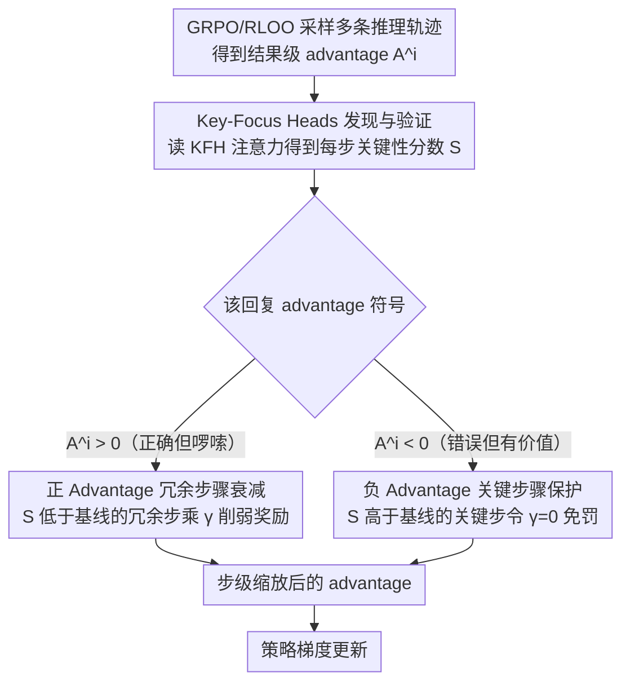

# AttnPO: Attention-Guided Process Supervision for Efficient Reasoning

**会议**: ACL 2026  
**arXiv**: [2602.09953](https://arxiv.org/abs/2602.09953)  
**代码**: [GitHub](https://github.com/NieSYsc20/AttnPO)  
**领域**: Reinforcement Learning / Efficient Reasoning  
**关键词**: 过度思考, 过程监督, 注意力机制, 强化学习, 推理效率

## 一句话总结

提出 AttnPO，一个利用模型内在注意力信号进行步级信用分配的低开销过程监督 RL 框架，通过识别 Key-Focus Heads（KFH）区分冗余和关键推理步骤，在大幅缩短推理长度的同时显著提升准确率。

## 研究背景与动机

**领域现状**: 基于 RLVR 训练的大推理模型（LRM）如 DeepSeek-R1 在复杂推理任务上表现优异，但存在严重的"过度思考"问题——对简单操作也生成冗长的推理过程，浪费计算资源。

**现有痛点**: (1) 轨迹级长度惩罚均匀对待所有推理步骤，无法区分冗余和必要步骤，常导致准确率下降；(2) 基于采样的过程监督方法（Monte Carlo 采样）计算开销大；(3) 基于模型的方法（训练 reward model 定位第一个正确答案位置）信用分配不精确。

**核心矛盾**: 需要细粒度的步级监督来区分冗余和关键步骤，但现有方法要么开销大（额外采样/模型），要么信用分配不准确。

**本文目标**: 以几乎零额外资源成本，仅依赖模型内在信号实现精细的步级过程监督。

**切入角度**: 深入分析模型注意力机制，发现最终答案生成时存在天然聚焦于关键步骤的特殊注意力头。

**核心 idea**: Key-Focus Heads（KFH）在生成最终答案时自然地将高注意力分配给关键推理步骤、低注意力分配给冗余步骤，可直接用于步级信用分配。

## 方法详解

### 整体框架

AttnPO 在 GRPO/RLOO 框架基础上，利用 KFH 的注意力分数对结果级 advantage 进行步级缩放：对正 advantage 的正确回复衰减冗余步骤的正 advantage（减少过度鼓励），对负 advantage 的正确回复衰减关键步骤的负 advantage（避免过度惩罚）。

### 关键设计

**1. Key-Focus Heads (KFH) 发现与验证：从模型自己的注意力里读出哪些步骤是关键的**

要做步级监督，最大的障碍是「怎么不花额外算力就知道哪一步关键、哪一步冗余」。AttnPO 的观察是：LRM 在生成最终答案时，必须从冗长推理里挑出关键信息，注意力机制本身就是一个天然的信息选择器。于是定义最终答案对某个推理步骤 $s_k$ 的注意力得分

$$\mathcal{S}_{s_k}^{l,h} = \frac{1}{|s_k|}\sum_{m \in \mathcal{F}}\sum_{n \in s_k} a_{m \to n}^{l,h}$$

其中 $\mathcal{F}$ 是最终答案的 token 集合。用 Step Ranking Accuracy（SRA，衡量该头按注意力给步骤排序与真实关键性的一致度）筛头，发现一小撮注意力头的 SRA 高达 95–96%——这些就是 Key-Focus Heads，它们生成最终答案时自然地把高注意力给关键步骤、低注意力给冗余步骤，可直接拿来做步级信用分配。

**2. 正 Advantage 冗余步骤衰减：正确但拖沓的回复，别再奖励它的废话步骤**

GRPO/RLOO 的结果级 advantage 是均匀作用在所有步骤上的，正 advantage 会无差别强化整条轨迹，连冗余步骤一起鼓励，这正是过度思考的根源。AttnPO 的做法是：当回复的 $A^i > 0$ 且某步骤的 KFH 注意力低于基线（$\mathcal{S}_{s_k}^i < \mathcal{S}_{\text{base}}^i$，判定为冗余）时，用缩放因子

$$\gamma_{s_k}^i = (1-\delta) \cdot p_i^\lambda \cdot (\mathcal{S}_{s_k}^i / \mathcal{S}_{\text{base}}^i) + \delta$$

把这一步的正 advantage 削下去。基线分数 $\mathcal{S}_{\text{base}}^i = p_i^\beta \cdot \frac{|\mathcal{F}_i|}{|o_i|}$ 带难度感知（$p_i$ 越难、阈值越宽松），保证对难题不会误删探索步骤。这样模型只会被鼓励保留真正有贡献的步骤，而不是把整条长链一起强化。

**3. 负 Advantage 关键步骤保护：错误回复里也别误伤正确推理的关键步骤**

负 advantage 会无差别打压整条轨迹的生成概率，但一条「最终答错」的回复里往往仍有正确的关键步骤，若把它们一起惩罚就会损伤模型的推理能力。AttnPO 反向操作：当 $A^i < 0$ 且某步骤的注意力高于基线（$\mathcal{S}_{s_k}^i > \mathcal{S}_{\text{base}}^i$，判定为关键）时，直接令 $\gamma_{s_k}^i = 0$ 完全免除惩罚，把负向梯度集中到冗余步骤上。设计 2 和 3 一正一负互补：前者压住「正确但啰嗦」的冗余、后者护住「错误但有价值」的关键步骤，合起来才能同时缩长度又提精度。

### 损失函数 / 训练策略

奖励函数 $r_i = \mathbb{I}[o_i \text{ correct}](1 - \alpha \cdot \sigma(f(o_i)))$，其中 $f(o_i) = \sigma((\text{len}(o_i) - \text{mean}(q)) / \text{std}(q))$。使用 RLOO advantage 估计器 $A^i = r_i - \frac{1}{G-1}\sum_{j \neq i} r_j$。KFH 选取 SRA 排名前 N 的头，行为在 RL 训练中保持稳定（Pearson 相关 > 0.85）。

## 实验关键数据

### 主实验（1.5B 模型）

| 方法 | GSM8K Acc | MATH500 Acc | AIME24 Acc | AIME25 Acc | 平均 Acc | 平均 Token |
|------|----------|------------|-----------|-----------|---------|-----------|
| DS-R1-1.5B 基线 | 78.8 | 82.1 | 28.1 | 22.8 | 54.5 | 8005 |
| AutoThink | 83.0 | 84.0 | 34.6 | 21.8 | 57.0 | 5056 |
| AdaptThink | 83.1 | 82.0 | - | - | - | - |
| AttnPO (本文) | **显著提升** | **显著提升** | **显著提升** | - | **+7.3pts** | **-60%** |

### 消融实验

| 配置 | 效果 |
|------|------|
| 仅 Pos-Adv 衰减 | 有效缩短长度但准确率提升有限 |
| 仅 Neg-Adv 保护 | 有效保护准确率但长度缩减有限 |
| 两者结合（AttnPO） | 同时实现大幅缩短和准确率提升 |
| 移除高 SRA 步骤 vs 低 SRA 步骤 | 移除高 SRA 步骤显著降低 pass@32，低 SRA 步骤影响小 |

### 关键发现

- KFH 主要位于中后层，少量头（SRA > 0.9）即足够，增加更多头收益饱和
- KFH 行为在 RL 训练过程中高度稳定，功能角色鲁棒
- 在非困难问题上识别的 KFH 对困难问题（AIME24）也具有泛化能力
- DeepSeek-R1-Distill-Qwen-1.5B 上实现平均 +7.3 点准确率提升 + 60% 推理长度缩减（6 个数学基准）

## 亮点与洞察

- 首次揭示 LRM 中 Key-Focus Heads 的存在——在最终答案生成时自然聚焦关键步骤
- 几乎零额外开销：不需要额外采样或 reward model，仅利用模型已有的注意力分数
- 两个互补策略（Pos-Adv 衰减 + Neg-Adv 保护）设计精巧，各司其职
- 难度感知机制（$p_i^\beta$ 和延迟调度 $t > T \cdot p_i$）确保困难问题有足够探索空间

## 局限与展望

- 推理步骤分割依赖预定义的特殊短语，可能不够通用
- KFH 在更大模型（>7B）上的表现未充分验证
- 仅在数学推理任务上评估，编码/逻辑等任务待探索
- 注意力分数的计算在推理时有额外开销（虽然训练时可忽略）

## 相关工作与启发

- GRPO / DeepSeek-R1（Guo et al., 2025）：outcome-supervised RL 的基础
- TLMRE（Arora & Zanette, 2025）：轨迹级长度惩罚方法
- Monte Carlo 采样方法（Dai et al., 2025; Yue et al., 2025）：高开销的过程监督
- 注意力头功能分化（Zheng et al., 2024; Li et al., 2025）：attention heads 的功能特化研究
- KFH 的发现为理解 LRM 的内部工作机制提供了新视角

## 评分

- 新颖性: ⭐⭐⭐⭐⭐ KFH 的发现极具洞察力，利用内在信号进行过程监督的思路新颖
- 实验充分度: ⭐⭐⭐⭐ 9 个基准，充分的探测分析和消融实验
- 写作质量: ⭐⭐⭐⭐⭐ 从发现到应用的叙事流畅，公式严谨
- 价值: ⭐⭐⭐⭐⭐ +7.3pts 准确率 + 60% 长度缩减，实用价值极高

<!-- RELATED:START -->

## 相关论文

- [\[ICLR 2026\] From Narrow to Panoramic Vision: Attention-Guided Cold-Start Reshapes Multimodal Reasoning](../../ICLR2026/reinforcement_learning/from_narrow_to_panoramic_vision_attention-guided_cold-start_reshapes_multimodal_.md)
- [\[ACL 2026\] SpiralThinker: Latent Reasoning through an Iterative Process with Text-Latent Interleaving](spiralthinker_latent_reasoning_through_an_iterative_process_with_text-latent_int.md)
- [\[ACL 2026\] Visually-Guided Policy Optimization for Multimodal Reasoning](visually-guided_policy_optimization_for_multimodal_reasoning.md)
- [\[ACL 2026\] Good Reasoning Makes Good Demonstrations: Implicit Reasoning Quality Supervision via In-Context Reinforcement Learning](good_reasoning_makes_good_demonstrations_implicit_reasoning_quality_supervision_.md)
- [\[ICLR 2026\] Regret-Guided Search Control for Efficient Learning in AlphaZero](../../ICLR2026/reinforcement_learning/regret-guided_search_control_for_efficient_learning_in_alphazero.md)

<!-- RELATED:END -->
