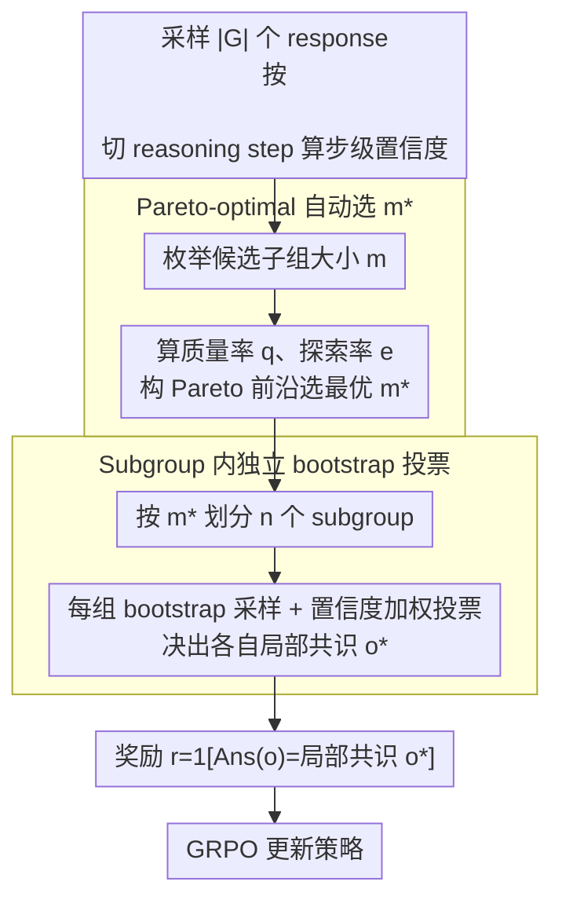

# Beyond Majority Voting: Towards Fine-grained and More Reliable Reward Signal for Test-Time Reinforcement Learning

**会议**: ACL 2026  
**arXiv**: [2512.15146](https://arxiv.org/abs/2512.15146)  
**代码**: <https://github.com/szu-tera/SCOPE>  
**领域**: 强化学习 / LLM 推理 / 测试时训练 / 奖励模型  
**关键词**: TTRL、majority voting、step-wise confidence、subgroup partition、Pareto optimization

## 一句话总结
针对 TTRL 用 majority voting 做伪标签带来的「确认偏差 + 稀疏奖励」两大痛点，SCOPE 提出步级置信度加权投票（不再唯频次是从）+ Pareto-optimal subgroup 动态划分（每子组独立 bootstrap 出局部共识），在 Qwen3-8B 上把 AIME 2024 从 47.13 → 52.70、AIME 2025 从 27.40 → 31.00。

## 研究背景与动机

**领域现状**：RLVR（带可验证奖励的 RL）是 R1/Qwen3/o1 等顶级推理模型的核心训练范式，但依赖大量人工标注。TTRL 提出在测试时不要标签——把多个采样 response 做 majority voting 得到「共识答案」当伪标签，用 GRPO 训练。

**现有痛点**：(1) **确认偏差**：majority voting 把所有票一视同仁，模型最自信但写错的答案如果恰好票数最多就被反复强化，错上加错；(2) **稀疏奖励**：整组 $|\mathcal{G}|$ 个采样共享一个全局共识标签，要么全对要么全错，没有细粒度信号让模型分清「错得有多离谱」。

**核心矛盾**：majority voting 是 token-level confidence 信息的暴力丢弃——LLM 推理时其实在每一步都有置信度，正确解可能恰恰是「票少但每步都自信」、错误解可能是「票多但中间某步发慌」；同时单一共识抹平了 within-group 多样性，难以兼顾质量与探索。

**本文目标**：在不引入人工标签的前提下，给 TTRL 注入两种信号——(a) 细粒度的步级置信度让正确但少数派的解能浮出，(b) 细分子组以同时获得密集奖励和多样监督。

**切入角度**：观察到 step-wise confidence（每段 reasoning step 内 top-k token 的负对数概率均值）能反映 LLM 对自己推理链每一段的把握；同时把候选 pool 切成大小为 $m$ 的子组、每组独立投票，能产生 $n=|\mathcal{G}|/m$ 个不同的局部共识，自动提供多样的监督目标。

**核心 idea**：用「置信度加权投票」代替「等权投票」+ 用「自动选择 subgroup 大小」代替「全局一个共识」，让 TTRL 的奖励信号同时更准（去 bias）和更密（解稀疏）。

## 方法详解

### 整体框架
SCOPE 的训练迭代有四步：(1) 采样 $|\mathcal{G}|$ 个 response，按 `\n\n` 切 reasoning step，算每个 response 的 average step confidence $\mathcal{C}_{AvgStep}^{(i)}$；(2) 评估若干候选 subgroup 大小 $m \in \mathcal{M}$，对每个 $m$ 算 quality rate $q$ 和 exploration rate $e$，构 Pareto 前沿，选最优 $m^*$；(3) 按 $m^*$ 把 response 划分到 $n$ 个 subgroup，每组通过 bootstrap 采样 + 置信度加权投票得到局部共识 $o_j^*$；(4) 用 $r(o, o_j^*) = \mathds{1}[\text{Ans}(o) = o_j^*]$ 计算奖励，用 GRPO 更新策略。

### 关键设计

**1. Step-wise 置信度加权投票：让推理过程稳定自信的少数派赢过中段拉胯的多数派**

majority voting 把所有票等权，于是「票多但中间某步发慌」的错误解会被反复强化，这就是确认偏差。SCOPE 改成按每个 response 的平均步级置信度加权投票。先算每个 token 的置信度 $\mathcal{C}_t = -\frac{1}{k}\sum_{j=1}^{k}\log P_t(j)$（top-k 平均负对数概率），再按 `\n\n` 切 reasoning step、每步取均值 $\mathcal{C}_{s_k} = \frac{1}{N_k}\sum_{t=1}^{N_k}\mathcal{C}_t$，整条 response 的权重就是各步均值 $\mathcal{C}_{AvgStep}^{(i)} = \frac{1}{|\mathcal{L}|}\sum_{k=1}^{|\mathcal{L}|}\mathcal{C}_{s_k}$。共识标签不再唯频次是从，而是

$$o^* = \operatorname{argmax}_y \sum_{i=1}^{|\mathcal{G}|} \mathcal{C}_{AvgStep}^{(i)} \cdot \mathds{1}[\text{Ans}(o_i) = y]$$

之所以选 step 这个粒度：token-level 太抖（高频虚词把噪声拉到极端），trace-level 又太平（一段错被几十段对淹没），step 是 reasoning 的天然结构单元，既保结构精度又避抖动。bottom-10% / tail-10% 等只盯最弱步的替代方案，会惩罚「难但对」的推理，实验里已被证伪。

**2. Subgroup 内独立 bootstrap 投票：把单一全局共识拆成多个局部真理，解开稀疏奖励**

TTRL 让整组 $|\mathcal{G}|$ 个采样共享一个全局共识标签，奖励要么全对要么全错，密度极稀、也没有探索多样性。SCOPE 把 pool 切成大小为 $m$ 的子组 $\mathcal{S} = \{S_j = \{o_{(j-1)m+1}, \dots, o_{jm}\}\}_{j=1}^{n}$，每个子组从全局 pool 做 bootstrap 采样得候选集、再用上面的置信度加权投票独立决出自己的局部共识 $o_j^*$，奖励按各自子组目标算 $r(o, o_j^*) = \mathds{1}[\text{Ans}(o) = o_j^*]$。这样 $n=|\mathcal{G}|/m$ 个子组各持一份可能不同的「局部真理」，给 GRPO 的 advantage 计算注入更多样的监督目标，鼓励探索更多 reasoning 路径。子组大小是把双刃剑：$m=1$ 只信单条采样、噪声大；$m=|\mathcal{G}|$ 又退化回全局共识，所以需要下面的机制自动选 $m$。

**3. Pareto-optimal 自动选 $m^*$：每个训练步动态权衡推理质量与探索多样性**

固定 $m$ 在训练不同阶段必然次优——初期需要小 $m$ 的多样性来探索，后期需要大 $m$ 的稳定共识。SCOPE 定义两个对立指标：质量 $q = \frac{1}{|\mathcal{G}|} \sum_{j=1}^{n}\sum_{l=1}^{m} \mathds{1}[\text{Ans}(o_{(j-1)m+l}) = o_j^*]$（组内一致率，越高说明子组共识越可靠），探索 $e = \frac{|\{o_1^*, \dots, o_n^*\}|}{n}$（独特共识数比例，越高越多样）。枚举候选 $m \in \{1, 2, 4, \dots\}$ 得到一组 $(q_k, e_k)$ 点、构 Pareto 前沿，对每个前沿点算 z-norm 后的加权距离

$$d_k = \sqrt{\lambda(1-\hat{q}_k)^2 + (1-\lambda)(1-\hat{e}_k)^2}$$

选 $m^* = \operatorname{argmin}_{m_k} d_k$（$\lambda = 0.7$ 经验最优）。这样把质量-探索双目标变成一条 trade-off 曲面，每步根据当前分布自适应调整，免去人工 schedule 或超参搜索。

### 损失函数 / 训练策略
沿用 GRPO 目标：$\mathcal{J}_{GRPO}(\theta) = \mathbb{E}\left[\frac{1}{|\mathcal{G}|}\sum_i \frac{1}{|o_i|}\sum_t \min[\rho_{i,t}\mathcal{A}_i, \text{clip}(\rho_{i,t}, 1-\epsilon, 1+\epsilon)\mathcal{A}_i] - \beta \mathbb{D}_{KL}[\pi_\theta \| \pi_{ref}]\right]$，advantage $\mathcal{A}_i = (r(o_i) - \mu_g)/(\sigma_g + \epsilon)$。SCOPE 的唯一改动是 $r(\cdot)$ 的来源——从「全局 majority vote」变成「subgroup-specific confidence-weighted vote」。Pareto 评估带来约 10% 额外计算。

## 实验关键数据

### 主实验（4 模型 × 4 数学竞赛 benchmark）

| 模型 | 方法 | AIME 2024 | AIME 2025 | AMC | MATH-500 | Avg |
|------|------|-----------|-----------|-----|----------|-----|
| Qwen2.5-Math-1.5B | TTRL | 16.48 | 9.86 | 48.87 | 72.58 | 36.95 |
| Qwen2.5-Math-1.5B | **SCOPE** | **22.50** | **14.90** | **51.20** | **76.85** | **41.36** |
| Qwen3-1.7B | TTRL | 19.37 | 19.23 | 50.45 | 78.18 | 41.91 |
| Qwen3-1.7B | **SCOPE** | **21.66** | **19.71** | **53.46** | **81.27** | **44.02** |
| LLaMA3.1-8B-Inst | TTRL | 9.56 | 0.96 | 32.08 | 62.93 | 26.38 |
| LLaMA3.1-8B-Inst | **SCOPE** | **14.37** | **1.44** | **35.24** | 61.67 | **28.18** |
| Qwen3-8B | TTRL | 47.13 | 27.40 | 68.55 | 89.74 | 58.21 |
| Qwen3-8B | **SCOPE** | **52.70** | **31.00** | **74.09** | 91.01 | **62.20** |

Qwen3-8B 上对 AIME 2025 相对涨 13.1%、AMC 涨 8.1%；LLaMA3.1-8B 上 AIME 2024 相对涨 50.3%。

### 消融实验（Qwen3-8B / Qwen2.5-Math-1.5B）

| 配置 | Qwen3-8B AIME 2024 | Qwen3-8B AIME 2025 |
|------|---------------------|---------------------|
| TTRL | 47.13 | 27.40 |
| **SCOPE Full** | **52.70** | **31.00** |
| w/o Conf（去置信度加权，纯多数投票） | 47.70 (-5.00) | 28.36 (-2.64) |
| w/o Subgroup（去子组划分，全局共识） | 47.91 (-4.79) | 26.92 (-4.08) |

Pseudo-Label Accuracy (PLA) 分析：TTRL 25.42 → SCOPE 30.71（+20.81%），子组划分实际**降低**而非加剧 pseudo-label 漂移。

### 关键发现
- 两大模块缺一不可：去置信度掉 5 个点，去子组划分掉 4-6 个点，说明「精准信号」和「密集信号」是两个独立维度，需联合优化。
- Step-wise 置信度优于其他粒度：average trace 因为 error masking 把关键错误平均掉；bottom-10% 因为只盯最弱步惩罚「难但对」的解，AIME 2024 上无任何收益。
- 自动选 $m^*$ 优于固定 $m$：$m=1$ 和 $m=8$ 收敛快但早期饱和；$m=|\mathcal{G}|$（全局）稳但慢。动态选择兼得快收敛与高峰值。
- $\lambda$ 控制 quality-exploration 权衡：$\lambda=0$（纯探索）会让模型漂离正确轨迹，$\lambda=1$（纯一致）饱和在次优；$\lambda=0.5$-$0.7$ 是甜蜜点。
- 「pseudo-label 越准 → 训练越好」的因果链：SCOPE 提升 PLA 20% 后下游也跟着涨，印证 majority voting 的 confirmation bias 是真实瓶颈。

## 亮点与洞察
- 用 LLM 自己每步的 confidence 给「投票权重」加权，是个非常自然但之前没人在 TTRL 里用过的 idea——相当于把推理过程的内信号外化为奖励信号。
- Subgroup 切分把「单一共识 → 多个局部共识」的转变看似简单，实质上把 GRPO 的 group-relative advantage 从 0/1 二值变成更细分布，密集化奖励同时保多样性。
- Pareto 动态选 $m^*$ 是工程上很优雅的解——不需要 schedule、不需要 hyper-search，每个 step 自适应。
- step 定义靠 `\n\n` 这种朴素分隔符就足够——说明现代 reasoning LLM 已经自带相当一致的步分割习惯，可以被低成本利用。

## 局限与展望
- step 划分基于 newline 启发式，假设了「模型输出有清晰段落结构」，对未做 reasoning 后训的 base model 可能不适用。
- Pareto 评估带 ~10% 计算开销，虽然不大但对超大模型规模化时仍是负担。
- 仅在数学竞赛 benchmark 上验证，对开放生成 / 多模态 / agent 等更复杂场景的迁移性还需验证。
- LLaMA3.1-8B 上 MATH-500 反而轻微掉点（-1.26），可能是模型本身偏弱导致 confidence 信号噪声大。

## 相关工作与启发
- **vs TTRL**：基础范式相同（采样 + 投票 + GRPO），但用 step-wise confidence 替代 frequency-only voting，用 subgroup 替代 single global consensus；保留 TTRL 的 zero-label 优势同时去除两大病灶。
- **vs INTUITOR**：INTUITOR 用 self-certainty 作内在奖励但仍是单一信号；SCOPE 把 confidence 用作投票权重而非直接 reward，能同时利用群体共识与个体置信度。
- **vs Co-rewarding / EVOL-RL**：那些方法用语义一致 / 新颖性增强多样性，本文用 subgroup 内独立共识做多样性，是从「奖励信号空间结构」而非「响应空间结构」入手的不同切口。

## 评分
- 新颖性: ⭐⭐⭐⭐ 把 step-wise confidence + Pareto-optimal subgroup 两条线串到 TTRL 是首次，但单独看每条线都有先例（INTUITOR 用 confidence、AdaCoT 用 Pareto）。
- 实验充分度: ⭐⭐⭐⭐ 4 个模型 × 4 个 benchmark + 完整消融 + 置信度粒度对比 + Pareto 参数 $\lambda$ 扫描 + PLA 分析，覆盖面充分。
- 写作质量: ⭐⭐⭐⭐ 图 1 的「错误投票 vs 正确高 confidence」例子和图 2 的整体 pipeline 把核心思路讲得很清楚，公式标号规整。
- 价值: ⭐⭐⭐⭐ 对所有在做 unsupervised RL / self-improvement 的工作都有直接借鉴；尤其是 confidence 信号的工程化利用方式可以迁移到 reasoning 模型的诸多场景。

<!-- RELATED:START -->

## 相关论文

- [\[ACL 2026\] d-TreeRPO: Towards More Reliable Policy Optimization for Diffusion Language Models](d-treerpo_towards_more_reliable_policy_optimization_for_diffusion_language_model.md)
- [\[ACL 2026\] SCRL: What If Consensus Lies? Selective-Complementary Reinforcement Learning at Test Time](what_if_consensus_lies_selective-complementary_reinforcement_learning_at_test_ti.md)
- [\[CVPR 2026\] Specificity-aware Reinforcement Learning for Fine-grained Open-world Classification](../../CVPR2026/reinforcement_learning/specificity-aware_reinforcement_learning_for_fine-grained_open-world_classificat.md)
- [\[ICLR 2026\] P-GenRM: Personalized Generative Reward Model with Test-time User-based Scaling](../../ICLR2026/reinforcement_learning/p-genrm_personalized_generative_reward_model_with_test-time_user-based_scaling.md)
- [\[ICLR 2026\] DiVE-k: Differential Visual Reasoning for Fine-grained Image Recognition](../../ICLR2026/reinforcement_learning/dive-k_differential_visual_reasoning_for_fine-grained_image_recognition.md)

<!-- RELATED:END -->
