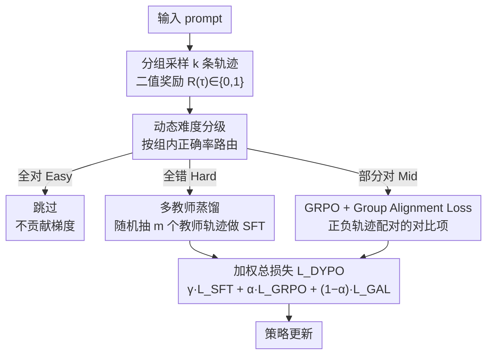

# Bridging SFT and RL: Dynamic Policy Optimization for Robust Reasoning

**会议**: ACL 2026 Findings  
**arXiv**: [2604.08926](https://arxiv.org/abs/2604.08926)  
**代码**: [GitHub](https://github.com/Tocci-Zhu/DYPO)  
**领域**: 强化学习  
**关键词**: SFT与RL融合, 偏差-方差权衡, 动态难度分级, 多教师蒸馏, 梯度方差缩减

## 一句话总结
提出 DYPO（Dynamic Policy Optimization），通过动态难度分级将样本路由到不同优化路径——Hard样本用多教师蒸馏降低SFT偏差、Mid样本用Group Alignment Loss降低RL方差，在数学推理benchmark上平均提升4.8%，OOD任务提升13.3%。

## 研究背景与动机

**领域现状**：LLM后训练主要分SFT和RL两条路线。SFT稳定（低方差）但受限于静态数据的拟合偏差；RL探索性强（低偏差）但采样随机性导致梯度高方差。业界通常采用"SFT→RL"的顺序流水线。

**现有痛点**：(1) 顺序流水线中SFT偏差会误导后续RL探索（bias propagation）；(2) 现有融合策略（如SuperRL、CHORD）仅通过简单的损失加权混合SFT和RL，忽略了两者梯度信号的根本统计冲突；(3) 对不同难度样本采用统一优化策略——简单样本提供边际信号，困难样本奖励极稀疏，只有中等难度样本信息量最大。

**核心矛盾**：SFT梯度的高偏差低方差与RL梯度的低偏差高方差之间的统计冲突，简单加权无法解决这一多维度不匹配问题。

**本文目标**：提出结构化解决方案，同时缓解SFT的拟合偏差和RL的梯度方差，实现高效稳定的统一后训练。

**切入角度**：从偏差-方差分解的理论视角出发，识别出不同难度样本需要不同优化策略——Hard样本需要知识注入（SFT方向），Mid样本需要强化学习（RL方向），Easy样本可以跳过。

**核心 idea**：基于group rollout结果动态将样本分为Easy/Hard/Mid三档，分别路由到跳过/多教师蒸馏SFT/GAL增强RL的优化路径。

## 方法详解

### 整体框架
对每个prompt生成一组k条轨迹，根据正确率将其分为Easy（全对）、Hard（全错）、Mid（部分对）三档。Easy样本跳过；Hard样本用多教师蒸馏提供低偏差监督；Mid样本用GRPO+GAL的混合目标实现低方差RL。总损失：$\mathcal{L}_{DYPO} = \mathbb{I}_\mathcal{H} \cdot \gamma \mathcal{L}_{SFT} + \mathbb{I}_\mathcal{M} \cdot (\alpha \mathcal{L}_{GRPO} + (1-\alpha) \mathcal{L}_{GAL})$。

### 关键设计

**1. 动态难度分级（Dynamic Difficulty Grading）：用 rollout 正确率把样本路由到最合适的优化路径**

统一的优化策略无法应对样本难度的悬殊：简单样本的梯度趋近于零、白白浪费算力，困难样本的奖励信号又太稀疏、让 RL 梯度方差爆炸。DYPO 不另设分类器或奖励模型，而是直接复用 group rollout——对每个 query 采样 $k$ 条轨迹，用二值奖励 $R(\tau_i) \in \{0,1\}$ 评估每条对错。

按结果把 query 分三档并各走一条路：全对为 Easy，直接跳过、不贡献梯度，避开饱和样本的无效更新；全错为 Hard，交给多教师蒸馏做 SFT，避免在毫无正例的情况下空跑 RL 探索；部分对为 Mid，正负轨迹并存、信息量最大，交给 RL 优化拿到最有效的梯度信号。一道正确率就完成了路由，实现成本极低。

**2. 多教师蒸馏（Multi-Teacher Distillation）：用多个教师的集成消掉单教师的特异性偏差**

单教师 SFT 的拟合偏差正是后续 RL 探索受限的根源之一——学生被一个有偏的老师带偏了方向。DYPO 为 Hard 样本维护 $m$ 个教师模型的推理轨迹集合，每遇到一个 Hard query 就随机抽一个教师的轨迹作为 SFT 目标。

理论上单个教师会引入 $\|\mathbf{b}_{sys} + \mathbf{b}_i\|$ 的偏差，而在教师偏差方向不相关的假设下，$m$ 个教师的集成把其中的特异性偏差缩减为 $\sigma_{bias}^2/m$。实践中用 DeepSeek-R1 和 Qwen3-235B 两个教师，就能明显压低这部分偏差，给 Hard 样本提供更可靠的低偏差监督。

**3. Group Alignment Loss（GAL，组对齐损失）：给 GRPO 配一个方差会自动衰减的对比项**

GRPO 的梯度方差 $\approx \Sigma_s/k$ 受限于组大小 $k$，组太小时方差降不下来。DYPO 在 Mid 样本上额外加一个对比损失：把同组的成功/失败轨迹配成正负对，用 DPO 风格的目标 $\mathcal{L}_{GAL} = -\log\sigma(\beta_{GAL} \cdot d(\tau_s, \tau_f))$ 拉近成功路径、推远失败路径。与标准 DPO 的关键区别是 GAL 用的是 on-policy rollout 而非静态偏好数据。

它之所以能压方差，在于梯度权重 $w_d = 1 - \sigma(\beta_{GAL} d)$ 严格有界于 $(0,1)$，而 GRPO 的优势 $\hat{A}_i$ 无界；更妙的是随着模型学会区分正负样本（$\sigma \to 1$），GAL 的方差会自然衰减至 0，相当于一个自适应正则器。两者混合后 $Var(g_{mix}) < Var(g_{GRPO})$，在不牺牲低偏差的前提下稳住了 RL 梯度。

### 损失函数 / 训练策略
总损失为分级路由的加权组合。Hard样本：多教师蒸馏的标准NLL损失（权重 $\gamma$）。Mid样本：$\alpha \cdot \mathcal{L}_{GRPO} + (1-\alpha) \cdot \mathcal{L}_{GAL}$。每个prompt采样8条轨迹，最大响应长度8192，学习率 $1 \times 10^{-6}$，基于verl框架在2×8 A800上训练。

## 实验关键数据

### 主实验（Qwen2.5-Math-7B）

| Benchmark | DYPO | SFT→RL | CHORD | SRFT | 提升(vs最强) |
|-----------|------|--------|-------|------|-------------|
| AIME 24 | 36.0 | 25.8 | 31.2 | 30.7 | +4.8 |
| AIME 25 | 28.7 | 23.1 | 24.4 | 26.0 | +2.7 |
| AMC | 67.0 | 62.7 | 66.8 | 69.8 | -2.8 |
| MATH-500 | 89.2 | 87.2 | 89.4 | 88.4 | -0.2 |
| ID Avg | 52.5 | 47.7 | 50.2 | 50.9 | +1.6 |
| ARC-c (OOD) | 81.8 | 72.4 | 81.1 | 81.6 | +0.2 |
| GPQA-D (OOD) | 41.4 | 24.2 | 40.4 | 40.4 | +1.0 |
| OOD Avg | 61.6 | 48.3 | 60.8 | 61.0 | +0.6 |

### 消融实验

| 配置 | ID Avg | OOD Avg | 说明 |
|------|--------|---------|------|
| SFT only | 44.1 | 50.0 | 高偏差低方差 |
| RL only | 45.2 | 61.4 | 低偏差高方差 |
| SFT→RL | 47.7 | 48.3 | 顺序流水线 |
| DYPO | 52.5 | 61.6 | 动态分级+双重缓解 |

### 关键发现
- DYPO在AIME 24上比最强baseline（SRFT）高+5.3分，比纯RL高+10.9分，说明动态分级和GAL有效缓解了RL的不稳定性
- OOD泛化性突出：GPQA-D上超SFT baseline +16.7%，证明DYPO不是在记忆模板而是提升了推理策略
- 在Qwen3-4B-Base上同样有效（ID Avg提升+18.8% vs SFT），证明跨模型泛化性

## 亮点与洞察
- **偏差-方差分解视角**：用统计学习理论分析SFT-RL融合的根本冲突，比"简单加权"的工程方案更深刻。这个分析框架可迁移到其他多目标优化场景
- **GAL的自适应方差衰减**：随着模型学会区分正负样本，GAL的梯度方差自然衰减至0——这使其成为一个"自适应正则器"而非固定权重的辅助损失
- **动态难度分级的简洁性**：只用group rollout的正确率就完成了Easy/Hard/Mid分类，无需额外分类器或奖励模型，实现成本极低

## 局限与展望
- 依赖二值奖励（对/错），对部分正确的开放式生成任务不直接适用
- 多教师蒸馏需要多个强教师模型的推理轨迹，增加了数据准备成本
- Easy/Hard/Mid的分界是硬划分（全对/全错），可能损失边界样本的信息
- 实验仅在数学推理上验证，NLP理解、代码等其他推理任务的效果待确认

## 相关工作与启发
- **vs SuperRL**: SuperRL在SFT和RL间做二元切换，DYPO做实例级路由并分别优化偏差和方差
- **vs CHORD**: CHORD通过动态软权重混合目标，但仍是统一优化；DYPO根据难度分派到完全不同的损失函数
- **vs LUFFY**: LUFFY也融合SFT+RL但采用固定混合比例；DYPO的动态分级使混合策略随样本自适应

## 评分
- 新颖性: ⭐⭐⭐⭐ 偏差-方差分析视角新颖，GAL设计精巧，但动态难度分级的idea本身不算全新
- 实验充分度: ⭐⭐⭐⭐ 5个ID+2个OOD benchmark，两个base model，多个baseline；但缺少非数学推理任务
- 写作质量: ⭐⭐⭐⭐⭐ 理论分析严谨清晰，偏差-方差分解的推导链路完整，实验对比全面

<!-- RELATED:START -->

## 相关论文

- [\[ACL 2026\] Visually-Guided Policy Optimization for Multimodal Reasoning](visually-guided_policy_optimization_for_multimodal_reasoning.md)
- [\[ACL 2026\] RL-PLUS: Countering Capability Boundary Collapse of LLMs in Reinforcement Learning with Hybrid-policy Optimization](rl-plus_countering_capability_boundary_collapse_of_llms_in_reinforcement_learnin.md)
- [\[ICLR 2026\] FAPO: Flawed-Aware Policy Optimization for Efficient and Reliable Reasoning](../../ICLR2026/reinforcement_learning/fapo_flawed-aware_policy_optimization_for_efficient_and_reliable_reasoning.md)
- [\[ICLR 2026\] RuleReasoner: Reinforced Rule-based Reasoning via Domain-aware Dynamic Sampling](../../ICLR2026/reinforcement_learning/rulereasoner_reinforced_rule-based_reasoning_via_domain-aware_dynamic_sampling.md)
- [\[ICLR 2026\] Thinking on the Fly: Test-Time Reasoning Enhancement via Latent Thought Policy Optimization](../../ICLR2026/reinforcement_learning/thinking_on_the_fly_test-time_reasoning_enhancement_via_latent_thought_policy_op.md)

<!-- RELATED:END -->
