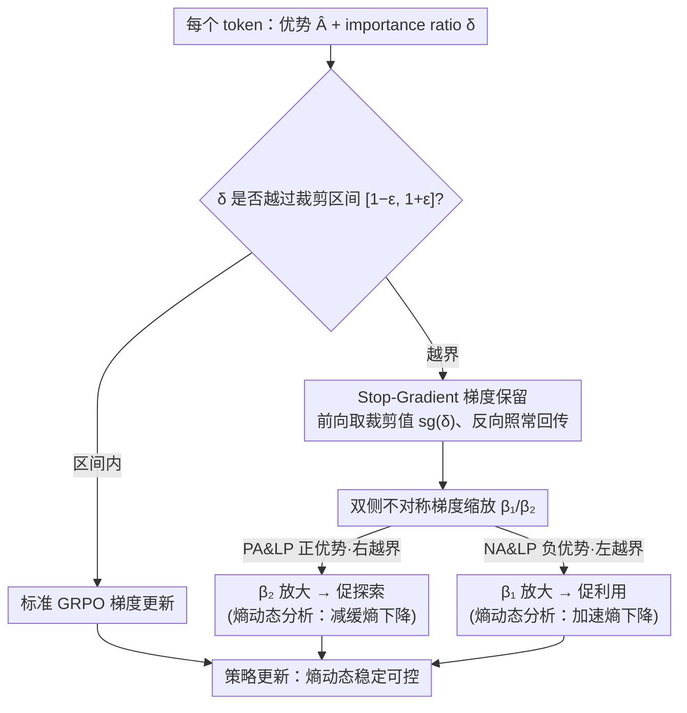

# CE-GPPO: Coordinating Entropy via Gradient-Preserving Clipping Policy Optimization in Reinforcement Learning

**会议**: ACL 2026  
**arXiv**: [2509.20712](https://arxiv.org/abs/2509.20712)  
**代码**: 无  
**领域**: 强化学习  
**关键词**: 策略优化, 熵动态控制, 梯度保留, PPO改进, 数学推理

## 一句话总结

提出 CE-GPPO 算法，通过 stop-gradient 操作重新引入 PPO 裁剪区间外低概率 token 的梯度信号，实现对策略熵的精细化协调控制，在探索-利用之间取得更好平衡。

## 研究背景与动机

**领域现状**：强化学习（RL）已成为优化 LLM 推理能力的核心范式，PPO 及其变体（GRPO、DAPO）被广泛使用。

**现有痛点**：PPO 的裁剪机制会丢弃低概率 token 的梯度信号，导致两类问题：(1) PA&LP（正优势低概率）token 被裁剪 → 熵坍缩；(2) NA&LP（负优势低概率）token 被裁剪 → 熵爆炸。

**核心矛盾**：DAPO 的 clip-higher 策略只缓解了上界裁剪（防熵坍缩），但对下界裁剪（防熵爆炸）无能为力，导致训练早期出现过度探索。

**本文目标**：通过统一管理裁剪区间两侧的 token 梯度，实现策略熵的稳定、可控演化。

**切入角度**：将熵动态控制重新定义为对裁剪区间外 token 梯度的管理问题。

**核心 idea**：通过 stop-gradient 解耦前向和反向传播，以可调系数 β₁/β₂ 分别控制左右裁剪边界外梯度的幅度，从而精细调节熵的升降节奏。

## 方法详解

### 整体框架

CE-GPPO 在 GRPO 基础上，对裁剪区间外的 token 不再完全丢弃梯度，而是以受控方式重新引入。对 PA&LP token（右侧越界，正优势）用 β₂ 放大以促探索；对 NA&LP token（左侧越界，负优势）用 β₁ 放大以促利用。当 β₁=β₂=0 时退化为标准 PPO。

### 关键设计

**1. Stop-Gradient 梯度保留机制：让越界 token 前向仍被裁剪、反向却能回传梯度**

PPO 的裁剪会把越界 token 的梯度整个丢掉，可如果直接放开裁剪、让这些 token 完整更新，策略又会大幅偏移、训练失稳。CE-GPPO 用 stop-gradient 在两者之间找平衡：对越界 token 的 importance ratio $\delta$ 施加 $\mathrm{sg}(\delta)$ 停梯度，使前向计算仍取裁剪值（稳定性不变），但反向传播时梯度可以照常流过，再乘上一个缩放系数。

这样梯度的幅度被牢牢限制在 $\beta\cdot(1\pm\varepsilon)$ 范围内——既把被丢弃的低概率 token 信号重新纳入更新，又不让它们把策略推得太远，实现了"前向保稳定、反向取信息"的鱼与熊掌兼得。

**2. 双侧不对称梯度缩放（$\beta_1$ / $\beta_2$）：分开调控探索与利用的强度**

裁剪区间两侧越界的 token 含义完全不同：右侧越界的 PA&LP（正优势低概率）token 被裁会导致熵坍缩，左侧越界的 NA&LP（负优势低概率）token 被裁会导致熵爆炸。把它们用同一个系数处理就管不住熵的双向漂移。CE-GPPO 因此给两侧各配一个独立系数：$\beta_2$ 放大 PA&LP token 的梯度以促探索，$\beta_1$ 放大 NA&LP token 的梯度以促利用。

两个旋钮独立可调，就能精细地协调熵的升降节奏。实验发现 $\beta_2 > \beta_1$ 更利于保持探索能力，例如 7B 模型上 $\beta_1=0.75, \beta_2=1$ 效果最佳；当 $\beta_1=\beta_2=0$ 时方法退化为标准 PPO。

**3. 熵动态理论分析：把"梯度保留为何能控熵"从经验上升为理论**

前两个设计的有效性需要一个解释，否则系数只能盲调。作者从熵变公式（策略概率与优势函数的协方差）出发，证明 PA&LP token 会减缓熵的下降、对应促探索，NA&LP token 会加速熵的下降、对应促利用。

这条分析把"放大哪一侧梯度会让熵怎么变"讲清楚了，于是 $\beta_1$ / $\beta_2$ 的取向不再是碰运气：想保熵就调大 $\beta_2$、想收熵就调大 $\beta_1$，超参数选择有了理论依据。

### 损失函数 / 训练策略

目标函数在 GRPO 基础上修改三分支 loss：越界负优势 → β₁·(1-ε)/sg(δ)·δ·Â；越界正优势 → β₂·(1+ε)/sg(δ)·δ·Â；其余不变。训练使用 KlearReasoner-MathSub-30K 数据集，lr=1e-6，rollout=8，ε=0.2，最大 1000 步（~10 epoch）。

## 实验关键数据

### 主实验

| 方法 | AIME24 | AIME25 | HMMT25 | MATH500 | AMC23 | HumanEval | LCB v6 |
|------|--------|--------|--------|---------|-------|-----------|--------|
| DS-R1-1.5B (base) | 29.2 | 24.1 | 13.1 | 86.0 | 73.7 | 70.4 | 25.1 |
| + GRPO | 33.4 | 28.1 | 16.6 | 88.3 | 79.3 | 67.5 | 27.1 |
| + DAPO | 40.0 | 28.4 | 19.2 | 90.0 | 84.4 | 73.2 | 30.5 |
| + CE-GPPO (β₁=0.5) | 42.0 | 33.9 | 21.6 | 91.0 | 85.9 | 76.5 | 31.7 |
| DS-R1-7B (base) | 54.5 | 39.1 | 26.2 | 93.6 | 90.6 | 89.6 | 49.0 |
| + GRPO | 55.3 | 40.3 | 24.5 | 93.7 | 88.8 | 88.6 | 49.2 |
| + DAPO | 59.7 | 48.7 | 25.6 | 95.1 | 93.4 | 92.5 | 52.2 |
| + CE-GPPO (β₁=0.75) | **66.0** | **51.4** | **30.5** | **95.6** | **93.8** | **93.0** | **53.6** |

### 消融实验

| β₁/β₂ 配置 | 熵趋势 | 1.5B AIME24 | 7B AIME25 |
|------------|--------|-------------|-----------|
| β₁=1, β₂=0.5 | 快速坍缩 | 性能先升后骤降 | — |
| β₁=0, β₂=1 | 持续上升 | 较好 | 不稳定 |
| β₁=0.5, β₂=1 | 高位稳定 | 42.0 | 49.1 |
| β₁=0.75, β₂=1 | 缓慢下降 | 43.6 | **51.4** |

### 关键发现

- GRPO 原生存在严重的熵坍缩问题，DAPO 虽能缓解但训练早期熵过高（过度探索）
- CE-GPPO 在训练全程保持熵平稳，KL 散度和梯度范数均无异常波动
- 较大 β₂（放大探索梯度）+ 较小 β₁（限制利用梯度）有利于性能，β₁=0.75, β₂=1 为推荐默认值
- 与 CISPO 对比：CISPO 训练后期出现模型坍缩，CE-GPPO 保持稳定；与 GSPO 对比：CE-GPPO 在 AIME25/HMMT25 上明显优于 GSPO

## 亮点与洞察

- 从 token 概率-优势函数交互的角度系统解释了 RL 训练中的熵动态，视角新颖且深刻
- stop-gradient 的设计巧妙：前向保持裁剪的稳定性，反向恢复梯度的信息量，实现"鱼与熊掌兼得"
- 方法简洁高效：仅改变 loss 的元素级重加权，不引入额外前向传播或辅助模块
- 对超参数有较好的鲁棒性，β₁=0.5, β₂=1 和 β₁=0.75, β₂=1 在不同模型规模上都有效

## 局限与展望

- 虽然展示了超参数鲁棒性，但不同模型的最优 β₁/β₂ 仍需微调
- 仅在数学推理任务上验证，在代码生成、指令遵循等任务上的泛化性有待考察
- 论文声称与 GSPO 互补，但未在同一框架下联合测试
- 熵的最优动态轨迹可能因任务/模型而异，自适应调节机制是重要的未来方向

## 相关工作与启发

- 与 DAPO (clip-higher) 的关系：DAPO 仅解决上界裁剪，CE-GPPO 同时处理两侧，更为完整
- 与 entropy regularization 的对比：传统熵正则对系数极敏感（α=0.001 无效，α=0.003 爆炸），CE-GPPO 更稳定
- Kimi K2 的训练经验（早期探索+后期利用）与本文发现一致，可通过分阶段调 β 实现

## 评分

- 新颖性: ⭐⭐⭐⭐ 从裁剪外 token 梯度角度重新理解熵控制，视角独特且有理论支撑
- 实验充分度: ⭐⭐⭐⭐ 多尺度模型、多基线对比、详细的超参数分析和稳定性验证
- 写作质量: ⭐⭐⭐⭐ 从问题分析到方法设计逻辑严谨，图表丰富直观

<!-- RELATED:START -->

## 相关论文

- [\[ICLR 2026\] Entropy-Preserving Reinforcement Learning (REPO / ADAPO)](../../ICLR2026/reinforcement_learning/entropy-preserving_reinforcement_learning.md)
- [\[ACL 2026\] RL-PLUS: Countering Capability Boundary Collapse of LLMs in Reinforcement Learning with Hybrid-policy Optimization](rl-plus_countering_capability_boundary_collapse_of_llms_in_reinforcement_learnin.md)
- [\[ACL 2026\] DPEPO: Diverse Parallel Exploration Policy Optimization for LLM-based Agents](dpepo_diverse_parallel_exploration_policy_optimization_for_llm-based_agents.md)
- [\[ACL 2026\] d-TreeRPO: Towards More Reliable Policy Optimization for Diffusion Language Models](d-treerpo_towards_more_reliable_policy_optimization_for_diffusion_language_model.md)
- [\[ICLR 2026\] Exploration vs Exploitation: Rethinking RLVR through Clipping, Entropy, and Spurious Reward](../../ICLR2026/reinforcement_learning/exploration_vs_exploitation_rethinking_rlvr_through_clipping_entropy_and_spuriou.md)

<!-- RELATED:END -->
