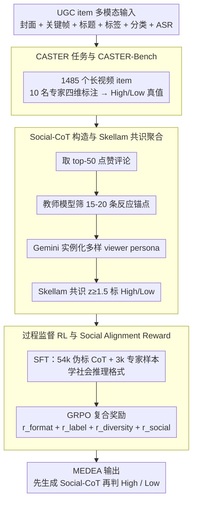

# Community-Aware Assessment of Social Textual Engagement and Resonance: A Human-Centric Perspective on User-Generated Content Evaluation

**会议**: ACL2026  
**arXiv**: [2606.01897](https://arxiv.org/abs/2606.01897)  
**代码**: 待确认  
**领域**: 多模态评估 / 强化学习对齐  
**关键词**: UGC质量评估, Social-CoT, 社区共鸣, GRPO, 多模态推理

## 一句话总结
这篇论文提出 CASTER 任务与 CASTER-Bench，并用 MEDEA 通过 Social-CoT、SFT 和带 Social Alignment Reward 的过程监督强化学习来模拟社区反应，在 CASTER-Bench 上把 High-Quality F1 提升到 0.650、Macro-F1 提升到 0.749，显著优于传统 VQA 和通用 LMM 基线。

## 研究背景与动机
**领域现状**：传统视频质量评估主要衡量清晰度、失真、审美和技术质量。近年来 LMM 也开始用于 UGC 质量估计，但大多仍把文本信息当作静态特征，或用普通 CoT 做逻辑分析。

**现有痛点**：真实 UGC 平台上的“好内容”并不只由画质决定。一个视频可能技术普通，却因叙事、情绪、知识价值或社区文化获得强烈正反馈；也可能播放量很高，却靠标题党、低俗刺激或诱导评论获得流量。仅靠视觉信号或一般多模态推理，很难区分“看起来不错”和“真正让社区产生积极共鸣”。

**核心矛盾**：平台需要在早期推荐和审核阶段判断内容的内在质量，但新上传内容往往还没有足够评论；模型必须从封面、关键帧、标题、标签、ASR 和元数据中推断潜在社区反应。这要求模型具备类似 Theory of Mind 的社会推理，而不是只做信号质量回归。

**本文目标**：作者提出 CASTER，把 UGC 质量评估重新定义为“内容是否获得正向社区共鸣”。为此，他们构建 CASTER-Bench，并提出 MEDEA：先模拟多样观众 persona 的 Social-CoT，再聚合成最终高/低质量判断。

**切入角度**：论文不是让模型直接输出二分类，而是要求它先生成多个“社区评论式”的共情推理路径。训练阶段再用真实高互动评论和专家标签约束这些推理路径，使模型学到更接近真实社区认知的判断标准。

**核心 idea**：用 Social-CoT 显式模拟“community mind”，再通过 Social Alignment Reward 把生成的社会推理路径对齐到真实用户评论，从而让 UGC 质量评估从画质判断转向社区共鸣建模。

## 方法详解

### 整体框架
论文包含两个核心产物。第一个是 CASTER-Bench：1,485 个长视频 UGC item，覆盖 30 个主要内容类别，每个 item 包含视频帧、封面、标题、标签、分类、ASR transcript 等多模态输入，并由 10 名专业内容运营专家按 Production Quality、Perceived Value、Information Utility、Narrative Excellence 四个维度标注。第二个是 MEDEA：一个多模态评估框架，先从社区评论挖掘 Social-CoT 训练数据，再用 SFT 学习社会推理格式，最后通过 GRPO 和社会对齐奖励优化推理过程。整条链路自上而下依次落在三个关键设计上——先由 CASTER-Bench 提供专家真值，再从评论构造可监督的社会推理路径，最后用过程监督 RL 把模型训到贴近真实社区判断。

### 关键设计

**1. CASTER 任务与 CASTER-Bench：把质量评估从画质打分换成社区共鸣判断**

传统 VQA 数据集大多是 8–20 秒短 clip，只能衡量清晰度、失真、审美这类信号质量，根本覆盖不了长视频靠叙事、知识密度和情绪共鸣取胜的价值来源。CASTER 因此重新定义任务：给定 cover image、关键帧、title、tags、category metadata 和 ASR transcript，模型要预测内容能否获得正向社区反馈（High-Quality），而不是回归一个技术质量分。配套的 CASTER-Bench 收了 1,485 个 UGC item、平均时长 442 秒、总时长 182.5 小时，标签分布为 Excellent 10.6%、Good 17.0%、Average 38.6%、Poor 33.7%——High-Quality 类天然稀少，这也决定了后面 High-Quality F1 才是最关键的指标。

**2. Social-CoT 构造与 Skellam 共识聚合：用真实评论造出可监督的社会推理路径**

要训练模型「模拟社区怎么想」，就得有社区反应的监督信号。系统对未标注 UGC 取 top-50 点赞评论，用教师模型筛出 15–20 条与创造性、情绪、叙事相关的反应锚点，再让 Gemini-2.5-Flash 实例化多样的 viewer persona，解释是哪些视觉/叙事元素触发了这些反应。每条模拟评论被赋予支持或反对 stance：设支持数为 $X$、反对数为 $Y$，用 $z=(X-Y)/\sqrt{X+Y}$ 算 Skellam-normalized consensus，当 $z\geq1.5$ 时标为 High-Quality，否则为 Low-Quality。之所以不用简单多数投票，是因为投票容易被评论数量和情绪偏差带偏，而 Skellam 标准化把判断变成「是否存在有统计意义的社区支持」，更接近真实的社区共识。

**3. 过程监督 RL 与 Social Alignment Reward：让推理路径贴近真实社区语言而非模板赞美**

只 prompt 一个通用 LMM 去写 Social-CoT，它学不会某个平台的社区标准，还容易塌缩成千篇一律的「so beautiful」式空话。MEDEA 先用 54k Gemini-labeled CoT 样本加 3k human-annotated UGC 做 SFT，再在专家样本上用 GRPO 优化一个复合奖励 $r=r_{format}+r_{label}+r_{diversity}+r_{social}$：$r_{format}$ 保证输出结构，$r_{label}$ 奖励最终二分类正确，$r_{diversity}$ 惩罚重复的情绪路径，$r_{social}$ 把生成 persona 与 held-out 真实高互动评论做 embedding 余弦匹配后取平均。关键在 $r_{social}$ 提供了「社会 grounding」——用真实评论相似度而非只用标签正确来约束推理过程，避免 Social Mode Collapse，让模型生成的反应在情绪粒度和语言上都更像真实社区。

### 损失函数或训练策略
训练分两阶段。SFT 阶段 batch size 256，学习率 $5e^{-6}$，cosine schedule，decay ratio 0.2。RL 阶段 batch size 64，学习率 $1e^{-6}$，cosine schedule，PPO clip ratio 0.2，KL coefficient 0.001，entropy coefficient 0.001，rollout number 8，rollout temperature 0.6。推理时 top-k 50、top-p 0.7、temperature 0.6。论文强调 RL 只使用 human-curated samples，以保证强化信号锚定专家标注，而不是继续放大教师模型伪标签偏差。

## 实验关键数据

### 主实验
CASTER-Bench 的 High-Quality 类样本较少，因此 High-Quality F1 是最关键指标。MEDEA 显著优于传统 VQA、标准 LMM、Long-CoT LMM 和纯 prompt 的 Social-CoT 模拟。

| 方法 | HQ Precision | HQ Recall | HQ F1 | Macro-F1 | 备注 |
|------|-------------:|----------:|------:|---------:|------|
| FastVQA | 0.347 | 0.440 | 0.388 | 0.554 | 传统 VQA |
| MaxVQA | 0.345 | 0.518 | 0.414 | 0.552 | 传统 VQA 最强之一 |
| Qwen3-VL-Plus | 0.366 | 0.893 | 0.519 | 0.542 | 标准 LMM，高召回低精度 |
| GPT-5.2 reasoning | 0.401 | 0.903 | 0.555 | 0.595 | 最强 Long-CoT 基线 |
| Qwen3-VL-Plus social-CoT | 0.380 | 0.766 | 0.508 | 0.578 | prompt 模拟 Social-CoT |
| Claude-4.5-opus social-CoT | 0.371 | 0.810 | 0.510 | 0.561 | prompt 模拟 Social-CoT |
| MEDEA | 0.603 | 0.705 | 0.650 | 0.749 | 完整方法 |

### 消融实验
| 配置 | HQ F1 | Low-Quality F1 | Macro-F1 | 说明 |
|------|------:|---------------:|---------:|------|
| SFT-pseudo-label | 0.487 | 0.686 | 0.587 | 只用伪标签，能学格式但判断弱 |
| SFT-human-label | 0.371 | 0.710 | 0.541 | 人工样本少，召回不足 |
| SFT-w/o-social-CoT | 0.510 | 0.638 | 0.574 | 去掉 Social-CoT 后高质召回高但不稳 |
| RL-pseudo+human | 0.536 | 0.848 | 0.692 | RL 提升整体性能 |
| RL-w/o-social-reward | 0.613 | 0.836 | 0.725 | 缺少社会对齐，易模板化 |
| RL-w/o-social-CoT | 0.421 | 0.821 | 0.621 | 去掉社会推理路径大幅掉点 |
| MEDEA(RL-human-label) | 0.650 | 0.847 | 0.749 | 完整方法 |

### 成本与模态分析
| 分析项 | 关键数据 | 结论 |
|--------|----------|------|
| token 开销 | MEDEA 平均 1,256 tokens/item；w/o Social-CoT 为 5.6 | 社会推理显著增加生成长度 |
| 推理速度 | MEDEA 0.79 videos/sec；w/o Social-CoT 2.55 videos/sec | 在 4×H800 + vLLM + 8 workers 下吞吐下降明显 |
| 模态消融 | Text-Only Macro-F1 0.698；Vision-Only 0.681；MEDEA 0.749 | 文本和视觉互补，单模态不足 |
| 推理质量 | Faithfulness 4.211 vs 2.471；Diversity 2.743 vs 1.058 | Social Alignment Reward 提升 grounding 与多样性 |

### 关键发现
- 通用 LMM 有 generosity bias：GPT-5.2、Claude-4.5-opus 等模型 High-Quality recall 可超过 90%，但 precision 约 30%-40%，会把普通内容过度解释为好内容。
- 传统 VQA 偏向 Low-Quality 类，High-Quality F1 多在 0.33-0.41，说明画质信号不足以发现社区共鸣。
- 仅 prompt 出 Social-CoT 不能替代训练；Qwen3-VL-Plus social-CoT 的 HQ F1 为 0.508，明显低于 MEDEA 0.650。
- 社会对齐奖励不只是提高分类分数，也减少重复、空泛的“so beautiful”式模板推理。

## 亮点与洞察
- **重新定义 UGC 质量**：论文把目标从 signal quality 改成 community resonance，这个任务设定比单纯刷 VQA 分数更贴近平台需求。
- **Social-CoT 是可解释中间层**：模型不直接给标签，而是先模拟多种观众反应，使错误分析更容易落到具体叙事、情绪或信息价值上。
- **奖励设计抓住了社会语言的真实性**：$r_{social}$ 用真实高互动评论作为锚点，比只奖励标签正确更能约束推理过程。
- **数据集设计考虑真实长视频**：平均 442 秒、182.5 小时总时长，明显不同于短 clip 技术质量数据集。

## 局限与展望
- Social-CoT 带来明显推理开销，尽管 MEDEA 参数小于部分 API LMM，实时推荐场景仍需要缓存、蒸馏或早退机制。
- 社会对齐是在特定平台动态上优化的，迁移到不同文化、社区规范或内容生态时可能需要重新标注和对齐。
- 二分类 High/Low 过于粗糙，社区共鸣本身是连续、多维且随时间变化的。
- 当前依赖丰富多模态 metadata；在只有标题、只有封面或评论极稀疏的场景中效果仍需验证。
- 未来可以扩展到多级质量、分社区偏好建模、时间动态共鸣预测，以及更轻量的 Social-CoT 蒸馏模型。

## 相关工作与启发
- **vs FastVQA / DOVER / MaxVQA / Q-Align / FineVQ**: 传统和现代 VQA 关注视觉技术/审美质量；CASTER 关注内容是否触发真实社区正反馈。
- **vs Long-CoT LMM**: 长推理模型会产生详细分析，但没有社区标准训练时容易过度宽容；MEDEA 用专家标签和真实评论约束这种偏差。
- **vs prompt-only Social-CoT**: 只给模型提示词能改善部分社会视角，但训练和 reward 才能内化“哪些反应是真实、有区分度的”。
- **启发**：对推荐、审核和创作者反馈系统，可以把“模拟用户群体反应”作为可解释评估中间层，但必须用真实社区数据和专家标准约束，避免生成漂亮却空洞的评论。

## 评分
- 新颖性: ⭐⭐⭐⭐⭐ 任务重定义、Social-CoT 和社会对齐奖励结合得很有辨识度。
- 实验充分度: ⭐⭐⭐⭐☆ 主实验、消融、成本、模态和推理质量都较完整；跨平台泛化还缺实证。
- 写作质量: ⭐⭐⭐⭐☆ 故事线强，方法和动机清楚；个别表述如 “GPT-5.2/Gemini-3.0” 带有未来模型色彩，需要读者按论文设定理解。
- 价值: ⭐⭐⭐⭐☆ 对 UGC 推荐和多模态社会推理很有启发，但落地时需要认真处理成本、隐私和平台偏差。

<!-- RELATED:START -->

## 相关论文

- [\[AAAI 2026\] Object-Centric World Models for Causality-Aware Reinforcement Learning](../../AAAI2026/reinforcement_learning/object-centric_world_models_for_causality-aware_reinforcement_learning.md)
- [\[AAAI 2026\] A Multi-Agent Conversational Bandit Approach to Online Evaluation and Selection of User-Aligned LLM Responses](../../AAAI2026/reinforcement_learning/a_multi-agent_conversational_bandit_approach_to_online_evaluation_and_selection_.md)
- [\[AAAI 2026\] G-UBS: Towards Robust Understanding of Implicit Feedback via Group-Aware User Behavior Simulation](../../AAAI2026/reinforcement_learning/g-ubs_towards_robust_understanding_of_implicit_feedback_via_group-aware_user_beh.md)
- [\[ACL 2026\] The Stackelberg Speaker: Optimizing Persuasive Communication in Social Deduction Games](the_stackelberg_speaker_optimizing_persuasive_communication_in_social_deduction_.md)
- [\[ICLR 2026\] PreferThinker: Reasoning-based Personalized Image Preference Assessment](../../ICLR2026/reinforcement_learning/preferthinker_reasoning-based_personalized_image_preference_assessment.md)

<!-- RELATED:END -->
