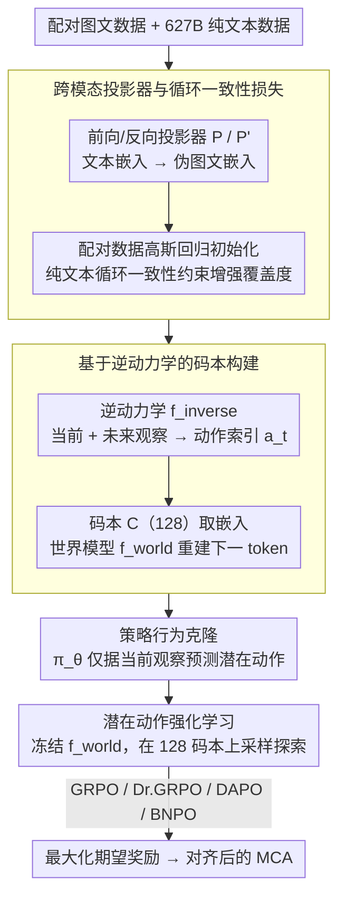

# Controlling Multimodal Conversational Agents with Coverage-Enhanced Latent Actions

**会议**: ACL 2026  
**arXiv**: [2601.07516](https://arxiv.org/abs/2601.07516)  
**代码**: [GitHub](https://github.com/AlibabaResearch/DAMO-ConvAI/tree/main/MMLatentAction)  
**领域**: 强化学习 / 多模态对话  
**关键词**: 潜在动作, 强化学习, 多模态对话, 视觉语言模型, 跨模态投影

## 一句话总结

提出为多模态对话智能体（MCA）构建紧凑的潜在动作空间来替代巨大的 token 动作空间进行 RL 微调，通过跨模态投影器和循环一致性损失利用配对图文数据和纯文本数据共同构建码本，将动作空间从 152K（词表大小）压缩到 128（码本大小），在两个对话任务上全面超越 token 级 RL 基线。

## 研究背景与动机

**领域现状**：视觉语言模型（VLM）如 Qwen-VL 和 GPT-4o 越来越多地被用作多模态对话智能体（MCA），支持基于图像和文本的情感丰富、上下文相关的对话。RL 已被广泛探索用于将 MCA 适配到多样的人机交互场景。

**现有痛点**：token 级 RL 面临巨大的探索空间挑战——词表大小 $|\mathcal{V}|=152K$（Qwen2.5-VL），最大响应长度 $m$ 步，采样空间指数增长为 $|\mathcal{V}|^m$。这导致 RL 探索效率低下、多样性不足。

**核心矛盾**：构建潜在动作空间需要足够覆盖度的多样数据，但 VLM 所需的配对图文数据标注成本高昂且规模有限。仅用有限配对数据训练码本会导致覆盖不足，影响泛化能力；引入大量非配对文本数据则可能引入单模态偏差（模型过度依赖文本而忽略视觉信息）。

**本文目标**：为 MCA 设计一种覆盖度增强的潜在动作空间构建方法，利用配对图文数据和大规模纯文本数据，同时避免单模态偏差。

**切入角度**：作者借鉴"从观察中学习"（learning from observation）机制来构建潜在动作码本——利用未来观察推断当前潜在动作，再用潜在动作重建未来观察。

**核心 idea**：训练一个跨模态投影器 $P$ 将文本嵌入映射到图文嵌入空间，用配对数据初始化、用纯文本数据 + 循环一致性损失增强鲁棒性，从而安全地利用 627B token 的纯文本数据扩展码本覆盖度。

## 方法详解

### 整体框架

在基础 VLM 之上引入三个新模块：(1) 语言世界模型 $f_{\text{world}}$ 接收当前观察和潜在动作，自回归生成下一个 token；(2) 逆动力学模型 $f_{\text{inverse}}$ 根据未来观察推断当前潜在动作索引；(3) 策略模型 $\pi_\theta$ 仅根据当前观察预测潜在动作。整个流程分两阶段：第一阶段构建潜在动作空间——先用跨模态投影器（cross-modal projector）把海量纯文本数据接进训练以增强覆盖度，再通过逆动力学学习出 128 大小的码本，并用行为克隆把策略模型对齐到该动作空间；第二阶段冻结世界模型，在紧凑的潜在动作空间上做下游任务的 RL 微调。

### 关键设计

**1. 跨模态投影器与循环一致性损失：安全地把海量纯文本数据接进码本**

构建潜在动作码本需要足够覆盖度的数据，但 VLM 的配对图文数据标注昂贵、规模有限，仅靠它训码本会覆盖不足；可如果直接把大量纯文本嵌入塞进来，又会引入单模态偏差，让模型过度依赖文本忽略视觉。解法是训一个前向投影器 $P$，把文本嵌入 $e^T$ 映射成对角高斯分布参数 $(\mu, \sigma) = P(e^T)$，再配一个反向投影器 $P'$ 做逆映射。两个投影器先在配对数据上用高斯回归损失 $\mathcal{L}_{\text{t2vt}} + \mathcal{L}_{\text{vt2t}}$ 初始化，再在纯文本数据上用循环一致性损失 $\mathcal{L}_{\text{cycle}}$ 联合训练，约束 $P'(P(e^T)) \approx e^T$。这样即便没有真实图像，也能生成合理的伪图文嵌入；循环一致性保证投影器在非配对数据上仍不偏离真实图文空间，从而把 627B token 的纯文本数据安全地用来扩展码本覆盖度。

**2. 基于逆动力学的码本构建：用「推断+重建」无监督地学出可控的潜在动作**

要在没有动作标注的情况下得到能控制生成的离散动作，作者借鉴「从观察中学习」：逆动力学模型 $f_{\text{inverse}}$ 看到当前和未来观察后输出离散动作索引 $a_t \in \{1, \ldots, |\mathcal{C}|\}$，从可学习码本 $\mathcal{C} \in \mathbb{R}^{|\mathcal{C}| \times d}$ 中取出对应嵌入 $c_{a_t}$，世界模型 $f_{\text{world}}$ 再用这个嵌入和当前观察重建下一个 token，三者联合训练，损失为 $\mathcal{L}_{\text{inverse}} = -\sum_t \log f_{\text{world}}(x^T_{t+1} | e^{V,T}_t, a_t)$。这个「逆动力学推断 + 重建」的双向约束逼着码本去编码真正控制生成的高级语义信息，而最终码本大小 $|\mathcal{C}|=128$ 相比 152K 的词表，把 RL 的探索空间压了三个数量级。

**3. 潜在动作强化学习：在紧凑潜在空间里采样，换取更快更多样的探索**

token 级 RL 的采样空间随响应长度指数爆炸（$|\mathcal{V}|^m$），探索效率低。潜在动作 RL 则把动作搬到码本上：冻结世界模型，只优化策略模型 $\pi_\theta$ 的潜在动作预测分布，每步采样 $a_t \sim \pi_\theta(\cdot | x^V, x^T_{1:t})$、由世界模型生成 token $x^T_{t+1} = f_{\text{world}}(x^V, x^T_{1:t}, a_t)$，最大化期望奖励 $\mathcal{J}(\theta) = \mathbb{E}[R(x^T_{p+1:m})]$，并兼容 GRPO、Dr.GRPO、DAPO、BNPO 等多种算法。因为只更新潜在动作分布而非整个 token 分布，策略更新反而更快（0.86× 基线时间），rollout 的语义多样性也从约 1.07 提升到约 1.25。

### 损失函数 / 训练策略

三个阶段的损失：(1) 投影器初始化 $\mathcal{L}_{\text{proj}_1} = \mathcal{L}_{\text{t2vt}} + \mathcal{L}_{\text{vt2t}}$；(2) 逆动力学+投影器联合训练 $\mathcal{L}_{\text{inverse}} + \mathcal{L}_{\text{proj}_2}$；(3) 策略行为克隆 $\mathcal{L}_{\text{bc}}$。数据规模：14M 图像 + 1B 文本 token（配对）+ 627B 文本 token（纯文本）。

## 实验关键数据

### 主实验

Qwen2.5-VL-3B-Instruct，LLM-as-a-Judge 分数比率：

| 方法 | MMRole-ID | MMRole-OOD | PCogAlign-LS1 | PCogAlign-LS2 | 平均 |
|------|-----------|------------|---------------|---------------|------|
| SFT | 0.843 | 0.809 | 0.808 | 0.810 | 0.817 |
| GRPO (Token) | 0.838 | 0.796 | 0.845 | 0.845 | 0.831 |
| **GRPO (Latent)** | **0.949** | **0.915** | **0.871** | 0.837 | **0.893** |
| Dr.GRPO (Token) | 0.867 | 0.823 | 0.835 | 0.834 | 0.840 |
| **Dr.GRPO (Latent)** | **0.953** | **0.916** | **0.874** | **0.840** | **0.896** |

Rollout 语义多样性对比：

| 方法 | MMRole | PCogAlignBench |
|------|--------|---------------|
| GRPO (Token) | 1.079 | 1.042 |
| GRPO (Latent) | **1.248** | **1.191** |
| DAPO (Token) | 1.073 | 1.038 |
| DAPO (Latent) | **1.253** | **1.127** |

### 消融实验

基于 GRPO + Qwen2.5-VL-3B-Instruct：

| 设置 | MMRole-ID | MMRole-OOD | PCogAlign-LS1 | 平均 |
|------|-----------|------------|---------------|------|
| 完整方法 | 0.949 | 0.915 | 0.871 | 0.893 |
| 去掉循环一致性 | 0.921 | 0.878 | 0.858 | 0.870 |
| 去掉跨模态投影器 | 0.944 | 0.901 | 0.858 | 0.880 |
| 去掉纯文本数据 | 0.932 | 0.861 | 0.851 | 0.865 |

### 关键发现

- 潜在动作 RL 平均比 token 级 RL 提升 4%，且在所有四种 RL 算法上一致有效
- 语义多样性大幅提升：GRPO 从 1.079 提升到 1.248（MMRole），证实了探索效率改善
- 纯文本数据是最关键组件——去掉后 OOD 性能下降最大（0.915→0.861），说明覆盖度对泛化至关重要
- 总训练时间仅增加 1.08×，策略更新反而更快（0.86×），整体开销可控

## 亮点与洞察

- 首次将潜在动作引入多模态对话智能体的 RL 微调，152K→128 的压缩率极其显著
- 循环一致性损失巧妙利用了跨模态冗余假设，将有限的配对数据与海量纯文本数据桥接
- RL 算法无关性（GRPO/Dr.GRPO/DAPO/BNPO 均适用）表明潜在动作是底层通用范式

## 局限与展望

- 潜在动作缺乏可解释性——不清楚 128 个码字分别编码了什么语义概念
- 仅在对话任务上验证，视觉数学推理等更广泛任务和更大 VLM 留待未来
- 推理延迟增加 1.13×，在实时对话场景中可能值得优化

## 相关工作与启发

- CoLA (Jia et al., 2025) 首次将潜在动作引入纯文本 LLM，本文将其扩展到多模态场景并解决了配对数据稀缺问题
- 机器人学中的 learning from observation 思想为构建潜在空间提供了理论基础
- 启发：RL 微调 VLM 的核心瓶颈不在算法本身，而在于动作空间的表征——从 token 级到潜在级的抽象可能是通向更高效 RL 对齐的关键路径

## 评分

- 新颖性: ⭐⭐⭐⭐ 将潜在动作引入多模态对话 RL 是新颖的组合创新，循环一致性损失设计精巧
- 实验充分度: ⭐⭐⭐⭐ 两个任务 × 两个模型规模 × 四种 RL 算法，消融和多样性分析完整
- 写作质量: ⭐⭐⭐⭐ 方法描述清晰，Pipeline 图表信息量大，但符号系统略显复杂

<!-- RELATED:START -->

## 相关论文

- [\[CVPR 2026\] Anticipatory Planning for Multimodal AI Agents](../../CVPR2026/reinforcement_learning/anticipatory_planning_for_multimodal_ai_agents.md)
- [\[ACL 2026\] SpiralThinker: Latent Reasoning through an Iterative Process with Text-Latent Interleaving](spiralthinker_latent_reasoning_through_an_iterative_process_with_text-latent_int.md)
- [\[ACL 2026\] DPEPO: Diverse Parallel Exploration Policy Optimization for LLM-based Agents](dpepo_diverse_parallel_exploration_policy_optimization_for_llm-based_agents.md)
- [\[ACL 2026\] Breaking the Impasse: Dual-Scale Evolutionary Policy Training for Social Language Agents](breaking_the_impasse_dual-scale_evolutionary_policy_training_for_social_language.md)
- [\[ICLR 2026\] A Unifying View of Coverage in Linear Off-Policy Evaluation](../../ICLR2026/reinforcement_learning/a_unifying_view_of_coverage_in_linear_off-policy_evaluation.md)

<!-- RELATED:END -->
