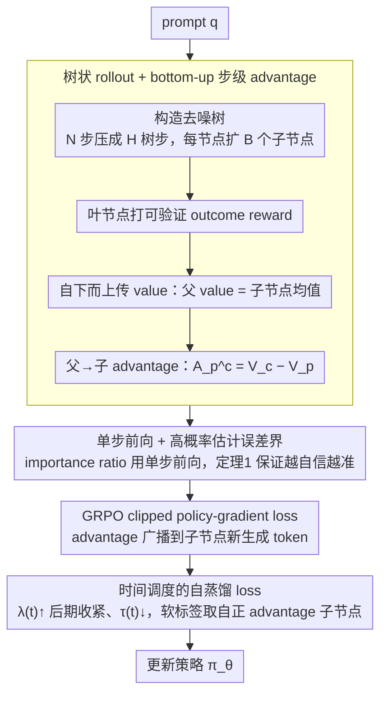

# d-TreeRPO: Towards More Reliable Policy Optimization for Diffusion Language Models

**会议**: ACL 2026  
**arXiv**: [2512.09675](https://arxiv.org/abs/2512.09675)  
**代码**: https://github.com/THU-BPM/d-TreeRPO （有）  
**领域**: 强化学习 / 扩散语言模型 / 推理 LLM  
**关键词**: dLLM, GRPO, 树状 rollout, 步级 advantage, 自蒸馏

## 一句话总结
针对扩散语言模型（dLLM）RL 的两大可靠性瓶颈 —— 奖励稀疏 / 概率估计偏差 —— 作者提出 d-TreeRPO：把 rollout 组织成树，用叶子节点的可验证奖励自下而上算出步级 advantage；同时理论证明「模型越自信，单步前向概率估计越准」，并设计时间调度的自蒸馏 loss 在训练后期收紧策略，最终在 LLaDA-8B-Instruct 上 Sudoku +86.2% / Countdown +51.6% / GSM8K +4.5% / Math500 +5.3%。

## 研究背景与动机
**领域现状**：dLLM（如 LLaDA / Dream / Seed Diffusion）以并行去噪取代自回归解码，推理速度更快；强化学习（PPO / GRPO 家族）已被广泛迁移过来增强其推理能力，代表工作有 Diffu-GRPO、VRPO (LLaDA-1.5)、wd1、SAPO、GDPO、TraceRL。

**现有痛点**：dLLM RL 在两个核心组件上同时出问题。(1) **奖励稀疏 / 不可验证**：多数方法把最终 outcome reward 均匀广播到所有 token，advantage 退化为常数；或者用学到的 process reward model 引入 reward hacking 风险。(2) **概率估计偏差**：dLLM 是任意顺序去噪，真实 token 概率应是「所有解码顺序」上的期望（公式 3），但实际算不动；ELBO 估计是有偏下界且需多次前向，单步前向估计便宜却没有理论保证。

**核心矛盾**：精确度 vs 计算量 —— 想要 fine-grained 且 verifiable 的 advantage，就得引入更多 rollout；想要准确的 $\log\pi$，就得多次前向；两边都贵，又彼此独立设计，缺少统一框架。

**本文目标**：(i) 在同样的 rollout 预算下给出 step-wise 且 verifiable 的 advantage；(ii) 找到一种「不增加前向次数」的策略让单步估计变准；(iii) 理论上量化两者之间的关系。

**切入角度**：把 rollout 树化 —— 父子节点之间天然对应「一段去噪步」的状态转移，叶子的 verifiable outcome reward 沿树自下而上传播就得到天然的 step-wise reward；同时观察到单步估计与真实期望之间的差距随策略 confidence 单调收紧，于是用一个时间调度的自蒸馏 loss 在后期主动提升 confidence。

**核心 idea**：用「树结构 + bottom-up reward」解决稀疏奖励，用「时间调度自蒸馏」解决概率估计偏差，二者在同一 GRPO 框架里互相成全。

## 方法详解

### 整体框架
对每个 prompt $q$，把 $N$ 步去噪按合并因子 $s$ 压成 $H=N/s$ 棵树步；每个非叶节点扩出 $B$ 个子节点，每个子节点对应连续 $s$ 步去噪，最终得到 $B^H$ 个完整生成的叶节点。叶节点用 verifiable outcome reward 打分，内部节点的 value 是子节点 value 的平均（公式 6），父-子转移的 advantage 是子节点 value 减父节点 value（公式 7）。loss 在「深度为 1 的子树」上按 GRPO 风格对每个子节点计算，importance ratio 用单步前向估计的 token 概率；额外叠加时间调度的自蒸馏 loss 让策略在后期向「高 advantage 子节点的 token 分布」收敛。

### 关键设计

**1. 树状 rollout + bottom-up 步级 advantage：把单个 outcome reward 拆成每一步去噪上的可验证 advantage**

dLLM RL 常见做法是把最终 outcome reward 均匀广播到所有 token，于是每个 token 看到的 advantage 都一样，credit assignment 全靠运气；用学到的 process reward model 又会引入 reward hacking。d-TreeRPO 把 rollout 树化来绕开这两条路：父节点 value 取子节点均值 $V_p = \frac{1}{|C_p|}\sum_{c\in C_p} V_c$，父→子转移的 advantage 是 $A^c_p = V_c - V_p$，同一父节点下的所有子节点当作一个 group 算相对 advantage，这个标量再广播到该子节点新生成的所有 token 上。配合 block-wise 解码（块长 $b$，每棵树步刚好覆盖整数块），同父子节点解出的 token 位置对齐，单步前向概率才有可比性。这样每一步去噪的 advantage 都来自真实的 value 差分，等价于隐式构造了一个 verifiable process reward，完全压在叶子的可验证 outcome reward 上，避开了训练 reward model 的 hacking 风险。

**2. 单步前向 + 高概率估计误差界：不增加前向次数也能给概率估计上理论保证**

dLLM 是任意顺序去噪，真实 token 概率本应是「所有解码顺序」上的期望（公式 3），但算不动；ELBO 估计是有偏下界还要多次前向，单步前向便宜却没保证。作者直接用单步估计 $\hat{p}_d := f^d_\theta(o_d \mid p)$ 作为 child token 在 parent state 下的概率，并用定理 1 给它兜底：对任意 $\delta\in(0,1)$，存在 confidence gap $\epsilon_{d,\delta}=\max\{1-\hat{p}_d, 1-q_{d,1-\delta}\}$ 使得 $\Pr_{\sigma\sim Q}\left[\log\frac{q_{\tau(d,\sigma)}(\sigma)}{\hat{p}_d} \le -\log(1-\epsilon_{d,\delta})\right]\ge 1-\delta$，也就是模型越自信（$\hat{p}_d$ 越接近 1），路径概率与单步估计的对数比偏差就越小。这把估计误差和 model confidence 直接绑定，等于给单步估计指出了一个「只要提升 determinism 就能逼近真实期望」的优化方向，省掉 ELBO 那套多次前向。

**3. 时间调度的自蒸馏 loss：早期不碰探索，后期主动把策略压 sharp 来收紧误差界**

定理 1 说 sharp 一点估计更准，但训练早期就把策略压 sharp 会扼杀探索。作者于是把这件事写成一条带时间调度的自蒸馏 loss：在每个深度 1 子树里挑出正 advantage 的子节点 $C^+_p$，用温度 $\tau(t)=\tau_{\max}(1-t/T)^\beta$ 算 advantage-weighted 软标签 $w_c = \frac{\exp(A^c_p/\tau(t))}{\sum_{c'\in C^+_p}\exp(A^{c'}_p/\tau(t))}$，按位置-token 聚合成目标分布 $P^{\sigma_i}_{\text{target}}$，自蒸馏 loss 为 $\mathcal{L}_{\text{distill}} = \lambda(t)\cdot\frac{1}{k}\sum_i \mathrm{KL}(P^{\sigma_i}_{\text{target}}\,\|\,\pi^{\sigma_i}_\theta)$，其中 $\lambda(t)=\lambda_{\max}\frac{e^{\gamma t/T}-1}{e^\gamma-1}$ 单调上升、$\tau(t)$ 单调下降。loss 形状本身就把「先探索、后收敛」写进去，与传统 entropy bonus 衰减相对应，但目标分布来自正 advantage 子节点，方向带 RL 信号而非纯熵。

### 损失函数 / 训练策略
完整目标 $\mathcal{L}_{\text{d-TreeRPO}}$（公式 19）= **policy-gradient loss**（树步内 GRPO 风格 clipped 目标，advantage 用 $A^c_p$，importance ratio 用 $f^{d_i}_\theta/f^{d_i}_{\theta_{\text{old}}}$，clip 范围 $[1-\epsilon, 1+\epsilon]$）+ **KL loss**（$\beta\,\mathrm{KL}(\pi_\theta\|\pi_{\text{ref}})$，对父节点状态）+ **self-distillation loss**（公式 17，权重 $\lambda(t)$ 时间上升）。使用 LoRA $r=128, \alpha=64$，lr $3\times 10^{-5}$；$\tau_{\max}=2, \beta=0.7$；$\lambda_{\max}=0.003, \gamma=2$；解码 256 token、块长 32、128 去噪步；树 $H=2, B=4$（平衡时间 / 性能）。

## 实验关键数据

### 主实验
LLaDA-8B-Instruct 主结果（256 / 512 token 两栏，括号内是相对 base 的提升，节选自 Table 1）：

| 方法 | Sudoku-256 | Countdown-256 | GSM8K-256 | Math500-256 |
|------|-----------:|--------------:|----------:|------------:|
| LLaDA-8B-Instruct (base) | 6.7 | 19.5 | 76.7 | 32.4 |
| Diffu-GRPO | 12.9 | 31.3 | 79.8 | 34.1 |
| VRPO (LLaDA-1.5) | 12.8 | 22.3 | 80.1 | 35.6 |
| wd1 | 25.2 | 51.2 | 80.8 | 34.4 |
| SAPO | 20.3 | 52.0 | 80.6 | 33.8 |
| GDPO | 25.7 | 64.1 | 81.1 | 37.0 |
| TraceRL | 25.6 | 50.4 | 80.3 | 35.6 |
| **d-TreeRPO** | **92.9 (+86.2)** | **71.1 (+51.6)** | **81.2 (+4.5)** | **37.7 (+5.3)** |

在 LLaDA-MoE-7BA1B-Instruct 上同样领先，并在 block-length ∈ {32, 64, 128} 的多种解码策略下保持 SOTA（Figure 3）。

### 消融实验
表 2：相同 rollout 预算（$B^H = 4^2 = 16$ 个叶节点 / query）下对比稀疏奖励变体；表 3：自蒸馏 loss 的消融。

| 配置 | Sudoku | Countdown | GSM8K | Math500 | 说明 |
|------|-------:|----------:|------:|--------:|------|
| d-TreeRPO（完整） | 92.9 | 71.1 | 81.2 | 37.7 | 树状 + 自蒸馏 |
| Sparse-Tree（同样树形 rollout 但只用 outcome reward 广播） | 22.4 | 38.2 | 80.4 | 35.4 | 验证「fine-grained credit 才是核心，不只是更大预算」 |
| Sparse-Flat（直接采 16 条完整 rollout，无树） | 24.6 | 37.1 | 80.4 | 35.6 | 同上结论 |
| d-TreeRPO w/o self-distill | 89.8 | 66.4 | 80.9 | 36.1 | 自蒸馏带来 +2–5 点 |
| d-TreeRPO + diversity loss（反向 schedule） | 84.2 | 63.4 | 78.5 | 35.2 | 维持高熵反而最差 |

概率估计误差（$\log(p_{\text{true}}/\hat{p})$，越低越准，表 4）：完整 d-TreeRPO 在 Sudoku 上为 1.25 ± 1.15，去掉自蒸馏跳到 2.64 ± 1.97，加 diversity loss 进一步劣化到 2.83 ± 2.02，直接验证「越 sharp 越准」的定理结论。

### 关键发现
- **fine-grained credit assignment 是性能根因**：把 rollout 预算固定为 16 时，仅靠树形结构而不做 bottom-up advantage（Sparse-Tree）几乎打不过原始 Diffu-GRPO；只有同时引入步级 advantage，puzzle 类任务才能从 ~25 跳到 ~90。
- **自蒸馏既调 RL 性能也调估计精度**：去掉它不仅 reward 略降，token 概率估计误差直接翻倍 —— 这是把理论分析（定理 1）和工程提升对齐起来的「闭环证据」。
- **forward schedule（先探索后收敛）远胜 reverse schedule**：反向调度初期奖励上升更快，但 0.75 之后停滞，说明早期把策略压 sharp 会陷入 local optimum。
- **训练时间可控**：相比 SAPO（≈72h），d-TreeRPO 约 48h 在 8×H20 上收敛，与 GDPO / TraceRL 同级，但效果远超它们。

## 亮点与洞察
- 「rollout 树 + 自下而上的 value 传播」把 process reward 的构造完全压在 verifiable outcome reward 上，绕开 PRM 训练 + reward hacking 这条传统路线，方法学上很干净。
- 定理 1 把「token confidence」与「单步前向估计误差」绑定，并用一个自蒸馏 loss 反过来主动控制 confidence —— 这种「理论分析 → 工程旋钮」的闭环在 dLLM RL 里很罕见，思路可外推到任意有「估计偏差 - 策略熵」trade-off 的场景。
- 时间调度的 $\lambda(t)$ 和 $\tau(t)$ 是同一族 loss 的两条「软 schedule」，比硬切探索 / 利用阶段更稳；这种「指数上升 + 多项式下降」组合可以直接搬到普通 AR LLM 的 RL 训练上去验证。

## 局限与展望
- 评测只覆盖有自动可验证 outcome reward 的任务（puzzle + 数学题），更主观的写作 / 对话场景里 verifiable signal 缺失，bottom-up credit assignment 不再适用。
- 树结构在 $B^H$ 上指数爆炸：$H=4$ 在作者资源下都没跑完，意味着深层 process reward 仍然贵；未来需要剪枝 / 采样的混合方案。
- 自蒸馏目标只对正 advantage 子节点做 voting，负样本完全忽略，可能在多模态推理场景下浪费信息。
- 实验全部用 LoRA，未验证全参微调下规律是否一致；Dream 因输出格式不稳被排除，说明方法对 base 模型的「格式合规」假设比较敏感。

## 相关工作与启发
- **vs Diffu-GRPO / wd1**: 它们用单步前向估计 $\log\pi$ 但没量化偏差，且 outcome reward 直接广播；d-TreeRPO 既给出偏差界又把奖励步级化，性能差距明显。
- **vs VRPO (LLaDA-1.5) / GDPO**: 走 ELBO 路线，多次前向贵且只是下界；本文论证「只要 confidence 高，单步估计就够」，从工程上把多次前向砍掉。
- **vs SAPO**: SAPO 在 outcome 之外加一项过程 reward，但仍然广播到 token；d-TreeRPO 的 process reward 完全由树结构和叶子 reward 隐式定义，避免「process reward 与 outcome reward 不一致」的 hack。
- **vs TraceRL**: TraceRL 用学到的 diffusion value model 给 token 级 advantage，可微但带 value 偏差；本文用 bottom-up 平均，无须额外网络。

## 评分
- 新颖性: ⭐⭐⭐⭐⭐ 「树 rollout + 单步估计误差界 + 时间调度自蒸馏」三件套是 dLLM RL 里第一次把工程与理论拧到一起。
- 实验充分度: ⭐⭐⭐⭐ 主结果 + 同预算对照 + 自蒸馏 / 调度方向 / 树参数全套消融，缺少 multi-turn dialog 验证。
- 写作质量: ⭐⭐⭐⭐⭐ pipeline 与公式对齐，附录给出定理证明和 baseline 的细致描述。
- 价值: ⭐⭐⭐⭐ 直接刷新多个 dLLM 推理 benchmark，思路对所有「稀疏 reward + 估计偏差」型 RL 都有借鉴价值。

<!-- RELATED:START -->

## 相关论文

- [\[ICML 2026\] Learning Unmasking Policies for Diffusion Language Models](../../ICML2026/reinforcement_learning/learning_unmasking_policies_for_diffusion_language_models.md)
- [\[ICLR 2026\] FAPO: Flawed-Aware Policy Optimization for Efficient and Reliable Reasoning](../../ICLR2026/reinforcement_learning/fapo_flawed-aware_policy_optimization_for_efficient_and_reliable_reasoning.md)
- [\[NeurIPS 2025\] Reinforcing the Diffusion Chain of Lateral Thought with Diffusion Language Models](../../NeurIPS2025/reinforcement_learning/reinforcing_the_diffusion_chain_of_lateral_thought_with_diffusion_language_model.md)
- [\[ACL 2026\] Beyond Majority Voting: Towards Fine-grained and More Reliable Reward Signal for Test-Time Reinforcement Learning](beyond_majority_voting_towards_fine-grained_and_more_reliable_reward_signal_for_.md)
- [\[ACL 2026\] DPEPO: Diverse Parallel Exploration Policy Optimization for LLM-based Agents](dpepo_diverse_parallel_exploration_policy_optimization_for_llm-based_agents.md)

<!-- RELATED:END -->
