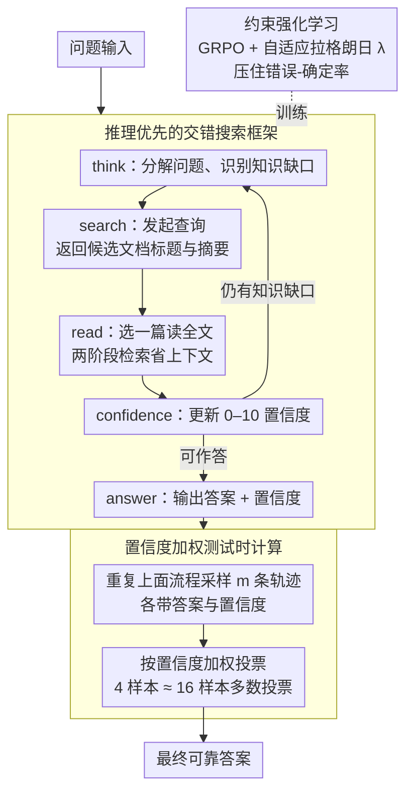

# Deliberative Searcher: Improving LLM Reliability via Reinforcement Learning with Constraints

**会议**: ACL 2026  
**arXiv**: [2507.16727](https://arxiv.org/abs/2507.16727)  
**代码**: 无  
**领域**: 强化学习  
**关键词**: 置信度校准, 搜索增强LLM, 约束强化学习, 可靠性, 推理效率

## 一句话总结

本文提出 Deliberative Searcher，一个推理优先的框架，将搜索操作集成到 CoT 生成中并保持显式置信度校准，使用自适应拉格朗日乘子的约束 RL 联合优化正确性和可靠性，将 7B 模型的平均"错误-确定"率从基线的 54% 降至 2%。

## 研究背景与动机

**领域现状**：具有搜索能力的 LLM 常表现出置信度失调——对错误答案给出高确定性。这在决策支持、医疗问答等场景中可能造成严重后果。

**现有痛点**：(1) LLM 的声明置信度与事实正确性之间缺乏可靠对应；(2) 现有搜索增强方法关注正确率但忽视可靠性（即模型应在不确定时表达不确定）；(3) "错误-确定"输出是最危险的状态——用户无法识别错误。

**核心矛盾**：正确率和可靠性是两个不同的目标——提高正确率可能通过增加确定性表达来实现，但这会增加"错误-确定"的风险。需要同时优化两者。

**本文目标**：设计一个同时优化正确性和置信度校准的 RL 框架，使模型在搜索辅助推理中产生可靠的输出。

**切入角度**：将可靠性约束（限制"错误-确定"率）直接融入 RL 训练目标，使用自适应拉格朗日乘子平衡正确性和可靠性。

**核心 idea**：校准的置信度不仅提供可靠输出，还能驱动高效的测试时计算——用置信度加权聚合替代多数投票，4 个样本达到 16 个样本的效果。

## 方法详解

### 整体框架

Deliberative Searcher 把搜索动作直接编织进 CoT 推理：模型一边推理一边判断知识缺口，自己决定何时发起检索、检索什么、怎么把检索回来的内容接回推理链，最终同时吐出答案和一个显式的置信度评分。训练阶段用约束 RL 把"答对"和"别在错的时候装确定"这两件事拧在一起——主目标拉高正确率，约束条件死死压住"错误-确定"率。推理时再把校准好的置信度复用为加权投票，省下大量采样。

### 关键设计

**1. 推理优先的交错搜索框架：让模型自己决定何时该查、查到什么程度**

现有搜索增强方法往往把检索当成推理前的独立预处理步（信息优先 information-primary），模型并不知道自己哪里不会、查得盲目。本文反过来走推理优先（reasoning-primary）：整个回答被组织成一个自回归动作序列，动作空间为 `{think, search, read, confidence, answer}`——`think` 分解问题、识别知识缺口；`search` 提交查询、拿回候选文档的标题与摘要；`read` 从候选里挑一篇读全文。这里的检索是两阶段（hierarchical）的：先看摘要再决定读哪篇，既压缩了上下文长度，又制造出"该不该读、读哪篇"的显式决策点，给 RL 提供更丰富的训练信号。每走一步都用 `confidence` 报一个 0–10 的置信度，最后用 `answer` 给出答案与最终置信度。因为触发时机由推理状态决定，模型更清楚"此刻确实需要外部信息"，而不是机械地每题先搜一遍。

**2. 约束强化学习（自适应拉格朗日）：把可靠性写成硬约束而非软权重**

正确率和可靠性是两个会打架的目标——一味追正确率，模型可能靠多表达"确定"来蹭分，反而推高最危险的"错误-确定"输出。本文不把可靠性当成加进 reward 的一项普通软目标手调权重，而是写成带约束的优化问题：最大化期望正确率、同时让可靠性满足一个阈值约束。具体做法是在 GRPO 之上引入一个拉格朗日项，把约束转成惩罚并入目标，奖励写成 $r_{\text{final}} = r_{\text{format}} \cdot (0.1\,r_{\text{format}} + 0.9\,r_{\text{acc}} + \lambda\,r_{\text{reliab}})$——其中 $r_{\text{format}}$ 当门控（格式不合直接清零），$r_{\text{reliab}}$ 奖励"对就该确定、错就该不确定"（以置信度阈值 $\zeta{=}5$ 判定）。关键在于乘子 $\lambda$ 不是常数：训练中通过对偶的乘性更新（multiplicative-weights）随约束是否被违反动态升降，约束越被违反 $\lambda$ 越大、对可靠性的惩罚越狠。相比加权求和那种需要手调权重、且权重含义随训练漂移的做法，这种约束形式让"错误-确定"率被真正压到目标阈值以下，而不是听天由命。

**3. 置信度加权测试时计算：校准好的置信度顺便省采样**

既然模型的置信度被校准得可信，它就不只是给用户看的，还能用来省推理预算。标准多数投票里每个采样答案一票、彼此平权；这里改成按置信度评分加权聚合——高置信度的正确答案贡献更大权重，低置信度的样本被自然削弱。结果是 4 个样本的置信度加权就能追平 16 个样本多数投票的性能，等于把测试时计算砍掉约 4×。这一步是前两个设计的红利：只有当置信度真的校准了，加权才比平权更聪明。

### 损失函数 / 训练策略

约束 RL 的总损失 = 标准策略梯度损失 + $\lambda \cdot$ 约束违反惩罚，其中 $\lambda$ 通过对偶梯度上升自适应调整以满足 $P(\text{false-certain}) \leq \epsilon$。训练在 7B 与 72B 两种规模上进行。

## 实验关键数据

### 主实验

**五个基准上的平均"错误-确定"率**

| 方法 | 错误-确定率↓ | 准确率 |
|------|------------|--------|
| 搜索增强基线 | 54% | 中等 |
| **7B Deliberative Searcher** | **2%** | 竞争力 |
| **72B Deliberative Searcher** | **9%** | 接近闭源 |

### 消融实验

| 配置 | 效果 |
|------|------|
| 无约束 RL | 高正确率但高错误-确定率 |
| 固定 λ | 次优——无法自适应平衡 |
| 自适应 λ | 最优——动态平衡正确性和可靠性 |
| 置信度加权 vs 多数投票 | 4 样本置信度加权 ≈ 16 样本多数投票 |

### 关键发现

- 错误-确定率从 54% 降至 2%（7B），从根本上提升了输出可靠性
- 72B 模型达到与闭源模型竞争的准确率，同时保持低错误-确定率
- 置信度加权聚合实现 4× 推理计算节省
- 自适应拉格朗日乘子优于固定权重的多目标优化

## 亮点与洞察

- 将可靠性形式化为约束优化问题而非辅助目标，确保了可靠性保证
- 置信度校准的双重价值：(1) 用户信任 (2) 推理效率——一箭双雕
- 错误-确定率作为 LLM 可靠性的核心指标，具有实际部署意义

## 局限与展望

- 置信度评分的表达形式（如概率 vs 自然语言）可能影响用户理解
- 约束阈值 ε 的选择需要根据应用场景调整
- 搜索质量依赖外部搜索引擎，搜索结果中的错误信息可能被整合

## 相关工作与启发

- **vs 标准搜索增强 LLM**: 标准方法忽视置信度校准，Deliberative Searcher 显式优化可靠性
- **vs 自我反思方法**: 反思方法依赖模型的内部判断，Deliberative Searcher 通过 RL 约束确保校准

## 评分

- 新颖性: ⭐⭐⭐⭐⭐ 约束 RL 优化可靠性和置信度加权推理的组合非常新颖
- 实验充分度: ⭐⭐⭐⭐ 五个基准、两种规模、效率分析
- 写作质量: ⭐⭐⭐⭐ 问题定义清晰，四象限可靠性框架直观
- 价值: ⭐⭐⭐⭐⭐ 对 LLM 可靠部署有重要实际意义

<!-- RELATED:START -->

## 相关论文

- [\[ICLR 2026\] Understanding and Improving Hyperbolic Deep Reinforcement Learning](../../ICLR2026/reinforcement_learning/understanding_and_improving_hyperbolic_deep_reinforcement_learning.md)
- [\[ACL 2026\] Scaling Behaviors of LLM Reinforcement Learning Post-Training: An Empirical Study](scaling_behaviors_of_llm_reinforcement_learning_post-training_an_empirical_study.md)
- [\[ACL 2026\] Efficient Hyperparameter Optimization for LLM Reinforcement Learning](efficient_hyperparameter_optimization_for_llm_reinforcement_learning.md)
- [\[ACL 2026\] LearnAlign: Data Selection for LLM Reinforcement Learning with Improved Gradient Alignment](learnalign_data_selection_for_llm_reinforcement_learning_with_improved_gradient_.md)
- [\[ICLR 2026\] CUDA-L1: Improving CUDA Optimization via Contrastive Reinforcement Learning](../../ICLR2026/reinforcement_learning/cuda-l1_improving_cuda_optimization_via_contrastive_reinforcement_learning.md)

<!-- RELATED:END -->
