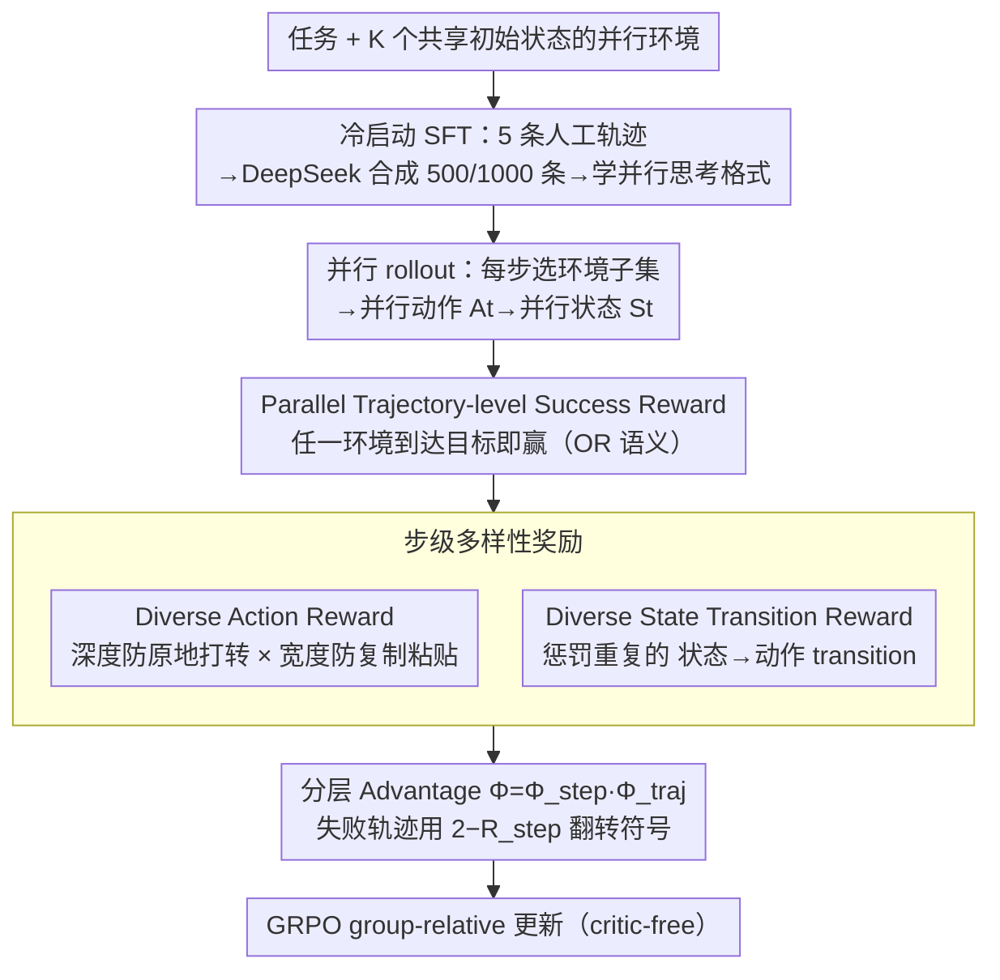

# DPEPO: Diverse Parallel Exploration Policy Optimization for LLM-based Agents

**会议**: ACL 2026  
**arXiv**: [2604.24320](https://arxiv.org/abs/2604.24320)  
**代码**: https://github.com/LePanda026/Code-for-DPEPO  
**领域**: 强化学习 / LLM Agent / GRPO 改进  
**关键词**: Parallel Exploration, GRPO, Diversity-Driven Reward, ALFWorld, ScienceWorld

## 一句话总结
作者提出"并行探索"新范式——agent 同步与 $K$ 个 environment 交互、跨轨迹共享经验，并给出对应的 RL 算法 **DPEPO**：先 SFT 冷启动学会并行 reasoning，再用"轨迹级成功 + 步级 Diverse Action / Diverse State Transition"分层奖励的 GRPO 训练，在 ALFWorld 与 ScienceWorld 全部 split 上拿下 SOTA（Qwen2.5-7B 上分别 98.2% / 61.4%），且在更大 $K$ 时 token 增长远低于"多采样"基线。

## 研究背景与动机

**领域现状**：基于 LLM 的自主 agent 几乎都遵循 ReAct 范式——"思考 → 单步执行 → 观察 → 再思考"。在 ALFWorld / ScienceWorld 等长程任务上，GRPO / GiGPO / RLVMR / SPEAR 等 RL 后训练已能把成功率推到 90%+。

**现有痛点**：ReAct 每步只能观察一条 trajectory，导致 agent 对环境的认知 **狭窄且片面**（论文称为 "narrow, linear view"）。最直观的扩展——"对同一任务采样多条独立 trajectory"——又有两大致命缺陷：(1) **多样性不足**：尽管输出 entropy 提高，多次采样的动作仍倾向收敛到相似选择；(2) **效率与隔离**：多条 trajectory 之间无经验共享，且顺序采样让 token 消耗与时间线性膨胀。

**核心矛盾**：传统 RL 在 LLM agent 上做"多采样"换 exploration，但 explore 的样本既不互相借鉴、又重复浪费算力；agent 永远在"窄视野 vs 高成本"之间二选一，没法又广又快地认识环境。

**本文目标**：让一个 agent 在一次 episode 内 **同步** 与多个相同初始状态的环境交互，跨环境共享中间观察，并设计能 **主动反 redundancy** 的 RL 奖励。

**切入角度**：从"agent 与环境一对一"升级为"agent 与环境集合 $\mathcal{E}=\{E_1,\ldots,E_K\}$ 多对一"；每步 agent 自主选择子集 $\mathcal{E}'_t\subseteq\mathcal{E}$ 并发起 parallel actions $A_t=\{(E_i, a_t)\}$，并发执行得到 parallel states $S_t$。

**核心 idea**：**Parallel Exploration as a Paradigm + Diversity as a Reward**——把"并行探索"作为 ReAct 的范式级扩展，再用 step-level diversity reward 把"不要重复行为"显式编码到 policy gradient 里，让 agent 既广又准。

## 方法详解

### 整体框架
DPEPO 是 GRPO 的并行扩展。给定任务 + $K$ 个共享初始状态的并行环境 $\mathcal{E}$，agent 在每步 $t$ 自主选 $\mathcal{E}'_t$，对每个被选环境生成 action 形成 $A_t$，同时执行得到 $S_t$，trajectory $\tau=\{(S_t, A_t)\}_{t=1}^T$。训练分两阶段：(1) Cold-start SFT，用 5 条人工标注的 ground-truth 并行 trajectory 引导 DeepSeek-V3.2 合成 500 / 1000 条 SFT 数据（ALFWorld / ScienceWorld），让 model 先学会"并行思考输出格式"；(2) RL 阶段，用分层奖励——并行轨迹级成功奖励 + 两个步级 diversity 奖励——加 GRPO 的 group-relative advantage 做优化。推理时 group size $N=8/4$、$K=4$、$T_{\max}=25$、温度 0.4。

### 关键设计

**1. Parallel Trajectory-level Success Reward：把成功判定改成"任一环境到达即赢"的 OR 语义**

传统 ReAct 的 task success 是单环境上的 0/1 奖励，搬到并行设定下需要重新定义"什么叫成功"。本文给出 $R_{traj}(\tau)=1$ 当 $S_T\cap\mathcal{G}\neq\emptyset$（只要任意一个并行环境到达目标状态，整条并行轨迹就算成功），否则为 0。这个奖励照搬 GRPO 的 group-relative advantage：从 $N$ 条 group trajectory 算均值和标准差，$\Phi_{traj}(\tau_i)=(R(\tau_i)-\text{mean})/\text{std}$。OR 语义的好处是鼓励 agent 把 $K$ 个环境当成冗余备份加信息源——一边广撒网探索、一边只要押中一个就行，这正契合并行计算的本质；而 group-relative 形式又省掉了 critic model。

**2. Diverse Action Reward：用深度 × 宽度两个方向把"动作重复"变成可微的密集惩罚**

并行探索最怕的退化是 $K$ 个环境其实在做同一件事，等于白并行。这里直接在 step 内部惩罚动作重复：$R_{action}(A_t)=\frac{1}{|\mathcal{E}'_t|}\sum_{E_i\in\mathcal{E}'_t}\alpha^{C_{depth}(E_i, a_t)}+\omega^{C_{width}(A_t)}$，其中 $C_{depth}$ 数动作 $a_t$ 在环境 $E_i$ 历史里重复了几次（深度方向 = 同一环境内是否原地反复试同一动作），$C_{width}$ 数 $A_t$ 这一步内有几个重复动作（宽度方向 = 多个环境是否都派了同一招），$\alpha,\omega\in(0,1]$ 是折扣因子，重复越多奖励越趋近 0。一句话：深度方向防"原地打转"，宽度方向防"复制粘贴"，逼着 $K$ 个并行环境真去探互补的状态空间，把模糊的"多样性"落成了可优化的梯度信号。

**3. Diverse State Transition Reward + 分层 Advantage：惩罚重复的"状态→动作"，并按成败翻转步级奖励的符号**

只看动作不够，因为同一个动作在不同状态下语义完全不同，agent 真正的经验单元是 transition。于是再加一项：把 transition 记作 $p_t=s_t\to a_t$，$R_{transition}=\frac{1}{|\mathcal{E}'_t|}\sum_i\gamma^{M_{depth}(E_i, p_t)} + \frac{1}{|\mathcal{E}'_t|}\sum_i\beta^{M_{width}(E_i, p_t)}$，其中 $M_{depth}$ 数 transition 在 $E_i$ 内重复次数，$M_{width}$ 数其他被选环境里相同 transition 的出现次数。两个步级奖励取平均 $R_{step}=(R_{action}+R_{transition})/2$，再嵌进轨迹级 advantage：若 $\Phi_{traj}(\tau_i)>0$ 则 $\Phi_{step}=R_{step}$，否则 $\Phi_{step}=2-R_{step}$；最终 $\Phi(A_{i,t})=\Phi_{step}\cdot\Phi_{traj}$。这个条件翻转 $2-R_{step}$ 是点睛之笔：成功轨迹里多样性是加分，但失败轨迹里若步级多样性还很高，说明 agent 是在乱试，应当反向降权——让模型既"敢探索"又"知收敛"。

### 损失函数 / 训练策略
RL 阶段直接套 GRPO 的策略目标（critic-free，relative advantage）；每个任务用 500 RL 样本、125 步训练、1 epoch；group size $N$ 在 ALFWorld 取 8、ScienceWorld 取 4；max step 25，parallel env 数 $K=4$。Cold start 用 SFT 在 500 / 1000 条合成并行 trajectory 上做行为模仿。

## 实验关键数据

### 主实验
**ALFWorld（成功率 %）+ ScienceWorld（成功率 %）on Qwen2.5-Instruct**：

| 模型 / 方法 | ALFWorld In-Domain | ALFWorld OOD | ALFWorld Avg | SW L0 | SW L1 | SW L2 | SW Avg |
|------------|-------------------|--------------|--------------|-------|-------|-------|--------|
| GPT-4o (closed) | 48.0 | 66.0 | 57.0 | 45.4 | 49.2 | 41.0 | 45.2 |
| DeepSeek-R1 (closed) | 75.0 | 85.1 | 80.1 | 22.2 | 31.4 | 29.1 | 27.6 |
| **1.5B**: GRPO | 72.8 | 71.1 | 72.0 | 21.1 | 13.7 | 10.9 | 15.2 |
| **1.5B**: GiGPO | 86.7 | 83.2 | 85.0 | 25.8 | 15.2 | 4.7 | 15.2 |
| **1.5B**: RLVMR | 89.1 | 87.9 | 88.5 | 46.9 | 34.3 | 26.5 | 35.9 |
| **1.5B**: SPEAR | 93.2 | - | - | - | - | - | - |
| **1.5B**: **DPEPO** | **95.7** | **92.5** | **94.1** | **59.8** | **58.1** | **34.2** | **50.7** |
| **7B**: GRPO | 77.6 | 77.3 | 77.5 | 49.1 | 30.1 | 26.6 | 35.3 |
| **7B**: GiGPO | 90.8 | 90.2 | 90.5 | 53.4 | 25.2 | 25.8 | 34.8 |
| **7B**: RLVMR | 91.4 | 91.8 | 91.6 | 67.2 | 43.0 | 32.2 | 47.5 |
| **7B**: SPEAR | 94.7 | - | - | - | - | - | - |
| **7B**: **DPEPO** | **98.6** | **97.8** | **98.2** | **66.6** | **66.5** | **51.0** | **61.4** |

7B DPEPO 在 ALFWorld 上比第二好的 SPEAR (94.7) 高 3.5 个百分点，在 ScienceWorld 上比 RLVMR (47.5) 高 13.9 个百分点；甚至 1.5B 的 DPEPO 在 ScienceWorld 上 (50.7) 超过 7B 的 RLVMR (47.5)。

**推理效率（ALFWorld，相同实验设定）**：

| 方法 | Tokens | Steps | Time (s) |
|------|--------|-------|----------|
| DeepSeek-V3 | 950.0 | 20.5 | 62.4 |
| DeepSeek-R1 | 1667.9 | 24.8 | 237.0 |
| GiGPO | 1115.1 | 15.2 | 70.8 |
| **DPEPO** | 2283.4 | **12.3** | **44.7** |

虽然 token 是 GiGPO 的 2 倍，但因为 step 数下降 + 并行执行不增加单步时间，wall-clock 反而最快。

### 消融实验

| 配置 | ALFWorld In | ALFWorld OOD | SW L0 | SW L1 | SW L2 |
|------|-------------|--------------|-------|-------|-------|
| ColdStart 仅 SFT | 93.6 | 97.8 | 66.5 | 62.2 | 48.1 |
| **DPEPO 完整** | **98.6** | 97.8 | **66.6** | **66.5** | **51.0** |
| w/o Diverse Action Reward | 97.1 | 97.0 | 65.1 | 62.8 | 49.0 |
| w/o Diverse State Trans. Reward | 96.4 | 98.5 | 64.4 | 63.6 | 49.7 |
| w/o DAR & DTR | 96.4 | 98.5 | 66.3 | 65.7 | 49.9 |

完整 DPEPO 在 ALFWorld In-Domain 上比 ColdStart 多 +5.0、ScienceWorld L2 多 +2.9；去掉任一 diversity reward 都掉点，但全部去掉时反而比单去一个稍好——说明两个 reward 是**互相依赖**的整体设计，单独使用会破坏 trade-off。

### 关键发现
- **并行探索 > 多采样**：图 4 显示在 ALFWorld 上随 $K$ 增加，GiGPO 的 token 线性膨胀但 DPEPO token 几乎不增长，且 DPEPO 在所有 $K$ 上都跑赢 GiGPO；这是 paradigm-level（不是 trick-level）的胜利。
- **小模型逆袭**：1.5B DPEPO 在 ScienceWorld 上超过 7B RLVMR；说明 paradigm 的红利大于模型参数的红利，对算力受限场景极有价值。
- **dual reward 互相依赖**：单独去 DAR 或 DTR 都掉点，但全去反而稍好——表明这两个 reward 是耦合设计，独立使用会引入误导性梯度。这是论文里非常诚实的实验观察。
- **inference 反而更快**：DPEPO 在 wall-clock 时间上比 GiGPO 快 37%、比 DeepSeek-R1 快 5×，因为并行 action 不增加单步时间且 step 数被砍半。
- **OOD 鲁棒**：ALFWorld OOD 与 ScienceWorld L2（unseen variants + categories）上 DPEPO 仍是最佳，说明并行探索带来的"comprehensive cognition"具有一定泛化迁移能力，不仅是过拟合训练分布。
- **训练效率 4×**：DPEPO 用 500 个 RL 样本 24 小时达到 SOTA，GiGPO 要 96 小时；并行环境复用 + 步级 dense reward 让 sample efficiency 显著提升。

## 亮点与洞察
- **范式级创新而非 trick**：把 ReAct 的"一次一环境"扩展为"一次多环境"是非常本质的改动，类似 batched RL 在 LLM agent 领域的首次系统化落地，未来 RL-for-agent 工作几乎都得考虑这个 axis。
- **diversity-as-reward 形式化**：把"不要重复"这一模糊直觉拆成深度（同环境 + 自循环）× 宽度（跨环境 + 一致化）两个独立维度，并都用指数折扣量化，是非常清爽的 reward shaping 设计。
- **失败 trajectory 的 reward 翻转**：$\Phi_{step}=2-R_{step}$ 在失败时的处理细节非常聪明——既鼓励探索又惩罚"乱探索"，这种 outcome-conditioned reward shaping 可以迁移到任何 RLHF 任务。
- **OR-语义任务成功**：把"任意并行环境成功即整体成功"这种 OR 语义巧妙嵌入到 RL 训练，让 agent 学会把并行环境当 robust hedging，而不是必须每个都成功。这种思路可以推广到"多模型集成 + 任意答对算赢"等场景。
- **token 不变 wall-clock 减半**：在 LLM agent 工程界，"减步数 > 减 tokens > 减时间"这三个目标常被混为一谈；DPEPO 用 inference 时间数据清晰拆开三者，是工程参考价值很高的对比。

## 局限与展望
- **依赖可复制环境**：所有并行环境必须共享初始状态，意味着真实物理 / 网络环境（不可逆操作 / 状态依赖外部 API）几乎无法落地。作者自己承认这点，并提出"训练 agent 并行完成不同任务"作为未来工作。
- **K 仍小**：实验中 $K=4$，未探索 $K=16/32$ 的边际收益与 token 膨胀；且 $K$ 增加时 group size 是否需要同步增加缺少分析。
- **SFT 数据靠人工 + DeepSeek 合成**：5 条人工 trajectory + LLM 扩写，可能在长尾任务上质量参差；论文未给出 cold-start 数据质量与 DPEPO 收敛的关系。
- **diversity reward 的超参未给敏感性**：$\alpha, \omega, \gamma, \beta$ 都在 $(0,1]$ 但具体值与敏感性表缺失。
- **只在文本环境上测**：ALFWorld 和 ScienceWorld 都是纯文本环境，多模态 / 真实 GUI 上的迁移性未验证。

## 相关工作与启发
- **vs GiGPO (Feng et al. 2025)**: GiGPO 用 anchor-state group 估计 step-level advantage 但仍在 ReAct 单环境内；DPEPO 把 step reward 从"相对 anchor"升级为"反 redundancy"，且突破单环境约束。
- **vs RLVMR (Zhang et al. 2025)**: RLVMR 用 meta-reasoning reward 解决无效探索，本质是 reward 范畴扩展；DPEPO 改变的是 paradigm（并行）而非 reward 类别，二者正交可结合。
- **vs SPEAR (Qin et al. 2025)**: SPEAR 用 self-imitation + intrinsic reward 平衡 explore-exploit；DPEPO 用 parallel structure 直接拓宽探索空间，不需要 imitation memory。
- **vs DeepSeek-R1**: R1 是单环境 CoT 推理强者，但在 agent 任务上 step 数和时间都最高；DPEPO 在 7B 量级就把性能打到 R1 之上且 wall-clock 5× 快。
- **vs Richens et al. 2025 (general agents need world models)**: 该工作论证 agent 需要全面 world model；DPEPO 是这一论点的 **algorithmic 实现** ——并行探索直接帮 agent 建立更完整的 environment cognition。

## 评分
- 新颖性: ⭐⭐⭐⭐⭐ Parallel exploration 是 agent RL 领域罕见的 paradigm-level 创新，diverse reward 设计也独立成型，社区应该会有大量 follow-up。
- 实验充分度: ⭐⭐⭐⭐ 2 模型规模 × 2 基准 × 5 baseline + 4 ablation + scaling / efficiency / training-cost 全套；唯一缺憾是真实 GUI / 多模态环境未验证。
- 写作质量: ⭐⭐⭐⭐ Figure 1 一图道尽 ReAct vs Parallel 的认知差距，公式记号严谨；唯一吹毛求疵的点是 SFT 数据合成细节略简。
- 价值: ⭐⭐⭐⭐⭐ 极强的实用价值（小模型即可 SOTA + wall-clock 更快）+ paradigm-level 学术贡献（重塑 ReAct）+ 现成的开源代码，对 agent RL 研究和工业部署都是直接 actionable。

<!-- RELATED:START -->

## 相关论文

- [\[ACL 2026\] Efficient Hyperparameter Optimization for LLM Reinforcement Learning](efficient_hyperparameter_optimization_for_llm_reinforcement_learning.md)
- [\[ACL 2026\] d-TreeRPO: Towards More Reliable Policy Optimization for Diffusion Language Models](d-treerpo_towards_more_reliable_policy_optimization_for_diffusion_language_model.md)
- [\[ACL 2026\] Visually-Guided Policy Optimization for Multimodal Reasoning](visually-guided_policy_optimization_for_multimodal_reasoning.md)
- [\[ICML 2026\] LABO: LLM-Accelerated Bayesian Optimization through Broad Exploration and Selective Experimentation](../../ICML2026/reinforcement_learning/labo_llm-accelerated_bayesian_optimization_through_broad_exploration_and_selecti.md)
- [\[ACL 2026\] Semantic-Space Exploration and Exploitation in RLVR for LLM Reasoning](semantic-space_exploration_and_exploitation_in_rlvr_for_llm_reasoning.md)

<!-- RELATED:END -->
