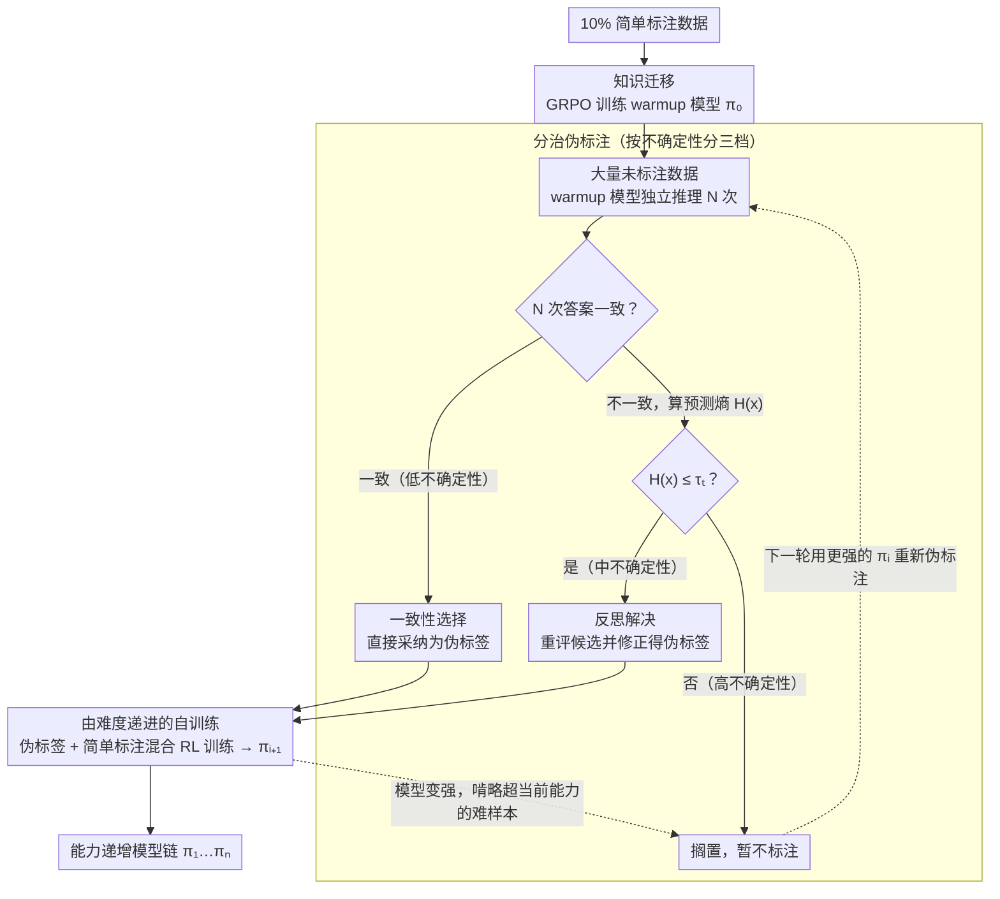

# Easy Samples Are All You Need: Self-Evolving LLMs via Data-Efficient Reinforcement Learning

**会议**: ACL 2026  
**arXiv**: [2604.18639](https://arxiv.org/abs/2604.18639)  
**代码**: [https://github.com/YuZhiyin/EasyRL](https://github.com/YuZhiyin/EasyRL)  
**领域**: 强化学习 / 数据高效训练  
**关键词**: 数据高效RL, 自进化LLM, 伪标签, 由简入难, 认知学习理论

## 一句话总结

提出 EasyRL 框架，受认知发展理论启发，仅用10%的简单标注数据通过知识迁移初始化模型，再通过分治伪标注和由难度递进的自训练逐步掌握困难未标注数据，一致性超越全量数据监督的 GRPO。

## 研究背景与动机

**领域现状**：RLVR 已成为提升 LLM 推理能力的关键后训练范式。现有方法分为监督式（依赖标注答案或奖励模型，标注成本高）和无监督式（投票或熵估计构建奖励，易崩溃或奖励黑客）。

**现有痛点**：（1）监督式方法需要大量高质量标注数据，特别是困难问题的标注成本极高；（2）无监督方法的性能增益有限且不稳定，容易模型崩溃或奖励黑客；（3）两者都没有考虑数据难度的分布——实际上简单问题的标注成本远低于困难问题。

**核心矛盾**：困难问题的标注成本高但价值大，简单问题的标注成本低但单独训练不够。如何仅用少量简单标注数据来逐步掌握大量困难未标注数据？

**本文目标**：设计一个认知启发的 RL 框架，从有限的简单标注数据出发，自进化地学习越来越难的推理任务。

**切入角度**：维果茨基的"最近发展区"（ZPD）理论——学习者先从简单可达的案例中内化知识，然后在最小外部指导下逐步扩展到更困难的挑战。

**核心 idea**：（1）用少量简单标注数据通过 GRPO 训练 warmup 模型；（2）用分治策略对未标注数据进行伪标注——一致性选择处理低不确定性样本，反思解决处理中不确定性样本；（3）由难度递进的自训练迭代扩展模型能力边界。

## 方法详解

### 整体框架

EasyRL 分三阶段：（1）知识迁移——在简单标注数据上用 GRPO 训练 warmup 模型；（2）分治伪标注——warmup 模型对未标注数据多次推理，按不确定性分为低/中/高三组，分别用一致性选择和反思解决构建高质量伪标签；（3）由难度递进的自训练——混合标注和伪标注数据迭代 RL 训练，每轮重新伪标注上轮的高不确定性样本。

### 关键设计

**1. 分治伪标注策略：按不确定性把未标注样本分三档，各用最合适的方式造标签**

直接拿多数投票给未标注数据造伪标签，质量参差不齐，难样本会被错误标签污染训练。EasyRL 改成按不确定性分治：对每个未标注样本让 warmup 模型独立推理 $N$ 次，先做一致性选择——若 $N$ 次输出答案完全一致，说明模型很有把握，直接采纳为伪标签（低不确定性）；答案不一致时再算预测熵 $H(x)$，若 $H(x)\leq\tau_t$ 则走反思解决，让模型重新评估各候选答案、修正后得到伪标签（中不确定性）；剩下 $H(x)>\tau_t$ 的高不确定性样本暂不标注，留给后面迭代。三档分别对应"高信心直接采、部分一致靠反思纠、太不确定先搁置"，从而把伪标签质量拉满，而不是一刀切地全靠投票。

**2. 由难度递进的自训练：让模型每轮只啃略超出当前能力的那批样本**

一次性把所有难题塞给模型，它标不准也学不动。EasyRL 让能力随轮次爬坡：第 $i$ 轮用当前模型 $\pi_i$ 对上一轮遗留的高不确定性样本重新伪标注并筛选，把通过的样本与原始简单标注数据混合做 RL 训练，得到更强的 $\pi_{i+1}$；模型一变强，之前标不动的难题就逐渐被它自信地纳入训练，于是 $\pi_1,\pi_2,\dots,\pi_n$ 形成一条能力递增的模型链。这正对应维果茨基的最近发展区（ZPD）——每一轮被纳入的伪标注集，恰好是"略超出当前能力、但够得着"的那批任务，既不会太简单浪费、也不会太难学崩。

**3. 认知学习曲线的统一视角：用 ConsRate 把"模型在长大"量化出来**

前两个设计并非各自为政，而是共同模拟人类的认知获取曲线：先从简单案例里内化基础规则（知识迁移阶段），再靠类比与自我反思把能力迁移到更难的新问题（分治伪标注 + 递进自训练）。这一框架的可观测证据是伪标签的一致性率 ConsRate（即模型 $N$ 次推理答案完全一致的样本比例）随迭代逐步上升——它直接说明模型对同一批数据越来越笃定，从经验上印证了"能力在渐进增长"这一认知曲线假设，而不只是停留在比喻层面。

### 损失函数 / 训练策略

标准 GRPO 目标函数。正确性奖励 $r=1$（匹配），$r=-0.5$（格式错误），$r=0$（其他）。在 Qwen2.5-Math-1.5B/7B 和 Llama-3.2-3B 上评估。简单标注数据占全量的 10%（按 AoPS 难度分级选择简单子集）。

## 实验关键数据

### 主实验

| 模型/方法 | 数学平均 | 科学平均 | 标注数据量 |
|----------|---------|---------|----------|
| Qwen2.5-Math-1.5B Base | 32.6 | 1.5 | 0 |
| w/ Supervised GRPO (10%) | 35.7 | 7.9 | 10% |
| w/ Unsupervised EMPO | 38.5 | 15.6 | 0 |
| w/ EasyRL Iter3 | **40.3** | **19.4** | 10% |
| Qwen2.5-Math-7B Base | 38.5 | 24.1 | 0 |
| w/ Supervised GRPO (10%) | 43.3 | 27.4 | 10% |
| w/ EasyRL Iter3 | **50.6** | **30.6** | 10% |

### 消融实验

| 配置 | 效果 | 说明 |
|------|------|------|
| 仅知识迁移（warmup） | 基线 | 仅简单数据 |
| + 分治伪标注 Iter1 | 提升 | 纳入容易的未标注数据 |
| + Iter2 | 进一步提升 | 纳入中等困难数据 |
| + Iter3 | 最优 | 纳入更多困难数据 |

### 关键发现

- 仅用10%简单标注数据的 EasyRL 超越了使用全量数据的 Supervised GRPO
- 迭代自训练带来持续提升：Iter1→Iter2→Iter3 在数学和科学基准上均稳步增长
- 伪标签一致性率随迭代提升，证实模型能力在自进化
- EasyRL 在域外任务（科学推理）上也有效，说明学到的是通用推理能力
- 反思机制对中不确定性样本的伪标签质量有显著帮助

## 亮点与洞察

- **"简单样本就够了"的发现有实际价值**：困难问题标注成本高昂，EasyRL 证明只需标注简单问题就能通过自进化覆盖困难问题。这对标注资源有限的实际场景极有意义
- **分治策略按不确定性分级处理数据很自然**：完全一致→反思修正→延后处理的三级策略，每级都有对应的最优处理方式
- **认知科学理论的引入提供了方法论指导**：ZPD 理论不是简单类比，而是指导了具体的设计选择（由简入难、渐进扩展）

## 局限与展望

- 多次推理的伪标注评估有一定计算成本
- 迭代自训练的收敛速度和最终上限取决于初始 warmup 模型的质量
- "简单"和"困难"的界定依赖 AoPS 难度标注，非所有领域都有类似分级
- 未探索更大模型（>7B）上的行为

## 相关工作与启发

- **vs 标准 GRPO（全量监督）**: EasyRL 用10%简单数据通过自进化超越全量监督的 GRPO，证明数据质量和学习策略比数据量更重要
- **vs 无监督 EMPO**: EMPO 完全不用标注，但性能增益有限且不稳定。EasyRL 用少量简单标注作为锚点，实现更稳定的自进化

## 评分

- 新颖性: ⭐⭐⭐⭐ 认知学习理论的引入有启发性，分治伪标注+递进自训练的组合设计巧妙
- 实验充分度: ⭐⭐⭐⭐⭐ 3个模型+数学和科学基准+多轮迭代消融+伪标签质量分析，非常充分
- 写作质量: ⭐⭐⭐⭐ 动机清晰，理论动机与方法设计的对应关系讲得好

<!-- RELATED:START -->

## 相关论文

- [\[ICML 2026\] Metis: Learning to Jailbreak LLMs via Self-Evolving Metacognitive Policy Optimization](../../ICML2026/reinforcement_learning/metis_learning_to_jailbreak_llms_via_self-evolving_metacognitive_policy_optimiza.md)
- [\[ICML 2026\] D$^2$Evo: Dual Difficulty-Aware Self-Evolution for Data-Efficient Reinforcement Learning](../../ICML2026/reinforcement_learning/d2evo_dual_difficulty-aware_self-evolution_for_data-efficient_reinforcement_lear.md)
- [\[ICLR 2026\] SPELL: Self-Play Reinforcement Learning for Evolving Long-Context Language Models](../../ICLR2026/reinforcement_learning/spell_self-play_reinforcement_learning_for_evolving_long-context_language_models.md)
- [\[ACL 2026\] EvoCoT: Overcoming the Exploration Bottleneck in Reinforcement Learning for LLMs](evocot_overcoming_the_exploration_bottleneck_in_reinforcement_learning.md)
- [\[ICLR 2026\] Self-Harmony: Learning to Harmonize Self-Supervision and Self-Play in Test-Time Reinforcement Learning](../../ICLR2026/reinforcement_learning/self-harmony_learning_to_harmonize_self-supervision_and_self-play_in_test-time_r.md)

<!-- RELATED:END -->
