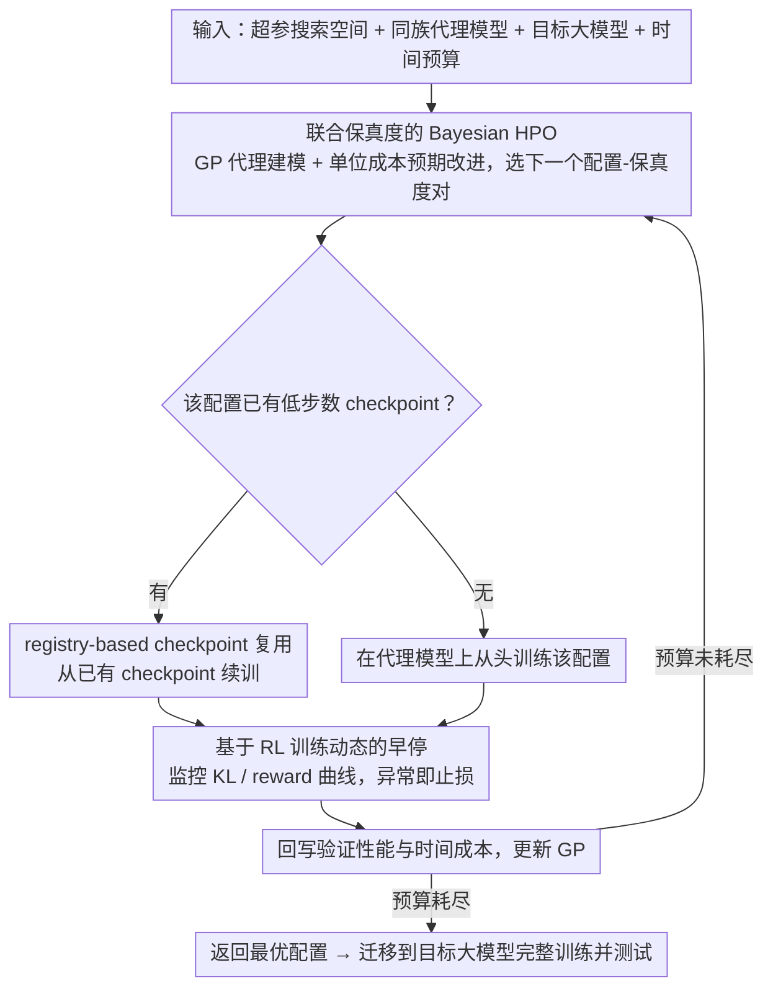

# Efficient Hyperparameter Optimization for LLM Reinforcement Learning

**会议**: ACL2026  
**arXiv**: [2606.03073](https://arxiv.org/abs/2606.03073)  
**代码**: 无  
**领域**: LLM强化学习 / 超参数优化  
**关键词**: LLM强化学习, 超参数优化, Bayesian Optimization, 多保真搜索, GRPO

## 一句话总结
本文提出 JF-HPO，把小型同族代理模型、训练步数保真度、训练动态早停和 checkpoint 复用合到一个 Bayesian HPO 框架中，用更低成本为 LLM 强化学习找到更稳的超参数，并在多个推理任务上优于 VeRL Recipe、Random Search 和 BOHB。

## 研究背景与动机
**领域现状**：LLM 的 RLHF/RLVR 训练越来越依赖 PPO、GRPO 等策略优化算法，数学推理和多选问答中也常用可验证奖励来训练模型。实践里，VeRL 等框架会给出一组推荐超参数，研究者通常直接沿用这些 recipe 或用随机搜索、BOHB 这类通用 HPO 方法做调参。

**现有痛点**：LLM RL 对学习率、clip ratio、KL 系数、rollout 数等超参数非常敏感，小幅变化就可能导致最终准确率和训练稳定性明显不同。但传统 HPO 每个 trial 都要完整训练大模型，既要 token-by-token rollout，又要反向传播更新，单次成本高到很难系统搜索。

**核心矛盾**：HPO 需要大量 trial 才能找到好配置，而 LLM RL 的每个 trial 又昂贵；已有多保真方法主要缩短训练预算，却没有充分利用“同族小模型可近似排序大模型配置”的机会，也没有针对 RL 训练动态做早停。

**本文目标**：作者希望在固定时间预算下探索更多超参数配置，同时保持代理模型与目标模型之间的性能排序相关性；最终目标不是改变 GRPO/PPO 本身，而是让这些 RL 算法更容易被可靠调参。

**切入角度**：论文把“模型规模”和“训练预算”同时当作 fidelity：低保真阶段用 0.5B 到 1B 的同族 proxy model 快速评估配置，高保真阶段只把最优配置迁移到 7B/8B/14B 目标模型上完整训练。

**核心 idea**：用 joint fidelity 的 Bayesian optimization 代替直接在大模型上暴力调参，再用训练动态早停和 checkpoint 复用把无效 trial 尽早切掉。

## 方法详解
JF-HPO 的核心不是新的 RL objective，而是围绕 LLM RL 训练过程重新设计 HPO 的评估单位。它把每个候选配置表示为 $(\phi_t, r_t)$：$\phi_t$ 是学习率、scheduler、actor clip ratio、gradient clip、KL loss coefficient、rollout 数等超参数，$r_t$ 是训练步数 fidelity；模型 fidelity 则由 proxy model 和 target model 的选择体现。

### 整体框架
输入是一组超参数搜索空间、一个小型同族代理模型、目标大模型和总时间预算。JF-HPO 先用 Gaussian Process surrogate 建模“配置 + 训练步数 fidelity”到性能和成本的关系，再用单位成本 expected improvement 选择下一个配置-保真度对。选中后，系统优先在 proxy model 上训练，如果之前存在同一配置的低步数 checkpoint 就从该 checkpoint 继续；训练过程中监控 KL divergence 和 reward 曲线，发现明显不稳定或无学习信号时提前终止。每个 trial 结束后，代理模型的验证性能和时间成本会回写到 observation set，更新 GP 并继续搜索。预算耗尽后，算法返回最优配置，再用目标大模型进行最终训练和测试。

### 关键设计

**1. 联合保真度的 Bayesian HPO：把模型规模和训练步数同时当 fidelity，让搜索主要发生在便宜的 proxy model 上**

传统多保真 HPO 只缩短训练步数，但每个 trial 仍要跑目标大模型，省下的成本有限；纯用小模型又缺少对大模型的高保真校准。JF-HPO 把「模型规模」和「训练步数」两个维度一起纳入 fidelity 控制：用 Gaussian Process surrogate 建模配置与性能、成本的关系，acquisition function 取「单位成本的预期性能改进」，即 $\alpha(\phi_t,r_t)=\mathbb{E}[f'(\theta',\phi_t,r_t)-f^*(\theta,\phi^+,r_{max})\mid D]/\mathbb{E}[C(\theta',\phi_t,r_t)]$，从而优先选性价比高的 trial。关键前提是 proxy model 与目标模型来自同一系列、共享架构，超参数的相对排序才能从小模型迁移到大模型；这样算法在搜索早期用 0.5B–1B 代理便宜探索，只在最后阶段把胜出配置映射回 7B/8B/14B 目标模型完整训练。

**2. 基于 RL 训练动态的早停：用 reward/KL 曲线的异常提前砍掉坏配置，不等训练跑完**

LLM RL 的失败往往先体现在训练曲线上，而不是最终测试集准确率——等完整训练结束才发现 trial 是坏的，预算已经浪费了。JF-HPO 直接监控 KL divergence 和 training reward 两条信号：若 KL 增长比例连续 $k$ 个 global step 超过阈值 $\tau_1$，说明策略相对 reference model drift 过快；若 reward 下降比例超过 $\tau_2$ 或连续为 0，说明该配置产生不了有效的策略更新。命中任一条件就提前终止该 trial。实验取 $\tau_1=15\%$、$\tau_2=10\%$、$k=5$，把「等 benchmark 才知道坏」的滞后判断换成「看动态曲线即时止损」。

**3. registry-based checkpoint 复用：让多保真晋级时接着练，而不是从头重训**

successive halving 式的多保真流程会反复扩大幸存配置的训练预算，同一配置被一次次以更高 fidelity 重新评估；如果每次都从零开始，前面低 fidelity 的训练成本就白费了，而 RL 的 rollout 和反向传播都很贵，这笔浪费尤其可观。JF-HPO 为每个 trial 维护一个 registry，记录其超参数、训练预算、已训练步数和 checkpoint 路径；当某配置从低 fidelity 晋级到更高 fidelity 时，直接从已有 checkpoint 续训，把低预算的试训直接转化为后续训练的一部分。这也是消融里去掉后性能下降最大的组件。

### 损失函数 / 训练策略
底层 RL 算法采用 GRPO 展示方法有效性。GRPO 不训练独立 value function，而是对同一 prompt 的多个 sampled outputs 做 group-relative advantage，使用 clipped policy objective 并加 KL penalty 约束 policy 不要偏离 reference model。HPO 搜索的超参数包括 learning rate、LR scheduler、actor clip ratio、gradient clip、KL loss coefficient 和 rollout 数；搜索空间来自 VeRL Recipe 附近的连续或离散区间。实验统一使用 48 小时时间预算，并在得到最优配置后训练目标模型 3 个 epoch。

## 实验关键数据

### 主实验
论文在 GSM8K、MATH、OpenBookQA、MMLU 上测试 LLaMA-3.1 8B、Qwen-2.5 7B 和 Qwen-3 14B。JF-HPO 在表 2 的 24 个任务-模型运行中 22 个优于或持平对照方法。

| 模型 | 方法 | GSM8K | MATH | OpenBookQA | MMLU | Average |
|------|------|------:|-----:|-----------:|-----:|--------:|
| LLaMA-3.1 8B | VeRL Recipe | 67.32 | 22.99 | 83.00 | 61.22 | 58.63 |
| LLaMA-3.1 8B | BOHB | 86.66 | 48.62 | 85.80 | 66.08 | 71.79 |
| LLaMA-3.1 8B | JF-HPO | 87.11 | 48.64 | 87.80 | 68.34 | 72.97 |
| Qwen-2.5 7B | VeRL Recipe | 83.47 | 63.21 | 88.20 | 68.81 | 75.92 |
| Qwen-2.5 7B | BOHB | 81.65 | 70.29 | 91.00 | 69.58 | 78.13 |
| Qwen-2.5 7B | JF-HPO | 88.17 | 68.19 | 91.00 | 71.23 | 79.65 |
| Qwen-3 14B | VeRL Recipe | 93.03 | 70.21 | 90.60 | 70.92 | 81.19 |
| Qwen-3 14B | JF-HPO | 94.84 | 71.83 | 92.60 | 72.14 | 82.85 |

### 消融实验
GSM8K + Qwen-2.5 7B 的消融显示，三个组件都有效，其中去掉 checkpointing 的下降最大。

| 配置 | Accuracy | 说明 |
|------|---------:|------|
| JF-HPO | 88.17 | 完整方法 |
| w/o proxy model | 86.88 | 不使用小模型代理，搜索效率下降 |
| w/o checkpointing | 84.84 | 重复训练开销变大，能探索的配置减少 |
| w/o early stopping | 86.35 | 坏配置不能及时终止，预算利用率下降 |

### 效率与泛化
| 模型 | 方法 | Overall Throughput | Avg. Time/Trial | Trial Speedup |
|------|------|-------------------:|----------------:|--------------:|
| Qwen-2.5 7B | Random Search | 521.6 tokens/s | 8.80 h | 1.0x |
| Qwen-2.5 7B | BOHB | 521.6 tokens/s | 2.20 h | 4.0x |
| Qwen-2.5 7B | JF-HPO | 8772.0 tokens/s | 0.59 h | 14.9x |
| LLaMA-3.1 8B | Random Search | 864.9 tokens/s | 5.38 h | 1.0x |
| LLaMA-3.1 8B | BOHB | 864.9 tokens/s | 1.80 h | 3.0x |
| LLaMA-3.1 8B | JF-HPO | 7167.3 tokens/s | 0.59 h | 9.1x |

附录结果还显示，在 Qwen-2.5 7B 上用 MATH 训练后做 OOD 测试，JF-HPO 在 AMC 2023 从 27.71 提到 44.58，在 AIME 2025 从 0.0 提到 3.3；MMLU 子领域上，LLaMA-3.1 8B 的 humanities/STEM/social/other 分别相对 VeRL Recipe 提升 8.18%、5.93%、7.42%、7.64%。

### 关键发现
- 学习率是最敏感的超参数，超过 $1e^{-6}$ 后性能开始下降；较大学习率搭配 cosine scheduler 比 constant scheduler 更稳。
- proxy model 与 target model 的配置排序相关性较高：5 个配置形成的 120 个 ranking 中，Spearman 为 0.90、Kendall 为 0.80。
- JF-HPO 对更难样本收益更明显：Qwen-2.5 7B 在 MATH Level-5 上从 38.80 提到 46.07，相对提升 18.74%。

## 亮点与洞察
- 把 HPO 的“低保真”从单纯少训练几步扩展到“小模型 + 少训练步数”，这比传统 BOHB 更贴合 LLM RL 的成本结构，因为 rollout 和 backprop 都会随模型规模急剧变贵。
- 早停标准选得很工程化：KL 快速上升和 reward 持续为零都是 RL 训练中能早看到的失败信号，不需要等最终 benchmark 才知道 trial 坏掉。
- checkpoint registry 是一个容易被忽略但很实用的设计。多保真 HPO 的晋级机制天然会重复访问同一配置，复用 checkpoint 能把低预算试训转化为后续训练的一部分。
- 论文给出一个有用的经验：对 proxy model 迁移到 target model 时，要关注超参数敏感性。KL loss coefficient 这类低敏感参数更容易迁移，而 learning rate 和 actor clip ratio 更容易出现小模型有效、大模型过拟合的失败。

## 局限与展望
- 作者明确指出，JF-HPO 依赖 proxy model 与 target model 之间稳定的性能排序相关性；如果从 dense proxy 迁移到 MoE 等结构差异很大的目标模型，当前论文没有验证这种相关性是否仍成立。
- 实验集中在数学推理、多选问答和 MMLU，没有覆盖 creative writing 等开放生成任务。这类任务的 reward 更主观，最优超参数地形可能与 RLVR 场景不同。
- 受资源限制，实验只使用 0.5B 到 1B 的 proxy model 和最高 14B 的目标模型；70B 级模型的保真度选择、相关性边界和 checkpoint 成本还需要进一步研究。
- 未来可以把 JF-HPO 扩展到 DAPO、REINFORCE++ 等新 RL 算法，并研究 proxy-target ranking correlation 的理论界限。

## 相关工作与启发
- **vs VeRL Recipe**: VeRL Recipe 给出一组推荐超参数，使用成本低但不能适配任务和模型差异；JF-HPO 保留 VeRL 训练框架，但系统搜索任务特定配置，平均性能更高。
- **vs Random Search**: Random Search 不需要 surrogate model，但在 LLM RL 中每个大模型 trial 代价过高；JF-HPO 用单位成本 expected improvement 和 proxy model 探索更多配置。
- **vs BOHB / Successive Halving**: BOHB 能分配训练预算，却仍主要在目标大模型上训练；JF-HPO 同时降低模型规模和训练预算，并通过 checkpointing 避免多保真重复训练。
- **启发**: 对任何昂贵的 post-training 流程，都可以考虑把模型家族中的小模型当作 hyperparameter ranking probe，而不是只把小模型用于算法原型验证。

## 评分
- 新颖性: ⭐⭐⭐⭐☆ 把 proxy-model fidelity、训练步数 fidelity 和 RL 动态早停合到 HPO 中，组合方式很贴近 LLM RL 的真实瓶颈。
- 实验充分度: ⭐⭐⭐⭐☆ 覆盖多模型多任务并有消融、效率和 OOD 分析，但开放生成任务和更大模型仍缺失。
- 写作质量: ⭐⭐⭐⭐☆ 动机、算法和实验表格清晰，工程细节足够复现主要思想。
- 价值: ⭐⭐⭐⭐⭐ 对资源受限团队很有用，直接回答“如何负担得起 LLM RL 调参”这个实际问题。

<!-- RELATED:START -->

## 相关论文

- [\[ACL 2026\] DPEPO: Diverse Parallel Exploration Policy Optimization for LLM-based Agents](dpepo_diverse_parallel_exploration_policy_optimization_for_llm-based_agents.md)
- [\[ACL 2026\] LearnAlign: Data Selection for LLM Reinforcement Learning with Improved Gradient Alignment](learnalign_data_selection_for_llm_reinforcement_learning_with_improved_gradient_.md)
- [\[ICLR 2026\] FAPO: Flawed-Aware Policy Optimization for Efficient and Reliable Reasoning](../../ICLR2026/reinforcement_learning/fapo_flawed-aware_policy_optimization_for_efficient_and_reliable_reasoning.md)
- [\[ICML 2026\] Revisiting Regularized Policy Optimization for Stable and Efficient Reinforcement Learning in Two-Player Games](../../ICML2026/reinforcement_learning/revisiting_regularized_policy_optimization_for_stable_and_efficient_reinforcemen.md)
- [\[ICLR 2026\] QuRL: Efficient Reinforcement Learning with Quantized Rollout](../../ICLR2026/reinforcement_learning/qurl_efficient_reinforcement_learning_with_quantized_rollout.md)

<!-- RELATED:END -->
