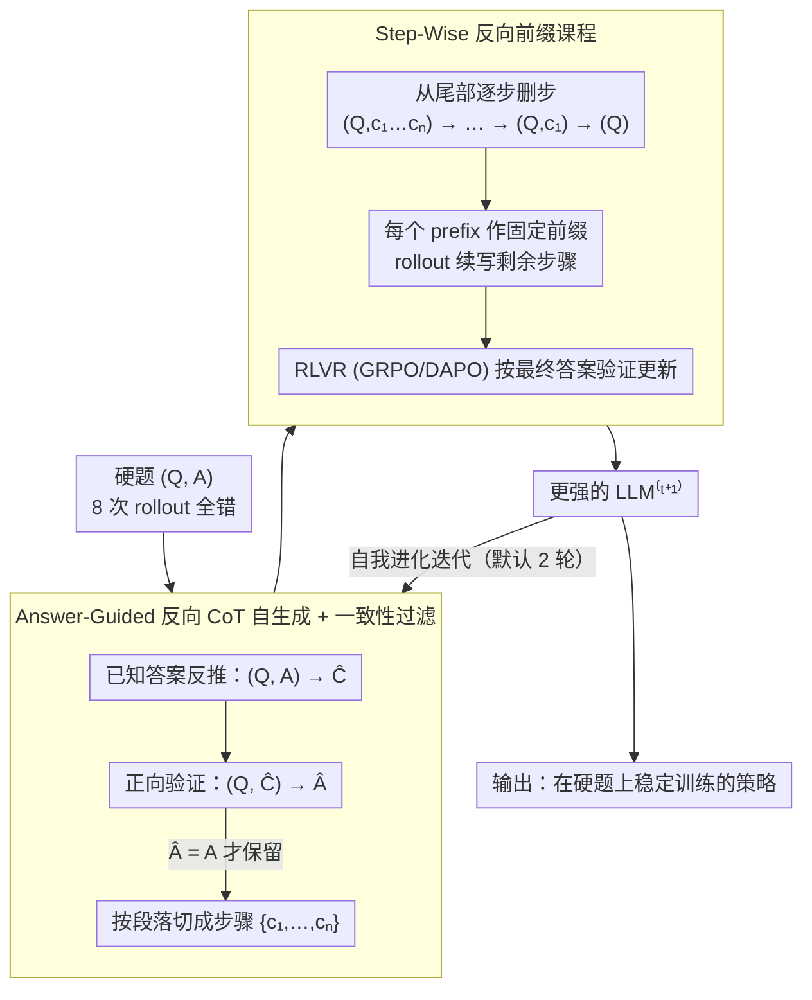

# EvoCoT: Overcoming the Exploration Bottleneck in Reinforcement Learning for LLMs

**会议**: ACL 2026  
**arXiv**: [2508.07809](https://arxiv.org/abs/2508.07809)  
**代码**: <https://github.com/gtxygyzb/EvoCoT>  
**领域**: 强化学习 / LLM 推理 / 课程学习  
**关键词**: RLVR、Chain-of-Thought、课程学习、自我进化、稀疏奖励

## 一句话总结
本文提出 EvoCoT，一个两阶段自我进化的课程学习框架：先用最终答案约束 LLM 自生成可验证的 CoT 轨迹，再渐进地从尾部删除推理步骤，逐步扩大探索空间，从而在 sparse reward 的硬题上稳定训练 RLVR，不依赖任何教师模型或人写 CoT，就让 R1-Qwen-1.5B 在 MATH 训练集上的硬题正确率从 55.7 飙升到 87.8。

## 研究背景与动机

**领域现状**：RLVR（Reinforcement Learning with Verifiable Reward）已成为 LLM 推理后训练的主流范式——DeepSeek-R1 / Kimi-k1.5 都靠它把推理能力推上新台阶。基本流程是 rollout 采样、用规则验证最终答案，再用 GRPO/DAPO 更新策略。但这套方法依赖 rollout 命中正确答案才能拿到奖励。

**现有痛点**：在硬题上 rollout 命中率极低（GRPO 训练后 Qwen2.5-7B 在 GSM8K 仍有 8.8% 解不出，MATH 22.0%），奖励长期稀疏，学习信号几乎为零。已有解法分两派：(i) 依赖教师模型（LUFFY / Guide-GRPO / ReLIFT / TAPO / SRFT），需访问 GPT-4o 级模型蒸馏，对训练旗舰模型不适用；(ii) 课程学习过滤（RORL / AdaRFT / SEC），但会扔掉本可贡献学习信号的硬题。

**核心矛盾**：硬题正是能扩展模型推理能力上界的关键数据，但稀疏奖励让 RLVR 在硬题上几乎学不到东西。如何在"不依赖教师、不丢弃硬题"两个约束下让 LLM 从硬题中学习，是一个被 Yue / Zhao (2025) 等人指出的 RLVR 根本瓶颈。

**本文目标**：(i) 设计一个 distillation-free + unfiltered 的训练框架（Table 1 中只有 EvoCoT 同时满足两点）；(ii) 让模型在初始 0/8 rollout 正确的硬题上仍能拿到密集奖励；(iii) 与现有 GRPO / DAPO 正交，可作为后训练增强层。

**切入角度**：作者发现关键瓶颈是"探索空间太大 vs. 模型当前能力"的不匹配（Figure 1）。如果能临时把探索空间约束到 LLM 能力可及的范围，硬题就能产生密集奖励信号；随后渐进放大探索空间，逐步逼近原任务难度。这正是课程学习思想，但前人的课程要么按题目难度分桶（需要外部难度标注），要么用静态 prefix 反向课程 R3/AdaBack（需要完整 CoT 数据）。

**核心 idea**：把每一道硬题转成"自生成的 CoT + 渐进缩短的 prefix"——CoT 越长，模型只需要补结尾，难度越低；CoT 越短，需要补的越多，越接近原题。每条样本自带一个完整的"易→难"梯度，无需任何外部难度标注或教师 CoT。

## 方法详解

### 整体框架
EvoCoT 是嵌套两阶段的迭代框架。Stage 1 (Answer-Guided Reasoning Path Self-Generation)：对每道 $(Q,A)$ 硬题，让 LLM 在已知最终答案 $A$ 的条件下生成 $\hat{C}$；再用一致性检查 $(Q,\hat{C}) \to \hat{A}$，只保留 $\hat{A}=A$ 的 $\hat{C}$，并按 "\n\n" 切成步骤 $\{\hat{c_1},\dots,\hat{c_n}\}$。Stage 2 (Step-Wise Curriculum Learning)：对每条 CoT 从尾部依次删步——先用 $(Q,c_1,\dots,c_n)$ 做 rollout、再 $(Q,c_1,\dots,c_{n-1})$、…、$(Q,c_1)$、最后 $(Q)$——形成一条"从全 prefix 引导到零引导"的难度梯度，每个 prefix 作为 rollout 的固定前缀，剩余步骤自由生成，再用 RLVR 更新。两阶段交替迭代 $t$ 次（Equation 5），随着 LLM 能力提升，下一轮 Stage 1 又能生成更高质量的 CoT，形成自我进化闭环。

### 关键设计

**1. Answer-Guided 反向 CoT 自生成 + answer-consistency 过滤：从只有 $(Q,A)$ 的硬题里无中生有地造出可信推理链**

硬题的困境是模型 rollout 几乎命中不了正确答案，拿不到任何监督；但每道题其实自带最终答案 $A$。EvoCoT 利用这个先验：把 $Q$ 和 $A$ 一起喂给 LLM，让它「反推」出支持该答案的推理链 $\hat{C}$，写成 $(Q,A) \xrightarrow{\text{LLM}} \hat{C}$——已知答案后，模型造出合理 CoT 比从零正向推导容易得多。但反推可能造出答案泄漏或 shortcut，于是再做一道正向一致性检验 $(Q,\hat{C}) \xrightarrow{\text{LLM}} \hat{A}$，只保留 $\hat{A}=A$ 的 $\hat{C}$。这样整个 CoT 既不依赖教师模型（模型自己生成、自己验证），又能确保保留的推理链真能推出正确答案。思路上类似 STaR 的 rationale 自生成，但 STaR 用于 SFT，这里是为后续 RL 课程搭脚手架。

**2. Step-Wise Reverse-Prefix Curriculum：把单条 CoT 变成一条从「全引导」到「零引导」的难度梯度**

光有 CoT 还不够——直接拿去 SFT 会退化成记忆。EvoCoT 把验证过的 CoT 按 "\n\n" 切成步骤 $\{c_1,\dots,c_n\}$，然后从尾部逐步删步，构造 $(Q,c_1,\dots,c_n) \to (Q,c_1,\dots,c_{n-1}) \to \dots \to (Q,c_1) \to (Q)$ 这条序列。每个 prefix 作为 rollout 的固定前缀（teacher forcing），LLM 只需自由生成剩余部分：prefix 越长，留给模型探索的空间越小，命中正确答案概率越高、奖励越密；prefix 越短，探索空间越大，但模型已在前几个 prefix 上学会了相关推理模式，可以稳定渐进。之所以一定要删到只剩 $(Q)$，是为了避免 reward hacking——如果 prefix 始终包含完整答案，模型就退化成抄答案，最终必须能从纯 $(Q)$ 直接推出 $A$ 才算真学会。相比 R3/AdaBack 这类同样用反向前缀课程的方法，EvoCoT 不需要外部完整 CoT 数据，每条样本自带课程。

**3. 自我进化迭代优化：让 CoT 质量与模型能力相互拉升**

单轮训练会被首轮自生成 CoT 的质量限死。EvoCoT 把两阶段嵌套成迭代闭环：第 $t$ 轮用当前 $\text{LLM}^{(t)}$ 生成 $\hat{C}^{(t)}$，在 $(Q,\hat{C}^{(t)},A)$ 上训练得到更强的 $\text{LLM}^{(t+1)}$；下一轮再用 $\text{LLM}^{(t+1)}$ 重新生成更优质的 $\hat{C}^{(t+1)}$（Equation 5）。即便首轮 CoT 不完美，迭代也能逐步打磨出高质量推理链，让框架对初始能力不那么敏感。整个机制与 GRPO / DAPO 正交——它不替换 RL 算法，只改写训练样本结构，可作为现有 RLVR pipeline 的 drop-in 增强层。

### 损失函数 / 训练策略
Stage 2 直接复用 RLVR（默认 GRPO，也兼容 DAPO/PRIME 等），rollout 在固定 prefix 后接续生成，回报基于最终答案的规则验证。Stage 1 阶段从 GSM8K + MATH 训练集中筛出"8 次 rollout 全错"的硬题，每题采样 8 条 CoT（temperature=1.0）。所有实验在 8×A100 (40GB) 上跑，每个模型最大训练步数固定，超额硬题被丢弃。EvoCoT 默认迭代 2 轮（实验显示 3 轮后 plateau）。

## 实验关键数据

### 主实验（跨模型族在 6 个数学 benchmark 上的对比，pass@1）

| 模型 + 方法 | GSM8K | MATH | AIME24 | AMC23 | Minerva | Olympiad | Avg |
|------------|-------|------|--------|-------|---------|----------|-----|
| Llama3.1-8B + GRPO | 78.5 | 23.1 | 0.0 | 5.0 | 4.4 | 6.2 | 19.5 |
| Llama3.1-8B + EvoCoT | 80.5 | 23.8 | 0.0 | 7.5 | 4.8 | 5.8 | **20.4** |
| DeepSeek-Math-7B + GRPO | 79.8 | 38.7 | 0.0 | 15.0 | 16.2 | 12.4 | 27.0 |
| DeepSeek-Math-7B + EvoCoT | 76.3 | 39.1 | 0.0 | 20.0 | 19.1 | 13.0 | **27.9** |
| Qwen2.5-7B + GRPO (SimpleRL) | 92.4 | 79.7 | 10.0 | 52.5 | 34.6 | 38.1 | 51.2 |
| Qwen2.5-7B + EvoCoT | 91.4 | 76.5 | 20.0 | 60.0 | 37.1 | 35.9 | **53.5** |
| R1-Qwen-1.5B + DeepScaleR (GRPO) | 88.2 | 89.4 | 36.7 | 77.5 | 38.2 | 51.6 | 63.6 |
| R1-Qwen-1.5B + EvoCoT | 88.0 | 89.7 | **40.0** | **87.5** | **42.8** | **52.0** | **66.7** |

R1-Qwen-1.5B + EvoCoT 在 AMC23 (+10pp)、AIME24 (+3.3pp)、Minerva (+4.6pp) 上大幅领先 DeepScaleR；Qwen2.5-7B 平均 +2.3。

### 消融实验（硬题专项 + 自进化迭代）

| 配置 | GSM8K (硬题) | MATH (硬题) | 平均 |
|------|--------------|--------------|------|
| Qwen2.5-7B + GRPO | 91.2 | 78.0 | 84.6 |
| Qwen2.5-7B + EvoCoT | 95.4 | 82.7 | **89.1** |
| R1-Qwen-1.5B + GRPO | 80.7 | 55.7 | 68.2 |
| R1-Qwen-1.5B + EvoCoT | 91.9 | **87.8** | **89.9** |
| Llama3.1-8B + GRPO | 84.3 | 21.9 | 53.1 |
| Llama3.1-8B + EvoCoT | 83.6 | 21.9 | 52.8 |

自进化迭代效果（R1-Qwen-1.5B 在 6 benchmark 平均）：iter0 = 63.6 → iter1 = 64.3 → **iter2 = 66.7** → iter3 = 65.8（开始震荡，说明 2 轮即饱和）。

### 关键发现
- **强模型受益更大**：Qwen2.5-7B 在 MATH 硬题上从 78.0 涨到 82.7（+4.7），R1-Qwen-1.5B 从 55.7 飙到 87.8（+32.1），但 Llama3.1-8B 几乎无变化。原因是弱模型自生成的 CoT 质量太低，整个 self-evolving 循环启动不起来——Stage 1 是质量上限。
- **rollout 正确数稳定在高位**：Figure 2 显示 R1-Qwen-1.5B 在 256 次 rollout 中持续保持 220+ 正确，而 GRPO 全程在 0-5 徘徊。这是"约束探索空间"的直接证据。
- **EvoCoT 优于 SFT**：在 STaR 风格 SFT 对比中，Qwen2.5-7B SFT 仅 36.9（甚至低于基线 40.3），EvoCoT 53.5。说明渐进 RL 比静态 SFT 更能内化推理能力，避免 Chu 2025 所说的"SFT 记忆化"。
- **自我进化 2 轮饱和**：R1-Qwen-1.5B 第 3 轮反而掉点，说明 self-evolution 不是 indefinite——一旦 CoT 质量与模型能力对齐后，继续迭代会过拟合或退化。
- **数据效率高**：训练只用 GSM8K + MATH，结果与用 380K 数据的 PRIME 相当 (53.5 vs 55.3)，效率远胜。

## 亮点与洞察
- **"已知答案反推 CoT"是个被低估的强先验**：传统 SFT/RL 都让模型先想 CoT 再得答案，而 EvoCoT 反过来让模型在答案约束下生成 CoT 再正向验证，这种"反向+正向"的双重约束让弱监督下的 CoT 自合成质量大幅提升。这一思路可直接迁移到任何 verifiable reward 任务（代码、数学、单元测试）。
- **单条样本自带课程**：相比 RORL / AdaRFT 需要外部难度估计、R3/AdaBack 需要完整 CoT 数据，EvoCoT 的"反向 prefix 删步"自然在每条样本内部生成完整难度谱。零额外标注成本，工程友好。
- **与 GRPO/DAPO 正交**：不替换 RL 算法本身，只改写训练样本结构，可作为现有 RLVR pipeline 的 drop-in 增强层。这种"和谁都不冲突"的特性极大降低落地门槛。
- **暴露"模型能力下限决定课程上限"**：弱模型 (Llama3.1-8B) 几乎无收益，说明 self-evolution 类方法需要 base model 跨过某个能力阈值才能起飞——这是个值得未来研究的 scaling law。

## 局限与展望
- 弱模型基本无效——Stage 1 的 CoT 自生成质量是硬上限，对 base capability < 某个阈值的模型完全失效；可考虑用更强的外部 verifier 替代 self-consistency。
- 自进化 2 轮后 plateau，无法 indefinite scaling；作者承认这是 inherent limitation。
- 只在数学 benchmark 上验证，没在代码生成 / 工具调用等其他 verifiable reward 任务上测；扩展性待验证。
- 训练资源仍重（8×A100 + 多轮 rollout + 多轮迭代），单题成本高。
- "尾部删步"是固定策略，没探索"中部删步"或"自适应 step 选择"的可能性。

## 相关工作与启发
- **vs LUFFY / Guide-GRPO / ReLIFT**：他们靠教师模型注入 CoT 或 hint；EvoCoT 完全自给自足，没有教师依赖，对训练旗舰模型至关重要。
- **vs RORL / AdaRFT / SEC**：他们用题目难度分桶或过滤；EvoCoT 不丢任何硬题，且在样本内部生成难度梯度。Table 1 中 EvoCoT 是唯一同时 distillation-free 和 unfiltered 的方法。
- **vs R3 / AdaBack**：他们也用 reverse-prefix curriculum，但需要外部完整 CoT 数据；EvoCoT 自生成 CoT，更通用。
- **vs STaR (Zelikman 2022)**：STaR 用 answer-rationalization 做 SFT，EvoCoT 把这一思路从 SFT 升级到 RL 课程构造，并加入渐进难度，效果上明显优于 STaR-style SFT。

## 评分
- 新颖性: ⭐⭐⭐⭐ 反向 prefix 课程 + 自生成 CoT 的组合是 unique 的，但单个组件都有先例
- 实验充分度: ⭐⭐⭐⭐ 4 个模型族 × 6 个 benchmark × 多基线对比 + 自进化迭代 + ablation，扎实
- 写作质量: ⭐⭐⭐⭐ Table 1 一目了然的方法定位、RQ 驱动的实验组织、公式简洁清晰
- 价值: ⭐⭐⭐⭐⭐ 解决了 RLVR 在硬题上的核心瓶颈，正交于现有 RL 算法，对旗舰模型后训练有直接工业价值

<!-- RELATED:START -->

## 相关论文

- [\[ACL 2026\] RL-PLUS: Countering Capability Boundary Collapse of LLMs in Reinforcement Learning with Hybrid-policy Optimization](rl-plus_countering_capability_boundary_collapse_of_llms_in_reinforcement_learnin.md)
- [\[ACL 2026\] Targeted Exploration via Unified Entropy Control for Reinforcement Learning](targeted_exploration_via_unified_entropy_control_for_reinforcement_learning.md)
- [\[ACL 2026\] Free Energy-Driven Reinforcement Learning with Adaptive Advantage Shaping for Unsupervised Reasoning in LLMs](free_energy-driven_reinforcement_learning_with_adaptive_advantage_shaping_for_un.md)
- [\[ACL 2026\] HEALing Entropy Collapse: Enhancing Exploration in Few-Shot RLVR via Hybrid-Domain Entropy Dynamics Alignment](healing_entropy_collapse_enhancing_exploration_in_few-shot_rlvr_via_hybrid-domai.md)
- [\[ACL 2026\] Semantic-Space Exploration and Exploitation in RLVR for LLM Reasoning](semantic-space_exploration_and_exploitation_in_rlvr_for_llm_reasoning.md)

<!-- RELATED:END -->
