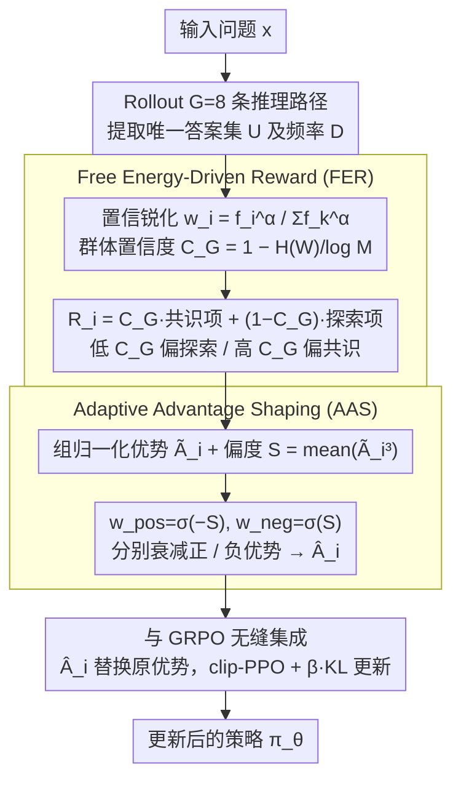

# Free Energy-Driven Reinforcement Learning with Adaptive Advantage Shaping for Unsupervised Reasoning in LLMs

**会议**: ACL 2026  
**arXiv**: [2605.04065](https://arxiv.org/abs/2605.04065)  
**代码**: 暂未公开  
**领域**: 强化学习 / 无监督 RL / LLM 推理 / GRPO  
**关键词**: Free Energy Principle, Unsupervised RL, Advantage Shaping, GRPO, 自我提升

## 一句话总结
FREIA 把自由能原理 (FEP) 引入无标签 RL 微调，用「共识 + 探索」自适应奖励 (FER) 和基于奖励分布偏度的自适应优势整形 (AAS) 同时解决传统多数投票 / 自信度 reward 的过早收敛和 advantage 估计在训练阶段错配两个问题，在 3 个推理任务、9 个数据集上达到与 supervised GRPO 持平甚至更好的水平。

## 研究背景与动机

**领域现状**：RLVR（带可验证奖励的强化学习）已经是 LLM 推理能力（如 DeepSeek-R1、o1）的核心技术，但它依赖人工标注 ground-truth。无监督自我提升（unsupervised self-improvement）成为热点，主流分两派：(1) **轨迹内蕴方法**（Entropy、Intuitor、Confidence-is-all-you-need）用语义熵 / 自信度当 reward；(2) **群体共识方法**（TTRL、Self-Consistency PO、Co-Reward）用多数投票当 reward。

**现有痛点**：作者通过一个简洁例子戳穿两派的硬伤 — 题目正确答案是 13，但 majority voting 把 0 分给了正确的"13"，把满分给了错误的多数答案"4"；自信度类方法则给"罕见但自信"的错误答案打高分。更糟的是，无论哪种方法都用**静态准则**面对一个**动态变化的能力**：

- **训练早期（Weak Consensus）**：高 reward 答案稀少，standard advantage normalization 会给少数 outlier 一个巨大的正 advantage，模型过早 overfit 到这些噪声。
- **训练后期（Strong Consensus）**：多数答案统治种群，standard advantage 把偶尔的少数路径打成大负 advantage，policy 从"巩固优势"退化为"只求不犯错"。

**核心矛盾**：reward 设计与 advantage 估计**都是静态的**，无法跟随模型能力演进而调整 — 早期需要鼓励探索，后期需要巩固共识，而现有方法在两端都用同一套规则。

**本文目标**：(1) 设计一个能在「共识 ↔ 探索」之间自适应切换的 reward；(2) 设计一个能感知当前训练阶段的 advantage shaping；(3) 在不引入额外训练成本的前提下，跨数学、SQL、多模态几何三种任务超越所有 unsupervised baseline。

**切入角度**：作者借用神经科学的**自由能原理 (FEP, Friston 2010)** — 大脑通过最小化自由能在"利用已有信念"与"主动探索"之间取得平衡。把无监督 LLM 自我提升类比为最小化自由能，自然导出"共识对齐 + 新颖路径探索"的双项目标。

**核心 idea**：用群体置信度 $C_G\in[0,1]$ 作为门控，自适应地在 consensus reward 和 exploration reward 之间插值；用 reward 分布的**偏度 (skewness)** $\mathcal{S}$ 作为训练阶段指示器，动态衰减正 / 负 advantage 的权重。

## 方法详解

### 整体框架

FREIA 建立在 GRPO 之上，只在「奖励」和「优势」两处做手术，其余 PPO 结构原样保留。对每个输入 $x$，先 rollout $G=8$ 条 reasoning 路径并提取最终答案，统计去重后的唯一答案集 $U=\{u_1,...,u_M\}$ 及其频率 $D=\{f_1,...,f_M\}$；然后 FER 模块根据群体置信度在「跟随共识」和「鼓励探索」之间自适应混合，给每条路径打出连续 reward $R_i$；AAS 模块再用这批 reward 分布的偏度判断当前训练处于早期还是后期，对正、负优势分别衰减，得到整形后的 $\hat{A}_i$；最后把 $\hat{A}_i$ 塞进标准 GRPO 的 clip-PPO 目标（带 $\beta=0.001$ 的 KL 约束）完成策略更新。整条 pipeline 不引入任何额外训练成本。

### 关键设计

**1. Free Energy-Driven Reward (FER)：用一个公式同时表达「跟随多数」和「鼓励冒险」，门控权重随训练动态滑动**

无监督自我提升的两派各有硬伤：纯共识（多数投票）会被错误多数锁死，纯自信度会给「罕见但自信」的错误答案高分；更根本的是，它们都用静态准则面对动态变化的能力——早期该探索、后期该巩固。FER 把这两端融进一条 reward。先对答案频率做非线性 belief sharpening $w_i = f_i^\alpha / \sum_k f_k^\alpha$（$\alpha=2$，越大越强化多数派），再用归一化 Shannon 熵定义群体置信度 $C_G = 1 - H(W)/\log M$（$M=1$ 时 $C_G=1$）。共识项 $r_{cons}(y_i) = \mathbb{1}[a_i = \text{Vote}(A)]$ 奖励跟随多数，探索项 $r_{explore}(y_i) = \tanh(-\log w_i)$ 奖励罕见答案（$\tanh$ 防止该信号爆炸主导）。最终 $R_i = C_G \cdot r_{cons}(y_i) + (1 - C_G) \cdot r_{explore}(y_i)$。这样训练早期 $C_G$ 低、权重自动偏向探索，避免被错误多数锁死；后期 $C_G$ 高、自动倾斜到共识，巩固正确路径——正是 FEP「越自信越利用、越不自信越探索」在无监督 LLM 上的落地。

**2. Adaptive Advantage Shaping (AAS)：用 reward 分布的偏度当训练阶段探针，对正、负优势分别衰减**

即便 reward 设计好了，标准 group normalization 仍会在两端犯错：早期高 reward 答案稀少，归一化会给个别 outlier 一个巨大正优势，模型过早 overfit 到噪声；后期多数答案统治种群，偶尔的少数路径被打成大负优势，policy 退化成「只求不犯错」。AAS 让 advantage 也随阶段自适应。先算标准 group-normalized 优势 $\tilde{A}_i = (R_i - \mu_R)/(\sigma_R + \epsilon)$，再算样本偏度 $\mathcal{S} = \frac{1}{G}\sum_i \tilde{A}_i^3$ 作为阶段指示器，最后用 sigmoid 把偏度映成衰减权重 $w_{pos} = \sigma(-\mathcal{S})$、$w_{neg} = \sigma(\mathcal{S})$，得到 $\hat{A}_i = w_{pos}\tilde{A}_i$（当 $\tilde{A}_i > 0$）或 $w_{neg}\tilde{A}_i$（当 $\tilde{A}_i < 0$）。正偏意味着低 reward 主导、高 reward 多半是随机 outlier，于是 $w_{pos}\to 0$ 抑制对噪声的过拟合；负偏意味着高 reward 主导、低 reward 多半是无害变体，于是 $w_{neg}\to 0$ 防止过度惩罚少数路径。本质上是把 FER 在 reward 层做的自适应，在 advantage 层再做一次，而且偏度完全 self-contained，单 batch 就能算出来。

**3. 与 GRPO 的无缝集成：整套 FER+AAS 是 drop-in plug-in，不动 PPO 的 clip 与 KL 结构**

FREIA 只用 $\hat{A}_i$ 替换 GRPO 原本的 group-normalized 优势，loss 仍是 $\mathcal{L}(\theta) = \mathbb{E}[\frac{1}{G}\sum_i \frac{1}{|o_i|} \sum_t \min(r_{i,t}(\theta)\hat{A}_i, \text{clip}(r_{i,t}, 1\pm\epsilon)\hat{A}_i) - \beta D_{KL}(\pi_\theta \| \pi_{ref})]$，token-level loss、clip 范围、KL 项全保持 GRPO 默认。这意味着它对任何 GRPO 实现都是零成本替换，也是为什么 wall-clock 时间与 baseline 持平（Figure 6）——FER 和 AAS 都只是 batch 内 $O(G)$ 的统计操作。

### 损失函数 / 训练策略

- 训练：MATH 数据集，AdamW (lr=1e-6)，400 步，batch=512，rollout $G=8$，sampling temperature=1.0；KL 系数 $\beta=0.001$；FER 关键超参 $\alpha=2$。
- 评测：Pass@1，sampling temperature=0.6，3 个 random seed 取均值±方差。
- 硬件：4× A100 40GB GPU。

## 实验关键数据

### 主实验

数学推理 6 个 benchmark（DeepSeek-R1-Distill-Qwen-1.5B）的 Pass@1：

| 数据集 | Base | GRPO (Supervised) | TTRL | Entropy | Intuitor | **FREIA** |
|--------|------|-------------------|------|---------|----------|-----------|
| MATH500 | 77.6 | 82.4 | 82.6 | 81.8 | 81.4 | 82.2 |
| AIME24 | 16.7 | 20.0 | 20.0 | 16.7 | 16.7 | **20.0** |
| AIME25 | 16.7 | 20.0 | 20.0 | 16.7 | 16.7 | **20.0** |
| AMC23 | 62.5 | 70.0 | 70.0 | 65.0 | 65.0 | **72.5** |
| Minerva | 27.6 | 30.5 | 30.9 | 29.8 | 29.4 | **31.3** |
| Olympiad | 42.4 | 48.6 | 49.0 | 47.5 | 46.6 | **49.4** |
| **Avg.** | 40.6 | 45.3 | 45.4 | 42.7 | 42.4 | **45.9** |

Qwen2.5-Math-1.5B-Instruct 上平均 Pass@1：Base=33.2 → Entropy=35.7 → Intuitor=34.8 → TTRL=38.1 → **FREIA=38.5**，仍然超过 supervised GRPO (38.3)。Qwen2.5-3B 上 FREIA 与 GRPO 打平（30.1 vs 30.1），均比无监督最强 TTRL (29.5) 高 0.6pp。

### 消融实验

| 配置 | Avg Pass@1 (相对变化) | 说明 |
|------|----------------------|------|
| Full FREIA | 45.9 | FER + AAS 完整版 |
| w/o AAS | ↓ 较小 | 退回 static advantage normalization |
| w/o Exploration | ↓↓ | 只用 consensus reward，早期过早收敛 |
| w/o Consensus | ↓↓↓ **最大降幅** | 只用 exploration reward，丧失自我提升驱动力 |

$\alpha$ 敏感性：$\alpha=2$ 附近最优，$\alpha$ 过小导致信号噪声大、不稳定；$\alpha$ 过大过度强化共识、过早收敛到次优解；曲线平坦说明对超参数 robust。

### 关键发现

- **无监督也能超过 supervised GRPO**：FREIA 在 DeepSeek-1.5B 平均分 45.9 高于 supervised GRPO 的 45.3，作者归因于 FER 提供「连续 + 密集」信号，而 binary RLVR 信号过于稀疏。
- **共识比探索更核心**：消融显示去掉 consensus 损失最大，去掉 exploration 次之，说明 self-improvement 的主驱动力仍是 majority signal，exploration 只是防过早收敛的安全阀。
- **训练动态符合 FEP 预期**：图 7 显示 policy entropy 单调下降、$C_G$ 单调上升，consensus reward 平滑上升，但 exploration reward 始终保持波动 — 模型在收敛同时**保留持续探索**，这是 FEP 理论的预期行为。
- **跨任务可迁移**：在 SQL 生成（Spider/BIRD）和多模态几何（Geometry3K）上 FREIA 仍领先所有 unsupervised baseline，证明 FER+AAS 不是只对数学有效。
- **AAS 的偏度信号确实有效**：w/o AAS 虽然是消融中性能最好的，但仍劣于 full FREIA，证明动态 advantage shaping 不可省。

## 亮点与洞察

- **首次把 Free Energy Principle 落到 unsupervised RL reward 设计上**：FEP 之前主要在主动推断 (Active Inference) 圈子里玩，这篇把它简化成「$C_G$ 当门控、consensus + exploration 双项相加」的可计算公式，给 LLM RL 社区一个全新的设计语言。
- **用 reward 分布偏度当训练阶段指示器**：传统做法是用 step 数或 entropy 当指示器，本文用 batch 内偏度 $\mathcal{S}$ — 完全 self-contained，不需要全局状态，单 batch 就能算出来。这个 trick 可以迁移到任何 group-based RL（GRPO / RLOO / REINFORCE++）。
- **「Belief sharpening + soft normalization」组合**：$w_i = f_i^\alpha / \sum f_k^\alpha$ 配合 $\tanh(-\log w_i)$ 的设计很巧妙 — 前者用幂律放大共识，后者用 $\tanh$ 防止探索 reward 爆炸。这一对 trick 是无监督 RL 中防止 reward hacking 的通用模板。
- **零计算开销**：FER 和 AAS 都是 batch 内 $O(G)$ 操作，wall-clock 跟 baseline 持平（Figure 6），意味着没有"以时间换效果"的隐性代价。

## 局限与展望

- **作者承认**：(1) 实验只到 3B 参数，更大模型上是否仍跑赢 GRPO 未知；(2) $C_G$ 只看最终答案分布，不考虑中间推理步骤的语义，对 process-level reward 是粗粒度近似；(3) AAS 用 batch-level 偏度作为代理，可能掩盖 intra-batch 的异质性，更细粒度的 per-sample shaping 是后续方向。
- **隐藏问题**：(1) 提升幅度有限 — 平均 Pass@1 比 TTRL 高 0.5-3.5 个点，统计显著但工程意义偏小；(2) FER 的"共识 = 多数答案"在开放生成任务（如 creative writing、数学开放式证明）中失效，本文的成功很大程度依赖任务有"短可验证答案"这一特性；(3) Group Confidence $C_G$ 依赖采样 $G$，论文用 $G=8$，更小 batch 时 $C_G$ 噪声可能淹没信号。
- **改进思路**：(1) 把偏度信号从 batch 级别下沉到 token 级别，对每个 token 都做 adaptive shaping；(2) 把 $C_G$ 扩展为"步骤级置信度"，把 process reward model 也包到 FEP 框架里；(3) 在 long-CoT 任务上验证 FEP 框架是否仍 holds — 长链推理时 reward 稀疏，FER 的连续信号优势可能更显著。

## 相关工作与启发

- **vs TTRL (Test-Time RL)**：TTRL 纯靠 majority voting，会被错误多数锁死（Figure 1 经典反例）；FREIA 通过 $(1-C_G)$ 探索项保留了少数路径的学习信号，对错误共识更鲁棒。
- **vs Entropy / Intuitor (自信度类)**：这两类只用 trajectory-intrinsic 信号，给"自信但错误"答案高 reward；FREIA 用群体共识作为外部锚，把自信度问题转化为「分布形状」问题，更稳。
- **vs Co-Reward / Self-Consistency PO**：Co-Reward 用 cross-view consensus 增加 robust 性但抑制探索；FREIA 在同一份 rollout 上同时做共识和探索，不需要多 view。
- **vs supervised GRPO**：GRPO 用 binary correct/wrong reward，信号稀疏；FER 用 $(0,1)$ 连续 reward，每条路径都有梯度信号，密集学习。

## 评分
- 新颖性: ⭐⭐⭐⭐ FEP 当成 reward 设计原则是新视角，但 GRPO 框架本身没动。
- 实验充分度: ⭐⭐⭐⭐ 3 任务 × 9 数据集 × 3 模型 × 4 baseline × 3 seed 全套跑完，消融和 sensitivity 都给了。
- 写作质量: ⭐⭐⭐⭐ 公式推导清晰，Figure 1/2 把动机讲得很直观；附录覆盖完整。
- 价值: ⭐⭐⭐⭐ 无监督 RL 是降本利器，本文给出一个可直接 plug 进 GRPO 的强基线和清晰的设计范式。

<!-- RELATED:START -->

## 相关论文

- [\[ACL 2026\] Verifier-Free RL for LLMs via Intrinsic Gradient-Norm Reward](verifier-free_rl_for_llms_via_intrinsic_gradient-norm_reward.md)
- [\[ACL 2026\] LANG: Reinforcement Learning for Multilingual Reasoning with Language-Adaptive Hint Guidance](lang_reinforcement_learning_for_multilingual_reasoning_with_language-adaptive_hi.md)
- [\[ICLR 2026\] Unsupervised Learning of Efficient Exploration: Pre-training Adaptive Policies via Self-Imposed Goals](../../ICLR2026/reinforcement_learning/unsupervised_learning_of_efficient_exploration_pre-training_adaptive_policies_vi.md)
- [\[ICML 2026\] CPMöbius: Iterative Coach–Player Reasoning for Data-Free Reinforcement Learning](../../ICML2026/reinforcement_learning/cpmobius_iterative_coach-player_reasoning_for_data-free_reinforcement_learning.md)
- [\[ACL 2026\] EvoCoT: Overcoming the Exploration Bottleneck in Reinforcement Learning for LLMs](evocot_overcoming_the_exploration_bottleneck_in_reinforcement_learning.md)

<!-- RELATED:END -->
