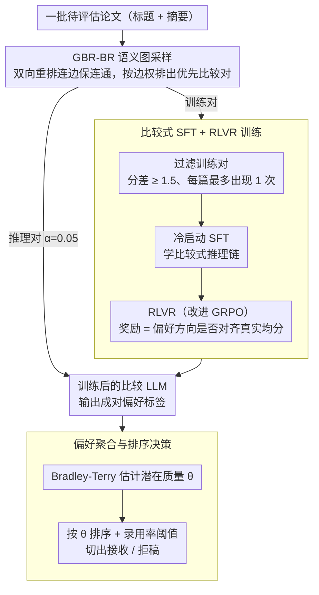

# From Isolated Scoring to Collaborative Ranking: A Comparison-Native Framework for LLM-Based Paper Evaluation

**会议**: ACL2026 Findings  
**arXiv**: [2603.17588](https://arxiv.org/abs/2603.17588)  
**代码**: 论文称已开源，但当前 cache 未给出具体 GitHub URL  
**领域**: LLM评估 / 自动化同行评审 / 排序学习  
**关键词**: 比较式评估, 论文排序, 论文评审LLM, Bradley-Terry, RLVR  

## 一句话总结
这篇论文把 LLM 论文评审从“单篇打绝对分”改成“成对比较再全局排序”，用语义图采样、比较式 SFT 与可验证奖励强化训练 7B 模型，在 ICLR-2025 论文排序和录用预测上显著超过 DeepReview-14B，并能迁移到多个未见会议。

## 研究背景与动机
**领域现状**：LLM 已经被用于辅助论文评审，常见范式是让模型阅读一篇论文后输出绝对分数、审稿意见或录用建议。训练式方法会用历史审稿分数监督模型，agent 方法则模拟多审稿人讨论，但最终大多仍围绕“单篇论文应该得几分”展开。

**现有痛点**：绝对分数并不稳定。同一个 6 分在不同会议、年份、领域或评审标准下含义不同，模型很容易学到某个数据集里的评分习惯，而不是可迁移的学术判断。更麻烦的是，论文评审本质上常常是排序问题：程序委员会关心的是一批投稿中哪些更值得接收，而不是每篇论文孤立地对应一个固定标尺。

**核心矛盾**：LLM 比较擅长相对判断和语言推理，但现有训练信号强迫它拟合绝对数值；绝对数值又受到会议尺度、打分习惯和领域差异影响，导致模型把数据集特定规则误当成“论文质量”。

**本文目标**：作者希望建立一个 comparison-native 的论文评估框架，在数据构造、模型训练和推理阶段都直接处理论文对之间的偏好，并把成对偏好聚合成全局质量排序，再由排序决定录用集合。

**切入角度**：论文从“人类评审往往通过比较形成判断”这一观察出发，把复杂的定量评分问题拆成大量更简单的 pairwise comparison。这样的监督既能避开绝对分数尺度不一致，也更贴近 LLM 通过对比分析差异的能力。

**核心 idea**：用“图采样得到有信息量的论文对 + 比较式 SFT/RLVR 学偏好 + Bradley-Terry 聚合偏好”替代“单篇论文打绝对分”。

## 方法详解
这篇方法的关键不是单独提出一个新的 reviewer prompt，而是把论文评审的整个数据流重写为比较任务：训练时构造成对论文，让模型判断哪篇质量更高；推理时也只让模型做成对判断；最后再把这些偏好边汇总成全局排序。

### 整体框架
输入是一批待评估论文，论文表示主要来自标题与摘要。框架先通过 pair sampling 选出需要比较的论文对，让经过训练的 LLM 给每个论文对输出偏好标签，再把这些成对偏好汇总成全局排序。训练阶段，采样出的论文对会先经过分数差和出现次数约束过滤形成可靠监督，模型先用冷启动 SFT 学会比较式推理、再用基于真实均分偏好的 RLVR 强化；推理阶段则控制采样比例只比较一小部分论文对，最后用 Bradley-Terry 模型估计每篇论文的潜在质量分数，并按录用率阈值做接收/拒稿决策。

### 关键设计

**1. GBR-BR 语义图采样：在海量可能论文对里只挑“既可比又有信息量”的那些**

完全随机配对会产生大量跨领域、难以判断或信息密度低的 pair，而只配同领域论文又会损失跨领域泛化能力。GBR-BR 用一张语义图来折中：每篇论文先用 embedding 检索候选邻居，再用 reranker 得到双向排名，只要论文 $p_i$ 和 $p_j$ 在任一方向进入前列就在图中连边，边权取 $2k_r-r_{ij}-r_{ji}$（双向排名越靠前权重越大）。图必须保持连通，一旦出现孤立节点就放宽检索和重排阈值把它接回来，最后按边权排序得到优先比较列表。这样相近论文之间形成细粒度的可比监督，同时连通性保证了没有论文被完全孤立、缺少比较信号。

**2. 比较式 SFT + RLVR 训练：让 7B 模型真正学会判断“哪篇更强”，而不是把比较丢给未训练的通用 LLM**

直接拿通用 LLM 做 comparator 并不可靠，但纯 SFT 又未必能优化最终的偏好正确性、直接上 RL 则容易不稳定，所以作者走“冷启动 + 强化”两步。训练 pair 先经两道过滤降噪提多样性：平均审稿分差至少 $d_{min}=1.5$、且每篇论文最多出现 $c_{max}=1$ 次。模型先用 instruct LLM 生成的比较推理链做冷启动 SFT 学会比较式推理格式，再用改进的 GRPO 做强化；奖励直接来自真实平均分构造的偏好标签 $y_{ij}=\mathbb{I}(s_i>s_j)$，模型预测方向正确时给 $R_l=\gamma\cdot\mathbb{I}(y_{ij}=\hat y_{ij}^{(l)})$，实验取 $\gamma=5$。SFT 负责把推理格式和初始偏好能力打好，RLVR 再用可验证标签持续对齐相对质量判断。

**3. 偏好聚合与排序决策：把一堆局部成对偏好转成会议层面的全局质量排名**

pairwise judgment 本身只给出“两两谁更好”，并不能直接产出一个会议的录用集合，所以推理时只在理论上 $O(n^2)$ 的论文对中采样一小部分（比例 $\alpha=0.05$），每个 pair 由训练后的 LLM 产生偏好标签，再用 Bradley-Terry 模型把这些偏好边聚合成每篇论文的潜在质量 $\theta_i$，其中 $i$ 优于 $j$ 的概率为 $p_{ij}=e^{\theta_i}/(e^{\theta_i}+e^{\theta_j})$。最大化所有偏好标签的似然后按 $\theta_i$ 排序，再用预设录用率切出接收论文。作者选 Bradley-Terry 而非其他聚合方式，是因为它可解释、经典，且在实验里聚合效果最好。

### 损失函数 / 训练策略
训练基座为 Qwen2.5-7B-Instruct，并用 LoRA 提升效率。主训练数据来自 ICLR-2025，遵循 DeepReview 的 train-test split，ground truth 是真实评审均分。训练 pair 过滤使用 $d_{min}=1.5$ 与 $c_{max}=1$，推理 pair 采样比例 $\alpha=0.05$，录用率固定为 ICLR-2023 和 ICLR-2024 平均录用率 31.4%。优化流程是“比较推理冷启动 SFT → RLVR”，奖励不拟合绝对分数，而只检查模型给出的偏好方向是否与真实均分高低一致。

## 实验关键数据

### 主实验
| 数据集 / 任务 | 指标 | 本文 CNPE-7B | 最强或代表性基线 | 提升 / 结论 |
|--------|------|------|----------|------|
| ICLR-2025 录用预测 | Accuracy | 0.7192 | DeepReview-14B 0.6845 | 7B 模型超过 14B 训练式 reviewer |
| ICLR-2025 录用预测 | F1 | 0.6732 | DeepReview-14B 0.6254 | 对接收/拒稿边界更敏感 |
| ICLR-2025 录用预测 | AUC | 0.7408 | DeepReview-14B 0.6624 | 论文称相对最接近竞争者提升 11.8% |
| ICLR-2025 排序 | Spearman $\rho$ | 0.4091 | DeepReview-14B 0.4014 | 排名相关性小幅领先 |
| ICLR-2025 排序 | MAP@20 | 0.7076 | PairReview(GLM) 0.3474 / DeepReview-14B 0.1478 | 高质量论文 Top-20 识别优势最明显 |
| ICLR-2025 排序 | NDCG@20 | 0.8153 | PairReview(Gemini) 0.7522 / DeepReview-14B 0.7204 | 顶部排序质量更好 |
| ICLR-2025 综合 | Avg. Perf. | 1.0000 | DeepReview-14B 0.8211 | 平均相对提升 21.8% |

### 消融实验
| 配置 | 关键指标 | 说明 |
|------|---------|------|
| Full model | Avg. Perf. 1.0000；F1 0.6732；MAP@20 0.7076 | 完整 CNPE，SFT+RLVR，训练和推理都混合 similarity/random sampling |
| w/o Training | Avg. Perf. 0.5845 | 不做比较式训练时平均性能下降 41.6%，说明通用模型不是可靠 comparator |
| w/o RLVR | Avg. Perf. 0.7744 | 只有 SFT 不够，论文称平均退化 21.6% |
| w/o SFT cold-start | Avg. Perf. 0.7511 | 直接 RL 也不如先冷启动，说明推理格式和初始偏好能力重要 |
| w/o Random (train) | Avg. Perf. 0.8792 | 训练时缺少随机跨域 pair 会损害泛化 |
| w/o Sim (train) | Avg. Perf. 0.8358 | 训练时缺少语义相近 pair 损失更大，细粒度比较很关键 |
| w/o Random (test) | Avg. Perf. 0.9890 | 推理阶段单独去掉一种采样影响较小 |
| w/o Sim (test) | Avg. Perf. 0.9842 | 推理 pair 多样性有用，但训练数据多样性更关键 |

### 关键发现
- 排序指标上的提升比二分类录用预测更突出，尤其是 MAP@20 从强基线水平跃升到 0.7076，说明 comparison-native 设计确实更适合“找到最强论文”的目标。
- SFT 和 RLVR 是互补的：SFT 给模型比较式推理能力，RLVR 再把偏好方向对齐到真实评审均分；缺任一环节都会明显掉点。
- 未见会议泛化中，模型在 ICML、NeurIPS 的 accepted/rejected 分组上拉开较大 percentile gap，分别为 +18.5 与 +15.9；在 ACL、EMNLP、NAACL 的 Long/Findings 区分上 gap 分别为 +5.2、+11.4、+8.9，符合这些分组本身质量差异更细的直觉。

## 亮点与洞察
- **把评审任务的目标函数想清楚了**：论文质量评估最终常是排序问题，绝对分数只是中间表达。本文把数据、训练、推理和聚合都改成比较式，比“prompt 里让模型多想想”更根本。
- **语义图采样是一个很实用的折中**：完全随机 pair 有泛化价值但噪声大，纯同域 pair 又可能窄。GBR-BR 用连通图把细粒度可比性和全局覆盖结合起来，这个思路可迁移到模型评测、候选回答排序和数据筛选。
- **RLVR 奖励设计避免了昂贵人工反馈**：作者没有再训练一个 reviewer reward model，而是用真实均分的大小关系构造 verifiable reward。只要任务能转成可验证偏好标签，这种训练范式就很有吸引力。
- **位置偏差被显式讨论**：论文指出未训练基座会出现明显 positional bias，而比较式 SFT+RL 后排序不再与论文 ID 显著相关，这对成对评估系统很重要。

## 局限与展望
- 数据范围仍然窄，实验主要依赖 2025 年计算机科学顶会论文，结论未必能直接外推到医学、社会科学或长周期期刊评审。
- 方法只使用标题和摘要，计算成本低但会丢失方法细节、实验严谨性和局限性等完整论文信息，因此还不能等同于真正读全文的审稿。
- 模型规模受资源限制只训练到 7B，虽然结果已经超过 DeepReview-14B，但作者也承认更大模型可能带来更强语言理解和知识覆盖。
- 自动评审仍达不到人类专家质量，并且存在伦理风险：若作为替代审稿人使用，可能强化主流会议偏好、压制非主流方向或让评审技能退化。更合适的定位是辅助排序、预审和反馈工具。

## 相关工作与启发
- **vs DeepReview / SEA / CycleReviewer**: 这些训练式 review model 主要学习单篇论文的绝对分数或审稿输出；CNPE 学的是两篇论文之间的质量偏好，因此更不依赖某个会议的分数尺度。
- **vs AIScientist / AgentReview**: agent 系统模拟审稿流程，但通常依赖未专门训练的通用 LLM，且最终仍倾向输出点式分数；CNPE 直接训练 comparator，并用排序模型汇总结果。
- **vs PairReview / NAIP**: PairReview 做 pairwise 比较但 comparator 多是固定 LLM，NAIP 虽引入 listwise 训练却仍预测孤立分数；本文从采样、训练到推理都保持 comparison-native。
- **启发**：很多“评分”任务也许都应该改写为“比较 + 排序”，例如数据质量筛选、生成答案评测、benchmark 排名和 reviewer assignment 质量控制。关键是要设计覆盖充分、噪声可控的 pair sampling。

## 评分
- 新颖性: ⭐⭐⭐⭐☆ 从 pairwise/listwise 方向看并非全新，但把采样、RLVR 和 Bradley-Terry 聚合系统化用于论文评审很完整。
- 实验充分度: ⭐⭐⭐⭐☆ 主实验、消融、超参数、未见会议泛化和位置偏差都有覆盖；不足是只用标题摘要且领域集中在 CS 顶会。
- 写作质量: ⭐⭐⭐⭐☆ 结构清楚，动机和模块解释充分，表格信息密集；部分公式和表格在 cache 文本中排版较碎。
- 价值: ⭐⭐⭐⭐☆ 对自动化评审和 LLM-as-judge 任务有直接启发，但需要非常谨慎地作为辅助系统使用。

<!-- RELATED:START -->

## 相关论文

- [\[AAAI 2026\] A Multi-Agent Conversational Bandit Approach to Online Evaluation and Selection of User-Aligned LLM Responses](../../AAAI2026/reinforcement_learning/a_multi-agent_conversational_bandit_approach_to_online_evaluation_and_selection_.md)
- [\[ICLR 2026\] Toward a Dynamic Stackelberg Game-Theoretic Framework for Agent-Based Conversational AI Defense Against LLM Jailbreaking](../../ICLR2026/reinforcement_learning/toward_a_dynamic_stackelberg_game-theoretic_framework_for_agent-based_conversat.md)
- [\[ACL 2026\] Semantic-Space Exploration and Exploitation in RLVR for LLM Reasoning](semantic-space_exploration_and_exploitation_in_rlvr_for_llm_reasoning.md)
- [\[ICLR 2026\] Menlo: From Preferences to Proficiency – Evaluating and Modeling Native-like Quality Across 47 Languages](../../ICLR2026/reinforcement_learning/menlo_from_preferences_to_proficiency_--_evaluating_and_modeling_native-like_qua.md)
- [\[ACL 2026\] LearnAlign: Data Selection for LLM Reinforcement Learning with Improved Gradient Alignment](learnalign_data_selection_for_llm_reinforcement_learning_with_improved_gradient_.md)

<!-- RELATED:END -->
