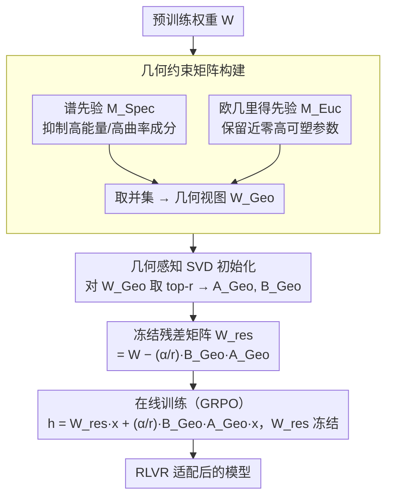

# GeoRA: Geometry-Aware Low-Rank Adaptation for RLVR

**会议**: ACL 2026  
**arXiv**: [2601.09361](https://arxiv.org/abs/2601.09361)  
**代码**: 无  
**领域**: 参数高效微调 / 强化学习推理  
**关键词**: 低秩适配, RLVR, 几何感知, SVD初始化, 参数高效微调

## 一句话总结

本文提出 GeoRA，一种专为强化学习可验证奖励（RLVR）设计的低秩适配方法，通过构建几何约束矩阵（融合谱先验和欧几里得先验）提取 RL 更新子空间的主方向进行 SVD 初始化，同时冻结残差矩阵作为结构锚，在 1.5B-32B 参数的 Qwen/Llama 模型上，数学、医学和代码 RLVR 任务中一致超越 LoRA、PiSSA、MiLoRA 等基线，且具备更强的域外泛化和更少的能力遗忘。

## 研究背景与动机

**领域现状**：RLVR 已成为提升大模型推理能力的核心范式（OpenAI-o1、DeepSeek-R1）。与 SFT 不同，RLVR 本质上是一种受约束的优化过程，通过奖励诱导的采样偏差来放大模型潜在的推理行为，而非注入新知识。因此 RLVR 对更新稳定性和预训练表示几何的保持极为敏感。

**现有痛点**：(1) **SFT 导向的低秩方法与 RLVR 存在几何不匹配**：PiSSA 将可训练参数分配到权重矩阵的主成分上，这在 SFT 中有效但与 RLVR 的首选更新子空间冲突——RLVR 更新偏向低能量方向（正交于预训练主特征），PiSSA 却强制在主方向上更新，导致不稳定。(2) **稀疏微调的效率瓶颈**：一些稀疏方法（SparseFT）虽然更符合 RLVR 的更新模式，但现代硬件对非结构化稀疏支持有限，理论上的参数效率无法转化为实际速度提升，甚至引入额外开销（比 FullFT 慢 10.8%）。

**核心矛盾**：RLVR 的有效更新子空间是各向异性且可压缩的（集中在少数主方向），但不是预训练权重的主成分方向——现有低秩方法要么对准了错误的子空间（PiSSA），要么方向正确但计算不高效（SparseFT）。

**本文目标**：设计一种同时满足三个条件的 PEFT 方法——(1) 对齐 RLVR 特定的更新几何，(2) 保持密集矩阵计算的硬件效率，(3) 通过结构锚防止预训练表示被破坏。

**切入角度**：通过分析 RLVR 的实际更新模式，发现有效更新子空间虽然稀疏但具有可压缩的低秩结构。通过几何约束掩码提取这一子空间，再用 SVD 将其压缩为低秩适配器初始化。

**核心 idea**：不在原始权重 $W$ 上做低秩分解（LoRA/PiSSA），而是在几何约束视图 $W_{Geo} = W \odot (M_{Spec} \cup M_{Euc})$ 上做 SVD 分解——这个视图只保留了低曲率（谱先验）和高可塑性（欧几里得先验）的参数，恰好对应 RLVR 偏好的更新区域。

## 方法详解

### 整体框架

GeoRA 分两步：(1) **离线预处理**——构建几何约束矩阵 $W_{Geo}$，对其做 SVD 提取 top-$r$ 成分初始化适配器 $A_{Geo}, B_{Geo}$，计算冻结的残差矩阵 $W_{res}$；(2) **在线训练**——前向传播时 $h = W_{res} x + \frac{\alpha}{r} B_{Geo} A_{Geo} x$，其中 $W_{res}$ 冻结，仅训练 $A_{Geo}, B_{Geo}$。初始化保证函数不变：$W_{res} + \frac{\alpha}{r} B_{Geo} A_{Geo} = W$。

### 关键设计

**1. 几何约束矩阵构建：从预训练权重中筛出真正适合 RLVR 更新的那块参数子空间**

LoRA/PiSSA 直接在原始权重上做低秩分解，但 RLVR 偏好的更新方向并不在预训练权重的主成分上，所以得先把"合适的区域"抠出来。GeoRA 用两种互补的几何先验联合定义这块区域：**谱先验** $M_{Spec}$ 对权重的 rank-$r$ 近似 $\hat{W}_r$ 取绝对值最小的 $\rho$ 分位数，$(M_{Spec})_{i,j} = \mathbb{I}(|(\hat{W}_r)_{i,j}| \leq \tau_{Spec}(\rho))$，专门抑制高能量/高曲率成分以保住谱稳定性；**欧几里得先验** $M_{Euc}$ 直接挑原始权重绝对值最小的 $\rho$ 分位数 $(M_{Euc})_{i,j} = \mathbb{I}(|W_{i,j}| \leq \tau_{Euc}(\rho))$，捕捉那些近零、可塑性高的参数。两者取并集得到几何视图 $W_{Geo} = W \odot (M_{Spec} \cup M_{Euc})$。实验发现两种掩码的交集只有 4.55%（Jaccard 0.128），说明谱稳定性和参数可塑性确实是两个互补维度——一个保证不破坏主成分、一个保留适配灵活性，联合起来恰好框出一个"既稳定又可表达"的 RLVR 更新流形。

**2. 几何感知 SVD 初始化：把这块几何子空间压成一个高效的低秩适配器**

抠出 $W_{Geo}$ 后，对它（而不是原始 $W$）做 SVD：$W_{Geo} = U_{Geo} \Sigma_{Geo} V_{Geo}^\top$，取 top-$r$ 成分初始化适配器 $A_{Geo} = \Sigma_{Geo[:r,:r]}^{1/2} V_{Geo[:,:r]}^\top$、$B_{Geo} = U_{Geo[:,:r]} \Sigma_{Geo[:r,:r]}^{1/2}$，使初始 $B_{Geo} A_{Geo}$ 就是 $W_{Geo}$ 的 rank-$r$ 最优逼近，残差 $W_{res} = W - \frac{\alpha}{r} B_{Geo} A_{Geo}$。这一步和 PiSSA 的本质区别就在于取主成分的对象：PiSSA 在原始 $W$ 上取主成分，对齐的是预训练的知识编码方向；GeoRA 在几何约束后的 $W_{Geo}$ 上取，对齐的才是 RLVR 实际会走的更新子空间。

**3. 冻结残差矩阵：用结构锚把主成分锁死，防止 RLVR 把预训练能力更新坏**

RLVR 里过激的更新容易引发行为坍缩或能力退化（"Reasoning Boundary Paradox"），所以 GeoRA 把残差 $W_{res}$ 在训练中完全冻结，前向传播为 $h = W_{res} x + \frac{\alpha}{r} B_{Geo} A_{Geo} x$，优化器只能在 $A_{Geo}, B_{Geo}$ 参数化的几何对齐流形上移动。$W_{res}$ 保留了原始权重减去几何子空间后的核心知识编码，冻结它相当于给策略更新加了一道硬性结构约束——等价于在几何对齐的信任域内做更新。这把 LoRA 原本"加法残差"的角色提升成了"结构锚"，不只保证初始化函数不变（$W_{res} + \frac{\alpha}{r} B_{Geo} A_{Geo} = W$），还约束了整条优化轨迹。

### 损失函数 / 训练策略

使用 GRPO 算法进行 RLVR 训练。固定 rank $r=16$，稀疏率 $\rho=0.2$。主实验在 DeepMath-103K 数据集上训练。SVD 初始化为一次性预处理开销，相比 RLVR 训练可忽略不计。

## 实验关键数据

### 主实验 — 数学 RLVR（Qwen3-8B）

| 方法 | AIME24 | AIME25 | MATH500 | OlymMATH | HumanEval(OOD) | MMLU(OOD) | IFEval(OOD) |
|------|--------|--------|---------|----------|---------------|-----------|-------------|
| Base | 13.33 | 11.67 | 71.20 | 9.75 | 76.83 | 71.94 | 54.32 |
| FullFT | 23.33 | 22.08 | 78.40 | 11.25 | 76.83 | 71.94 | 50.45 |
| LoRA | 19.58 | 19.58 | 75.60 | 10.75 | 81.10 | 75.65 | 52.13 |
| PiSSA | 22.50 | 20.42 | 74.40 | 11.75 | 71.95 | 73.89 | 48.74 |
| MiLoRA | 20.42 | 19.58 | 76.20 | 11.50 | 78.66 | 74.51 | 51.85 |
| **GeoRA** | **23.75** | **21.67** | **78.00** | **12.75** | **82.93** | **75.96** | **53.73** |

### 消融实验（Qwen3-4B）

| 配置 | Reward | AIME24 | AIME25 | MATH500 | OlymMATH | Avg |
|------|--------|--------|--------|---------|----------|-----|
| GeoRA (Full) | 0.88 | 13.33 | 9.17 | 73.40 | 5.75 | 25.41 |
| Random-r Init | 0.85 | 12.50 | 8.50 | 72.10 | 5.25 | 24.60 |
| Tail-r Init | 0.82 | 11.67 | 7.50 | 70.80 | 4.50 | 23.40 |
| w/o $M_{Spec}$ | 0.86 | 12.50 | 8.33 | 72.00 | 4.75 | 24.40 |
| w/o $M_{Euc}$ | 0.83 | 13.33 | 8.75 | 72.80 | 5.50 | 25.10 |

### 关键发现

- GeoRA 在 ID 任务上匹配或超越 FullFT，同时在 OOD 任务上全面领先——HumanEval 82.93（FullFT 76.83），MMLU 75.96（FullFT 71.94），说明几何对齐的更新减少了对预训练能力的干扰
- PiSSA 在 OOD 任务上表现最差（IFEval 48.74），验证了 SFT 导向的主成分初始化对 RLVR 有害
- 谱分析证实 GeoRA 的更新几乎不触及主成分子空间（$\mathcal{S}_{Head} \leq 0.02$），而 PiSSA 高度重叠（$\approx 0.98$）
- 效率优势显著：仅 0.04B 可训练参数（FullFT 的 0.5%），训练速度比 FullFT 快 19.9%，VRAM 节省 28.5%
- 超参数鲁棒性强：GeoRA 在宽范围的学习率下保持高奖励，PiSSA/MiLoRA 在高学习率下性能急剧下降
- 医学和代码 RLVR 同样有效：GeoRA 在 MedQA 达 76.12（LoRA 74.23），在 MBPP 达 81.60（LoRA 81.00）

## 亮点与洞察

- 核心洞察深刻：RLVR 的有效更新子空间不是各向同性的随机噪声，而是具有可压缩的重尾谱结构——这为低秩方法应用于 RLVR 提供了理论基础。关键是要在正确的子空间上做低秩分解
- 两种几何先验的互补性经验证：仅 4.55% 的参数重叠（Jaccard 0.128），说明谱稳定性和参数可塑性确实捕捉了不同的信息维度
- 冻结残差矩阵的设计将 LoRA 的"加法残差"范式提升为"结构锚"范式——不仅保持初始化不变性，还强制约束优化轨迹，对 RLVR 中的策略稳定性至关重要

## 局限与展望

- SVD 初始化虽为一次性成本但增加了预处理步骤，对需要快速迭代的场景不够便捷
- 实验主要聚焦于推理类 RLVR 任务（数学、医学、代码），在更开放的 RL 场景（如对话偏好优化）中的效果未验证
- 稀疏率 $\rho=0.2$ 和 rank $r=16$ 的选择未做大范围搜索，可能存在更优配置
- 几何先验的构建依赖预训练权重的统计特性，对于经过大量后训练的模型，这些特性是否仍然成立有待验证
- 未与 DoRA、AdaLoRA 等更多 LoRA 变体对比

## 相关工作与启发

- **vs PiSSA**: PiSSA 在预训练权重的主成分上初始化适配器，适合 SFT 但对 RLVR 有害——其 NSS 高达 0.395（结构破坏严重），$\mathcal{S}_{Head} \approx 0.98$（几乎完全在主成分上更新）；GeoRA 的 NSS 仅 0.092，$\mathcal{S}_{Head} \leq 0.02$，更新精准定位在几何约束的尾部子空间
- **vs MiLoRA**: MiLoRA 选择次要成分初始化，方向更接近 RLVR 但未显式利用几何先验；GeoRA 通过双掩码精确定义更新流形，在所有基准上一致超越 MiLoRA
- **vs SparseFT**: SparseFT 的更新模式与 RLVR 一致但计算效率差（比 FullFT 慢 10.8%）；GeoRA 将稀疏子空间压缩为密集低秩计算，反而比 FullFT 快 19.9%

## 评分

- 新颖性: ⭐⭐⭐⭐⭐ 首个专门为 RLVR 设计的几何感知低秩适配方法，理论分析和方法设计紧密结合
- 实验充分度: ⭐⭐⭐⭐⭐ 1.5B-32B 多尺度模型 × 数学/医学/代码三领域 × 全面的消融和机制分析
- 写作质量: ⭐⭐⭐⭐ 动机推导清晰，谱分析有说服力，但符号较多初读门槛稍高
- 价值: ⭐⭐⭐⭐⭐ 为 RLVR 时代的参数高效训练提供了新范式，几何感知的思路可泛化到其他 RL 微调场景

<!-- RELATED:START -->

## 相关论文

- [\[ICLR 2026\] Online Minimization of Polarization and Disagreement via Low-Rank Matrix Bandits](../../ICLR2026/reinforcement_learning/online_minimization_of_polarization_and_disagreement_via_low-rank_matrix_bandits.md)
- [\[ACL 2026\] HEALing Entropy Collapse: Enhancing Exploration in Few-Shot RLVR via Hybrid-Domain Entropy Dynamics Alignment](healing_entropy_collapse_enhancing_exploration_in_few-shot_rlvr_via_hybrid-domai.md)
- [\[NeurIPS 2025\] Shift Before You Learn: Enabling Low-Rank Representations in Reinforcement Learning](../../NeurIPS2025/reinforcement_learning/shift_before_you_learn_enabling_low-rank_representations_in_reinforcement_learni.md)
- [\[ACL 2026\] Semantic-Space Exploration and Exploitation in RLVR for LLM Reasoning](semantic-space_exploration_and_exploitation_in_rlvr_for_llm_reasoning.md)
- [\[NeurIPS 2025\] The Path Not Taken: RLVR Provably Learns Off the Principals](../../NeurIPS2025/reinforcement_learning/the_path_not_taken_rlvr_provably_learns_off_the_principals.md)

<!-- RELATED:END -->
