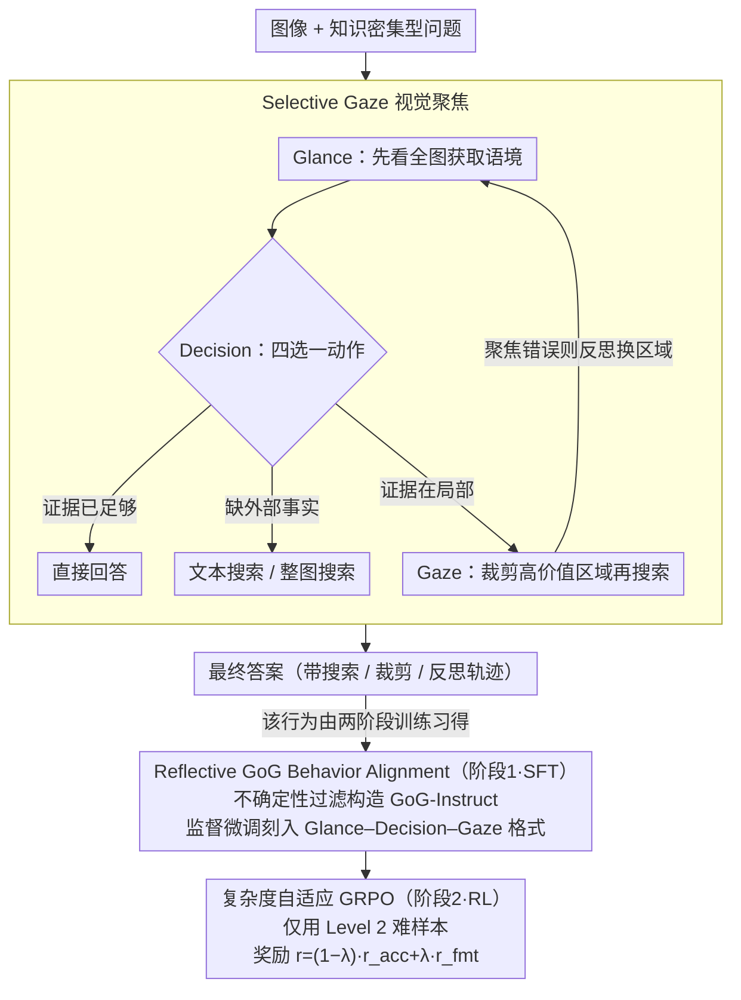

# Glance-or-Gaze: Incentivizing LMMs to Adaptively Focus Search via Reinforcement Learning

**会议**: ACL2026 Findings  
**arXiv**: [2601.13942](https://arxiv.org/abs/2601.13942)  
**代码**: https://github.com/TOM-ZHOUch/Glance-or-Gaze  
**领域**: 强化学习 / 多模态检索增强 / 视觉问答  
**关键词**: 多模态大模型, 视觉搜索, Selective Gaze, GRPO, 复杂度自适应RL  

## 一句话总结
这篇论文提出 Glance-or-Gaze (GoG)，让多模态大模型在回答知识密集型视觉问题时学会先看全图、再选择高价值区域精查，并通过 SFT + 复杂度自适应 GRPO 在 6 个视觉问答/搜索基准上显著优于直接回答、全量搜索和 MMSearch-R1 等基线。

## 研究背景与动机
**领域现状**：多模态大模型已经能完成大量通用视觉理解任务，但当问题涉及长尾实体、最新事实或图像中的细粒度区域时，模型的参数知识很容易过期或缺失。搜索增强 LMM 因此成为一个自然方向：模型可以调用文本搜索、图像搜索或网页读取工具，把外部信息补进回答过程。

**现有痛点**：已有方法常把整张图或所有候选区域都送去检索，等价于“看见就搜”。这会带来两个问题：一是视觉冗余和噪声很大，检索系统可能被无关区域误导；二是很多方法只做单轮工具调用，缺少在视觉证据不够时继续反思、换区域、再验证的能力。

**核心矛盾**：知识密集型 VQA 既需要外部搜索，又不能把搜索变成无差别的昂贵流程。模型必须在“是否需要搜索”“搜全局还是搜局部”“第一次聚焦错了怎么办”之间做规划，而不是被动接受固定工作流。

**本文目标**：作者希望把 LMM 从被动感知器变成主动视觉规划器：先用全图获得上下文，再根据问题选择是否调用文本搜索、整图搜索或局部裁剪搜索，并在复杂样本上通过多步反思修正聚焦区域。

**切入角度**：论文观察到，人类处理视觉搜索问题时并不会平均看整张图，而是先 glance 获得上下文，再 gaze 到高价值区域。作者把这个行为抽象为 Selective Gaze，并把“选择哪里看”作为可训练策略。

**核心 idea**：用 Selective Gaze 过滤无关视觉区域，再用 SFT 教会基本行为、用复杂样本上的 GRPO 强化多步搜索规划，从而把外部检索变成按需、可反思的视觉证据获取过程。

## 方法详解
GoG 的方法可以理解成两层：第一层是行为格式和工具使用范式，告诉模型什么叫“先看全局、再看局部、再搜索”；第二层是强化学习策略，告诉模型在复杂问题里如何组合多种搜索动作并修正错误聚焦。

### 整体框架

输入是一张图像和一个知识密集型问题，输出是带有搜索/裁剪/反思轨迹的最终答案。整个流程分为两个训练阶段。

第一阶段是 Reflective GoG Behavior Alignment。作者从 FVQA 和 InfoSeek 构造 GoG-Instruct 数据，用不确定性过滤去掉模型已能直接回答的简单样本，再合成包含 Glance、Decision、Gaze 的工具轨迹，最后由人工检查答案正确性和裁剪区域合理性。这个阶段用监督微调让模型掌握 GoG 行为格式。

第二阶段是 Complexity-Adaptive Reinforcement Learning。作者先用 SFT 后的 GoG 模型评估原始查询，把样本按模型通过率分成不同复杂度，其中最终 RL 使用更难的 Level 2 样本。训练时采用 GRPO，让模型在答案正确性和格式合规性的奖励下学习多步工具调用策略。

### 关键设计

**1. Selective Gaze 视觉聚焦机制：把“看哪里”变成显式动作，而不是把整张图盲目丢去检索**

很多视觉知识问题的关键证据只藏在一小块区域里，整图检索会把背景、无关物体和错误 OCR 一起喂给检索系统，被噪声带偏。Selective Gaze 让模型先用 Glance 理解全局语境，再提出候选区域，然后在四种动作里做决策：直接回答、做文本搜索、做整图搜索，或对选中的裁剪区域执行 Gaze 搜索。这相当于给推理过程加了一个物理锚点——外部工具调用被绑定到模型主动选出的证据区域上，而不是无差别处理整张图，从源头上压掉了视觉冗余和误导。

**2. Reflective GoG Behavior Alignment：先用 SFT 把“先全局、再局部、再搜索”的行为格式刻进模型，给 RL 一个好的起点**

如果直接上 RL，模型连合法的工具格式和有效搜索轨迹都不知道，探索成本会很高，所以第一阶段先用 SFT 建立行为先验。作者用 Qwen3-VL-235B-Instruct 对每个查询生成 $N=4$ 次答案，若 4 次全对就认为太简单、过滤掉，只保留需要外部验证的样本，再为它们合成“全局观察–工具决策–局部搜索”的多轮轨迹，并人工核对答案正确性和裁剪区域合理性。最终 GoG-Instruct 有 5,750 条样本，其中 43.5% 不需要搜索、56.5% 需要不同形式的搜索——这个配比让模型既学会“该搜的时候搜”，也学会“能直接答就别搜”。

**3. 复杂度自适应 GRPO：只拿真正难的样本做强化，逼模型学会多步混合搜索和错误反思**

简单样本给不出足够的规划信号，模型很容易“蒙对”而学不到策略，所以 RL 阶段做了难度筛选：把 SFT 模型通过率约 50% 的样本记为 Level 1，把 SFT 经常失败、整体通过率更低的样本扩成 Level 2，最终只用 Level 2 训练。训练用 GRPO，对每个输入采样一组轨迹、用组内均值和方差归一化优势，奖励由答案正确性 $r_{acc}$ 和格式分数 $r_{fmt}$ 组成，形式为 $r_i=(1-\lambda)r_{acc}+\lambda r_{fmt}$。只有困难样本才会逼模型去组合文本搜索、图像搜索和裁剪搜索，并在一次 Gaze 聚焦错误后主动换区域、再验证。

### 损失函数 / 训练策略

SFT 阶段使用标准因果语言建模目标，在多轮对话轨迹 $y^*$ 上最大化 $\pi_\theta(y_t^*|x,I,y_{<t}^*)$；实现上使用 Qwen2.5-VL-7B-Instruct 和 Qwen3-VL-8B-Think 作为底座，并在所有 transformer block 上加 LoRA，rank 为 8。

RL 阶段使用 veRL 中的 GRPO。论文给出的关键训练设置包括：SFT 训练 3 个 epoch，学习率 $1e^{-4}$，global batch size 为 8；RL actor 学习率 $2e^{-6}$，KL 系数 $\beta=0.001$，rollout 数 $N=4$，最大回复长度 8,192 token，RL 训练 15 个 epoch，硬件为 8 张 NVIDIA H800。

## 实验关键数据

### 主实验

| 模型/范式 | Avg. | FVQA | InfoSeek | SimpleVQA | MMSearch | LiveVQA | DynVQA |
|--------|------|------|----------|-----------|----------|---------|--------|
| GPT-4o Direct Answer | 30.68 | 42.00 | 30.60 | 43.44 | 21.64 | 14.80 | 31.59 |
| Qwen3-VL-8B-Thinking Direct Answer | 23.84 | 24.56 | 16.05 | 41.76 | 15.20 | 15.15 | 30.31 |
| Qwen3-VL-8B-Think Prompt-based GoG | 41.70 | 51.33 | 32.00 | 62.69 | 36.84 | 25.95 | 41.36 |
| Qwen3-VL-8B-Thinking Full-Search | 46.99 | 57.33 | 32.25 | 61.90 | 63.84 | 23.55 | 39.09 |
| MMSearch-R1* | 36.91 | 42.39 | 24.65 | 54.79 | 40.94 | 23.85 | 34.84 |
| GoG-3-8B-Think-SFT | 50.17 | 62.17 | 40.55 | 65.65 | 53.80 | 32.40 | 46.46 |
| GoG-3-8B-Think-RL | 56.88 | 68.44 | 49.05 | 66.44 | 65.50 | 43.85 | 48.02 |

GoG-3-8B-Think-RL 在平均分上比最强 Full-Search Workflow 高 9.89 分，比 Prompt-based GoG 高 15.18 分，比复现的 MMSearch-R1 高 19.97 分。这个结果说明收益不是来自“总是搜索”，而是来自学习到何时搜索、搜哪里以及如何反思。

### 消融实验

| 配置 | Avg. | FVQA | Info | Simple | MM | Live | Dyn | 说明 |
|------|------|------|------|--------|----|------|-----|------|
| Qwen2.5 SFT w/o SG | 41.76 | 53.39 | 40.10 | 59.53 | 40.94 | 22.30 | 34.28 | 移除 Selective Gaze |
| Qwen2.5 Full SFT | 43.28 | 53.72 | 41.90 | 60.61 | 40.35 | 24.55 | 38.53 | 平均 +1.52，DynVQA +4.25 |
| Qwen3 SFT w/o SG | 48.34 | 60.17 | 40.55 | 64.86 | 46.20 | 32.80 | 45.47 | 移除 Selective Gaze |
| Qwen3 Full SFT | 50.17 | 62.17 | 40.55 | 65.65 | 53.80 | 32.40 | 46.46 | 平均 +1.83，MMSearch +7.60 |

| RL 数据构造 | Avg. | FVQA | Info | Simple | MM | Live | Dyn | 说明 |
|------|------|------|------|--------|----|------|-----|------|
| Qwen2.5 RL w/ Level 1 Data | 47.28 | 64.00 | 50.35 | 64.66 | 50.88 | 32.95 | 39.94 | 较容易样本 |
| Qwen2.5 RL w/ Level 2 Data | 53.22 | 66.78 | 51.05 | 64.86 | 56.73 | 37.70 | 42.21 | 平均 +5.94 |
| Qwen3 RL w/ Level 1 Data | 48.89 | 66.39 | 44.95 | 64.86 | 61.99 | 39.55 | 45.61 | 较容易样本 |
| Qwen3 RL w/ Level 2 Data | 52.38 | 68.44 | 49.05 | 66.44 | 65.50 | 43.85 | 48.02 | 平均 +3.49 |

### 关键发现

- SFT 主要学会基本工具调用：Qwen3-VL-Think 在 SFT 后 62.3% 样本只用一种搜索，28.7% 使用混合搜索；RL 后混合搜索提升到 76.7%，无搜索比例降到 3% 以下。
- Selective Gaze 不只是增加工具调用次数，而是提升聚焦质量：Qwen3-VL-Think 的 crop selection accuracy 从 42.1% 提升到 48.9%，Qwen2.5-VL 从 46.7% 提升到 51.3%。
- 人工检查 100 个 GoG-3-8B-Think 的 Gaze 样本时，RL 把 Gaze correctness 从 59% 提升到 75%，并把错误选择后的 reflection rate 从 30% 提升到 70%。

## 亮点与洞察
- **把视觉搜索建模成主动规划问题**：论文没有把检索增强当成外挂模块，而是让模型学习“看不看、看哪里、看错后怎么办”。这比全量搜索更接近真实的视觉问答流程，也更适合长尾实体和细粒度图像证据。
- **SFT 和 RL 分工清晰**：SFT 负责建立合法行为和工具格式，RL 负责在困难样本上学策略。这个分工避免了纯 RL 冷启动困难，也解释了为什么 RL 后混合搜索和反思行为显著增加。
- **困难样本比边界样本更有训练价值**：Level 2 数据优于 Level 1 数据，说明在工具使用型推理中，真正让策略变强的不是“差一点就会”的样本，而是能暴露错误聚焦、错误搜索和错误反思链条的样本。
- **可迁移启发**：Selective Gaze 的思想可以迁移到网页 agent、医学影像问答或遥感解译：先学局部证据选择，再把外部工具调用绑定到选中的证据区域，而不是让工具无差别处理全输入。

## 局限与展望

- **搜索基础设施仍不稳定**：作者报告 Jina Reader/search pipeline 仍有约 1-5% 的偶发失败，来源包括网络不稳定、API timeout 或网页内容格式异常。这类失败会直接造成证据缺失，影响最终答案。
- **语言覆盖有限**：实验主要集中在英文 benchmark，GoG 在多语言或跨语言视觉问答中的泛化尚未验证。对文化特定实体、非英文网页和多语言 OCR 场景，Selective Gaze 和搜索策略可能需要重新适配。
- **外部 judge 依赖**：RL 奖励中的答案正确性由 gpt-oss-120b 判断，虽然实用，但仍可能引入 judge 偏差。未来可以研究更可验证的任务奖励或多 judge 一致性。
- **工具成本问题**：RL 后混合搜索比例大幅上升，说明模型更愿意多步查证；这提高准确率，但也会增加调用成本和延迟。实际部署时需要加入预算感知的 reward 或停止策略。

## 相关工作与启发
- **vs RAG 式多模态检索**：传统 RAG 常把检索作为固定前处理，本文把检索变成模型可选择、可组合、可反思的动作。优势是更自适应，代价是训练和工具环境更复杂。
- **vs Prompt-based GoG Agent**：prompt agent 依赖提示词诱导搜索流程，本文通过 SFT/RL 把行为写入模型策略。实验中 Qwen3 prompt GoG 平均 41.70，而 GoG-3-8B-Think-RL 达到 56.88。
- **vs Full-Search Workflow**：全量搜索强制每个问题都检索，能补知识但噪声大；GoG 学会筛掉不必要或错误区域，所以平均分比最强 Full-Search 高 9.89。
- **vs MMSearch-R1**：MMSearch-R1 已把搜索纳入训练，但缺少本文这种 Selective Gaze + 多步视觉反思机制。GoG 对 MMSearch-R1 的平均提升达到 19.97，说明视觉聚焦策略是关键增益来源。

## 评分
- 新颖性: ⭐⭐⭐⭐⭐ 把 glance/gaze 式主动视觉聚焦和复杂度自适应 RL 结合起来，问题定义和训练策略都比较完整。
- 实验充分度: ⭐⭐⭐⭐⭐ 覆盖 6 个 benchmark、多个搜索范式、SG 消融、RL 数据难度消融和人工行为分析，证据链很扎实。
- 写作质量: ⭐⭐⭐⭐ 结构清楚，方法和结果解释充分；但表 5 的 Level 描述有明显文字笔误，需结合上下文理解。
- 价值: ⭐⭐⭐⭐⭐ 对搜索增强 LMM 和多模态 agent 都有直接启发，尤其适合需要细粒度视觉证据的开放世界问答。

<!-- RELATED:START -->

## 相关论文

- [\[NeurIPS 2025\] ReSearch: Learning to Reason with Search for LLMs via Reinforcement Learning](../../NeurIPS2025/reinforcement_learning/research_learning_to_reason_with_search_for_llms_via_reinforcement_learning.md)
- [\[ICML 2026\] The Surprising Difficulty of Search in Model-Based Reinforcement Learning](../../ICML2026/reinforcement_learning/the_surprising_difficulty_of_search_in_model-based_reinforcement_learning.md)
- [\[CVPR 2026\] Incentivizing Generative Zero-Shot Learning via Outcome-Reward Reinforcement Learning with Visual Cues](../../CVPR2026/reinforcement_learning/incentivizing_generative_zero-shot_learning_via_outcome-reward_reinforcement_lea.md)
- [\[NeurIPS 2025\] Reinforcement Learning for Long-Horizon Multi-Turn Search Agents](../../NeurIPS2025/reinforcement_learning/reinforcement_learning_for_long-horizon_multi-turn_search_agents.md)
- [\[NeurIPS 2025\] Learning to Focus: Prioritizing Informative Histories with Structured Attention Mechanisms in Partially Observable Reinforcement Learning](../../NeurIPS2025/reinforcement_learning/learning_to_focus_prioritizing_informative_histories_with_structured_attention_m.md)

<!-- RELATED:END -->
