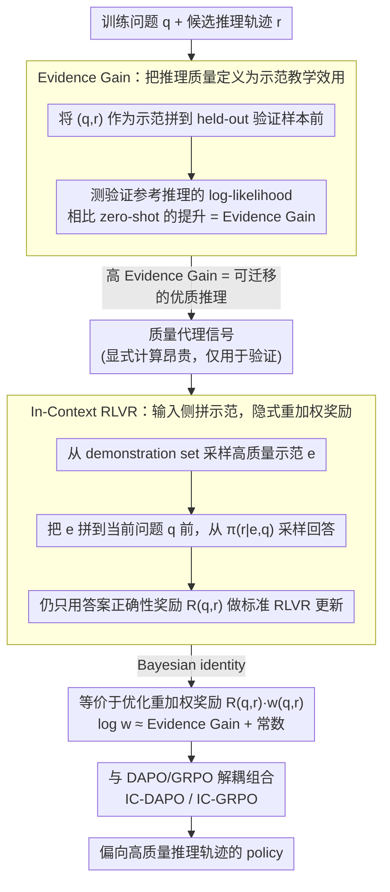

# Good Reasoning Makes Good Demonstrations: Implicit Reasoning Quality Supervision via In-Context Reinforcement Learning

**会议**: ACL2026  
**arXiv**: [2603.09803](https://arxiv.org/abs/2603.09803)  
**代码**: https://github.com/Mithas-114/IC-DAPO  
**领域**: 强化学习 / LLM推理 / RLVR  
**关键词**: RLVR, Evidence Gain, in-context learning, DAPO, 数学推理  

## 一句话总结
这篇论文指出 RLVR 不能区分“推理质量高的正确答案”和“碰巧答对的低质量推理”，并提出用示范的 in-context 教学效用 Evidence Gain 作为隐式质量信号，通过 In-Context RLVR 在不训练 PRM 的情况下提升数学推理准确率和推理质量。

## 研究背景与动机
**领域现状**：Reinforcement Learning with Verifiable Rewards (RLVR) 已成为提升大语言模型数学推理能力的重要范式。它依赖可验证答案，把正确结果给正奖励，避免了昂贵的逐步人工过程标注。

**现有痛点**：RLVR 的结果奖励过于粗粒度。只要最终答案正确，不管推理过程是严谨、冗余、跳步还是碰巧猜对，都会得到同样奖励。这样会把低质量推理轨迹也强化进模型，长期看可能破坏模型的内部解题策略。

**核心矛盾**：过程奖励模型可以区分推理质量，但需要额外标注或训练 evaluator；只用答案奖励又无法区分正确轨迹内部的好坏。作者要解决的是：能否在不引入 PRM 的前提下，让 RLVR 自动偏向高质量推理轨迹。

**本文目标**：定义一个能反映推理质量的全局信号，并把它低成本接入 RLVR，使训练过程对高质量正确轨迹赋予更高权重，对低质量正确轨迹赋予更低权重。

**切入角度**：作者把“好推理”理解成“好示范”。如果一条推理轨迹真的清晰、相关、可迁移，那么把它作为 in-context demonstration 放到别的问题前面，应该会帮助当前 policy 更容易生成高质量参考解。

**核心 idea**：用模型自身的 ICL 能力衡量一条推理作为示范后带来的 log-likelihood 提升，即 Evidence Gain；训练时不显式计算它，而是在 rollout 前加入高质量示范，让目标函数隐式地按 Evidence Gain 重加权奖励。

## 方法详解
论文的方法由两部分组成。第一部分先证明 Evidence Gain 确实能作为推理质量代理信号；第二部分把同一个思想反过来用于训练，形成 In-Context RLVR。

### 整体框架

给定一个训练问题 $q$ 和模型生成的推理轨迹 $r$，作者准备一个 held-out validation set，其中每个样本包含问题和高质量参考推理。Evidence Gain 衡量的是：把 $(q,r)$ 作为 demonstration 放到验证样本前面后，模型生成验证参考推理的 log-likelihood 相比 zero-shot 提升了多少。

直接把 Evidence Gain 当奖励会非常昂贵。缓存中给出的估计是，对约 12K 样本和 100 个 demonstrations 显式计算 Evidence Gain 需要约 80 小时 H800。作者因此不在 rollout 后计算奖励，而是在 rollout 前从 demonstration set 中采样一个示范，拼到当前问题前面，再执行标准 RLVR 更新。这个简单的输入侧改动就是 In-Context RLVR。

### 关键设计

**1. Evidence Gain：把"推理质量"重新定义成"示范教学效用"**

RLVR 只看答案对错，根本无从判断一条正确轨迹是真严谨还是碰巧蒙对，而长度、logprob、majority vote 这些表面信号又只能弱相关地反映质量。作者绕开"看推理本身像不像好推理"，改问一个可测的问题：把候选轨迹 $(q,r)$ 当成 in-context demonstration 拼到一批 held-out 验证样本前面，模型生成那些高质量参考推理的 log-likelihood 会比 zero-shot 提升多少？这个对验证样本求平均的提升量就是 Evidence Gain。它直接测试"这条推理能不能教会模型做类似推理"——真正清晰、相关、可迁移的轨迹会显著抬高参考解的生成概率，而冗余跳步或蒙对的轨迹帮不上忙。消融里 Evidence Gain 与推理质量的 Spearman $\rho$ 在 1.5B/7B 上分别为 0.405/0.444，远高于 length 的负相关和 logprob 的 0.13 左右。

**2. In-Context RLVR：用输入侧拼示范，隐式实现奖励重加权**

直接把 Evidence Gain 当奖励太贵——缓存估计对约 12K 样本、100 个 demonstration 显式算一遍要约 80 小时 H800。作者因此不在 rollout 后算奖励，而是在 rollout 前从 demonstration set 随机采一个高质量问答/推理对，拼到当前问题前面，再跑标准 RLVR 更新，奖励仍只用答案正确性。关键在于输入里加示范会改变采样分布：高 Evidence Gain 的轨迹本来就更容易在示范引导下被生成，于是它们的梯度权重被自然放大。作者用 Bayesian identity 证明，这个 demonstration-conditioned 目标等价于在 zero-shot 基础分布上优化重加权奖励 $R(q,r)\cdot w(q,r)$，且 $\log w(q,r)$ 近似等于 Evidence Gain 加一个模型相关常数——一个纯输入侧的改动，换来了对高质量轨迹的奖励重加权，实现极简但解释扎实。

**3. 与 DAPO/GRPO 解耦组合：证明它是通用增强模块而非某个优化器的特例**

如果一个信号只在特定 objective 上有效，就很难说明它捕捉的是推理质量而非优化器的副作用。作者因此把 In-Context RLVR 当成输入侧 wrapper，分别接到 DAPO（得 IC-DAPO，主实验）和 1.5B 上的 GRPO（得 IC-GRPO），训练目标不变、只改输入条件和隐式权重。两套优化器上都拿到稳定增益，说明 Evidence Gain 重加权是更通用的训练信号，可以挂在已有 RLVR 流水线上而不需要改动 RL 内核。

### 损失函数 / 训练策略

标准 RLVR 优化的是问题 $q$ 上的答案奖励 $R(q,r)$。In-Context RLVR 改成先采样示范 $e$，再从 $pi_theta(r|e,q)$ 中采样回答。作者通过 Bayesian identity 推导出，这等价于在基础分布 $pi_theta(r|q)$ 上优化 $R(q,r) * w(q,r)$，其中 $w(q,r)$ 是 demonstration likelihood ratio 的期望，并且 $log w(q,r)$ 近似等于 Evidence Gain 加上一个模型相关常数。

实验中训练数据来自 KlearReasoner-MathSub-30K，并被划分为 policy optimization 训练集、包含 1,082 个问答/推理对的 demonstration set，以及 100 个额外样本的 held-out set。评估覆盖 AIME24、AIME25、HMMT25、MATH500、AMC23 和 OlympiadBench，MATH500/OlympiadBench 报告 avg@4，其余报告 avg@32。

## 实验关键数据

### 主实验

| 模型/方法 | AIME24 | AIME25 | HMMT25 | MATH500 | AMC23 | Olympiad | Average | Time/Step |
|--------|--------|--------|--------|---------|-------|----------|---------|-----------|
| DS-R1-Distill-Qwen-1.5B | 29.2 | 24.1 | 13.1 | 86.0 | 73.7 | 51.8 | 46.3 | 未报告 |
| + GRPO | 33.4 | 28.1 | 16.6 | 88.3 | 79.3 | 56.2 | 50.3 | 457.4s |
| + IC-GRPO | 38.3 | 30.6 | 17.7 | 89.5 | 82.5 | 56.9 | 52.6 | 461.8s |
| + DAPO | 40.0 | 28.4 | 19.2 | 90.0 | 84.4 | 61.6 | 53.9 | 459.6s |
| + CE-GPPO | 42.8 | 32.5 | 20.5 | 91.0 | 85.8 | 61.8 | 55.7 | 464.0s |
| + IC-DAPO | 45.6 | 34.2 | 19.7 | 90.6 | 86.2 | 62.1 | 56.4 | 477.2s |

| 模型/方法 | AIME24 | AIME25 | HMMT25 | MATH500 | AMC23 | Olympiad | Average | Time/Step |
|--------|--------|--------|--------|---------|-------|----------|---------|-----------|
| DS-R1-Distill-Qwen-7B | 54.5 | 39.1 | 26.2 | 93.6 | 90.6 | 67.0 | 61.8 | 未报告 |
| + GRPO | 55.3 | 40.3 | 24.5 | 93.7 | 88.8 | 65.6 | 61.4 | 305.6s |
| + DAPO | 62.0 | 45.9 | 27.4 | 94.1 | 92.3 | 69.9 | 65.3 | 303.1s |
| + CE-GPPO | 64.2 | 50.3 | 28.9 | 95.3 | 93.3 | 71.6 | 67.3 | 292.5s |
| + IC-DAPO | 66.5 | 49.8 | 29.4 | 95.6 | 93.7 | 71.7 | 67.8 | 315.6s |

IC-DAPO 相比 DAPO 在 1.5B 和 7B 上平均都提升 2.5 分；IC-GRPO 相比 GRPO 在 1.5B 上平均提升 2.3 分。训练开销有增加，但作者强调 IC-DAPO 的额外开销小于 5%。

### 消融实验

| 代理信号 | 1.5B Spearman rho | 7B Spearman rho | 说明 |
|------|-------------------|-----------------|------|
| Length | -0.147 | -0.161 | 推理越长不代表越好 |
| LogProb | 0.129 | 0.178 | 置信度只弱相关 |
| MajorVote | 0.079 | 0.109 | 多数答案一致性区分能力弱 |
| Evidence Gain | 0.405 | 0.444 | 与推理质量相关性最强 |

| 难度 | DAPO 1.5B | IC-DAPO 1.5B | DAPO 7B | IC-DAPO 7B | 主要结论 |
|------|-----------|--------------|---------|------------|----------|
| Easy | 98.3 | 98.8 (+0.5%) | 98.6 | 99.3 (+0.7%) | 简单题空间很小 |
| Medium | 90.1 | 93.5 (+3.8%) | 97.8 | 98.2 (+0.4%) | 中等题有稳定收益 |
| Hard | 23.1 | 26.0 (+12.6%) | 39.2 | 43.2 (+10.2%) | 收益集中在困难题 |

| 示范来源 | 1.5B Average | 7B Average | 说明 |
|------|-------------|------------|------|
| DAPO | 53.9 | 65.3 | 不使用 in-context demonstration |
| IC-DAPO (V3.1) | 55.7 | 66.4 | 使用非 reasoning 模型 DeepSeek-V3.1 生成的示范 |
| IC-DAPO (R1) | 56.4 | 67.8 | 使用 DeepSeek-R1 refined reasoning traces，效果最好 |

### 关键发现

- Evidence Gain 在 1.5B 和 7B 上都比 length、logprob、major vote 更能预测推理质量，说明它捕捉的是可迁移解题模式，而不是表面长度或答案一致性。
- 训练动态中，IC-DAPO 的平均 Evidence Gain 增长更快，推理质量分数也更高；Evidence Gain 与质量的 Spearman 相关在训练中稳定在约 0.4。
- 增益主要来自困难题：1.5B hard split 相对 DAPO 提升 12.6%，7B hard split 提升 10.2%，符合“质量重加权最适合需要深推理的题”的解释。

## 亮点与洞察
- **把推理质量转化为教学效用**：论文没有直接问“这条推理看起来好不好”，而是问“它作为示范能不能帮助模型解决别的问题”。这个定义很聪明，因为它天然强调可迁移结构。
- **输入侧改动实现奖励侧重加权**：最有价值的部分是理论解释：简单地在 rollout 前加 demonstration，就能隐式放大高 Evidence Gain 轨迹的梯度信号。实现简单，但解释很强。
- **不需要 PRM 也能做过程质量偏好**：方法绕开了过程标注和训练 evaluator 的成本，对已经有 verifiable answer 的数学/代码任务尤其实用。
- **质量信号不是越强模型越单调变大，而是相对排序稳定**：7B 模型的 Evidence Gain 绝对值整体更高，但高质量轨迹相对更高的现象仍成立，这说明该信号更适合做同模型内部排序。

## 局限与展望

- **任务范围主要是数学推理**：论文承认在其他推理密集领域如 STEM 综合问题、代码推理或开放问答上的泛化仍未验证。数学题有规则奖励，迁移到非严格可验证任务会更难。
- **demonstration set 依赖强模型**：当前高质量参考轨迹由 DeepSeek-R1 等强模型生成。若没有强 teacher，或者 teacher 的推理风格有偏，Evidence Gain 和 IC-RLVR 的效果可能下降。
- **只重加权正确答案内部质量**：RLVR 的第一层过滤仍是答案正确性，错误但有启发性的推理轨迹不会被直接利用。未来可以考虑把局部正确步骤或可修复错误也纳入训练。
- **输入变长和训练成本**：虽然作者报告额外开销小于 5%，但 demonstration 拼接会增加上下文长度；在更长问题、更多示范或更大模型上，成本可能成为部署瓶颈。

## 相关工作与启发
- **vs 标准 RLVR/GRPO/DAPO**：标准方法只看最终答案，本文通过 in-context demonstration 改变采样分布，等价于对高质量正确轨迹加权。实验中 IC-GRPO 和 IC-DAPO 都优于各自基线。
- **vs PRM**：PRM 显式评估中间步骤，但需要标注或额外模型；Evidence Gain 用 policy 自身的 ICL 能力做隐式评价，不需要训练新的过程奖励器。
- **vs 长度/logprob/major vote 代理信号**：这些信号只看表面统计或答案一致性，相关性明显低于 Evidence Gain。启发是：推理质量应通过“是否能迁移为示范”来衡量，而不是通过轨迹外观衡量。
- **对后续 RLHF/RLVR 的启发**：可以把 demonstration-conditioned rollout 当成一种通用 wrapper，接到代码、定理证明、科学问答等可验证任务上，用高质量示范缓解 correct-but-bad-reasoning 的问题。

## 评分
- 新颖性: ⭐⭐⭐⭐⭐ Evidence Gain 的“示范效用”定义和隐式重加权推导都很有新意。
- 实验充分度: ⭐⭐⭐⭐ 覆盖多个数学 benchmark、两个模型尺度、DAPO/GRPO 两个优化器和示范质量消融；但领域仍集中在数学。
- 写作质量: ⭐⭐⭐⭐⭐ 动机、理论和实验闭环清楚，主张和证据对应得很好。
- 价值: ⭐⭐⭐⭐⭐ 对 RLVR 训练非常实用，尤其适合想提升推理质量但不想训练 PRM 的场景。

<!-- RELATED:START -->

## 相关论文

- [\[ACL 2026\] AttnPO: Attention-Guided Process Supervision for Efficient Reasoning](attnpo_attention-guided_process_supervision_for_efficient_reasoning.md)
- [\[AAAI 2026\] Good-for-MDP State Reduction for Stochastic LTL Planning](../../AAAI2026/reinforcement_learning/good-for-mdp_state_reduction_for_stochastic_ltl_planning.md)
- [\[ICLR 2026\] Reasoning as Representation: Rethinking Visual Reinforcement Learning in Image Quality Assessment](../../ICLR2026/reinforcement_learning/reasoning_as_representation_rethinking_visual_reinforcement_learning_in_image_qu.md)
- [\[ACL 2026\] ImpRIF: Stronger Implicit Reasoning Leads to Better Complex Instruction Following](imprif_stronger_implicit_reasoning_leads_to_better_complex_instruction_following.md)
- [\[ICLR 2026\] LongRLVR: Long-Context Reinforcement Learning Requires Verifiable Context Rewards](../../ICLR2026/reinforcement_learning/longrlvr_long-context_reinforcement_learning_requires_verifiable_context_rewards.md)

<!-- RELATED:END -->
