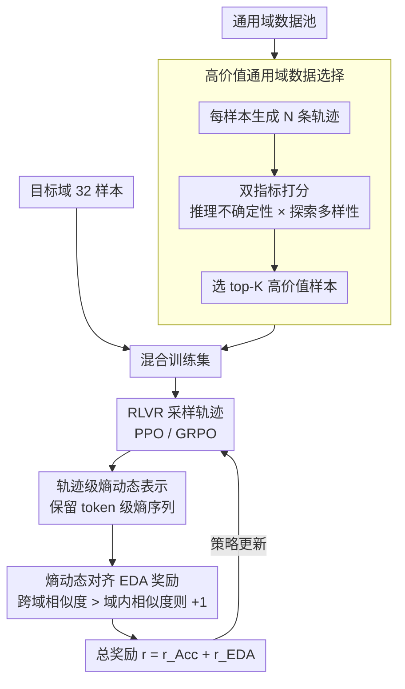

# HEALing Entropy Collapse: Enhancing Exploration in Few-Shot RLVR via Hybrid-Domain Entropy Dynamics Alignment

**会议**: ACL 2026  
**arXiv**: [2604.17928](https://arxiv.org/abs/2604.17928)  
**代码**: [https://github.com/XMUDeepLIT/HEAL](https://github.com/XMUDeepLIT/HEAL)  
**领域**: 强化学习 / LLM推理  
**关键词**: RLVR, 熵崩溃, 少样本强化学习, 跨域对齐, 探索多样性

## 一句话总结

提出 HEAL 框架，通过混合通用领域数据和熵动态对齐（EDA）奖励机制解决少样本 RLVR 中的严重熵崩溃问题，仅用32个目标域样本即可匹配甚至超越使用1K样本的全量 RLVR 性能。

## 研究背景与动机

**领域现状**：RLVR（带可验证奖励的强化学习）已成为训练推理型 LLM 的关键技术，以二值准确率奖励引导模型学习推理链。但现有研究主要聚焦于数据充裕的场景。

**现有痛点**：在医学推理、专业知识等低资源领域，RLVR 训练数据稀缺。少样本 RLVR 容易快速过拟合到少量生成轨迹，导致探索过早收敛和更严重的熵崩溃。现有的熵正则化方法没有考虑数据规模的影响，直接应用于低资源场景效果次优。

**核心矛盾**：少样本 RLVR 中策略的熵值显著低于全量训练，探索多样性严重不足。朴素增加熵的方法（如添加熵正则项）缺乏约束，可能限制策略利用甚至破坏训练稳定性。

**本文目标**：设计一个专门面向少样本 RLVR 的框架，在保持训练稳定性的前提下缓解熵崩溃、提升探索多样性。

**切入角度**：类比人类学习——面对新领域时，人会调用通用技能来弥补领域知识不足。混入通用领域数据可提供基本推理模式，防止策略过早收窄搜索空间。

**核心 idea**：（1）选择性引入高价值通用领域数据缓解目标域的熵崩溃；（2）用 EDA 奖励引导策略将目标域的轨迹级熵动态（幅度和细粒度变化）对齐到通用域水平，实现可控的熵提升。

## 方法详解

### 整体框架

HEAL 包含两个核心组件：（1）混合训练——基于推理不确定性和探索多样性两个标准从通用域选择高价值样本，与少量目标域数据混合训练；（2）EDA 奖励——在标准准确率奖励基础上添加熵动态对齐（Entropy Dynamics Alignment, EDA）奖励，引导策略学习通用域的探索行为模式。两者之间的桥梁是"轨迹级熵动态表示"：把每条轨迹的 token 级熵序列完整保留下来，EDA 奖励才能在这一表示上度量目标域轨迹与通用域轨迹的探索模式相似度。整体数据流是：从通用域池选出高价值样本 → 与少量目标域样本混合 → RLVR 采样轨迹 → 提取轨迹级熵动态表示 → 算 EDA 奖励并与准确率奖励相加 → 用 PPO/GRPO 更新策略。

### 关键设计

**1. 高价值通用域数据选择：用最少的混入样本最大化探索补给**

不加选择地混入大量通用域数据计算开销过大，低质量样本还会引入噪声，因此 HEAL 先对每个通用域样本生成 $N$ 条轨迹，按两个互补指标打分：推理不确定性 $\text{Uncertainty}(x) = 1 - 2|\text{Acc}(x) - 0.5|$ 偏好准确率接近 50% 的"半会不会"困难样本，探索多样性则取每条轨迹中熵最高的 20% token 的平均熵。两者相乘得综合评分 $c(x)$，选 top-K。这样既保证选进来的样本本身就富含探索行为、又控制规模——仅需 384 个通用域样本即可显著改善目标域的熵崩溃，而不是无脑灌十倍数据。

**2. 轨迹级熵动态表示：保留细粒度序列而非塌成一个标量**

直接对熵取平均会丢掉生成过程里的细粒度信息——两条平均熵相同的轨迹可能有完全不同的探索模式（比如一条在推理中途出现熵峰值、一条全程平稳）。HEAL 因此不做标量聚合，而是把每条轨迹的 token 级熵序列完整保留为"熵动态"表示 $\tau_y = (\mathcal{H}_1, \mathcal{H}_2, ..., \mathcal{H}_{|y|})$，再对不同长度的轨迹做插值对齐后计算相似度。正是这个表示让下面的 EDA 奖励能同时区分探索的"幅度"和"变化模式"两层信息，而不是只比一个平均熵的高低。

**3. 熵动态对齐（EDA）奖励：以通用域为参考实现可控的熵提升**

单纯混合数据后目标域熵仍显著低于通用域，朴素地加熵正则项又缺乏约束、可能破坏稳定性。EDA 的做法是：对每条目标域轨迹，基于上面的熵动态表示算两个量——与其他目标域轨迹的最大相似度（域内 $\mathcal{S}_{\text{intra}}$）和与通用域轨迹的最大相似度（跨域 $\mathcal{S}_{\text{inter}}$）。当跨域相似度高于域内相似度时——意味着这条轨迹的探索模式更像通用域而非困在目标域的窄模式——给额外奖励 $r_{\text{EDA}} = 1$，否则为 0，最终奖励 $r = r_{\text{Acc}} + r_{\text{EDA}}$。它不直接拔高熵的绝对值，而是把"向通用域那种自然探索模式靠拢"变成可优化的信号，从而在不伤利用的前提下扩张探索。

### 损失函数 / 训练策略

使用标准 RLVR 的 PPO/GRPO 优化，奖励为准确率奖励+EDA 奖励之和。基于 Qwen3 和 LLaMA-3.2 系列模型实验，目标域使用32个样本，通用域选择384个高价值样本。

## 实验关键数据

### 主实验

| 模型/方法 | 目标域样本 | 通用域样本 | Medicine Avg | Physics Avg | Code Avg |
|----------|----------|----------|-------------|------------|---------|
| Qwen3-1.7B Few-shot | 32 | 0 | 41.70 | - | - |
| Qwen3-1.7B Full-shot | 1K | 0 | 44.73 | 36.24 | 39.18 |
| Qwen3-1.7B HEAL | 32 | 384 | **44.67** | **37.20** | **41.28** |
| Qwen3-4B Few-shot | 32 | 0 | 49.22 | 42.57 | 47.35 |
| Qwen3-4B Full-shot | 1K | 0 | 56.70 | 44.57 | 51.00 |
| Qwen3-4B HEAL | 32 | 384 | 50.82 | **46.99** | **53.42** |

### 消融实验

| 配置 | 说明 | 效果 |
|------|------|------|
| Few-shot (32样本) | 仅目标域 | 基线，严重熵崩溃 |
| Only-General (10K) | 仅通用域 | 不提供目标域知识 |
| Hybrid (32+384) | 混合但无EDA | 缓解熵崩溃但不充分 |
| HEAL (32+384+EDA) | 完整框架 | 最优，匹配Full-shot |

### 关键发现

- 仅32个目标域样本+384个通用域样本，HEAL 在多个设置中匹配甚至超越1K样本的 Full-shot RLVR
- 混合训练本身就能显著缓解熵崩溃，但目标域熵仍低于通用域；EDA 进一步弥合差距
- 数据选择策略优于随机采样通用域数据
- 在 Medicine、Physics、Code、Math 四个领域均有一致提升
- HEAL 也优于现有熵正则化方法（如 DAPO-style 熵奖励）在低资源场景下的表现

## 亮点与洞察

- **少样本 RLVR 的熵崩溃问题被首次系统揭示**：之前的工作报告了训练崩溃但未找到根本原因，本文将其归因于熵崩溃并提出解决方案
- **轨迹级熵动态是比标量更好的特征**：保留了生成过程中的细粒度探索模式，这一表示方法可推广到其他需要分析生成行为的场景
- **通用域作为"探索教师"的思路很自然**：不期望通用域提供领域知识，只是提供"如何探索"的行为参考

## 局限与展望

- 通用域数据选择依赖预先生成多条轨迹，有一定前期成本
- EDA 的二值奖励设计可能不够精细，连续奖励可能更好
- 仅在中小规模模型（1.7B-4B）上验证，更大模型上的少样本 RLVR 行为可能不同
- 相似度函数的选择（如 DTW vs 余弦）未充分探索

## 相关工作与启发

- **vs 标准熵正则化方法**: 这些方法朴素地增加熵而无约束，可能破坏训练稳定性。HEAL 以通用域的自然熵模式为参考，实现可控的熵提升
- **vs 数据增强式少样本RLVR**: 数据增强依赖模型内部知识，受知识边界限制。HEAL 引入外部通用域数据作为探索引导

## 评分

- 新颖性: ⭐⭐⭐⭐ 少样本 RLVR 的熵崩溃问题定义清晰，EDA 奖励设计巧妙
- 实验充分度: ⭐⭐⭐⭐⭐ 四个领域、两个模型系列、多种消融，非常充分
- 写作质量: ⭐⭐⭐⭐ 问题引入有说服力，方法描述清晰，图表辅助理解

<!-- RELATED:START -->

## 相关论文

- [\[AAAI 2026\] Reasoning with Exploration: An Entropy Perspective](../../AAAI2026/reinforcement_learning/reasoning_with_exploration_an_entropy_perspective.md)
- [\[ICLR 2026\] Controllable Exploration in Hybrid-Policy RLVR for Multi-Modal Reasoning](../../ICLR2026/reinforcement_learning/controllable_exploration_in_hybrid-policy_rlvr_for_multi-modal_reasoning.md)
- [\[ICLR 2026\] Exploration vs Exploitation: Rethinking RLVR through Clipping, Entropy, and Spurious Reward](../../ICLR2026/reinforcement_learning/exploration_vs_exploitation_rethinking_rlvr_through_clipping_entropy_and_spuriou.md)
- [\[ACL 2026\] RL-PLUS: Countering Capability Boundary Collapse of LLMs in Reinforcement Learning with Hybrid-policy Optimization](rl-plus_countering_capability_boundary_collapse_of_llms_in_reinforcement_learnin.md)
- [\[ACL 2026\] Targeted Exploration via Unified Entropy Control for Reinforcement Learning](targeted_exploration_via_unified_entropy_control_for_reinforcement_learning.md)

<!-- RELATED:END -->
