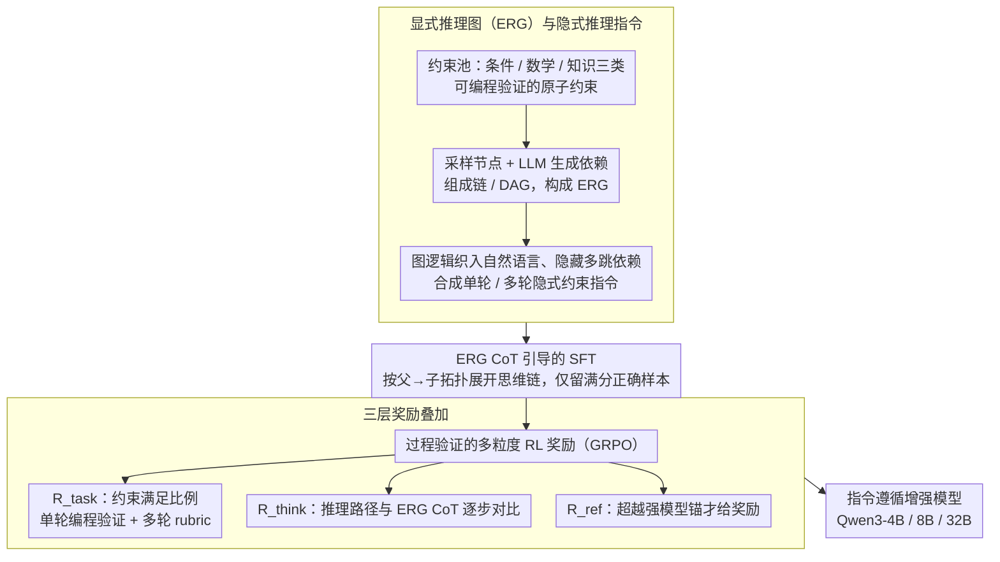

# ImpRIF: Stronger Implicit Reasoning Leads to Better Complex Instruction Following

**会议**: ACL 2026  
**arXiv**: [2602.21228](https://arxiv.org/abs/2602.21228)  
**代码**: 无  
**领域**: 指令遵循 / LLM 推理  
**关键词**: 复杂指令遵循, 隐式推理, 推理图, 过程验证, 强化学习

## 一句话总结

ImpRIF 将复杂指令中的隐式推理结构形式化为可验证的显式推理图（ERG），基于此构建大规模单轮/多轮数据并通过 SFT+过程验证 RL 训练，使 4B-32B 模型在五个指令遵循基准上显著超越基座模型，32B 模型甚至超越部分大型商用模型。

## 研究背景与动机

**领域现状**：LLM 的指令遵循能力对复杂应用至关重要。现有研究主要关注显式的、结构化的多约束组合指令，通过数据工程和模板扩展来提升遵循能力。

**现有痛点**：现实用户指令不是扁平、单一、完全显式的——它们常常包含多步推理、条件语句、嵌套逻辑和隐式前提。现有方法没有系统地解决指令中涉及隐式推理和复杂逻辑依赖的情况——模型在遇到需要推断"言外之意"的约束时容易忽略关键条件或误解隐式条件。

**核心矛盾**：可靠的指令遵循根本上依赖于对指令本身的深入理解，特别是对隐式推理需求和复杂约束结构的准确建模，但现有工作尚未从隐式推理的角度切入。

**本文目标**：(1) 形式化隐式推理指令的结构；(2) 构建可控的大规模训练数据；(3) 通过 SFT 和 RL 训练模型学会沿推理图推理。

**切入角度**：将隐式推理结构抽象为有向无环图（DAG），节点表示可编程验证的原子操作（条件判断/数学计算/知识推理），边编码依赖关系。在数据生成时将图逻辑融入自然语言并隐藏中间推理，形成隐式约束指令。

**核心 idea**：显式建模指令中的隐式推理结构（ERG），并将其同时用于数据合成（可控生成）、SFT（图引导 CoT）和 RL（过程验证奖励），全链路增强隐式推理能力。

## 方法详解

### 整体框架

ImpRIF 管道：(1) 构建约束池（条件/数学/知识三类可验证原子约束）→ (2) 生成 ERG 并合成隐式推理指令（单轮/多轮）→ (3) 用 ERG CoT 做 SFT → (4) 用过程验证的多粒度奖励做 GRPO RL 训练。前两步把"隐式推理"做成可控、可验证的训练数据，后两步分别在初始化（SFT）和强化（RL）阶段教模型沿图推理，整条链路共享同一张 ERG 骨架。

### 关键设计

**1. 显式推理图（ERG）与隐式推理指令：把"言外之意"形式化成可验证的结构**

现实指令常含多步推理、条件分支、嵌套逻辑和隐式前提，但现有方法只处理扁平的显式约束组合，模型遇到需要推断的条件就容易漏掉。ImpRIF 把隐式推理结构抽象成有向无环图：节点分三类——条件节点（布尔检查和分支）、数学节点（算术和数值比较）、知识节点（事实推理、概念消歧），它们组成链或 DAG，每个节点都配一段可执行的验证代码。生成指令时把图逻辑编织进自然语言并隐藏多跳依赖，就得到表面平铺、实则需要沿图推理的隐式约束指令；多轮数据进一步覆盖系统指令对话和用户累积对话两种类型，部分还在最后一轮加入冲突、注入攻击等对抗查询。可编程验证让数据质量可控，约束数量让复杂度可调，而 DAG 形式化让后面的 CoT 构建和奖励设计都有据可依——这张图是全链路的公共骨架。

**2. ERG CoT 引导的 SFT：把图的拓扑顺序直接教成思维过程**

光有结构化数据不够，还得让模型学会"按图走"。作者把 ERG 的节点和依赖边展开成自然语言 CoT，严格按"父→子"顺序遍历依赖，保证每一步都建立在前步结果上，具体含五步：(a) 描述每个节点的推理；(b) 从根到叶遍历依赖；(c) 按依赖顺序展开推导；(d) 检查多约束之间的协调；(e) 基于推理生成答案并自检。只挑那些满分且答案正确的样本进入 SFT，从而把 ERG 的拓扑结构显式映射进模型的思维链，让它在初始化阶段就习得"图引导推理"的范式而非死记答案。

**3. 过程验证的多粒度 RL 奖励：既奖约束满足，也奖推理路径本身正确**

只看最终约束满足率，模型可能蒙对答案却走了错误推理路径。ImpRIF 因此在 GRPO 阶段叠三层奖励：任务奖励 $R_{\text{task}}$ 是满足约束的比例（单轮用编程验证，多轮再加 LLM 评分的 rubric 奖励）；思维过程监督 $R_{\text{think}}$ 用 LLM judge 把模型推理和参考 ERG CoT 逐步对比，评估逻辑性和正确性；偏序奖励 $R_{\text{ref}}$ 引入强模型当质量锚，仅当学生超越锚时才给额外奖励，总奖励 $R_{\text{total}} = R_{\text{task}} + R_{\text{ref}} + R_{\text{think}}$。过程监督这一层确保推理路径而非只是结果正确（消融里去掉它逻辑性得分明显下降），偏序锚则用"超过强模型才奖励"的设计加速收敛。

### 损失函数 / 训练策略

SFT 阶段用标准语言建模损失。RL 阶段用 GRPO，结合多粒度奖励。训练在 Qwen3-4B/8B/32B 上进行。

## 实验关键数据

### 主实验

**五个指令遵循基准（ImpRIF-8B_SFT+RL vs Qwen3-8B）**

| 基准 | Qwen3-8B | ImpRIF-8B | 提升 |
|------|---------|-----------|------|
| ImpRIF-Test ISR | 19.87 | **51.85** | +32.0 |
| SysBench ISR | 66.52 | **79.08** | +12.6 |
| MultiChallenge | 42.00 | **59.60** | +17.6 |
| MedMT ISR | 34.39 | **48.07** | +13.7 |
| ComplexBench ISR | 81.37 | **83.29** | +1.9 |

### 消融实验

| 配置 | ImpRIF-Test CSR | 说明 |
|------|----------------|------|
| ImpRIF-8B_SFT+RL | **78.33** | 完整方法 |
| ImpRIF-8B_SFT | 68.63 | 仅 SFT |
| ImpRIF-8B_RL | 66.33 | 仅 RL |
| Qwen3-8B (基座) | 55.64 | 无训练 |

### 关键发现

- SFT+RL 的组合效果显著优于单独使用——SFT 提供良好初始化，RL 进一步强化推理能力
- ImpRIF-32B_SFT+RL 在多个基准上超越 Qwen3-235B-A22B 和 Qwen2.5-72B，以 32B 参数达到更大模型的水平
- 4B 模型也获得显著提升（ImpRIF-Test ISR: 17.70→49.11, +31.4），说明方法对小模型同样有效
- 思维过程监督奖励对推理质量的提升至关重要，去掉后逻辑性得分明显下降

## 亮点与洞察

- ERG 的形式化设计是全文的基石——一个统一的图结构同时服务于数据生成、CoT 构建和奖励设计，实现了全链路一致性
- 将"指令遵循"问题重新定义为"隐式推理"问题，提供了新的理论视角
- 过程监督 RL + 偏序奖励的组合设计，为复杂任务的 RL 训练提供了可借鉴的范式

## 局限与展望

- ERG 的构建依赖 LLM 和人工设计的约束池，扩展到新领域可能需要额外工程
- 思维过程监督使用 LLM judge，引入了评估噪声
- 仅在 Qwen3 系列上验证，跨模型家族的泛化性未知
- 隐式推理的定义限于条件/数学/知识三类，未覆盖修辞、反讽等更复杂的语言现象

## 相关工作与启发

- **vs RwG/RAIF**: RwG 用图增强推理，RAIF 奖励推理过程；ImpRIF 将两者统一在 ERG 框架下
- **vs 传统指令遵循数据扩展**: 传统方法扩展显式约束组合，ImpRIF 聚焦于隐式推理依赖

## 评分

- 新颖性: ⭐⭐⭐⭐⭐ ERG 形式化和"隐式推理→指令遵循"的视角转变非常有启发性
- 实验充分度: ⭐⭐⭐⭐⭐ 五个基准、三个模型规模、完整消融、单轮+多轮
- 写作质量: ⭐⭐⭐⭐ 方法描述详细，但论文较长，可更简洁
- 价值: ⭐⭐⭐⭐⭐ 对复杂指令遵循问题提供了系统性解决方案

<!-- RELATED:START -->

## 相关论文

- [\[NeurIPS 2025\] Generalizing Verifiable Instruction Following](../../NeurIPS2025/reinforcement_learning/generalizing_verifiable_instruction_following.md)
- [\[NeurIPS 2025\] Incentivizing Reasoning for Advanced Instruction-Following of Large Language Models](../../NeurIPS2025/reinforcement_learning/incentivizing_reasoning_for_advanced_instruction-following_of_large_language_mod.md)
- [\[ACL 2026\] LENS: Less Noise, More Voice — Reinforcement Learning for Reasoning via Instruction Purification](less_noise_more_voice_reinforcement_learning_for_reasoning_via_instruction_purif.md)
- [\[NeurIPS 2025\] Financial Instruction Following Evaluation (FIFE)](../../NeurIPS2025/reinforcement_learning/financial_instruction_following_evaluation_fife.md)
- [\[ACL 2026\] Adaptive Instruction Composition for Automated LLM Red-Teaming](adaptive_instruction_composition_for_automated_llm_red-teaming.md)

<!-- RELATED:END -->
