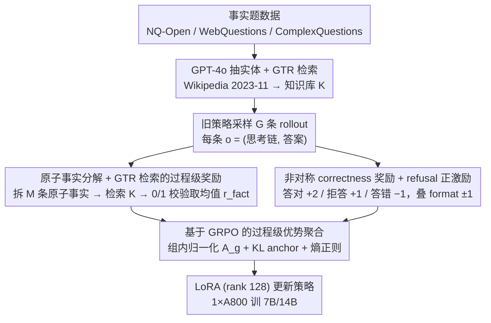

# KnowRL: Exploring Knowledgeable Reinforcement Learning for Factuality

**会议**: ACL 2026  
**arXiv**: [2506.19807](https://arxiv.org/abs/2506.19807)  
**代码**: https://github.com/zjunlp/KnowRL  
**领域**: 强化学习 / 慢思考 LLM / 事实性 / 幻觉缓解  
**关键词**: 过程级奖励、原子事实校验、GRPO、知识边界、refusal 激励

## 一句话总结
KnowRL 把"原子事实校验"作为过程级奖励直接塞进 GRPO 训练循环，对慢思考模型的 CoT 每一步进行事实判定，同时用"拒答给正奖励"教模型识别自己的知识边界，在 SimpleQA Incorrect Rate 上直降 20.3% 的同时不损失（甚至略升）GPQA / AIME 等推理能力，并展现出英文知识 → 中文 QA 的跨语言迁移。

## 研究背景与动机

**领域现状**：DeepSeek-R1 一类"慢思考"模型通过 RL 鼓励长 CoT，在 GPQA / AIME 等强推理基准上突破明显；但 SimpleQA 等事实性基准上反而出现规模反比——DeepSeek-R1-Distill-Qwen-32B 在 SimpleQA 上准确率仅 6.64%，规模越大幻觉不降反升。

**现有痛点**：现有 RL 训练几乎全是 outcome-only 奖励（看最终答案对不对），把推理过程当黑箱。这有两个致命问题：(i) 模型可以"答案蒙对、推理过程胡编"，奖励信号反而强化了虚构推理路径；(ii) 模型完全不知道"自己不知道"，只会硬猜以拿奖励——知识边界这件事缺失。

**核心矛盾**：要让慢思考既能推理又能讲真话，必须同时解决"对推理过程做事实监督"和"教模型主动拒答"两个事。但 RAG 在长 CoT 中检索成本爆炸、SFT 容易遗忘并只是死记知识、DPO 类偏好优化也只能在 outcome 层面调整，都不直接解决过程级幻觉。

**本文目标**：(1) 把事实校验嵌入到 RL 训练 loop 里，做 step-level 监督；(2) 不损害已经训出的复杂推理能力；(3) 教模型在缺信息时说 "I don't know"，且这种"边界意识"应能跨任务、跨语言迁移。

**切入角度**：借鉴 FactScore 把长生成拆成原子事实并逐条对知识库校验的范式，作者把"原子事实通过率"做成 RL 的稠密奖励信号；再设计 correctness 奖励里"答对 +2 / 拒答 +1 / 答错 −1"的非对称结构，把"拒答"显式 incentive 起来。

**核心 idea**：用 GRPO + 三项复合奖励（format + correctness with refusal bonus + atomic-fact factuality）打开慢思考的"思考黑箱"，让模型把概率质量从幻觉链路转移到知识支持的链路。

## 方法详解

### 整体框架
KnowRL 整体在 GRPO 之上做奖励工程：(1) **数据构造**——从 NQ-Open / WebQuestions / ComplexQuestions 抽事实题，GPT-4o 抽实体，从 Wikipedia 2023-11-01 dump 检索对应事实段落作为外部知识库 $K$；(2) **Rollout & 复合奖励**——每个 prompt $x$ 让旧策略 $\pi_{\theta_{\text{old}}}$ 采 $G$ 条 rollout，每条 $o=(o_{\text{think}},o_{\text{answer}})$ 算 $R_{\text{total}}=r_{\text{format}}+r_{\text{correct}}+r_{\text{fact}}$；(3) **GRPO 优势归一化**——同 prompt 组内 $A_g=(R_g-\mu_x)/(\sigma_x+\varepsilon)$；(4) **代理目标**+ KL anchor + 熵正则做 PPO-style 更新；(5) 全程 LoRA (rank 128) 微调，1×A800 即可训 7B/14B 模型。

### 关键设计

**1. 原子事实分解 + GTR 检索的过程级奖励 $r_{\text{fact}}$：把"思考黑箱"拆成可被梯度推动的稠密分**

outcome-only 奖励的致命伤是把推理过程当黑箱，模型完全可以"答案蒙对、推理胡编"。KnowRL 借鉴 FactScore 的核查管道，把它从评测侧搬到训练侧：用 GPT-4o-mini 调一次 prompt 把 $o_{\text{think}}$ 拆成 $M$ 条原子事实 $\Phi(o_{\text{think}})=\{f_1,\dots,f_M\}$，每条 $f_j$ 用 sentence-transformers `gtr-t5-large` 从知识库 $K$ 检索 top-相关段 $K_x$，再让 GPT-4o-mini 给出 0/1 的 verification $v(f_j,K_x)$，最后取平均 $r_{\text{fact}}(o)=\frac{1}{M}\sum_j v(f_j,K_x)$（$M=0$ 时记 0）。这一步把"事实性"从一个黑箱标量变成逐句可核查的密集分——FactScore 早已证明"分原子事实 + 检索 + 二元校验"是衡量长文本事实性的可靠管道，KnowRL 的灵魂就是把它接进 RL 的奖励端，直接对 CoT 的每一步做监督。

**2. 非对称 correctness 奖励 + refusal 正激励：用 +2/+1/−1 教模型守住知识边界**

传统 RL 把所有"非正确"都等价惩罚，会逼模型在不确定时也硬"赌一把"来博取奖励——根本学不会"自己不知道"。KnowRL 在正确性奖励里显式区分三种结果：$r_{\text{correct}}=+2$（GPT-4o-mini 判答对）/ $+1$（显式拒答）/ $-1$（答错），外加 format 奖励 ±1 强制 `<think>...</think><answer>...</answer>` 结构。这个非对称设计告诉模型"拒答虽不如答对赚得多，但比答错强"，从而把概率质量从硬猜挪向诚实弃权。它的不可替代性在消融里很扎眼：把 refusal 的 +1 改成 −1，Incorrect Rate 会从 57.67% 弹回 78.67%，refusal 率从 40.67 暴跌到 8.67。

**3. 基于 GRPO 的过程级优势聚合：让"事实多 + 拒答得当"的轨迹拿到正信用**

有了复合奖励，还需要一个稳定、内存友好的方式把它转成梯度信号。KnowRL 用 GRPO 免去 critic：同一 prompt 组内的 $G$ 条 rollout 各算 $R_{\text{total}}=r_{\text{format}}+r_{\text{correct}}+r_{\text{fact}}$，再组内归一化成带符号优势 $A_g=(R_g-\mu_x)/(\sigma_x+\varepsilon)$，让幻觉为主的轨迹得负信用、事实充分且拒答得当的轨迹得正信用。轨迹级 importance ratio $\varrho_g=\pi_\theta(o^{(g)}|x)/\pi_{\theta_{\text{old}}}(o^{(g)}|x)$ 经 clip 后求 surrogate $\hat{\mathcal{J}}(\theta)=\frac{1}{G}\sum_g \min(\varrho_g A_g, \text{clip}(\varrho_g,1{-}\epsilon,1{+}\epsilon)A_g)$，再叠 entropy bonus 与 KL anchor 得到

$$\mathcal{L}_{\text{KnowRL}}=-\hat{\mathcal{J}}+\beta_{\mathcal{H}}\mathcal{E}_{\mathcal{H}}+\beta_{\text{KL}}\mathcal{E}_{\text{KL}}.$$

组内归一化能拉平不同 prompt 难度下的奖励量级，KL anchor 则防止模型为追事实而把已练出的推理能力丢掉——这也是 GPQA/AIME 不掉甚至略升的关键。

### 损失函数 / 训练策略
LoRA rank 128 / alpha 256，bf16，lr=1e-5，batch=20、grad accum=4，KL 系数 $\beta_{\text{KL}}\approx 1\text{e-3}$，cosine LR 调度、warmup 0.03，AdamW-8bit，vLLM gpu mem util 0.5；7B 模型 1×A800 即可。训练 100-300 步即收敛，超过 300 步会出现轻微 over-optimization。

## 实验关键数据

### 主实验
两个 7B 慢思考模型（distillation 派 DeepSeek-R1-Distill-Qwen-7B 与 RL 派 Skywork-OR1-7B-Preview），主要指标 SimpleQA Incorrect Rate 和 GPQA Diamond 同时报：

| 模型 | 方法 | SimpleQA Incorrect ↓ | ChineseSimpleQA Incorrect ↓ | GPQA Diamond ↑ | AIME 2025 ↑ |
|------|------|----------------------|------------------------------|----------------|-------------|
| DeepSeek-7B | Zero-shot | 78.00 | 68.33 | 40.91 | 30.00 |
| DeepSeek-7B | SFT | 83.33 (+5.33) | 76.67 (+8.34) | 36.36 | 26.67 |
| DeepSeek-7B | DPO | 88.00 (+10.0) | 79.33 (+11.0) | 37.37 | 30.00 |
| DeepSeek-7B | FactTune-FS | 59.67 (−18.3) | 76.00 (+7.67) | 38.89 | 30.00 |
| DeepSeek-7B | TruthRL | 61.00 (−17.0) | 60.00 (−8.33) | 39.39 | 26.67 |
| DeepSeek-7B | **KnowRL** | **57.67 (−20.3)** | **58.33 (−10.0)** | 36.87 | **33.33** |
| Skywork-7B | Zero-shot | 76.33 | 67.00 | 37.37 | 26.67 |
| Skywork-7B | **KnowRL** | **60.33 (−16.0)** | **52.33 (−14.7)** | **42.42** | **36.67** |

多 run（Avg@5, T=0.6）下 KnowRL 把 DeepSeek-7B 的 SimpleQA Incorrect 从 62.47 降到 48.27、AIME 从 29.33 升到 34.00；14B 上 SimpleQA Incorrect 83→68、GPQA 47→51。

### 消融实验
DeepSeek-7B 上不同奖励组合（SimpleQA Incorrect / GPQA）：

| 奖励配置 | SimpleQA Incorrect ↓ | Refusal | GPQA ↑ | AIME ↑ |
|----------|----------------------|---------|--------|--------|
| $r_{\text{format}}$ only | 74.00 | 24.00 | 39.39 | 30.00 |
| $r_{\text{format}}+r_{\text{fact}}$ | 80.67 (+6.67) | 17.33 | **47.47** | **40.00** |
| $r_{\text{format}}+r_{\text{correct}}$ | 60.67 (−13.3) | 37.33 | 38.89 | 40.00 |
| **Full $R_{\text{total}}$ (KnowRL)** | **57.67 (−16.3)** | 40.67 | 36.87 | 33.33 |
| KnowRL with $r_{\text{refusal}}=-1$ | 78.67 (+4.67) | 8.67 | 34.85 | 30.00 |

跨算法鲁棒性：把 GRPO 换成 DAPO / BNPO / Dr.GRPO，SimpleQA Incorrect 仍降 16-19，证明效果来自奖励设计而非特定优化器。

### 关键发现
- **拒答正激励是知识边界的"焊点"**：把 $r_{\text{refusal}}$ 从 +1 改成 −1，refusal 率从 40.67 暴跌到 8.67，Incorrect 从 57.67 弹回 78.67——说明只用 correctness 自身的 +2/−1 不足以稳定边界行为。
- **$r_{\text{fact}}$ 单独使用利于推理但不抑制幻觉**：$r_{\text{format}}+r_{\text{fact}}$ 这条配置 GPQA 升到 47.47、AIME 40.00，但 Incorrect Rate 反而比 baseline 还差（80.67 vs 74.00），原因是缺 correctness 信号，模型更敢"自信编造"。这一对照非常巧妙地说明三项奖励是耦合互补的。
- **跨语言迁移**：训练知识库几乎是英文，但 ChineseSimpleQA Incorrect 也降 10-15 点，说明模型学到的是"语言无关的核查行为"而非死记。
- **completion length 巨幅下降但 ≠ 推理能力崩**：训练中生成长度急降，是模型学会"不再为未知问题硬编故事"的副产物——GPQA / AIME / OlympiadBench 同时保持或微升。
- **训练步数甜区 ≈ 200 步**：100→200 步事实指标快速改善后趋稳，300+ 步可能出现轻微过优化。

## 亮点与洞察
- 把 FactScore 从"评测工具"重新理解为"奖励工厂"是个简单却效果显著的范式迁移；几乎所有现有 RL 框架都能 plug-in 这个稠密事实奖励。
- 非对称 refusal 奖励（+2/+1/−1）的设计很优雅：它把"诚实"作为单独动作类型奖励，而不是依赖输出层熵或外加 reject head，是模型学边界的最直接信号。
- 跨算法（GRPO/DAPO/BNPO/Dr.GRPO）几乎等效，说明本质是"奖励设计 → 行为塑造"，告诉社区"奖励工程比 RL 算法替换更重要"。
- 英文训练 → 中文测试的迁移是个意外但强力的发现：暗示 verification 行为可能是某种语言无关的"元能力"。

## 局限与展望
- 每个 rollout 都要调 GPT-4o-mini 拆原子事实 + 校验，训练成本和延迟都被绑死在外部 API；如能把校验器内化为本地小模型会更工程友好。
- 知识库覆盖窄（NQ/WebQ/Wiki 2023-11），对开放/最新事实仍有盲区；模型可能学会"凡这种问就拒答"而不是真懂边界。
- 评测样本各 300 条受计算限制，AIME 也仅 30 题，方差较大；作者用 Avg@5 部分缓解但仍偏窄。
- 仅文本，无多模态；图表 / 公式 / 物理图等"原子事实"如何拆解尚未涉及。
- refusal 的语义判定也靠 LLM evaluator，可能把"答得保守"误判为 refusal。

## 相关工作与启发
- **vs TruthRL**：TruthRL 也走"诚实 vs 真值"奖励，但仍是 outcome-level；KnowRL 给出更细的过程级 + 原子事实信号，DeepSeek-7B 上 Incorrect 57.67 vs 61.00 略胜。
- **vs FactTune-FS**：FactTune-FS 用 FactScore 筛 SFT 数据；KnowRL 把 FactScore 直接做 RL 奖励，避免了静态 SFT 的灾难性遗忘，GPQA / AIME 都不掉。
- **vs DPO with R1 chosen data**：DPO 反而让 Incorrect Rate 涨 10+，说明"偏好对齐"在事实任务上可能强化错误风格。
- **vs RAG**：RAG 在每步长 CoT 都检索成本爆炸；KnowRL 把"检索 + 校验"放在 reward 端而非 inference 端，部署不引入检索开销。

## 评分
- 新颖性: ⭐⭐⭐⭐ "FactScore 当 RL 奖励 + 拒答正激励"组合在事实性 RL 里第一次完整落地；非对称 refusal 设计尤其精彩。
- 实验充分度: ⭐⭐⭐⭐ 两类慢思考模型 × 6+ 基线 × 4 RL 算法 × 14B 扩展 × Avg@5 多 run，覆盖度足；OlympiadBench 中英双语物理任务进一步加分。
- 写作质量: ⭐⭐⭐⭐ 故事讲得清晰，图 2 的"规模 vs 幻觉"反比直接立住问题；公式 1-5 自成闭环，工程细节交代充分。
- 价值: ⭐⭐⭐⭐⭐ 给社区一条"不重训知识、不上检索"也能让慢思考说真话的实践路径，工程友好且通用性强，是慢思考 + 事实性方向值得跟进的代表作。

<!-- RELATED:START -->

## 相关论文

- [\[CVPR 2026\] PanoEnv: Exploring 3D Spatial Intelligence in Panoramic Environments with Reinforcement Learning](../../CVPR2026/reinforcement_learning/panoenv_exploring_3d_spatial_intelligence_in_panoramic_environments_with_reinfor.md)
- [\[ICLR 2026\] UME-R1: Exploring Reasoning-Driven Generative Multimodal Embeddings](../../ICLR2026/reinforcement_learning/ume-r1_exploring_reasoning-driven_generative_multimodal_embeddings.md)
- [\[ACL 2026\] LoVeC: Reinforcement Learning for Better Verbalized Confidence in Long-Form Generations](lovec_reinforcement_learning_for_better_verbalized_confidence_in_long-form_gener.md)
- [\[ACL 2026\] Free Energy-Driven Reinforcement Learning with Adaptive Advantage Shaping for Unsupervised Reasoning in LLMs](free_energy-driven_reinforcement_learning_with_adaptive_advantage_shaping_for_un.md)
- [\[ICLR 2026\] Exo-Plore: Exploring Exoskeleton Control Space through Human-Aligned Simulation](../../ICLR2026/reinforcement_learning/exo-plore_exploring_exoskeleton_control_space_through_human-aligned_simulation.md)

<!-- RELATED:END -->
