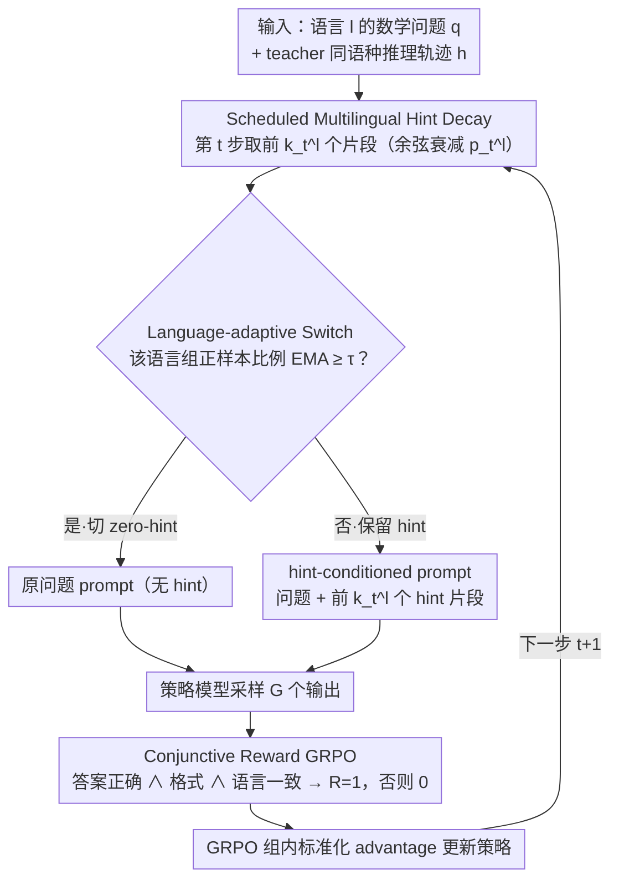

# LANG: Reinforcement Learning for Multilingual Reasoning with Language-Adaptive Hint Guidance

**会议**: ACL2026  
**arXiv**: [2605.22567](https://arxiv.org/abs/2605.22567)  
**代码**: https://github.com/fmm170/LANG  
**领域**: 强化学习 / 多语言推理  
**关键词**: 多语言推理、GRPO、hint-guided RL、语言一致性、reward sparsity  

## 一句话总结
LANG 用同语种推理 hint 启动多语言数学推理 RL，再通过余弦衰减和按语言难度自适应关停 hint，让模型在保持语言一致性的同时提升非英语推理准确率。

## 研究背景与动机
**领域现状**：RLVR/GRPO 已经成为提升大模型多步推理能力的常见路线，DeepSeek-R1 一类模型证明了可验证奖励能把模型推向更长、更可靠的推理链。但这条路线高度英语中心化，多语言场景里不仅要答对，还要让中间推理和最终答案保持用户输入语言。

**现有痛点**：直接在 prompt 里要求“用某语言思考并回答”可以提高语言一致性，却常牺牲数学推理准确率；只优化答案正确性又会让模型在推理链里漂移到英语。论文用韩语除数个数例子说明了这个矛盾：语言一致的推理可能算错，算对的推理又可能变成英文。

**核心矛盾**：多语言 RL 的根本难点是 reward sparsity 与训练-推理不一致叠加。低资源语言里模型本来就很难采到“答案正确、格式正确、语言一致”的轨迹，如果训练时一直给完整 hint，模型又会学会依赖 hint，而推理时 hint 不存在。

**本文目标**：作者希望在早期训练中给模型足够脚手架，帮助它找到非英语正确推理轨迹；同时又要逐步移除脚手架，让最终策略能独立完成多语言推理。

**切入角度**：论文借鉴 hint-guided RL 和 scheduled sampling，把 hint 看成训练早期的探索辅助，而不是长期输入条件；并进一步观察不同语言学习难度不同，低资源语言需要更长 hint 保留，高资源语言应更早脱离 hint。

**核心 idea**：用“语言条件 hint + 渐进式 hint 衰减 + 按语言组自适应开关”替代固定 hint 或纯语言一致性奖励，缓解多语言 RL 的稀疏奖励和语言漂移问题。

## 方法详解

### 整体框架
LANG 是一个面向多语言推理的 RL 课程学习框架，核心是把同语种推理 hint 当成训练早期的"脚手架"，再逐步撤掉。给定一道语言为 $l$ 的数学问题 $q$ 和 teacher 生成的同语种推理轨迹 $h=(h_1,\ldots,h_L)$，训练第 $t$ 步时 LANG 按 hint ratio $p_t^l$ 取前 $k_t^l=\lfloor p_t^lL\rfloor$ 个片段拼到问题后构成 hint-conditioned prompt，策略模型基于它采一组输出，再用 GRPO 按答案正确、格式、语言一致三项联合奖励更新。训练早期靠长 hint 解决低资源语言采不到正样本的问题，随训练推进 hint 逐渐缩短直至完全移除，模型也从"跟着同语种轨迹走"过渡到"自己生成同语种推理"；当某语言资源组已能稳定采到正样本时，该组提前进入 zero-hint regime。

### 关键设计

**1. Scheduled Multilingual Hint Decay：早期给脚手架，再平滑撤掉以防 hint 依赖**

低资源语言里模型本来就很难采到"答对 + 格式对 + 语言一致"的轨迹，所以训练初期需要同语种推理 hint 来启动探索；但如果一直给完整 hint，模型会学到一个推理时根本不存在的 hint-conditioned shortcut。LANG 的做法是给定 hint 长度 $L$，第 $t$ 步只注入前 $k_t^l=\lfloor p_t^lL\rfloor$ 个片段，并用余弦衰减 $p_t^l=\frac{1}{2}(1+\cos(\pi t/T))$ 让 hint 比例从完整平滑降到 0。这个节奏不是凭空选的——pilot study 发现 QUESTA 式固定 hint 虽然训练 reward 和 entropy 更高，测试却更差，还伴随 response length 和 repeat score 上升，正是 shortcut 的典型症状；余弦衰减相比线性、指数衰减更稳，因为它在早期保留足够探索、又不至于太晚移除而养成依赖。

**2. Language-adaptive Switch：按语言资源难度决定各自何时脱离 hint**

不同语言的学习难度天差地别，用一个全局 schedule 撤 hint 必然顾此失彼——高资源语言早就能独立采到正轨迹，过长 hint 反而诱导依赖；低资源语言太早撤 hint 又会跌回 reward sparsity。LANG 把语言分成 high/mid/low resource 三组，对每组统计 batch 中"至少有一个 rollout 产生正 advantage"的比例 $u_R(t)$，再做 EMA 平滑 $\bar{u}_R(t)=\alpha\bar{u}_R(t-1)+(1-\alpha)u_R(t)$；当 $\bar{u}_R(t)\geq\tau$、说明该组已能稳定自采正样本时，就把它切到 zero-hint，后续直接用原问题训练。这样高资源组早退、低资源组晚退，比固定 schedule 更贴合多语言训练的真实难度差异。

**3. Conjunctive Reward GRPO：用合取奖励堵住"英语思考再翻译"的投机空间**

多语言推理只看最终答案，模型会偷偷用英语想再翻译过去；只看语言一致性，又会牺牲推理正确性。LANG 把答案正确、格式规范、语言一致三个可验证条件做成一个严格的合取奖励：模型输出含 reasoning trace $o_t$ 和 final answer $o_a$，只有 $R_{lc}=1$、$R_{format}=1$、$R_{acc}=1$ 同时成立时总奖励 $R(o)=1$，否则为 0；GRPO 采样 $G$ 个输出后用组内标准化 advantage 更新策略。把"同语种且答对"定为唯一优化目标，消融里去掉 $R_{lc}$ 后 MMATH LC&Acc 从 28.6 暴跌到 3.1，可见这条约束对压住语言漂移的分量。

### 损失函数 / 训练策略
训练分为 cold-start 和 RL 两步。作者从 DeepMath-103K 构造多语言训练数据，先为每个 in-domain 语言采样 0.3K 条做 cold-start，再采样 3K 条做 GRPO。RL 使用 8 个 rollouts、temperature 1.0、学习率 $1\times10^{-6}$、batch size 128、PPO mini-batch 64、最大序列长度 16,384，并把 KL 系数设为 0。

语言组划分为：高资源包括 English、German、French、Spanish、Portuguese、Italian；中资源包括 Japanese、Chinese、Russian、Korean、Vietnamese；低资源包括 Arabic、Bengali、Thai、Swahili、Telugu、Indonesian。这个分组直接服务于 language-adaptive switch。

## 实验关键数据

### 主实验
论文主要在 MMATH 和 PolyMath 上报告 LC&Acc，即回答正确且推理/答案语言与输入一致才算成功。下面摘取 Qwen2.5-7B-Instruct 的整体均值，能直接反映 LANG 相比强基线的收益。

| 数据集 | 指标 | 本文 LANG | 之前强基线 | 提升 |
|--------|------|-----------|------------|------|
| MMATH, Qwen2.5-7B | ALL-Avg. LC&Acc | 28.6 | mGRPO 26.0 / LC-GRPO 26.3 | +2.3 vs LC-GRPO |
| PolyMath, Qwen2.5-7B | ALL-Avg. LC&Acc | 15.6 | mGRPO 13.0 / LC-GRPO 13.9 | +1.7 vs LC-GRPO |
| MMATH, Qwen2.5-3B | ALL-Avg. LC&Acc | 17.7 | LC-GRPO 16.8 / mGRPO 15.7 | +0.9 vs LC-GRPO |
| PolyMath, Qwen2.5-3B | ALL-Avg. LC&Acc | 10.1 | LC-GRPO 9.5 / Vanilla GRPO 8.6 | +0.6 vs LC-GRPO |

论文还给出总体结论：在四个评测模型上，LANG 相比 LC-GRPO 在 MMATH 上平均提升 24.1%，在 PolyMath 上平均提升 18.7%。低资源语言收益尤其明显，例如 Qwen2.5-7B 上 Thai 的 MMATH LC&Acc 相比 mGRPO 提升 39.0%，Vietnamese 的 PolyMath LC&Acc 提升 24.6%。

### 消融实验
| 配置 | MMATH LC&Acc | PolyMath LC&Acc | 说明 |
|------|--------------|-----------------|------|
| LANG, cosine decay | 28.6 | 15.6 | 完整方法，余弦衰减最好 |
| Linear decay | 27.1 | 14.6 | 统一线性移除 hint，略弱于余弦 |
| Exponential decay | 24.1 | 14.3 | 早期移除过快，低资源语言探索不足 |
| LANG w/o cold-start | 27.5 | 15.0 | 少了初始格式/语言遵循能力 |
| LANG w/o $R_{lc}$ | 3.1 | 9.1 | 语言一致性奖励去掉后明显漂移 |
| LANG w/o $p_t^l$ | 10.1 | 3.2 | 全程保留 hint，训练-推理不一致严重 |

### 关键发现
- LANG 的收益不是来自“更长回答”。pilot study 中 QUESTA 让 response length 和 repetition 同时上升，测试表现却下降；LANG 在后续分析中能增加有效推理长度而不诱发重复生成。
- 余弦衰减优于指数和线性衰减，说明 hint 移除节奏很关键：太快会回到 reward sparsity，太慢会形成 hint dependence。
- 非数学多语言任务也有迁移收益：在 MMLU-ProX、XWinograd、XStoryCloze、XCOPA 上，LANG 平均提升 10.9%；具体到 Qwen2.5-7B，MMLU-ProX 从 35.9 到 41.0，XWinograd 从 65.7 到 79.9。
- layer-wise logit lens 分析显示，LANG 在中间层也保持较高语言一致性，不只是最后输出层做翻译。

## 亮点与洞察
- 最有价值的观察是把 multilingual reasoning failure 拆成两个不同问题：采不到正轨迹和过度依赖 hint。很多方法只解决前者，LANG 明确把“撤掉脚手架”也纳入训练目标。
- language-adaptive switch 很实用，因为它承认语言之间不是同一个学习难度。高资源语言早退 hint、低资源语言晚退 hint，比固定 schedule 更符合多语言训练现实。
- 合取奖励虽然简单，但定义非常干净：只有语言一致、格式正确、答案正确才给 1。这个设计减少了“用英语想、目标语言答”的投机空间。
- 论文的 layer-wise 分析值得借鉴。多语言推理不应只检查最终字符串语言，还可以看中间表示是否已经形成目标语言推理路径。

## 局限与展望
- 作者承认多语言 hint 主要由 DeepSeek-R1 蒸馏得到，虽然补充实验替换 GPT-4o-mini 后仍有收益，但 teacher 多样性还不够充分。
- 不同语言之间仍然存在性能 trade-off。论文猜测这与预训练阶段多语言数据不均衡有关，而 LANG 主要从 RL 阶段补救，不能从根上解决低资源语言表示不足。
- 方法依赖可验证答案和语言检测器，在数学题上比较自然；开放式推理、长文本生成或主观任务中，$R_{acc}$ 与 $R_{lc}$ 的可靠构造会更难。
- hint 的质量、切分粒度和语义连续性会影响训练。随机丢弃 hint 片段会破坏语义并导致性能下降，说明未来可以研究更细粒度但语义保持的 hint curriculum。

## 相关工作与启发
- **vs Language-Constraint Prompting / DIT / QRT**: 这些方法主要在推理时通过提示词控制语言，优点是轻量，缺点是常牺牲准确率；LANG 把语言一致性变成 RL 训练目标，并用 hint 降低探索难度。
- **vs LC-GRPO / M-Thinker**: 这些方法引入语言一致性奖励或 cross-lingual thinking alignment，但仍可能遇到低资源语言 reward sparsity；LANG 额外提供同语种 hint 来启动探索。
- **vs QUESTA / StepHint 类 hint-guided RL**: 这些方法用 hint 缓解稀疏奖励，但固定 hint 会带来训练-推理不一致；LANG 的关键差异是逐步移除 hint，并按语言难度决定移除时间。
- **对后续工作的启发**: 多语言 agent/RAG 任务也可以采用类似策略：先给同语种检索链或推理链 hint，训练中逐步撤掉，同时用语言组难度决定 curriculum 节奏。

## 评分
- 新颖性: ⭐⭐⭐⭐☆ 把 hint-guided RL、scheduled decay 和语言自适应开关组合到多语言推理场景，问题定义清晰，机制不复杂但切中要害。
- 实验充分度: ⭐⭐⭐⭐☆ 覆盖 MMATH、PolyMath、非数学多语言任务、多模型和多消融；但对 teacher/hint 质量的系统性分析还可以更细。
- 写作质量: ⭐⭐⭐⭐☆ 动机链条完整，pilot study 很有说服力；主表较大且文本抽取后数字密集，阅读成本略高。
- 价值: ⭐⭐⭐⭐⭐ 对多语言 RL 和低资源语言推理很有参考价值，尤其适合需要同时优化准确率与目标语言可解释性的系统。

<!-- RELATED:START -->

## 相关论文

- [\[AAAI 2026\] MARS: Multi-Agent Adaptive Reasoning with Socratic Guidance for Automated Prompt Optimization](../../AAAI2026/reinforcement_learning/mars_multi-agent_adaptive_reasoning_with_socratic_guidance_f.md)
- [\[NeurIPS 2025\] When Less Language is More: Language-Reasoning Disentanglement Makes LLMs Better Multilingual Reasoners](../../NeurIPS2025/reinforcement_learning/when_less_language_is_more_language-reasoning_disentanglement_makes_llms_better_.md)
- [\[ACL 2026\] Free Energy-Driven Reinforcement Learning with Adaptive Advantage Shaping for Unsupervised Reasoning in LLMs](free_energy-driven_reinforcement_learning_with_adaptive_advantage_shaping_for_un.md)
- [\[AAAI 2026\] Vision-Language Reasoning for Geolocalization: A Reinforcement Learning Approach](../../AAAI2026/reinforcement_learning/vision-language_reasoning_for_geolocalization_a_reinforcement_learning_approach.md)
- [\[ICML 2026\] Learning to Route Languages for Multilingual Policy Optimization](../../ICML2026/reinforcement_learning/learning_to_route_languages_for_multilingual_policy_optimization.md)

<!-- RELATED:END -->
