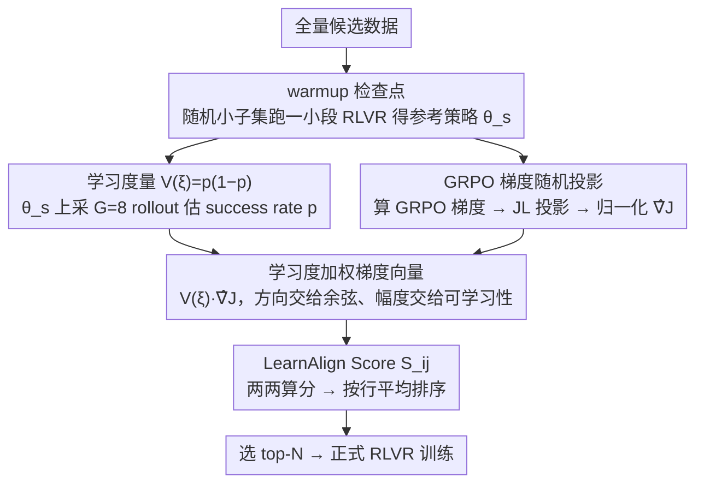

# LearnAlign: Data Selection for LLM Reinforcement Learning with Improved Gradient Alignment

**会议**: ACL 2026 Findings  
**arXiv**: [2506.11480](https://arxiv.org/abs/2506.11480)  
**代码**: 待确认  
**领域**: 强化学习 / 数据选择 / LLM 推理  
**关键词**: RLVR, GRPO, 数据选择, 梯度对齐, 数据可学习性, 近端发展区

## 一句话总结
针对 RLVR 后训练的数据选择问题，提出 LearnAlign——把"梯度对齐"作为代表性指标，再用"成功率 $V(\xi)=p(1-p)$"作为可学习性权重消除响应长度偏置，仅用 1000 条数据（约 6%）就在 5 个推理 benchmark 上做到接近全量训练（42.4% vs 44.9%），且 GSM8K 上以 13.4% 数据 (77.5%) 超过全量 (77.0%)。

## 研究背景与动机

**领域现状**：RLVR（Reinforcement Learning with Verifiable Rewards）已成为 OpenAI o1、DeepSeek-R1、Kimi k1.5 等推理 LLM 的标配 post-training 方案——用规则可验证奖励（如数学答案对错、代码 pass）当监督信号，配合 GRPO/PPO 训练。但 RLVR 数据效率低、训练昂贵。

**现有痛点**：现有数据选择方法绝大多数为 SFT 设计（INSTAG、ALPAGASUS、IFD、LESS、SelectIT、Nuggets 等），把"高质量"=高难度/低 perplexity 当作首选。两个 RLVR 相关工作（LIMR、1-shot RLVR）虽然证明少量数据足够，但选择阶段要在全量数据上完整训练几个 epoch，**评测成本极高，谈不上"选择"二字**。

**核心矛盾**：SFT 目标是最大化目标输出似然，所以"越难越好"；但 RLVR 目标是 reward 最大化，**只有难度与当前策略能力匹配的样本才能产生学习信号**——太简单 $p\approx 1$ 已会、太难 $p\approx 0$ 学不到，**两端的样本对 RLVR 都没用**。把 SFT 选择直接搬到 RLVR 反而经常不如随机采样。

**本文目标**：(1) 给 RLVR 找一个高效（不需训练全集）、可解释、可量化的数据选择准则；(2) 同时解决梯度方法的两个老毛病——梯度模长的"短响应偏置"和余弦相似度丢失幅度信息；(3) 在 GSM8K + DAPO-MATH-17K 上验证少量数据能否匹敌全量训练。

**切入角度**：作者借鉴 SFT 时代的 LESS（梯度对齐）和教育学中的"近端发展区"（ZPD，Vygotsky）——既要保证样本和整个训练集分布对齐（梯度方向相似），又要保证它处于策略能力边界（$p\approx 0.5$ 时学习潜力最大）。

**核心 idea**：构造**学习度加权梯度向量** $\mathbf{V}(\xi_i) = \frac{\nabla \mathcal{J}}{\|\nabla \mathcal{J}\|} \cdot V(\xi_i)$，其中 $V(\xi_i) = p(1-p)$ 用 success rate 直接量化"学习潜力"，乘到单位梯度上既消除长度偏置又保留方向对齐信息。然后用 LearnAlign Score $S_{ij}$ 算两两数据间的可学习+代表性，按行平均选 top-N。

## 方法详解

### 整体框架

LearnAlign 想解决的是 RLVR 后训练"选哪些数据来训"的问题，而它的核心是把每条数据既评"代表性"（梯度方向和整个训练集对不对齐）又评"可学习性"（当前策略对它有没有学习空间），合成一个分数再排序选 top-N。整条流水线是轻量的 4 步：先在随机小子集上跑一小段 RLVR 得到一个稍微上路的策略 $\bm{\theta}_s$ 作为参考点；再在 $\bm{\theta}_s$ 上对每条数据采样估计 success rate、计算 GRPO 梯度；然后把 success rate 当权重乘到归一化梯度上算 pairwise 分数；最后按每条数据的平均得分排序取最高的 $N$ 条做正式训练。关键是全程**不需要在全量数据上完整训练几个 epoch**，只花一次 warmup + 一次梯度估计的代价。

### 关键设计

**1. 学习度量 $V(\xi)=p(1-p)$：用近端发展区原则量化"这条数据现在值不值得学"**

RLVR 和 SFT 的根本区别在于，SFT 越难越好、RLVR 却只有难度与当前策略能力匹配的样本才产生学习信号——太简单 $p\to 1$ 已经会了、太难 $p\to 0$ 又学不到，两端都白费。LearnAlign 对每条数据在 $\pi_{\bm{\theta}_s}$ 下采 $G=8$ 个 rollout，按 ground-truth 算 success rate $p_i=\frac{1}{G}\sum_g \mathbb{I}(\mathbf{y}_g=\mathbf{y}^*)$，再取 $V(\xi_i)=p_i(1-p_i)$ 作为学习度量。这个量落在 $[0,0.25]$，恰在 $p=0.5$（能力边界）取最大、在两端归零，正好对应教育心理学里 Vygotsky 的"近端发展区"，作者在附录 B/C 还从信息增益与策略梯度方差最小化两个角度给了理论支撑。它的额外好处是 success rate 与响应长度天然解耦，因此能直接替代有 length-bias 的梯度模长，给 RLVR 补上 SFT 没有的"难度-能力匹配"机制。

**2. 学习度加权梯度向量 $\mathbf{V}(\xi_i)=\hat{\nabla}\mathcal{J}\cdot V(\xi_i)$：把代表性和可学习性正交地拼进一个向量**

单看梯度有两个老毛病：纯余弦相似度丢掉了幅度信息（看不出哪个样本"更值得学"），纯梯度内积又有长度偏置（长响应天然梯度小、被系统性低估）。LearnAlign 的做法是先把每条数据的 GRPO 梯度归一化 $\hat{\nabla}\mathcal{J}_i=\nabla\mathcal{J}_i/\|\nabla\mathcal{J}_i\|$ 消除模长偏置，再用上一节的 $V(\xi_i)$ 重新加权幅度。这样最终的 LearnAlign Score 干净地拆成

$$S_{ij}=V(\xi_i)V(\xi_j)\cdot\cos(\hat{\nabla}_i,\hat{\nabla}_j)$$

方向部分交给余弦、幅度部分交给 learnability，物理意义清晰：两端都可学、且梯度方向高度对齐的样本得分最高。选数据时对每条按行平均 $\text{Avg}_i=\frac{1}{n}\sum_j S_{ij}$ 排序，取最高的 $N$ 条。

**3. warmup 检查点 + GRPO 梯度随机投影：把选择成本压到接近 SFT 数据选择的水平**

LearnAlign 要回避两个成本陷阱：LIMR / 1-shot RLVR 那种"选之前先把全集训几个 epoch"的瓶颈，以及存储高维梯度的内存爆炸。它的对策是借 LESS 在 SFT 上验证过的基础设施搬到 RLVR：先用 warmup 阶段（GSM8K 300 条、DAPO 1000 条）得到一个稳定的梯度估计参考点 $\bm{\theta}_s$，避免冷启动时梯度噪音过大；在 $\bm{\theta}_s$ 上对每条数据做一次前向+反向算 GRPO 梯度（梯度形式直接用论文已有的 $G(q,o,t,\pi_{\bm{\theta}})=\hat{A}_{i,t}+\beta(\pi_{\text{ref}}/\pi_{\bm{\theta}}-1)$）；再用 Johnson-Lindenstrauss 随机投影 $\Gamma$ 把梯度压成低维 $\phi(\bm{\theta};\xi)=\Gamma^\top\nabla\mathcal{J}$ 后做内积。warmup 与投影配合，使整个选择一次性出结果，表 4 显示总耗时被压到接近 SFT 数据选择的水平。

### 损失函数 / 训练策略

不改 RLVR 损失，全部用标准 GRPO（KL 系数 $\beta=0.04$, clip $\epsilon=0.2$, lr $1\times 10^{-6}$, $G=8$ rollouts at temperature 1.0, batch=48/64）。DAPO 训练时只用 1 条 correct rollout 算梯度（沿用 Lin et al. 2025 经验加速）。

## 实验关键数据

### 主实验

**GSM8K 数据选择**（Qwen2.5-1.5B-Instruct，在 GSM8K 自家训练集中选）：

| 方法 | 100 | 500 | 1,000 | 2,000 |
|------|-----|-----|-------|-------|
| Base (no RLVR) | 55.7 | – | – | – |
| Full data (~7.5K) | 77.0 | – | – | – |
| Random | 73.1 | 75.1 | 75.6 | 75.5 |
| IFD (SFT 选择) | 72.0 | 76.0 | 75.6 | 75.4 |
| Token Length | 72.3 | 74.4 | 76.2 | 75.6 |
| LIMR (RLVR baseline) | 74.2 | 76.2 | 76.1 | 76.7 |
| **LearnAlign** | **74.8** | **76.4** | **77.5** | **78.3** |

1000 条已经追平全量 (77.5% vs 77.0%)，2000 条反而**超过**全量 1.3 个点。

**DAPO-MATH-17K → 5 benchmark**（仅选 1000 条，Qwen2.5-7B）：

| 方法 | GSM8K | MATH500 | AMC2023 | AIME2024 | CRUX | Avg. |
|------|-------|---------|---------|----------|------|------|
| Base | 26.4 | 67.2 | 18.1 | 16.7 | 25.1 | 30.7 |
| Full 17K | 89.8 | 76.4 | 47.0 | 30.0 | 51.1 | 58.9 |
| Random 1K | 81.1 | 65.0 | 30.1 | 23.3 | 40.8 | 48.1 |
| SelectIT 1K | 85.4 | 67.0 | 32.7 | 26.7 | 41.5 | 50.7 |
| LIMR 1K | 84.2 | 61.6 | 27.1 | 16.7 | 39.9 | 45.9 |
| **LearnAlign 1K** | **88.3** | **70.4** | **35.4** | **30.0** | **44.0** | **54.6** |

只用 5.9% 数据拿到 54.6 平均分（全量 58.9），比第二名 SelectIT 高出 3.9 个点；AIME2024 直接打平全量训练 (30.0)。

### 消融实验

| 配置 | GSM8K (1K, 1.5B) | GSM8K (2K, 1.5B) | GSM8K (1K, 3B) | MATH500 (1K, 3B) | AMC2023 (1K, 3B) |
|------|------------------|------------------|----------------|-------------------|-------------------|
| **Full LearnAlign** | **77.5** | **78.3** | **79.3** | **60.2** | **28.3** |
| w/o warmup | 76.6 | 76.6 | 76.7 | 58.2 | 26.1 |
| w/o data learnability $V$ | 75.6 | 76.7 | 77.5 | 58.4 | 28.3 |
| w/ feature similarity (代替梯度) | 75.7 | 76.6 | 79.1 | 57.6 | 27.5 |

两个组件均不可或缺：去掉 $V$ 平均掉 1.4 个点（验证 ZPD 假设），去掉 warmup 也明显退化（说明冷启动梯度噪音影响选择质量）。

### 关键发现
- **传统 SFT 选择在 RLVR 上无效甚至有害**：IFD / PPL-Top / Token Length 在 1.5B 上几乎都不如随机采样；理论原因是 SFT 看"难度"，RLVR 看"能力匹配"，目标根本不同。
- **小数据反超全数据**：GSM8K 上 2000 条 LearnAlign (78.3%) > 7.5K 全量 (77.0%)；表明 RLVR 有效信号集中在少量"近端发展区"样本，多数数据是冗余甚至有害的。
- **跨域泛化稳定**：训于 DAPO-MATH，但在 OOD 的 AMC2023/AIME2024、跨域的 CRUX 代码都保持优势——说明 LearnAlign 选的不是"GSM8K 特化"样本，而是真正的"推理学习潜力"样本。
- **响应长度偏置存在且影响显著**：Fig 3 显示纯梯度内积选出的样本响应明显偏短、性能也低；用 $V$ 替换后响应长度回到中等区间，性能涨。
- **Warmup 不可省**：从图中可见 warmup 让梯度估计稳定到能反映真实学习潜力的程度。
- **效率优势明显**：相比 LIMR/1-shot RLVR 需要训完整数据集 epoch 才能选，LearnAlign 只需 warmup + 一次梯度估计；表 4 显示总耗时大幅下降。

## 亮点与洞察
- **"$V(\xi) = p(1-p)$" 是把 ZPD 教育心理学落实到 RLVR 的最简形式**：一行公式同时承担三件事——消除长度偏置、量化学习潜力、给梯度向量提供合理幅度。这种"信息论合理 + 直觉合理 + 工程可计算"三重一致是数据选择研究的范本。
- **"warmup + 投影梯度"组合优雅地把 LESS 思路搬到 RLVR**：LESS 在 SFT 上靠 few-shot 锚点选数据，本文用 warmup checkpoint 替代锚点 + GRPO 梯度替代 SFT 梯度。这种"借用 SFT 数据选择基础设施给 RLVR 用"的思路可继续迁移到 RLHF、DPO 等其他 alignment 范式。
- **"SFT 选择在 RLVR 不工作"的负结果非常有价值**：很多团队直觉上会把现成 SFT 选择工具直接套到 RL 流程，本文用 Table 1/2 把这种 anti-pattern 公开证伪，为社区节省大量试错。
- **"少量数据反超全量"反映 RLVR 数据效率上限尚未触及**：1.5B 模型上 2K LearnAlign > 7.5K full 这个反直觉现象暗示 RLVR 数据存在显著噪音/冗余/反作用样本，未来 data-quality 研究空间巨大。
- **可迁移 trick**：$V(\xi) = p(1-p)$ 的"近端发展区权重"可以直接接到 RLHF reward model 训练数据筛选、self-play curriculum、rollout reweighting 等场景。

## 局限与展望
- **依赖 warmup 模型的 success rate 估计准确度**：如果 warmup 不充分或 $G=8$ 太少，$p$ 估计有噪音，$V(\xi)$ 会偏；理想情况下应有动态 / 迭代式 $V$ 更新。
- **仅在数学 / 代码这类有 verifiable reward 的任务上验证**：开放领域（如对话质量、长文写作）RLVR 没有清晰 $p$ 定义，方法不直接适用。
- **梯度计算 + 投影对大模型仍贵**：尽管比 LIMR 便宜，DAPO-MATH-17K 上选 1K 仍需算 17K 条 GRPO 梯度；70B+ 规模下投影维度和存储成本仍是瓶颈。
- **$V(\xi) = p(1-p)$ 是静态选择**：选完一次就不再更新；但训练过程中 $p$ 会变化（曾经 $p=0.5$ 的样本会逐渐 $p\to 1$）。这指向 online / curriculum 式 LearnAlign。
- **没有讨论"反作用"样本**：实验显示某些样本会拉低性能（IFD/Token Length 不如 random），但论文未深入分析"什么是 RLVR 中真正的 noisy sample"。
- **改进思路**：(a) 动态 $V$ + curriculum 调度，按训练阶段重新 ranking；(b) 把 LearnAlign 与 LESS 的 few-shot 锚点结合做 task-specific 选择；(c) 把 $p(1-p)$ 推广到 reward 是连续分数的场景，如 $V = \text{Var}_g(r_g)$。

## 相关工作与启发
- **vs LIMR / 1-shot RLVR**: 同样发现"少量数据够 RLVR"，但选择阶段需训全集 epoch；LearnAlign 只用 warmup + 一次梯度估计，效率高出一个量级，更贴近"实用的数据选择工具"。
- **vs LESS (Xia et al., 2024)**: SFT 时代的梯度对齐数据选择标杆。本文把 LESS 的 JL 投影 + 梯度对齐范式继承，但用 GRPO 梯度替换 SFT 梯度，并用 $V(\xi)$ 解决了 LESS 的两个老毛病（长度偏置、丢幅度）。
- **vs SelectIT / IFD / PPL-based**: 这些都基于"输出难度/质量分"做选择，目标对齐 SFT 而非 RLVR。本文给出明确的负结果证明它们在 RL 上不工作，再用 ZPD 框架解释为什么。
- **vs Curriculum Learning (Florensa et al., 2018; Tzannetos et al., 2023)**: ZPD 思想的源头。本文把 curriculum 的"中等难度优先"具体化为 $p(1-p)$，并嵌入梯度对齐框架，是 curriculum learning 在大模型 RLVR 时代的一次落地。
- **vs Persona Vectors / Steering 类工作**: 那些做 inference 时控制；LearnAlign 做训练数据控制——是后训练效率优化的另一支正交研究线。

## 评分
- 新颖性: ⭐⭐⭐⭐ "梯度对齐 × $p(1-p)$ 学习度"的组合是清晰的小创新，把 SFT 时代的 LESS 思路成功扩展到 RLVR；理论 ZPD 视角提供了优雅的解释框架
- 实验充分度: ⭐⭐⭐⭐⭐ 5 benchmark × 3 模型 × 多种数据量 + 7 个 baseline + 消融 + 效率对比 + 长度偏置分析，覆盖完整
- 写作质量: ⭐⭐⭐⭐ 数学推导清晰、消融充分；但符号略密集，对读者要求较高
- 价值: ⭐⭐⭐⭐⭐ RLVR 是当下推理 LLM 的核心训练范式，数据效率优化直接降低训练成本；GSM8K 上小数据反超全量的发现对实践有强指导意义

<!-- RELATED:START -->

## 相关论文

- [\[ICML 2026\] Single-Rollout Hidden-State Dynamics for Training-Free RLVR Data Selection](../../ICML2026/reinforcement_learning/single-rollout_hidden-state_dynamics_for_training-free_rlvr_data_selection.md)
- [\[ICCV 2025\] RL-Selector: Reinforcement Learning-Guided Data Selection via Redundancy Assessment](../../ICCV2025/reinforcement_learning/reinforcement_learning-guided_data_selection_via_redundancy_assessment.md)
- [\[ACL 2026\] Efficient Hyperparameter Optimization for LLM Reinforcement Learning](efficient_hyperparameter_optimization_for_llm_reinforcement_learning.md)
- [\[ICLR 2026\] References Improve LLM Alignment in Non-Verifiable Domains](../../ICLR2026/reinforcement_learning/references_improve_llm_alignment_in_non-verifiable_domains.md)
- [\[ACL 2026\] Semantic-Space Exploration and Exploitation in RLVR for LLM Reasoning](semantic-space_exploration_and_exploitation_in_rlvr_for_llm_reasoning.md)

<!-- RELATED:END -->
