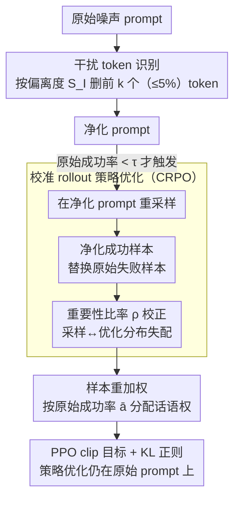

# LENS: Less Noise, More Voice — Reinforcement Learning for Reasoning via Instruction Purification

**会议**: ACL 2026  
**arXiv**: [2601.21244](https://arxiv.org/abs/2601.21244)  
**代码**: [https://github.com/RUCBM/LENS](https://github.com/RUCBM/LENS)  
**领域**: 强化学习 / LLM 推理  
**关键词**: RLVR, 干扰token, 指令纯化, rollout效率, 推理增强

## 一句话总结

LENS 发现 RLVR 中许多探索失败并非因为问题难度，而是因为 prompt 中少量（<5%）干扰 token，通过识别和删除这些 token 来提升 rollout 成功率，并将净化 rollout 的学习信号转移到原始噪声 prompt 的策略优化中，平均提升 3.88% 并加速 1.6 倍。

## 研究背景与动机

**领域现状**：RLVR（如 GRPO）已显著提升 LLM 推理能力，但在复杂任务中面临核心挑战：正确 rollout 极为稀少，导致缺乏正样本，训练效率低或崩溃。

**现有痛点**：现有应对策略走两条路——(1) 扩大探索规模（增加 rollout 数），计算成本高但效率不变；(2) 过滤零方差 prompt（跳过完全失败的 prompt），牺牲了对困难样本的探索。两者都未触及探索失败的根本原因。

**核心矛盾**：低成功率的 prompt 包含有价值的训练信号，但当前方法要么忽略它们（过滤），要么低效地强攻（暴力扩展 rollout）。

**本文目标**：找到探索失败的根本原因，并设计针对性解决方案，在不增加计算成本的前提下提升 rollout 效率。

**切入角度**：通过 token 级别的细粒度分析，发现失败原因常常是少数 token 引入了过度干扰——这些 token 使策略在 token 空间中偏离参考模型过远。简单删除这些 token 即可将失败 prompt 的 rollout 准确率提升 20%+。

**核心 idea**：prompt 中少数干扰 token 是探索失败的关键原因；先"净化"prompt 获取成功 rollout，再将学习信号"转移"回原始 prompt，让模型学会忽略干扰而非依赖净化。

## 方法详解

### 整体框架

LENS 的出发点是一个反直觉的观察：RLVR 中很多 rollout 失败不是因为题目难，而是 prompt 里夹了少量（<5%）"干扰 token"把策略带偏了。围绕这点它分两阶段做事：先**识别并删除**这些干扰 token 得到一个"净化 prompt"，让本来全错的 prompt 重新采到成功 rollout；再用一套**校准的策略优化（CRPO）**把这些净化 rollout 的学习信号转移回原始（带噪）prompt 上去优化策略——核心是让模型学会"在噪声里也能推理对"，而不是只会在干净环境里做题。

### 关键设计

**1. 干扰 token 识别：用与参考模型的偏离度定位"少数惹祸的 token"**

要净化 prompt，先得知道删哪些 token。LENS 把每个 token 的干扰分数定义为当前策略与参考模型在该位置对数概率偏差的绝对值

$$S_I(s,a)=\big|\log\pi_\theta(a|s)-\log\pi_{\text{ref}}(a|s)\big|$$

参考模型代表了训练数据学到的稳定分布基准，分数高就意味着这个 token 把策略在 KL 意义上推离参考分布太远，通常源于奖励过优化或本身就是噪声/误导信号。按干扰分数降序，删掉前 $k=\lceil\gamma\cdot|x_i|\rceil$ 个 token（$\gamma$ 取 1%–5%）即得净化 prompt。正是这"删 <5% token"的小动作，能把失败 prompt 的 rollout 准确率拉高 20%+。

**2. 校准 rollout 策略优化（CRPO）：把干净环境采到的成功信号搬回噪声 prompt 上学**

只在净化 prompt 上训练等于"在干净环境学习"，没法迁移到真实的噪声环境，所以关键不是用净化 prompt 替换训练对象，而是用它来补救信号。CRPO 只对低成功率 prompt（成功率 $<\tau$）出手：在净化 prompt 上重新采样，若成功率确实提升，就用净化 rollout 的成功样本替换原始 rollout 里等量的失败样本。但所有策略优化仍在**原始 prompt**上进行，靠重要性比率

$$\rho(y;\theta)=\frac{\pi_\theta(y|x_i)}{\tilde{w}(y)\,\pi_{\text{old}}(y|x^{\text{roll}}(y))}$$

校正这种"采样自净化 prompt、优化在原始 prompt"的分布不匹配。这样模型被迫学会在带干扰的条件下也得到正确推理，本质是教它"忽略干扰"而非依赖净化。

**3. 样本重加权：按原始成功率动态分配原始信号和净化信号的话语权**

替换之后原始成功样本和净化成功样本的可信度并不对等，需要有侧重。LENS 用原始成功率 $\bar{a}_i$ 当缩放因子：原始成功样本权重为 $\bar{a}_i$，净化成功样本与未被替换的失败样本权重为 $1-\bar{a}_i$。直觉很清楚——当原始成功率本来就低时多信净化样本的信号，当原始成功率高时则保持原始样本的主导地位。整体在 PPO 风格的 clip 目标 + KL 正则下优化。

### 损失函数 / 训练策略

PPO 风格的 clip 目标函数：$\mathcal{L}(\theta) = -\sum_{y} \min(\rho(y;\theta)\hat{A}(y), \text{clip}(\rho, 1-\epsilon, 1+\epsilon)\hat{A}(y)) + \beta D_{\text{KL}}$。优势值在重构的 rollout 集上按 group-relative 方式计算。

## 实验关键数据

### 主实验

**数学推理基准 Pass@1（Llama3.2-3B-Instruct）**

| 方法 | MATH | Olympiad | AIME24 | Avg (7 benchmarks) |
|------|------|----------|--------|-------------------|
| + GRPO | 51.60 | 44.68 | 6.25 | 23.98 |
| + DAPO | 53.00 | 47.01 | 9.79 | 25.32 |
| + GRPO_extended | 51.20 | 44.68 | 6.25 | 24.33 |
| + **LENS_GRPO** | **55.80** | **48.83** | **10.62** | **27.03** |

### 消融实验

| 配置 | 关键指标 | 说明 |
|------|---------|------|
| 完整 LENS | 最优 | 识别+纯化+CRPO |
| 仅纯化（无 CRPO） | 次优 | 模型只在干净环境学习 |
| 随机删除（替代干扰分数） | 下降 | 验证干扰分数的有效性 |
| 仅约 20% prompt 受益于删除 | — | 说明 CRPO 的条件激活设计必要 |

### 关键发现

- **零奖励 prompt 比例大幅降低**：LENS 将 DeepMath 上的零奖励 prompt 比例从 GRPO 的 ~80% 降至 ~40%
- 仅删除 <5% 的 token 就能将失败 prompt 的 rollout 准确率提升 20%+，验证了"少数 token 导致多数失败"的假设
- LENS 达到 GRPO 的性能只需 60% 的训练步数，实现 1.6 倍加速
- 在四个域外通用推理基准上也有 1.83% 提升，表明鲁棒性的改善可迁移
- 与扩展探索（增加 rollout）和 prompt 过滤相比，LENS 用更少计算资源获得更好性能

## 亮点与洞察

- "少量干扰 token 导致探索失败"的发现非常反直觉且有说服力——开辟了 RLVR 研究的新视角
- CRPO 的设计哲学很巧妙：不是让模型在干净环境中学习然后期望它迁移到噪声环境，而是用干净环境的信号来校准噪声环境中的学习，本质上是在教模型"忽略干扰"
- 干扰分数的定义（策略与参考模型的对数概率偏差）简单高效，不需要额外模型

## 局限与展望

- 仅在 3B-4B 规模模型上验证，更大模型（7B+）的效果未知
- 干扰分数依赖参考模型，如果参考模型本身质量不高可能导致误判
- 删除比例 $\gamma$ 需要手动调整，不同数据集可能需要不同的值
- 仅约 20% 的 prompt 在删除后 rollout 准确率提升，CRPO 的条件激活限制了整体影响范围

## 相关工作与启发

- **vs GRPO/DAPO**: LENS 是即插即用的改进，不改变基础 RL 算法而是提升 rollout 质量
- **vs 扩展探索方法**: 扩展探索增加计算成本但不改变效率，LENS 在不增加成本的前提下提升效率

## 评分

- 新颖性: ⭐⭐⭐⭐⭐ "干扰 token"的发现和"净化+转移"的解决方案均为全新视角
- 实验充分度: ⭐⭐⭐⭐ 多基线对比和消融完整，但模型规模覆盖有限
- 写作质量: ⭐⭐⭐⭐⭐ 动机清晰，方法阐述精确，算法伪代码清晰
- 价值: ⭐⭐⭐⭐⭐ 为 RLVR 的探索效率问题提供了新思路和实用解决方案

<!-- RELATED:START -->

## 相关论文

- [\[ICLR 2026\] Less is More: Clustered Cross-Covariance Control for Offline RL](../../ICLR2026/reinforcement_learning/less_is_more_clustered_cross-covariance_control_for_offline_rl.md)
- [\[ACL 2026\] ImpRIF: Stronger Implicit Reasoning Leads to Better Complex Instruction Following](imprif_stronger_implicit_reasoning_leads_to_better_complex_instruction_following.md)
- [\[ACL 2026\] Semantic-Space Exploration and Exploitation in RLVR for LLM Reasoning](semantic-space_exploration_and_exploitation_in_rlvr_for_llm_reasoning.md)
- [\[NeurIPS 2025\] When Less Language is More: Language-Reasoning Disentanglement Makes LLMs Better Multilingual Reasoners](../../NeurIPS2025/reinforcement_learning/when_less_language_is_more_language-reasoning_disentanglement_makes_llms_better_.md)
- [\[ACL 2026\] Beyond Majority Voting: Towards Fine-grained and More Reliable Reward Signal for Test-Time Reinforcement Learning](beyond_majority_voting_towards_fine-grained_and_more_reliable_reward_signal_for_.md)

<!-- RELATED:END -->
